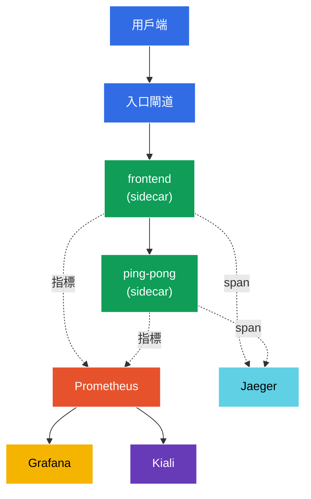

[Русская версия](README_RU.MD) · [Eng version](README.MD) · [Versión en español](README_ES.MD) · [Version française](README_FR.MD) · [Deutsche Version](README_DE.MD) · [ქართული ვერსია](README_GE.MD) · [日本語版](README_JP.MD)

# Lab 08 - 可觀測性：Prometheus / Jaeger / Kiali

> [參考解答](worker/files/solutions/1_TW.MD)

想像一下：叢集中執行著多個服務，突然有東西「變慢」了。究竟是哪裡？哪個服務呼叫了哪個服務、有多少錯誤、延遲是多少？Istio 會自動收集所有這些遙測資料（sidecar proxy 能看見每一個請求），但要檢視它，需要一些工具：
- **Prometheus** - 收集並儲存指標（RPS、回應碼、延遲）。
- **Jaeger** - 分散式追蹤：單一請求穿越所有服務的路徑。
- **Kiali** - mesh 視覺化：服務圖、健康狀態、流量流向。
- **Grafana** - 建立於 Prometheus 指標之上的儀表板。

在本實驗中，我們將部署這個堆疊、產生流量，並確認指標、追蹤和服務圖確實會被收集--完全不需要為應用程式程式碼加入任何插樁。

### 運作方式（整體架構）



## 目標

- 部署 Istio 可觀測性附加元件：Prometheus、Grafana、Jaeger、Kiali。
- 透過 Telemetry API 啟用 100% 的追蹤取樣。
- 產生流量並驗證指標（Prometheus）、追蹤（Jaeger）和服務圖（Kiali）。

> 此處已安裝 Istio（demo 設定檔），且追蹤已設定為將 span 傳送至 `zipkin.istio-system:9411`（此 endpoint 由 Jaeger 附加元件提供）。

## 基礎架構

環境透過 Terragrunt 在 AWS（`eu-central-1`）中部署，由以下元件組成：

| 元件  | 說明                                          |
|------------|---------------------------------------------------|
| `vpc`      | 具有公用子網路的 VPC `10.10.0.0/16`          |
| `ssh-keys` | 用於存取節點的 SSH 金鑰                      |
| `k8s-1`    | Kubernetes `1.35.2`（kubeadm），已安裝 Istio（demo 設定檔） |
| `worker`   | 配備 `kubectl` 且可存取叢集的工作機器   |

執行個體：`t4g.medium`（master）Ubuntu `22.04`

## 部署

```bash
TASK=08 make run_ica_task
```

## 步驟 1. 啟用 sidecar 注入

```bash
kubectl label namespace default istio-injection=enabled --overwrite
```

所有遙測資料都在 sidecar proxy 中產生：Envoy 計算每個請求的指標並產生追蹤 span。沒有 sidecar，就不會有可觀測性。

## 步驟 2. 安裝應用程式與入口點

我們部署一個兩層應用程式：`frontend` 每次請求都會呼叫 `ping-pong`。這個呼叫會產生「兩段式」追蹤（frontend → ping-pong），並提供兩個服務的指標。同時也會啟動 `curl-client`--我們將從它在 mesh 內部查詢 Prometheus API。

```bash
kubectl apply -f https://raw.githubusercontent.com/ViktorUJ/cks/refs/heads/master/tasks/ica/labs/08/k8s-1/scripts/1.yaml
kubectl rollout restart deployment -n default
```

透過 Gateway 建立入口：

```bash
vim gateway.yaml
```

```yaml
apiVersion: networking.istio.io/v1
kind: Gateway
metadata:
  name: main-gateway
  namespace: default
spec:
  selector:
    istio: ingressgateway
  servers:
  - port:
      number: 80
      name: http
      protocol: HTTP
    hosts:
    - "myapp.local"
---
apiVersion: networking.istio.io/v1
kind: VirtualService
metadata:
  name: frontend-vs
  namespace: default
spec:
  hosts:
  - "myapp.local"
  gateways:
  - main-gateway
  http:
  - route:
    - destination:
        host: frontend
        port:
          number: 8080
```

```bash
kubectl apply -f gateway.yaml
```

## 步驟 3. 安裝可觀測性附加元件

Istio 在 `samples/addons` 中提供現成的附加元件 manifest。我們安裝全部四個：

```bash
REL=release-1.29
kubectl apply -f https://raw.githubusercontent.com/istio/istio/$REL/samples/addons/prometheus.yaml
kubectl apply -f https://raw.githubusercontent.com/istio/istio/$REL/samples/addons/grafana.yaml
kubectl apply -f https://raw.githubusercontent.com/istio/istio/$REL/samples/addons/jaeger.yaml
kubectl apply -f https://raw.githubusercontent.com/istio/istio/$REL/samples/addons/kiali.yaml
```

等待就緒：

```bash
kubectl get pods -n istio-system | grep -E 'prometheus|grafana|jaeger|kiali'
```

```
grafana-xxxx        1/1   Running
jaeger-xxxx         1/1   Running
kiali-xxxx          1/1   Running
prometheus-xxxx     2/2   Running
```

**安裝的內容：**
- **prometheus.yaml** - Prometheus，已設定為 scrape Istio 指標（`istio_requests_total`、`istio_request_duration_milliseconds` 等）。
- **jaeger.yaml** - Jaeger all-in-one；除了 UI 以外，也會在 `istio-system` 中啟動 `zipkin` 服務（meshConfig 正是將 span 傳送至此處）。
- **kiali.yaml** - Kiali，從 Prometheus 讀取指標並建立服務圖。
- **grafana.yaml** - Grafana，含有預先設定的 Istio 儀表板。

## 步驟 4. 啟用追蹤（100% 取樣）

預設情況下，Istio 只會將約 1% 的請求取樣為追蹤。為了本實驗，我們會透過 **Telemetry API** 將取樣比例調為 100%，並指定 `zipkin` provider（它在 Istio 安裝時已於 meshConfig 中設定）。

```bash
vim telemetry.yaml
```

```yaml
apiVersion: telemetry.istio.io/v1
kind: Telemetry
metadata:
  name: mesh-default
  namespace: istio-system   # 在 mesh 根 namespace = 套用到整個 mesh
spec:
  tracing:
  - providers:
    - name: zipkin
    randomSamplingPercentage: 100.0
```

```bash
kubectl apply -f telemetry.yaml
```

**說明：**沒有 `selector` 的 `istio-system` namespace 中的 `Telemetry`，是整個 mesh 的預設政策。`providers.name: zipkin` 會參考在安裝 Istio 時設定的 `extensionProvider`。`randomSamplingPercentage: 100` 代表每個請求都會進入追蹤（適合示範；在正式環境中通常設為 1–5%）。

## 步驟 5. 產生流量

為了讓指標與追蹤有資料可展示，執行請求：

```bash
for i in $(seq 50); do curl -s -o /dev/null http://myapp.local:32080; done
```

## 步驟 6. 指標（Prometheus）

透過 Prometheus HTTP API 查詢對 `ping-pong` 的請求計數器（從 mesh 內的 `curl-client` pod）：

```bash
kubectl exec -n default deploy/curl-client -c curl -- \
  curl -s 'http://prometheus.istio-system:9090/api/v1/query?query=istio_requests_total{destination_service_name="ping-pong"}' | jq '.data.result | length'
```

非零結果表示 Prometheus 正在收集 Istio 指標。每個 `istio_requests_total` 序列都帶有 `source_workload`、`destination_workload`、`response_code` 等 label--這些就是 mesh 的「黃金訊號」。

供瀏覽器使用（選用）：

```bash
kubectl -n istio-system port-forward svc/prometheus 9090:9090
# 開啟 http://localhost:9090
```

## 步驟 7. 追蹤（Jaeger）

確認 Jaeger 是否知道我們的服務：

```bash
kubectl exec -n default deploy/curl-client -c curl -- \
  curl -s 'http://tracing.istio-system/jaeger/api/services' | jq .
```

清單中應出現 `frontend` 和 `ping-pong`。在 UI 中開啟追蹤後，您會看到 span 鏈 `ingressgateway → frontend → ping-pong`，以及每個環節的延遲。

供瀏覽器使用（選用）：

```bash
kubectl -n istio-system port-forward svc/tracing 8080:80
# 開啟 http://localhost:8080/jaeger
```

## 步驟 8. 服務圖（Kiali）

Kiali 在 Prometheus 指標之上建立直觀的 mesh 圖：

```bash
kubectl -n istio-system port-forward svc/kiali 20001:20001
# 開啟 http://localhost:20001  ->  Graph  ->  namespace "default"
```

您會看到圖 `ingressgateway → frontend → ping-pong`，箭頭上會即時顯示 RPS、錯誤比例和延遲。

## 總結

| 工具 | 提供的內容 | 如何驗證 |
|-----------|----------|---------------|
| Prometheus | 指標（RPS、代碼、延遲） | API 查詢 `istio_requests_total` |
| Jaeger | 分散式追蹤 | 服務清單 + span 鏈 |
| Kiali | mesh 服務圖 | namespace 的視覺化圖 |
| Grafana | 建立於指標之上的儀表板 | 預先設定的 Istio 儀表板 |

**核心結論：**Istio 提供「開箱即用」的可觀測性--sidecar proxy 會自動匯出**每一個**請求的指標與 span，不需要修改應用程式程式碼。附加元件（Prometheus/Jaeger/Kiali/Grafana）僅負責收集並視覺化這些資料。Telemetry API 可讓您精細設定要收集的內容（例如追蹤的取樣比例）。