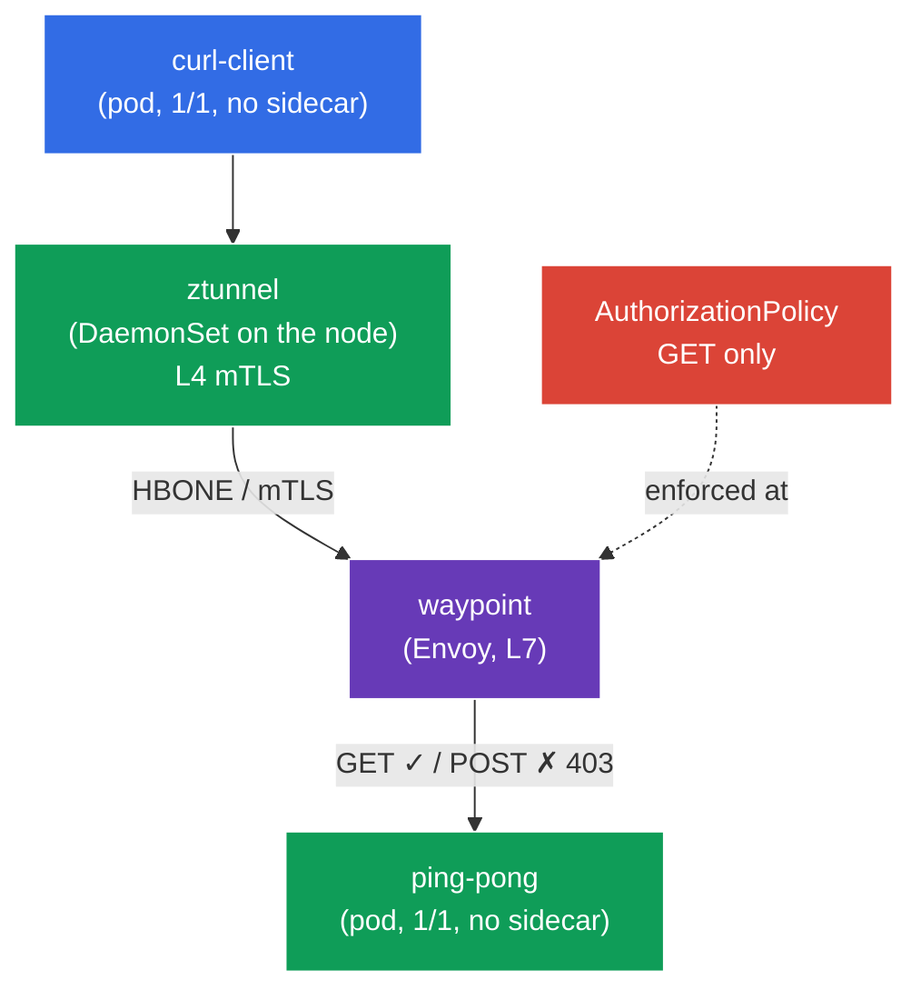

[RU version](README_RU.MD) · [Versión en español](README_ES.MD)

# Lab 09 - Advanced: Ambient mode (sidecar-less data plane)

So far, in every lab Istio used the classic sidecar model: an `istio-proxy` (Envoy) container was added to every pod. It's reliable but costly - a proxy in every pod consumes memory and CPU, and any data-plane upgrade requires restarting pods.

**Ambient mode** is Istio's new **sidecar-less** data plane. It splits into two layers:
- **ztunnel** - a lightweight proxy, one per **node** (a DaemonSet). It captures pod traffic and automatically provides **L4 mTLS** (encryption + identity) - with no sidecars at all.
- **waypoint** - a separate proxy (Envoy) deployed **on demand** for a namespace/service when you need **L7 features** (HTTP routing, L7 authorization, retries, etc.).

The idea: pay for an L7 proxy only where you actually need it, and get baseline security (L4 mTLS) "for free" at the node level.

### How It Works (High-Level Overview)



## Objective

- Understand the difference between the sidecar and ambient data planes.
- Enable ambient for a namespace and confirm pods run **without sidecars**, while ztunnel provides L4 mTLS.
- Deploy a **waypoint** and apply an **L7 AuthorizationPolicy** (allow `GET` only), then confirm it is enforced.

> Istio is already installed here in the **ambient** profile (istiod + istio-cni + ztunnel), and the Gateway API CRDs are installed (required for waypoints).

## Step 1. Enroll the Namespace into Ambient

In ambient a namespace is labelled with `istio.io/dataplane-mode=ambient` - **not** `istio-injection=enabled`:

```bash
kubectl label namespace default istio.io/dataplane-mode=ambient --overwrite
```

**What this does:** istio-cni starts redirecting this namespace's pod traffic to the node's ztunnel. Sidecars are **not** added - pods stay `1/1`. This is the fundamental difference from sidecar mode.

## Step 2. Deploy the Application

```bash
kubectl apply -f https://raw.githubusercontent.com/ViktorUJ/cks/refs/heads/master/tasks/ica/labs/09/k8s-1/scripts/1.yaml
```

Verify the pods came up **without sidecars** (`1/1`, not `2/2`):

```bash
kubectl get pods -n default
```

```
NAME                           READY   STATUS    RESTARTS   AGE
ping-pong-xxxx                 1/1     Running   0          20s
curl-client-xxxx               1/1     Running   0          20s
```

**Key point:** `READY 1/1` - there is no sidecar. In sidecar mode this would be `2/2`. Yet the pod is already part of the mesh: its traffic flows through ztunnel.

## Step 3. Verify L4 Connectivity (mTLS via ztunnel)

Call `ping-pong` from `curl-client`:

```bash
kubectl exec -n default deploy/curl-client -c curl -- \
  curl -s -o /dev/null -w "%{http_code}\n" http://ping-pong:8080/
```
```
200
```

The request succeeds - and it's **already mTLS-encrypted** at the ztunnel layer, even though we configured nothing for it and there are no sidecars. ztunnel runs as a DaemonSet:

```bash
kubectl get daemonset ztunnel -n istio-system
```

**What happened:** the ztunnel on the client's node established an mTLS tunnel (the HBONE protocol) to the ztunnel on the backend's node. This is "zero-trust out of the box" at L4 - identity and encryption without sidecars.

## Step 4. Waypoint - a Proxy for L7

ztunnel operates only at L4 (TCP/mTLS). As soon as you need **L7 features** (e.g., authorization by HTTP method or path), you need a **waypoint** - an Envoy L7 proxy for a namespace or service. It's deployed via the Gateway API with the `istio-waypoint` class.

```bash
vim waypoint.yaml
```

```yaml
apiVersion: gateway.networking.k8s.io/v1
kind: Gateway
metadata:
  name: waypoint
  namespace: default
  labels:
    istio.io/waypoint-for: service   # the waypoint serves the namespace's services
spec:
  gatewayClassName: istio-waypoint    # Istio's special class for ambient
  listeners:
  - name: mesh
    port: 15008
    protocol: HBONE
```

```bash
kubectl apply -f waypoint.yaml

# tell the ping-pong service to route through the waypoint
kubectl label service ping-pong -n default istio.io/use-waypoint=waypoint
```

Verify the waypoint pod is up:

```bash
kubectl get pods -n default -l gateway.networking.k8s.io/gateway-name=waypoint
```

**Breakdown:**
- **`gatewayClassName: istio-waypoint`** - tells Istio to create a waypoint proxy, not a regular ingress gateway.
- **`istio.io/waypoint-for: service`** - the waypoint will handle traffic addressed to services.
- **`istio.io/use-waypoint=waypoint`** on the service - enables routing of traffic to `ping-pong` through the waypoint. The path is now: `curl-client → ztunnel → waypoint → ztunnel → ping-pong`.

## Step 5. L7 AuthorizationPolicy (allow GET only)

Now that a waypoint exists, L7 policies can be applied. Allow only the `GET` method to `ping-pong`:

```bash
vim authz.yaml
```

```yaml
apiVersion: security.istio.io/v1
kind: AuthorizationPolicy
metadata:
  name: ping-pong-get-only
  namespace: default
spec:
  targetRefs:
  - kind: Service
    group: ""
    name: ping-pong     # bound to the service -> enforced by the waypoint
  action: ALLOW
  rules:
  - to:
    - operation:
        methods: ["GET"]
```

```bash
kubectl apply -f authz.yaml
```

**Important:** an L7 policy (by HTTP method) can be applied **only** because a waypoint exists. Without it, ztunnel sees only L4 (TCP) and cannot read the HTTP method. The `targetRefs` to the `ping-pong` service tells the waypoint to enforce the policy for that service's traffic.

## Step 6. Verify L7 Enforcement

```bash
# GET -> allowed
kubectl exec -n default deploy/curl-client -c curl -- \
  curl -s -o /dev/null -w "%{http_code}\n" http://ping-pong:8080/
```
```
200
```

```bash
# POST -> denied by the waypoint
kubectl exec -n default deploy/curl-client -c curl -- \
  curl -s -o /dev/null -w "%{http_code}\n" -X POST http://ping-pong:8080/
```
```
403      # RBAC: access denied - the L7 policy fired at the waypoint
```

## Summary

| Layer | Component | What it provides | Scope |
|-------|-----------|------------------|-------|
| L4 | **ztunnel** (per-node DaemonSet) | mTLS, identity, L4 authorization | automatic for the whole ambient namespace |
| L7 | **waypoint** (Envoy, on demand) | HTTP routing, L7 authorization, retries | only where explicitly deployed |

**Key takeaway:** ambient mode splits the data plane into two layers:
- **ztunnel** provides baseline security (L4 mTLS) for all pods in the namespace **with no sidecars** - pods stay `1/1`, resources are saved, and data-plane upgrades don't require restarting applications.
- **waypoint** adds L7 capabilities **selectively** - only for the services that need them.

This is fundamentally different from the sidecar model, where Envoy lives in every pod and always handles both L4 and L7. Ambient is about "paying for L7 only where you need it".
