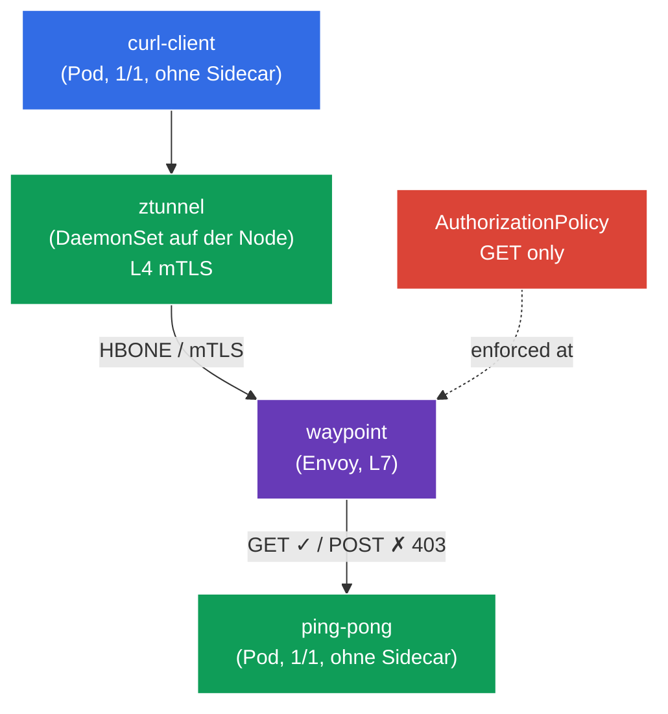

[RU version](README_RU.MD) · [Eng version](README.MD) · [Versión en español](README_ES.MD) · [Version française](README_FR.MD)

# Lab 09 - Advanced: Ambient mode (data plane ohne Sidecars)

Bisher lief Istio in allen Labs nach dem klassischen Sidecar-Modell: In jeden Pod wurde ein Container `istio-proxy` (Envoy) hinzugefügt. Das ist zuverlässig, aber aufwendig - ein Proxy in jedem Pod verbraucht Speicher und CPU, und jede Aktualisierung des data plane erfordert einen Neustart der Pods.

**Ambient mode** ist ein neues data plane von Istio **ohne Sidecars**. Es ist in zwei Schichten aufgeteilt:
- **ztunnel** - ein leichtgewichtiger Proxy, einer pro **Node** (DaemonSet). Er fängt den Traffic der Pods ab und liefert automatisch **mTLS auf L4-Ebene** (Verschlüsselung + Identität) - ganz ohne Sidecars.
- **waypoint** - ein separater Proxy (Envoy), der **bei Bedarf** für einen Namespace/Service bereitgestellt wird, wenn **L7-Funktionen** benötigt werden (HTTP-Routing, L7-Autorisierung, Retries usw.).

Die Idee: Man zahlt nur dort für den L7-Proxy, wo er wirklich gebraucht wird, und erhält die grundlegende Sicherheit (mTLS L4) „kostenlos" auf Node-Ebene.

### Wie das funktioniert (Gesamtschema)



## Ziel

- Den Unterschied zwischen dem Sidecar- und dem Ambient-data-plane verstehen.
- Ambient für einen Namespace aktivieren und sich überzeugen, dass die Pods **ohne Sidecars** laufen und mTLS (L4) von ztunnel bereitgestellt wird.
- Einen **waypoint** bereitstellen und eine **L7 AuthorizationPolicy** anwenden (nur `GET` erlauben) sowie sicherstellen, dass sie funktioniert.

> Istio ist hier bereits im **Ambient**-Profil installiert (istiod + istio-cni + ztunnel), und die CRDs der Gateway API sind installiert (werden für waypoint benötigt).

## Infrastruktur

Die Umgebung wird in AWS (`eu-central-1`) über Terragrunt bereitgestellt und besteht aus:

| Komponente  | Beschreibung                                      |
|------------|---------------------------------------------------|
| `vpc`      | VPC `10.10.0.0/16` mit öffentlichen Subnetzen          |
| `ssh-keys` | SSH-Schlüssel für den Zugriff auf die Nodes                      |
| `k8s-1`    | Kubernetes `1.35.2` (kubeadm) mit installiertem Istio (Ambient-Profil) |
| `worker`   | Arbeitsmaschine mit `kubectl` und Zugriff auf den Cluster   |

Instanzen: `t3.medium` (master) Ubuntu `22.04`

## Deployment

```bash
TASK=09 make run_ica_task
```

## Schritt 1. Aktivierung von Ambient für den Namespace

Im Ambient-Modus wird der Namespace **nicht** mit `istio-injection=enabled` gekennzeichnet, sondern mit dem speziellen Label `istio.io/dataplane-mode=ambient`:

```bash
kubectl label namespace default istio.io/dataplane-mode=ambient --overwrite
```

**Was das bewirkt:** istio-cni beginnt, den Traffic der Pods dieses Namespace zum ztunnel der Node umzuleiten. Sidecars werden **nicht** hinzugefügt - die Pods bleiben `1/1`. Das ist der grundlegende Unterschied zum Sidecar-Modus.

## Schritt 2. Installation der Anwendung

```bash
kubectl apply -f https://raw.githubusercontent.com/ViktorUJ/cks/refs/heads/master/tasks/ica/labs/09/k8s-1/scripts/1.yaml
```

Wir prüfen, dass die Pods **ohne Sidecars** gestartet sind (`1/1`, nicht `2/2`):

```bash
kubectl get pods -n default
```

```
NAME                           READY   STATUS    RESTARTS   AGE
ping-pong-xxxx                 1/1     Running   0          20s
curl-client-xxxx               1/1     Running   0          20s
```

**Kernpunkt:** `READY 1/1` - es gibt keinen Sidecar. Im Sidecar-Modus stünde hier `2/2`. Dabei ist der Pod bereits Teil des Mesh: Sein Traffic läuft über ztunnel.

## Schritt 3. Prüfung der L4-Konnektivität (mTLS über ztunnel)

Wir wenden uns von `curl-client` an `ping-pong`:

```bash
kubectl exec -n default deploy/curl-client -c curl -- \
  curl -s -o /dev/null -w "%{http_code}\n" http://ping-pong:8080/
```
```
200
```

Die Anfrage geht durch - und sie ist **bereits mit mTLS verschlüsselt** auf ztunnel-Ebene, obwohl wir dafür nichts konfiguriert haben und es keine Sidecars gibt. ztunnel läuft als DaemonSet:

```bash
kubectl get daemonset ztunnel -n istio-system
```

**Was passiert ist:** Der ztunnel auf der Node des Clients hat einen mTLS-Tunnel (Protokoll HBONE) zum ztunnel auf der Node des Backends aufgebaut. Das ist „Zero-Trust out of the box" auf L4-Ebene - Identität und Verschlüsselung ohne Sidecars.

## Schritt 4. Waypoint - Proxy für L7

ztunnel arbeitet nur auf L4 (TCP/mTLS). Sobald **L7-Funktionen** benötigt werden (zum Beispiel Autorisierung nach HTTP-Methode oder Pfad), wird ein **waypoint** benötigt - ein L7-Envoy-Proxy für einen Namespace oder Service. Er wird über die Gateway API mit der Klasse `istio-waypoint` bereitgestellt.

```bash
vim waypoint.yaml
```

```yaml
apiVersion: gateway.networking.k8s.io/v1
kind: Gateway
metadata:
  name: waypoint
  namespace: default
  labels:
    istio.io/waypoint-for: service   # waypoint bedient die Services des Namespace
spec:
  gatewayClassName: istio-waypoint    # spezielle Istio-Klasse für Ambient
  listeners:
  - name: mesh
    port: 15008
    protocol: HBONE
```

```bash
kubectl apply -f waypoint.yaml

# wir weisen den Service ping-pong an, über den waypoint zu laufen
kubectl label service ping-pong -n default istio.io/use-waypoint=waypoint
```

Wir prüfen, dass der waypoint-Pod gestartet ist:

```bash
kubectl get pods -n default -l gateway.networking.k8s.io/gateway-name=waypoint
```

**Erläuterung:**
- **`gatewayClassName: istio-waypoint`** - weist Istio an, kein gewöhnliches Ingress-Gateway, sondern einen waypoint-Proxy zu erstellen.
- **`istio.io/waypoint-for: service`** - der waypoint verarbeitet den an Services adressierten Traffic.
- **`istio.io/use-waypoint=waypoint`** am Service - aktiviert das Routing des Traffics zu `ping-pong` über den waypoint. Der Pfad ist jetzt: `curl-client → ztunnel → waypoint → ztunnel → ping-pong`.

## Schritt 5. L7 AuthorizationPolicy (nur GET erlauben)

Jetzt, da es einen waypoint gibt, können L7-Richtlinien angewendet werden. Wir erlauben zu `ping-pong` nur die Methode `GET`:

```bash
vim authz.yaml
```

```yaml
apiVersion: security.istio.io/v1
kind: AuthorizationPolicy
metadata:
  name: ping-pong-get-only
  namespace: default
spec:
  targetRefs:
  - kind: Service
    group: ""
    name: ping-pong     # Richtlinie ist an den Service gebunden -> sie wird vom waypoint angewendet
  action: ALLOW
  rules:
  - to:
    - operation:
        methods: ["GET"]
```

```bash
kubectl apply -f authz.yaml
```

**Wichtig:** Eine L7-Richtlinie (nach HTTP-Methode) kann **nur** angewendet werden, weil es einen waypoint gibt. Ohne ihn sieht ztunnel nur L4 (TCP) und kann die HTTP-Methode nicht lesen. Das `targetRefs` auf den Service `ping-pong` weist den waypoint an, die Richtlinie auf den Traffic dieses Services anzuwenden.

## Schritt 6. Prüfung des L7-Enforcements

```bash
# GET -> erlaubt
kubectl exec -n default deploy/curl-client -c curl -- \
  curl -s -o /dev/null -w "%{http_code}\n" http://ping-pong:8080/
```
```
200
```

```bash
# POST -> vom waypoint verboten
kubectl exec -n default deploy/curl-client -c curl -- \
  curl -s -o /dev/null -w "%{http_code}\n" -X POST http://ping-pong:8080/
```
```
403      # RBAC: access denied - die L7-Richtlinie am waypoint hat gegriffen
```

## Fazit

| Schicht | Komponente | Was sie liefert | Bereich |
|------|-----------|----------|---------|
| L4 | **ztunnel** (DaemonSet auf der Node) | mTLS, Identität, L4-Autorisierung | automatisch für den gesamten Ambient-Namespace |
| L7 | **waypoint** (Envoy bei Bedarf) | HTTP-Routing, L7-Autorisierung, Retries | nur dort, wo explizit bereitgestellt |

**Zentrale Erkenntnis:** Ambient mode teilt das data plane in zwei Ebenen:
- **ztunnel** liefert grundlegende Sicherheit (mTLS L4) für alle Pods des Namespace **ohne Sidecars** - die Pods bleiben `1/1`, Ressourcen werden gespart, und die Aktualisierung des data plane erfordert keinen Neustart der Anwendungen.
- **waypoint** fügt L7-Fähigkeiten **punktuell** hinzu - nur für die Services, die sie benötigen.

Das unterscheidet sich grundlegend vom Sidecar-Modell, bei dem Envoy in jedem Pod vorhanden ist und stets sowohl L4 als auch L7 verarbeitet. Ambient bedeutet: „Zahle für L7 nur dort, wo es gebraucht wird."
