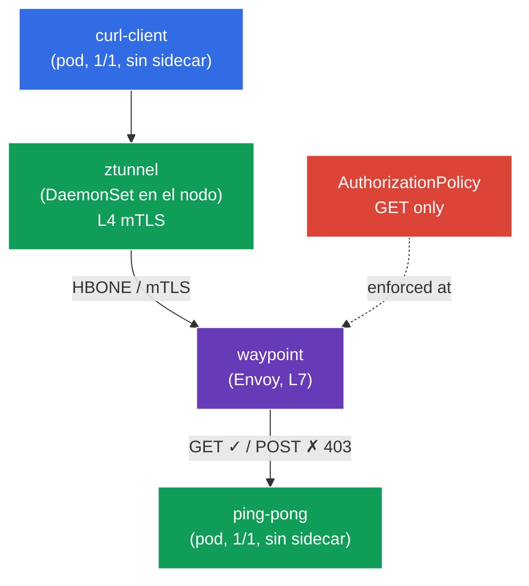

[RU version](README_RU.MD) · [Eng version](README.MD)

# Lab 09 - Advanced: Ambient mode (data plane sin sidecars)

Hasta ahora Istio, en todas las prácticas, funcionaba según el modelo clásico de sidecar: a cada pod se le añadía un contenedor `istio-proxy` (Envoy). Esto es fiable, pero costoso - un proxy en cada pod consume memoria y CPU, y cualquier actualización del data plane requiere reiniciar los pods.

El **Ambient mode** es un nuevo data plane de Istio **sin sidecars**. Está dividido en dos capas:
- **ztunnel** - un proxy ligero, uno por **nodo** (DaemonSet). Intercepta el tráfico de los pods y proporciona automáticamente **mTLS a nivel L4** (cifrado + identidad) - sin ningún sidecar.
- **waypoint** - un proxy independiente (Envoy) que se despliega **bajo demanda** para un namespace/servicio cuando se necesitan **funciones L7** (enrutamiento por HTTP, autorización L7, reintentos, etc.).

La idea: pagar por un proxy L7 solo allí donde realmente se necesita, y obtener la seguridad básica (mTLS L4) «gratis» a nivel de nodo.

### Cómo funciona (esquema general)



## Objetivo

- Entender la diferencia entre el data plane de sidecar y el ambient.
- Activar ambient para un namespace y comprobar que los pods funcionan **sin sidecars**, mientras que mTLS (L4) lo proporciona ztunnel.
- Desplegar un **waypoint** y aplicar una **L7 AuthorizationPolicy** (permitir solo `GET`), comprobar que funciona.

> Istio aquí ya está instalado en el perfil **ambient** (istiod + istio-cni + ztunnel), y están instalados los CRD de la Gateway API (necesarios para waypoint).

## Paso 1. Activación de ambient para el namespace

En ambient el namespace se marca **no** con `istio-injection=enabled`, sino con la etiqueta especial `istio.io/dataplane-mode=ambient`:

```bash
kubectl label namespace default istio.io/dataplane-mode=ambient --overwrite
```

**Qué hace esto:** istio-cni empieza a redirigir el tráfico de los pods de este namespace hacia el ztunnel del nodo. Los sidecars **no se añaden** - los pods se mantienen `1/1`. Esta es la diferencia fundamental con el modo sidecar.

## Paso 2. Instalación de la aplicación

```bash
kubectl apply -f https://raw.githubusercontent.com/ViktorUJ/cks/refs/heads/master/tasks/ica/labs/09/k8s-1/scripts/1.yaml
```

Comprobamos que los pods han arrancado **sin sidecars** (`1/1`, y no `2/2`):

```bash
kubectl get pods -n default
```

```
NAME                           READY   STATUS    RESTARTS   AGE
ping-pong-xxxx                 1/1     Running   0          20s
curl-client-xxxx               1/1     Running   0          20s
```

**Punto clave:** `READY 1/1` - no hay sidecar. En el modo sidecar aquí habría `2/2`. Aun así, el pod ya está incluido en la malla: su tráfico pasa a través de ztunnel.

## Paso 3. Comprobación de la conectividad L4 (mTLS mediante ztunnel)

Nos dirigimos desde `curl-client` a `ping-pong`:

```bash
kubectl exec -n default deploy/curl-client -c curl -- \
  curl -s -o /dev/null -w "%{http_code}\n" http://ping-pong:8080/
```
```
200
```

La petición pasa - y ya va **cifrada con mTLS** a nivel de ztunnel, aunque no configuramos nada para ello y no hay sidecars. ztunnel funciona como DaemonSet:

```bash
kubectl get daemonset ztunnel -n istio-system
```

**Qué ha ocurrido:** el ztunnel del nodo del cliente estableció un túnel mTLS (protocolo HBONE) hasta el ztunnel del nodo del backend. Esto es «zero-trust de fábrica» a nivel L4 - identidad y cifrado sin sidecars.

## Paso 4. Waypoint - proxy para L7

ztunnel funciona solo en L4 (TCP/mTLS). En cuanto se necesitan **funciones L7** (por ejemplo, autorización por método HTTP o por ruta), se requiere un **waypoint** - un proxy L7 Envoy para un namespace o servicio. Se despliega mediante la Gateway API con la clase `istio-waypoint`.

```bash
vim waypoint.yaml
```

```yaml
apiVersion: gateway.networking.k8s.io/v1
kind: Gateway
metadata:
  name: waypoint
  namespace: default
  labels:
    istio.io/waypoint-for: service   # el waypoint sirve a los servicios del namespace
spec:
  gatewayClassName: istio-waypoint    # clase especial de Istio para ambient
  listeners:
  - name: mesh
    port: 15008
    protocol: HBONE
```

```bash
kubectl apply -f waypoint.yaml

# indicamos al servicio ping-pong que pase por el waypoint
kubectl label service ping-pong -n default istio.io/use-waypoint=waypoint
```

Comprobamos que el pod del waypoint ha arrancado:

```bash
kubectl get pods -n default -l gateway.networking.k8s.io/gateway-name=waypoint
```

**Análisis:**
- **`gatewayClassName: istio-waypoint`** - le dice a Istio que cree no un ingress-gateway normal, sino un proxy waypoint.
- **`istio.io/waypoint-for: service`** - el waypoint procesará el tráfico dirigido a los servicios.
- **`istio.io/use-waypoint=waypoint`** en el servicio - activa el enrutamiento del tráfico hacia `ping-pong` a través del waypoint. Ahora el recorrido es este: `curl-client → ztunnel → waypoint → ztunnel → ping-pong`.

## Paso 5. L7 AuthorizationPolicy (permitir solo GET)

Ahora que hay waypoint, se pueden aplicar políticas L7. Permitiremos hacia `ping-pong` solo el método `GET`:

```bash
vim authz.yaml
```

```yaml
apiVersion: security.istio.io/v1
kind: AuthorizationPolicy
metadata:
  name: ping-pong-get-only
  namespace: default
spec:
  targetRefs:
  - kind: Service
    group: ""
    name: ping-pong     # la política está ligada al servicio -> la aplica el waypoint
  action: ALLOW
  rules:
  - to:
    - operation:
        methods: ["GET"]
```

```bash
kubectl apply -f authz.yaml
```

**Importante:** la política L7 (por método HTTP) puede aplicarse **solo** porque hay waypoint. Sin él, ztunnel ve únicamente L4 (TCP) y no sabe leer el método HTTP. `targetRefs` sobre el servicio `ping-pong` le dice al waypoint que aplique la política al tráfico de este servicio.

## Paso 6. Comprobación del enforcement L7

```bash
# GET -> permitido
kubectl exec -n default deploy/curl-client -c curl -- \
  curl -s -o /dev/null -w "%{http_code}\n" http://ping-pong:8080/
```
```
200
```

```bash
# POST -> denegado por el waypoint
kubectl exec -n default deploy/curl-client -c curl -- \
  curl -s -o /dev/null -w "%{http_code}\n" -X POST http://ping-pong:8080/
```
```
403      # RBAC: access denied - se activó la política L7 en el waypoint
```

## Resumen

| Capa | Componente | Qué aporta | Ámbito |
|------|-----------|----------|---------|
| L4 | **ztunnel** (DaemonSet en el nodo) | mTLS, identidad, autorización L4 | automáticamente para todo el namespace ambient |
| L7 | **waypoint** (Envoy bajo demanda) | enrutamiento HTTP, autorización L7, reintentos | solo allí donde se despliega explícitamente |

**Conclusión clave:** el ambient mode separa el data plane en dos niveles:
- **ztunnel** da seguridad básica (mTLS L4) a todos los pods del namespace **sin sidecars** - los pods se mantienen `1/1`, se ahorran recursos y la actualización del data plane no requiere reiniciar las aplicaciones.
- **waypoint** añade capacidades L7 **de forma puntual** - solo para aquellos servicios que las necesitan.

Esto se diferencia fundamentalmente del modelo sidecar, donde Envoy está presente en cada pod y siempre procesa tanto L4 como L7. Ambient trata de «pagar por L7 solo allí donde se necesita».
