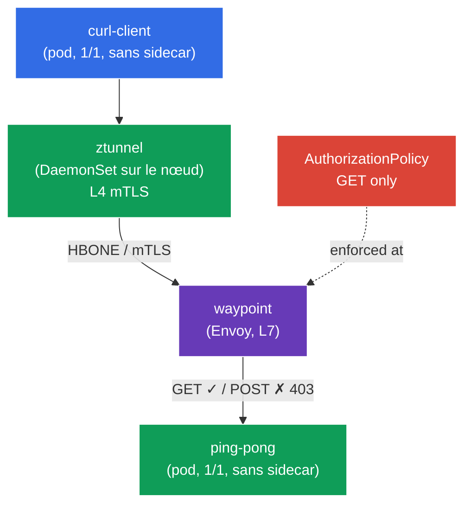

[RU version](README_RU.MD) · [Eng version](README.MD) · [Versión en español](README_ES.MD) · [Deutsche Version](README_DE.MD)

# Lab 09 - Advanced: Ambient mode (data plane sans sidecars)

Jusqu'ici, dans tous les labs, Istio fonctionnait selon le modèle classique du sidecar : un conteneur `istio-proxy` (Envoy) était ajouté à chaque pod. C'est fiable, mais coûteux - un proxy dans chaque pod consomme de la mémoire et du CPU, et toute mise à jour du data plane impose de redémarrer les pods.

Le **mode ambient** est le nouveau data plane d'Istio **sans sidecars**. Il est découpé en deux couches :
- **ztunnel** - un proxy léger, un par **nœud** (DaemonSet). Il intercepte le trafic des pods et fournit automatiquement le **mTLS au niveau L4** (chiffrement + identité) - sans aucun sidecar.
- **waypoint** - un proxy dédié (Envoy) qui se déploie **à la demande** pour un namespace/service lorsque des **fonctions L7** sont nécessaires (routage HTTP, autorisation L7, tentatives, etc.).

L'idée : ne payer un proxy L7 que là où il est réellement nécessaire, tout en obtenant la sécurité de base (mTLS L4) « gratuitement » au niveau du nœud.

### Comment ça marche (schéma général)



## Objectif

- Comprendre la différence entre les data plane sidecar et ambient.
- Activer l'ambient pour un namespace et vérifier que les pods fonctionnent **sans sidecars**, tandis que le mTLS (L4) est assuré par ztunnel.
- Déployer un **waypoint** et appliquer une **AuthorizationPolicy L7** (autoriser uniquement `GET`), puis vérifier qu'elle fonctionne.

> Istio est déjà installé ici en profil **ambient** (istiod + istio-cni + ztunnel), et les CRD de la Gateway API sont installées (nécessaires pour le waypoint).

## Infrastructure

L'environnement est déployé dans AWS (`eu-central-1`) via Terragrunt et se compose de :

| Composant  | Description                                          |
|------------|---------------------------------------------------|
| `vpc`      | VPC `10.10.0.0/16` avec des sous-réseaux publics          |
| `ssh-keys` | Clés SSH pour l'accès aux nœuds                      |
| `k8s-1`    | Kubernetes `1.35.2` (kubeadm) avec Istio installé (profil ambient) |
| `worker`   | Machine de travail avec `kubectl` et accès au cluster   |

Instances : `t3.medium` (master) Ubuntu `22.04`

## Déploiement

```bash
TASK=09 make run_ica_task
```

## Étape 1. Activation de l'ambient pour le namespace

En ambient, le namespace n'est **pas** marqué avec `istio-injection=enabled`, mais avec un label spécial `istio.io/dataplane-mode=ambient` :

```bash
kubectl label namespace default istio.io/dataplane-mode=ambient --overwrite
```

**Ce que ça fait :** istio-cni commence à rediriger le trafic des pods de ce namespace vers le ztunnel du nœud. Les sidecars **ne sont pas ajoutés** - les pods restent `1/1`. C'est la différence fondamentale avec le mode sidecar.

## Étape 2. Installation de l'application

```bash
kubectl apply -f https://raw.githubusercontent.com/ViktorUJ/cks/refs/heads/master/tasks/ica/labs/09/k8s-1/scripts/1.yaml
```

On vérifie que les pods sont bien démarrés **sans sidecars** (`1/1`, et non `2/2`) :

```bash
kubectl get pods -n default
```

```
NAME                           READY   STATUS    RESTARTS   AGE
ping-pong-xxxx                 1/1     Running   0          20s
curl-client-xxxx               1/1     Running   0          20s
```

**Point clé :** `READY 1/1` - pas de sidecar. En mode sidecar, ce serait `2/2` ici. Pourtant, le pod fait déjà partie du maillage : son trafic passe par ztunnel.

## Étape 3. Vérification de la connectivité L4 (mTLS via ztunnel)

On appelle `ping-pong` depuis `curl-client` :

```bash
kubectl exec -n default deploy/curl-client -c curl -- \
  curl -s -o /dev/null -w "%{http_code}\n" http://ping-pong:8080/
```
```
200
```

La requête passe - et elle est **déjà chiffrée en mTLS** au niveau de ztunnel, alors que nous n'avons rien configuré pour ça et qu'il n'y a pas de sidecar. ztunnel fonctionne comme un DaemonSet :

```bash
kubectl get daemonset ztunnel -n istio-system
```

**Ce qui s'est passé :** le ztunnel sur le nœud du client a établi un tunnel mTLS (protocole HBONE) jusqu'au ztunnel sur le nœud du backend. C'est du « zero-trust clé en main » au niveau L4 - identité et chiffrement sans sidecars.

## Étape 4. Waypoint - proxy pour le L7

ztunnel ne travaille qu'au niveau L4 (TCP/mTLS). Dès que des **fonctions L7** sont nécessaires (par exemple l'autorisation par méthode HTTP ou par chemin), il faut un **waypoint** - un proxy Envoy L7 pour un namespace ou un service. Il se déploie via la Gateway API avec la classe `istio-waypoint`.

```bash
vim waypoint.yaml
```

```yaml
apiVersion: gateway.networking.k8s.io/v1
kind: Gateway
metadata:
  name: waypoint
  namespace: default
  labels:
    istio.io/waypoint-for: service   # le waypoint dessert les services du namespace
spec:
  gatewayClassName: istio-waypoint    # classe spéciale Istio pour l'ambient
  listeners:
  - name: mesh
    port: 15008
    protocol: HBONE
```

```bash
kubectl apply -f waypoint.yaml

# on indique au service ping-pong de passer par le waypoint
kubectl label service ping-pong -n default istio.io/use-waypoint=waypoint
```

On vérifie que le pod waypoint est démarré :

```bash
kubectl get pods -n default -l gateway.networking.k8s.io/gateway-name=waypoint
```

**Décryptage :**
- **`gatewayClassName: istio-waypoint`** - demande à Istio de créer non pas un ingress-gateway classique, mais un proxy waypoint.
- **`istio.io/waypoint-for: service`** - le waypoint traitera le trafic adressé aux services.
- **`istio.io/use-waypoint=waypoint`** sur le service - active le routage du trafic vers `ping-pong` à travers le waypoint. Le chemin devient alors : `curl-client → ztunnel → waypoint → ztunnel → ping-pong`.

## Étape 5. AuthorizationPolicy L7 (autoriser uniquement GET)

Maintenant qu'il y a un waypoint, on peut appliquer des politiques L7. Autorisons uniquement la méthode `GET` vers `ping-pong` :

```bash
vim authz.yaml
```

```yaml
apiVersion: security.istio.io/v1
kind: AuthorizationPolicy
metadata:
  name: ping-pong-get-only
  namespace: default
spec:
  targetRefs:
  - kind: Service
    group: ""
    name: ping-pong     # la politique est liée au service -> elle est appliquée par le waypoint
  action: ALLOW
  rules:
  - to:
    - operation:
        methods: ["GET"]
```

```bash
kubectl apply -f authz.yaml
```

**Important :** une politique L7 (par méthode HTTP) ne peut être appliquée **que** parce qu'il y a un waypoint. Sans lui, ztunnel ne voit que le L4 (TCP) et ne sait pas lire la méthode HTTP. Le `targetRefs` sur le service `ping-pong` indique au waypoint d'appliquer la politique au trafic de ce service.

## Étape 6. Vérification de l'application L7

```bash
# GET -> autorisé
kubectl exec -n default deploy/curl-client -c curl -- \
  curl -s -o /dev/null -w "%{http_code}\n" http://ping-pong:8080/
```
```
200
```

```bash
# POST -> refusé par le waypoint
kubectl exec -n default deploy/curl-client -c curl -- \
  curl -s -o /dev/null -w "%{http_code}\n" -X POST http://ping-pong:8080/
```
```
403      # RBAC: access denied - la politique L7 sur le waypoint a agi
```

## Bilan

| Couche | Composant | Ce qu'il apporte | Portée |
|------|-----------|----------|---------|
| L4 | **ztunnel** (DaemonSet sur le nœud) | mTLS, identité, autorisation L4 | automatiquement pour tout le namespace ambient |
| L7 | **waypoint** (Envoy à la demande) | routage HTTP, autorisation L7, tentatives | uniquement là où il est explicitement déployé |

**À retenir :** le mode ambient sépare le data plane en deux niveaux :
- **ztunnel** fournit la sécurité de base (mTLS L4) pour tous les pods du namespace **sans sidecars** - les pods restent `1/1`, les ressources sont économisées, la mise à jour du data plane ne nécessite pas de redémarrer les applications.
- **waypoint** ajoute les capacités L7 **de façon ciblée** - uniquement pour les services qui en ont besoin.

C'est fondamentalement différent du modèle sidecar, où Envoy est présent dans chaque pod et traite toujours à la fois le L4 et le L7. L'ambient, c'est « ne payer le L7 que là où il est nécessaire ».
