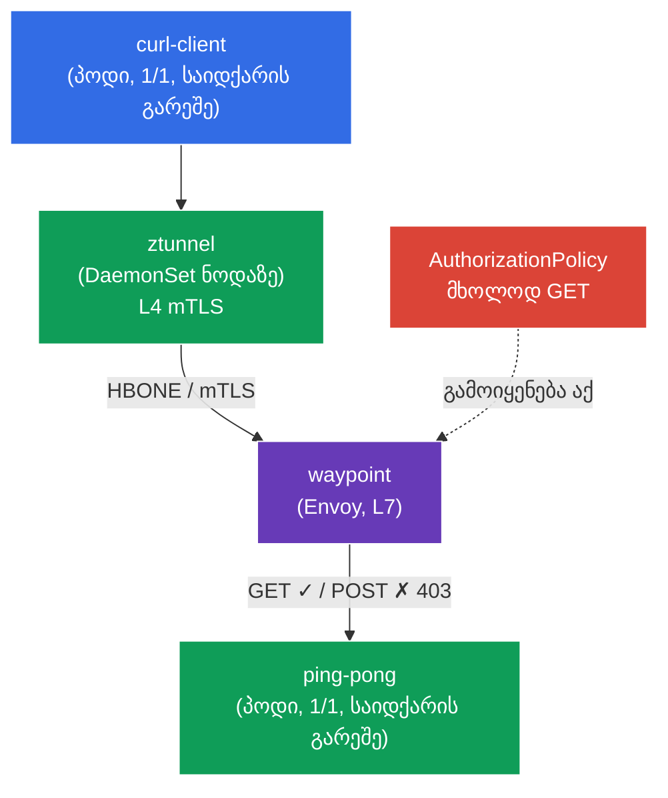

[Русская версия](README_RU.MD) · [Eng version](README.MD) · [Versión en español](README_ES.MD) · [Version française](README_FR.MD) · [Deutsche Version](README_DE.MD) · [繁體中文版](README_TW.MD) · [日本語版](README_JP.MD)

# Lab 09 - Advanced: Ambient mode (data plane საიდქარების გარეშე)

> [საცნობარო გადაწყვეტა](worker/files/solutions/1_GE.MD)

აქამდე ყველა ლაბორატორიაში Istio კლასიკური sidecar-მოდელით მუშაობდა: თითოეულ პოდს ემატებოდა `istio-proxy` (Envoy) კონტეინერი. ეს საიმედოა, თუმცა რესურსტევადი - თითოეულ პოდში არსებული პროქსი მოიხმარს მეხსიერებასა და CPU-ს, ხოლო data plane-ის ნებისმიერი განახლება პოდების გადატვირთვას მოითხოვს.

**Ambient mode** - Istio-ს ახალი data plane **საიდქარების გარეშე**. ის ორ შრედ იყოფა:
- **ztunnel** - მსუბუქი პროქსი, თითო **ნოდაზე** ერთი (DaemonSet). ის პოდების ტრაფიკს იჭერს და ავტომატურად უზრუნველყოფს **mTLS-ს L4 დონეზე** (დაშიფვრა + იდენტობა) - ყოველგვარი საიდქარების გარეშე.
- **waypoint** - ცალკე პროქსი (Envoy), რომელიც namespace-ისთვის/სერვისისთვის **საჭიროებისამებრ** იშლება, როდესაც საჭიროა **L7-ფუნქციები** (HTTP-ის მიხედვით მარშრუტიზაცია, L7-ავტორიზაცია, განმეორებითი მცდელობები და ა.შ.).

იდეა: L7-პროქსის საფასური გადავიხადოთ მხოლოდ იქ, სადაც ის რეალურად საჭიროა, ხოლო საბაზისო უსაფრთხოება (mTLS L4) ნოდის დონეზე „უფასოდ“ მივიღოთ.

### როგორ მუშაობს ეს (ზოგადი სქემა)



## მიზანი

- გავიგოთ განსხვავება sidecar და ambient data plane-ებს შორის.
- ჩავრთოთ ambient namespace-ისთვის და დავრწმუნდეთ, რომ პოდები **საიდქარების გარეშე** მუშაობენ, ხოლო mTLS-ს (L4) ztunnel უზრუნველყოფს.
- გავშალოთ **waypoint**, გამოვიყენოთ **L7 AuthorizationPolicy** (დავუშვათ მხოლოდ `GET`) და დავრწმუნდეთ, რომ ის მუშაობს.

> Istio აქ უკვე დაყენებულია **ambient**-პროფილით (istiod + istio-cni + ztunnel), ასევე დაყენებულია Gateway API-ის CRD-ები (waypoint-ისთვის აუცილებელია).

## ინფრასტრუქტურა

გარემო Terragrunt-ის საშუალებით AWS-ში (`eu-central-1`) იშლება და შედგება შემდეგი კომპონენტებისგან:

| კომპონენტი | აღწერა |
|------------|--------|
| `vpc`      | VPC `10.10.0.0/16` საჯარო ქვექსელებით |
| `ssh-keys` | SSH-გასაღებები ნოდებზე წვდომისთვის |
| `k8s-1`    | Kubernetes `1.35.2` (kubeadm) დაყენებული Istio-თი (ambient-პროფილი) |
| `worker`   | სამუშაო მანქანა `kubectl`-ითა და კლასტერზე წვდომით |

ინსტანსები: `t3.medium` (master) Ubuntu `22.04`

## გაშლა

```bash
TASK=09 make run_ica_task
```

## ნაბიჯი 1. Ambient-ის ჩართვა namespace-ისთვის

Ambient-ში namespace ინიშნება **არა** `istio-injection=enabled`-ით, არამედ სპეციალური ჭდით `istio.io/dataplane-mode=ambient`:

```bash
kubectl label namespace default istio.io/dataplane-mode=ambient --overwrite
```

**რას აკეთებს ეს:** istio-cni ამ namespace-ის პოდების ტრაფიკის ნოდის ztunnel-ზე გადამისამართებას იწყებს. საიდქარები **არ ემატება** - პოდები `1/1` რჩება. ეს sidecar-რეჟიმისგან პრინციპული განსხვავებაა.

## ნაბიჯი 2. აპლიკაციის დაყენება

```bash
kubectl apply -f https://raw.githubusercontent.com/ViktorUJ/cks/refs/heads/master/tasks/ica/labs/09/k8s-1/scripts/1.yaml
```

ვამოწმებთ, რომ პოდები **საიდქარების გარეშე** გაეშვა (`1/1` და არა `2/2`):

```bash
kubectl get pods -n default
```

```
NAME                           READY   STATUS    RESTARTS   AGE
ping-pong-xxxx                 1/1     Running   0          20s
curl-client-xxxx               1/1     Running   0          20s
```

**საკვანძო მომენტი:** `READY 1/1` - საიდქარი არ არის. Sidecar-რეჟიმში აქ `2/2` იქნებოდა. ამასთან, პოდი უკვე ჩართულია mesh-ში: მისი ტრაფიკი ztunnel-ის გავლით გადის.

## ნაბიჯი 3. L4-კავშირის შემოწმება (mTLS ztunnel-ის გავლით)

`curl-client`-იდან `ping-pong`-ს ვუკავშირდებით:

```bash
kubectl exec -n default deploy/curl-client -c curl -- \
  curl -s -o /dev/null -w "%{http_code}\n" http://ping-pong:8080/
```
```
200
```

მოთხოვნა სრულდება - და ის ztunnel-ის დონეზე **უკვე დაშიფრულია mTLS-ით**, მიუხედავად იმისა, რომ ამისთვის არაფერი მოგვიმართავს და საიდქარები არ არის. ztunnel მუშაობს როგორც DaemonSet:

```bash
kubectl get daemonset ztunnel -n istio-system
```

**რა მოხდა:** კლიენტის ნოდაზე არსებულმა ztunnel-მა mTLS-გვირაბი (HBONE პროტოკოლი) დაამყარა ბექენდის ნოდაზე არსებულ ztunnel-მდე. ეს არის „zero-trust პირდაპირ მზა სახით“ L4 დონეზე - იდენტობა და დაშიფვრა საიდქარების გარეშე.

## ნაბიჯი 4. Waypoint - პროქსი L7-ისთვის

ztunnel მხოლოდ L4-ზე (TCP/mTLS) მუშაობს. როგორც კი საჭიროა **L7-ფუნქციები** (მაგალითად, ავტორიზაცია HTTP-მეთოდის ან გზის მიხედვით), საჭიროა **waypoint** - L7-პროქსი Envoy namespace-ისთვის ან სერვისისთვის. ის Gateway API-ის საშუალებით, `istio-waypoint` კლასით იშლება.

```bash
vim waypoint.yaml
```

```yaml
apiVersion: gateway.networking.k8s.io/v1
kind: Gateway
metadata:
  name: waypoint
  namespace: default
  labels:
    istio.io/waypoint-for: service   # waypoint ემსახურება namespace-ის სერვისებს
spec:
  gatewayClassName: istio-waypoint    # სპეციალური კლასი Istio-სთვის ambient-ში
  listeners:
  - name: mesh
    port: 15008
    protocol: HBONE
```

```bash
kubectl apply -f waypoint.yaml

# ვეუბნებით სერვის ping-pong-ს, waypoint-ის გავლით იაროს
kubectl label service ping-pong -n default istio.io/use-waypoint=waypoint
```

ვამოწმებთ, რომ waypoint-ის პოდი გაეშვა:

```bash
kubectl get pods -n default -l gateway.networking.k8s.io/gateway-name=waypoint
```

**განხილვა:**
- **`gatewayClassName: istio-waypoint`** - Istio-ს მიუთითებს, რომ შექმნას არა ჩვეულებრივი ingress-gateway, არამედ waypoint-პროქსი.
- **`istio.io/waypoint-for: service`** - waypoint დაამუშავებს სერვისების მისამართით გაგზავნილ ტრაფიკს.
- **`istio.io/use-waypoint=waypoint`** სერვისზე - რთავს `ping-pong`-ისკენ ტრაფიკის მარშრუტიზაციას waypoint-ის გავლით. ახლა გზა ასეთია: `curl-client → ztunnel → waypoint → ztunnel → ping-pong`.

## ნაბიჯი 5. L7 AuthorizationPolicy (მხოლოდ GET-ის დაშვება)

ახლა, როდესაც waypoint არსებობს, შესაძლებელია L7-პოლიტიკების გამოყენება. `ping-pong`-ისთვის მხოლოდ `GET` მეთოდი დავუშვათ:

```bash
vim authz.yaml
```

```yaml
apiVersion: security.istio.io/v1
kind: AuthorizationPolicy
metadata:
  name: ping-pong-get-only
  namespace: default
spec:
  targetRefs:
  - kind: Service
    group: ""
    name: ping-pong     # პოლიტიკა მიბმულია სერვისზე -> მას იყენებს waypoint
  action: ALLOW
  rules:
  - to:
    - operation:
        methods: ["GET"]
```

```bash
kubectl apply -f authz.yaml
```

**მნიშვნელოვანია:** L7-პოლიტიკის (HTTP-მეთოდის მიხედვით) გამოყენება **მხოლოდ** waypoint-ის არსებობის გამოა შესაძლებელი. მის გარეშე ztunnel მხოლოდ L4-ს (TCP) ხედავს და HTTP-მეთოდის წაკითხვა არ შეუძლია. სერვის `ping-pong`-ზე `targetRefs` waypoint-ს მიუთითებს, რომ პოლიტიკა ამ სერვისის ტრაფიკზე გამოიყენოს.

## ნაბიჯი 6. L7-აღსრულების შემოწმება

```bash
# GET -> ნებადართულია
kubectl exec -n default deploy/curl-client -c curl -- \
  curl -s -o /dev/null -w "%{http_code}\n" http://ping-pong:8080/
```
```
200
```

```bash
# POST -> აკრძალულია waypoint-ის მიერ
kubectl exec -n default deploy/curl-client -c curl -- \
  curl -s -o /dev/null -w "%{http_code}\n" -X POST http://ping-pong:8080/
```
```
403      # RBAC: access denied - ამოქმედდა L7-პოლიტიკა waypoint-ზე
```

## შეჯამება

| შრე | კომპონენტი | რას უზრუნველყოფს | მოქმედების არეალი |
|-----|------------|------------------|-------------------|
| L4 | **ztunnel** (DaemonSet ნოდაზე) | mTLS, იდენტობა, L4-ავტორიზაცია | ავტომატურად მთელი ambient-namespace-ისთვის |
| L7 | **waypoint** (Envoy საჭიროებისამებრ) | HTTP-მარშრუტიზაცია, L7-ავტორიზაცია, განმეორებითი მცდელობები | მხოლოდ იქ, სადაც აშკარად არის გაშლილი |

**საკვანძო დასკვნა:** ambient mode data plane-ს ორ დონედ ყოფს:
- **ztunnel** namespace-ის ყველა პოდისთვის საბაზისო უსაფრთხოებას (mTLS L4) უზრუნველყოფს **საიდქარების გარეშე** - პოდები `1/1` რჩება, რესურსები იზოგება, ხოლო data plane-ის განახლება აპლიკაციების გადატვირთვას არ მოითხოვს.
- **waypoint** L7-შესაძლებლობებს **შერჩევითად** ამატებს - მხოლოდ იმ სერვისებისთვის, რომლებსაც ისინი სჭირდება.

ეს პრინციპულად განსხვავდება sidecar-მოდელისგან, სადაც Envoy თითოეულ პოდშია და ყოველთვის ამუშავებს როგორც L4-ს, ისე L7-ს. Ambient-ის პრინციპია: „L7-ის საფასური გადაიხადე მხოლოდ იქ, სადაც ის საჭიროა“.
