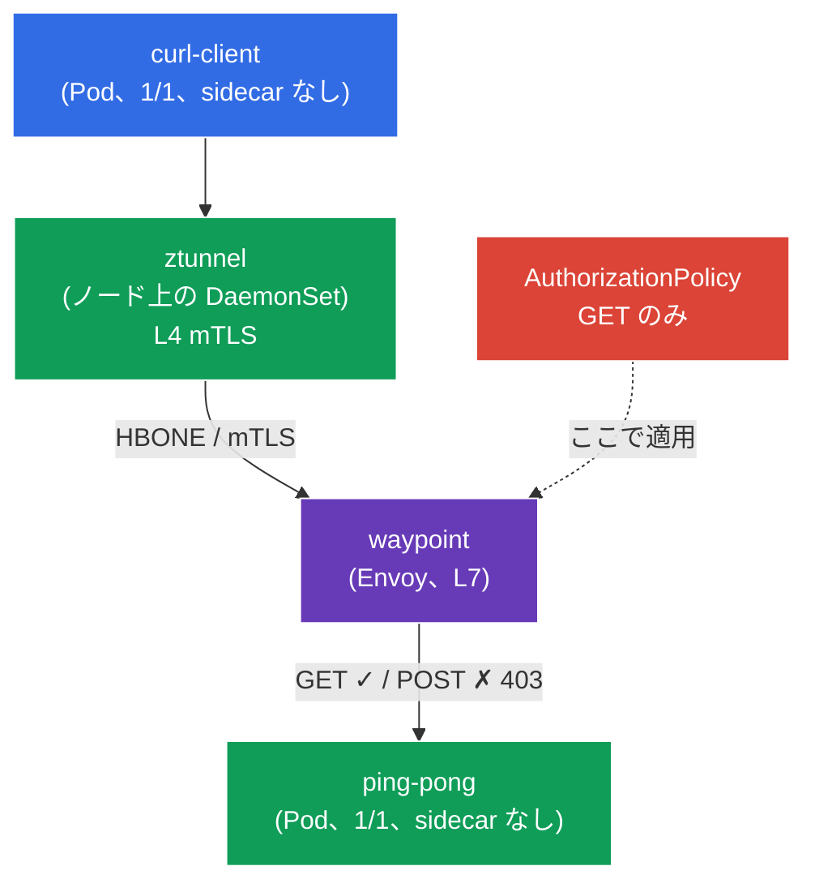

[Русская версия](README_RU.MD) · [Eng version](README.MD) · [Versión en español](README_ES.MD) · [Version française](README_FR.MD) · [Deutsche Version](README_DE.MD) · [ქართული ვერსია](README_GE.MD) · [繁體中文版](README_TW.MD)

# Lab 09 - 上級: Ambient mode（sidecar なしの data plane）

> [リファレンス解答](worker/files/solutions/1_JP.MD)

これまでのすべてのラボで、Istio は従来の sidecar モデルで動作していました。各 Pod に `istio-proxy`（Envoy）コンテナが追加される方式です。これは信頼性がありますが、コストがかかります。各 Pod のプロキシがメモリと CPU を消費し、data plane を更新するたびに Pod の再起動が必要になります。

**Ambient mode** は、**sidecar なし**の新しい Istio data plane です。2 つのレイヤーに分かれています。
- **ztunnel** - **ノード**ごとに 1 つ配置される軽量プロキシ（DaemonSet）。Pod のトラフィックを捕捉し、sidecar をまったく追加せずに **L4 レベルの mTLS**（暗号化 + ID）を自動で提供します。
- **waypoint** - **L7 機能**（HTTP ルーティング、L7 認可、リトライなど）が必要な場合に、namespace／サービス向けに**必要に応じて**デプロイされる個別のプロキシ（Envoy）。

考え方は、実際に必要な箇所でのみ L7 プロキシのコストを払い、基本的なセキュリティ（L4 mTLS）はノードレベルで「無料」で得ることです。

### 仕組み（全体図）



## 目的

- sidecar と ambient data plane の違いを理解する。
- namespace に ambient を有効化し、Pod が **sidecar なし**で動作し、ztunnel が mTLS（L4）を提供していることを確認する。
- **waypoint** をデプロイして **L7 AuthorizationPolicy**（`GET` のみを許可）を適用し、動作を確認する。

> ここでは Istio はすでに **ambient** プロファイル（istiod + istio-cni + ztunnel）でインストールされており、Gateway API CRD（waypoint に必要）もインストール済みです。

## インフラストラクチャ

環境は Terragrunt 経由で AWS（`eu-central-1`）にデプロイされ、次で構成されています。

| コンポーネント | 説明 |
|------------|---------------------------------------------------|
| `vpc`      | パブリックサブネットを持つ VPC `10.10.0.0/16` |
| `ssh-keys` | ノードへアクセスするための SSH キー |
| `k8s-1`    | Istio（ambient プロファイル）がインストールされた Kubernetes `1.35.2`（kubeadm） |
| `worker`   | `kubectl` とクラスターへのアクセスを備えた作業マシン |

インスタンス: `t3.medium`（master）Ubuntu `22.04`

## デプロイ

```bash
TASK=09 make run_ica_task
```

## ステップ 1. namespace の ambient を有効化

ambient では、namespace に `istio-injection=enabled` ではなく、専用のラベル `istio.io/dataplane-mode=ambient` を付与します。

```bash
kubectl label namespace default istio.io/dataplane-mode=ambient --overwrite
```

**これにより行われること:** istio-cni がこの namespace の Pod トラフィックをノードの ztunnel へリダイレクトし始めます。**sidecar は追加されず**、Pod は `1/1` のままです。これは sidecar モードとの根本的な違いです。

## ステップ 2. アプリケーションのインストール

```bash
kubectl apply -f https://raw.githubusercontent.com/ViktorUJ/cks/refs/heads/master/tasks/ica/labs/09/k8s-1/scripts/1.yaml
```

Pod が **sidecar なし**（`2/2` ではなく `1/1`）で起動したことを確認します。

```bash
kubectl get pods -n default
```

```
NAME                           READY   STATUS    RESTARTS   AGE
ping-pong-xxxx                 1/1     Running   0          20s
curl-client-xxxx               1/1     Running   0          20s
```

**重要なポイント:** `READY 1/1` は sidecar が存在しないことを示します。sidecar モードではここは `2/2` になります。それでも Pod はすでに mesh に参加しており、そのトラフィックは ztunnel を通過します。

## ステップ 3. L4 接続性の確認（ztunnel 経由の mTLS）

`curl-client` から `ping-pong` にアクセスします。

```bash
kubectl exec -n default deploy/curl-client -c curl -- \
  curl -s -o /dev/null -w "%{http_code}\n" http://ping-pong:8080/
```
```
200
```

リクエストは成功します。何も設定しておらず sidecar もありませんが、すでに ztunnel レベルで **mTLS により暗号化**されています。ztunnel は DaemonSet として動作します。

```bash
kubectl get daemonset ztunnel -n istio-system
```

**発生したこと:** クライアントノードの ztunnel が、バックエンドノードの ztunnel との mTLS トンネル（HBONE プロトコル）を確立しました。これは L4 レベルでの「最初からゼロトラスト」です。sidecar なしで ID と暗号化を提供します。

## ステップ 4. Waypoint - L7 用プロキシ

ztunnel は L4（TCP/mTLS）のみで動作します。HTTP メソッドやパスに基づく認可など、**L7 機能**が必要になると、namespace またはサービス向けの L7 Envoy プロキシである **waypoint** が必要です。これは `istio-waypoint` クラスの Gateway API を介してデプロイされます。

```bash
vim waypoint.yaml
```

```yaml
apiVersion: gateway.networking.k8s.io/v1
kind: Gateway
metadata:
  name: waypoint
  namespace: default
  labels:
    istio.io/waypoint-for: service   # waypoint は namespace のサービスを処理する
spec:
  gatewayClassName: istio-waypoint    # ambient 用の Istio 専用クラス
  listeners:
  - name: mesh
    port: 15008
    protocol: HBONE
```

```bash
kubectl apply -f waypoint.yaml

# ping-pong サービスに waypoint 経由で通信するよう指定する
kubectl label service ping-pong -n default istio.io/use-waypoint=waypoint
```

waypoint Pod が起動したことを確認します。

```bash
kubectl get pods -n default -l gateway.networking.k8s.io/gateway-name=waypoint
```

**解説:**
- **`gatewayClassName: istio-waypoint`** - 通常の ingress-gateway ではなく、waypoint プロキシを作成するよう Istio に指示します。
- **`istio.io/waypoint-for: service`** - waypoint がサービス宛てのトラフィックを処理します。
- サービス上の **`istio.io/use-waypoint=waypoint`** - `ping-pong` 宛てのトラフィックを waypoint 経由にします。これで経路は `curl-client → ztunnel → waypoint → ztunnel → ping-pong` になります。

## ステップ 5. L7 AuthorizationPolicy（GET のみを許可）

waypoint があるため、L7 ポリシーを適用できるようになりました。`ping-pong` には `GET` メソッドのみを許可します。

```bash
vim authz.yaml
```

```yaml
apiVersion: security.istio.io/v1
kind: AuthorizationPolicy
metadata:
  name: ping-pong-get-only
  namespace: default
spec:
  targetRefs:
  - kind: Service
    group: ""
    name: ping-pong     # ポリシーはサービスに紐付く -> waypoint がそれを適用する
  action: ALLOW
  rules:
  - to:
    - operation:
        methods: ["GET"]
```

```bash
kubectl apply -f authz.yaml
```

**重要:** HTTP メソッドに基づく L7 ポリシーを適用できるのは、waypoint が存在するため**のみ**です。waypoint がなければ、ztunnel は L4（TCP）しか認識できず、HTTP メソッドを読み取れません。サービス `ping-pong` の `targetRefs` は、waypoint にこのサービスのトラフィックへポリシーを適用するよう指示します。

## ステップ 6. L7 エンフォースメントの確認

```bash
# GET -> 許可
kubectl exec -n default deploy/curl-client -c curl -- \
  curl -s -o /dev/null -w "%{http_code}\n" http://ping-pong:8080/
```
```
200
```

```bash
# POST -> waypoint により拒否
kubectl exec -n default deploy/curl-client -c curl -- \
  curl -s -o /dev/null -w "%{http_code}\n" -X POST http://ping-pong:8080/
```
```
403      # RBAC: access denied - waypoint の L7 ポリシーが発動した
```

## まとめ

| レイヤー | コンポーネント | 提供するもの | 範囲 |
|------|-----------|----------|---------|
| L4 | **ztunnel**（ノード上の DaemonSet） | mTLS、ID、L4 認可 | ambient namespace 全体に自動適用 |
| L7 | **waypoint**（必要に応じた Envoy） | HTTP ルーティング、L7 認可、リトライ | 明示的にデプロイされた箇所のみ |

**重要な結論:** ambient mode は data plane を 2 つのレベルに分離します。
- **ztunnel** は namespace 内のすべての Pod に、**sidecar なし**で基本的なセキュリティ（L4 mTLS）を提供します。Pod は `1/1` のままで、リソースを節約でき、data plane の更新でアプリケーションを再起動する必要がありません。
- **waypoint** は、必要なサービスにのみ**限定して** L7 機能を追加します。

これは、Envoy が各 Pod に存在し、常に L4 と L7 の両方を処理する sidecar モデルとは根本的に異なります。Ambient とは、「必要な箇所でのみ L7 のコストを支払う」という考え方です。
