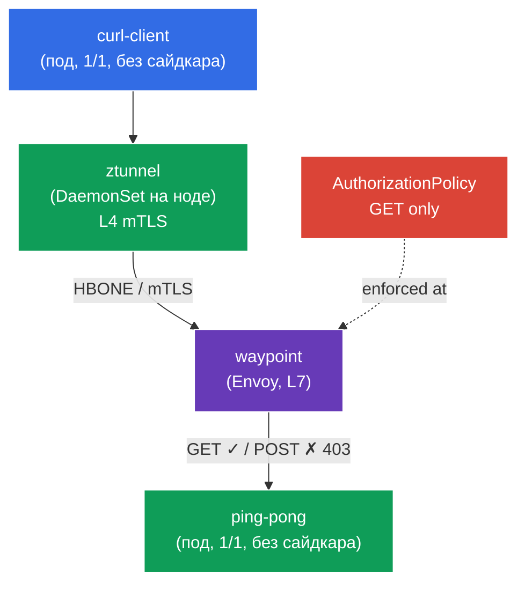

[Eng version](README.MD) · [Versión en español](README_ES.MD) · [Version française](README_FR.MD) · [Deutsche Version](README_DE.MD)

# Lab 09 - Advanced: Ambient mode (data plane без сайдкаров)

До сих пор Istio во всех лабах работал по классической sidecar-модели: в каждый под добавлялся контейнер `istio-proxy` (Envoy). Это надёжно, но затратно - прокси в каждом поде ест память и CPU, а любое обновление data plane требует перезапуска подов.

**Ambient mode** - новый data plane Istio **без сайдкаров**. Он разбит на два слоя:
- **ztunnel** - легковесный прокси, по одному на **ноду** (DaemonSet). Перехватывает трафик подов и автоматически даёт **mTLS на уровне L4** (шифрование + идентичность) - без каких-либо сайдкаров.
- **waypoint** - отдельный прокси (Envoy), который разворачивается **по требованию** для namespace/сервиса, когда нужны **L7-функции** (маршрутизация по HTTP, L7-авторизация, ретраи и т.д.).

Идея: платить за L7-прокси только там, где он реально нужен, а базовую безопасность (mTLS L4) получать «бесплатно» на уровне ноды.

### Как это работает (общая схема)



## Цель

- Понять разницу между sidecar и ambient data plane.
- Включить ambient для namespace и убедиться, что поды работают **без сайдкаров**, а mTLS (L4) обеспечивает ztunnel.
- Развернуть **waypoint** и применить **L7 AuthorizationPolicy** (разрешить только `GET`), убедиться, что она работает.

> Istio здесь уже установлен в **ambient**-профиле (istiod + istio-cni + ztunnel), и установлены CRD Gateway API (нужны для waypoint).

## Инфраструктура

Окружение разворачивается в AWS (`eu-central-1`) через Terragrunt и состоит из:

| Компонент  | Описание                                          |
|------------|---------------------------------------------------|
| `vpc`      | VPC `10.10.0.0/16` с публичными подсетями          |
| `ssh-keys` | SSH-ключи для доступа к нодам                      |
| `k8s-1`    | Kubernetes `1.35.2` (kubeadm) с установленным Istio (ambient-профиль) |
| `worker`   | Рабочая машина с `kubectl` и доступом к кластеру   |

Инстансы: `t3.medium` (master) Ubuntu `22.04`

## Развёртывание

```bash
TASK=09 make run_ica_task
```

## Шаг 1. Включение ambient для namespace

В ambient namespace размечается **не** `istio-injection=enabled`, а специальной меткой `istio.io/dataplane-mode=ambient`:

```bash
kubectl label namespace default istio.io/dataplane-mode=ambient --overwrite
```

**Что это делает:** istio-cni начинает перенаправлять трафик подов этого namespace на ztunnel ноды. Сайдкары **не добавляются** - поды остаются `1/1`. Это принципиальное отличие от sidecar-режима.

## Шаг 2. Установка приложения

```bash
kubectl apply -f https://raw.githubusercontent.com/ViktorUJ/cks/refs/heads/master/tasks/ica/labs/09/k8s-1/scripts/1.yaml
```

Проверяем, что поды поднялись **без сайдкаров** (`1/1`, а не `2/2`):

```bash
kubectl get pods -n default
```

```
NAME                           READY   STATUS    RESTARTS   AGE
ping-pong-xxxx                 1/1     Running   0          20s
curl-client-xxxx               1/1     Running   0          20s
```

**Ключевой момент:** `READY 1/1` - сайдкара нет. В sidecar-режиме здесь было бы `2/2`. При этом под уже включён в mesh: его трафик проходит через ztunnel.

## Шаг 3. Проверка L4-связности (mTLS через ztunnel)

Обращаемся с `curl-client` к `ping-pong`:

```bash
kubectl exec -n default deploy/curl-client -c curl -- \
  curl -s -o /dev/null -w "%{http_code}\n" http://ping-pong:8080/
```
```
200
```

Запрос проходит - и он **уже зашифрован mTLS** на уровне ztunnel, хотя мы ничего для этого не настраивали и сайдкаров нет. ztunnel работает как DaemonSet:

```bash
kubectl get daemonset ztunnel -n istio-system
```

**Что произошло:** ztunnel на ноде клиента установил mTLS-туннель (протокол HBONE) до ztunnel на ноде бэкенда. Это «zero-trust из коробки» на уровне L4 - идентичность и шифрование без сайдкаров.

## Шаг 4. Waypoint - прокси для L7

ztunnel работает только на L4 (TCP/mTLS). Как только нужны **L7-функции** (например, авторизация по HTTP-методу или пути), требуется **waypoint** - L7-прокси Envoy для namespace или сервиса. Разворачивается он через Gateway API с классом `istio-waypoint`.

```bash
vim waypoint.yaml
```

```yaml
apiVersion: gateway.networking.k8s.io/v1
kind: Gateway
metadata:
  name: waypoint
  namespace: default
  labels:
    istio.io/waypoint-for: service   # waypoint обслуживает сервисы namespace
spec:
  gatewayClassName: istio-waypoint    # специальный класс Istio для ambient
  listeners:
  - name: mesh
    port: 15008
    protocol: HBONE
```

```bash
kubectl apply -f waypoint.yaml

# указываем сервису ping-pong ходить через waypoint
kubectl label service ping-pong -n default istio.io/use-waypoint=waypoint
```

Проверяем, что под waypoint поднялся:

```bash
kubectl get pods -n default -l gateway.networking.k8s.io/gateway-name=waypoint
```

**Разбор:**
- **`gatewayClassName: istio-waypoint`** - говорит Istio создать не обычный ingress-gateway, а waypoint-прокси.
- **`istio.io/waypoint-for: service`** - waypoint будет обрабатывать трафик, адресованный сервисам.
- **`istio.io/use-waypoint=waypoint`** на сервисе - включает маршрутизацию трафика к `ping-pong` через waypoint. Теперь путь такой: `curl-client → ztunnel → waypoint → ztunnel → ping-pong`.

## Шаг 5. L7 AuthorizationPolicy (разрешить только GET)

Теперь, когда есть waypoint, можно применять L7-политики. Разрешим к `ping-pong` только метод `GET`:

```bash
vim authz.yaml
```

```yaml
apiVersion: security.istio.io/v1
kind: AuthorizationPolicy
metadata:
  name: ping-pong-get-only
  namespace: default
spec:
  targetRefs:
  - kind: Service
    group: ""
    name: ping-pong     # политика привязана к сервису -> её применяет waypoint
  action: ALLOW
  rules:
  - to:
    - operation:
        methods: ["GET"]
```

```bash
kubectl apply -f authz.yaml
```

**Важно:** L7-политика (по HTTP-методу) может быть применена **только** потому, что есть waypoint. Без него ztunnel видит лишь L4 (TCP) и не умеет читать HTTP-метод. `targetRefs` на сервис `ping-pong` говорит waypoint'у применять политику к трафику этого сервиса.

## Шаг 6. Проверка L7-энфорсмента

```bash
# GET -> разрешён
kubectl exec -n default deploy/curl-client -c curl -- \
  curl -s -o /dev/null -w "%{http_code}\n" http://ping-pong:8080/
```
```
200
```

```bash
# POST -> запрещён waypoint'ом
kubectl exec -n default deploy/curl-client -c curl -- \
  curl -s -o /dev/null -w "%{http_code}\n" -X POST http://ping-pong:8080/
```
```
403      # RBAC: access denied - сработала L7-политика на waypoint
```

## Итог

| Слой | Компонент | Что даёт | Область |
|------|-----------|----------|---------|
| L4 | **ztunnel** (DaemonSet на ноде) | mTLS, идентичность, авторизация L4 | автоматически для всего ambient-namespace |
| L7 | **waypoint** (Envoy по требованию) | HTTP-маршрутизация, L7-авторизация, ретраи | только там, где явно развёрнут |

**Ключевой вывод:** ambient mode разделяет data plane на два уровня:
- **ztunnel** даёт базовую безопасность (mTLS L4) для всех подов namespace **без сайдкаров** - поды остаются `1/1`, ресурсы экономятся, обновление data plane не требует перезапуска приложений.
- **waypoint** добавляет L7-возможности **точечно** - только для тех сервисов, которым они нужны.

Это принципиально отличается от sidecar-модели, где Envoy присутствует в каждом поде и всегда обрабатывает и L4, и L7. Ambient - это про «плати за L7 только там, где он нужен».
