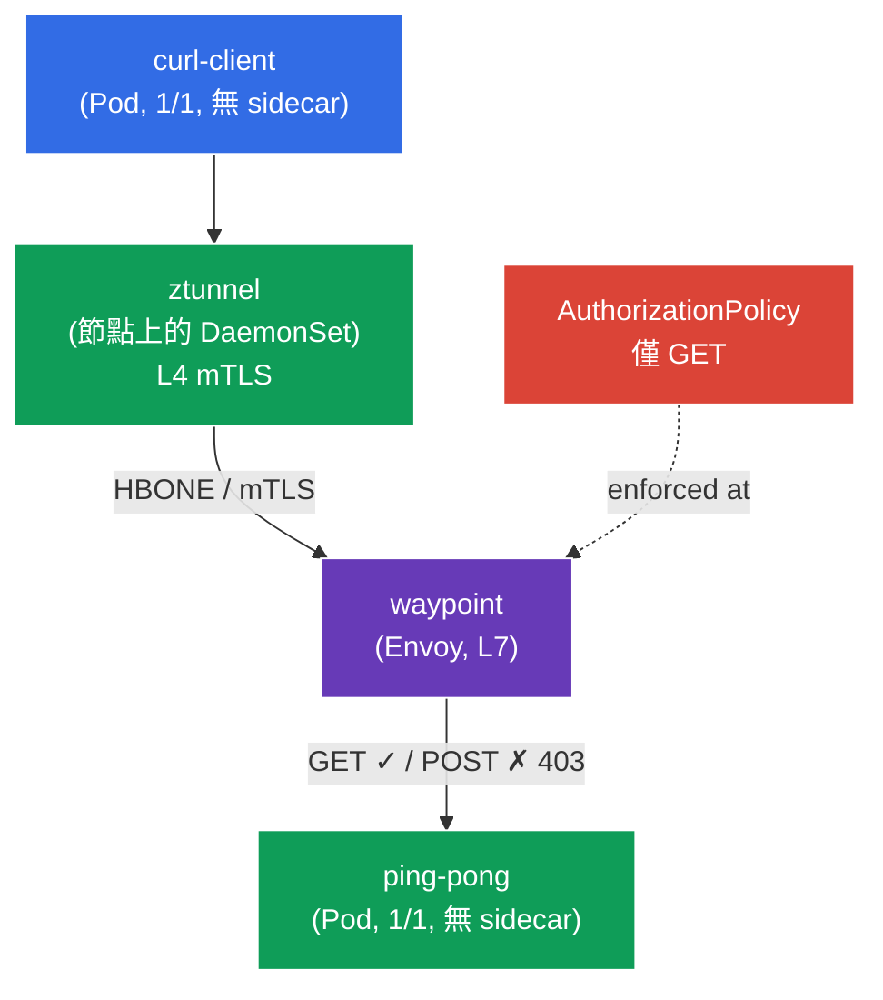

[Русская версия](README_RU.MD) · [Eng version](README.MD) · [Versión en español](README_ES.MD) · [Version française](README_FR.MD) · [Deutsche Version](README_DE.MD) · [ქართული ვერსია](README_GE.MD) · [日本語版](README_JP.MD)

# Lab 09 - 進階：Ambient 模式（無 sidecar 的資料平面）

> [參考解答](worker/files/solutions/1_TW.MD)

到目前為止，Istio 在所有實驗中都採用經典的 sidecar 模式運作：每個 Pod 都會加入一個 `istio-proxy`（Envoy）容器。這很可靠，但成本較高--每個 Pod 中的代理都會占用記憶體和 CPU，且每次更新資料平面都需要重新啟動 Pod。

**Ambient 模式**是 Istio 全新的**無 sidecar**資料平面。它分為兩個層級：
- **ztunnel**--輕量代理，每個**節點**各一個（DaemonSet）。它會攔截 Pod 流量，並自動提供**L4 層級的 mTLS**（加密 + 身分識別）--完全不需要任何 sidecar。
- **waypoint**--獨立的代理（Envoy），當 namespace／服務需要**L7 功能**（依 HTTP 路由、L7 授權、重試等）時，才會**按需**部署。

核心概念是：只在確實需要的地方支付 L7 代理的成本，同時在節點層級「免費」取得基礎安全性（L4 mTLS）。

### 運作方式（整體架構）



## 目標

- 了解 sidecar 與 ambient 資料平面的差異。
- 為 namespace 啟用 ambient，確認 Pod 在**無 sidecar**的情況下運作，而 mTLS（L4）由 ztunnel 提供。
- 部署 **waypoint** 並套用 **L7 AuthorizationPolicy**（僅允許 `GET`），確認其運作正常。

> 此處 Istio 已以 **ambient** 設定檔安裝（istiod + istio-cni + ztunnel），且已安裝 Gateway API CRD（waypoint 所需）。

## 基礎設施

此環境透過 Terragrunt 在 AWS（`eu-central-1`）中部署，包含：

| 元件  | 說明                                          |
|------------|---------------------------------------------------|
| `vpc`      | VPC `10.10.0.0/16`，包含公有子網路          |
| `ssh-keys` | 用於存取節點的 SSH 金鑰                      |
| `k8s-1`    | Kubernetes `1.35.2`（kubeadm），已安裝 Istio（ambient 設定檔） |
| `worker`   | 具備 `kubectl` 並可存取叢集的工作機器   |

執行個體：`t3.medium`（master）Ubuntu `22.04`

## 部署

```bash
TASK=09 make run_ica_task
```

## 步驟 1. 為 namespace 啟用 ambient

在 ambient namespace 中，標記的**不是** `istio-injection=enabled`，而是特殊標籤 `istio.io/dataplane-mode=ambient`：

```bash
kubectl label namespace default istio.io/dataplane-mode=ambient --overwrite
```

**這會做什麼：**istio-cni 開始將此 namespace 的 Pod 流量重新導向至節點的 ztunnel。**不會加入** sidecar--Pod 維持 `1/1`。這是與 sidecar 模式的根本差異。

## 步驟 2. 安裝應用程式

```bash
kubectl apply -f https://raw.githubusercontent.com/ViktorUJ/cks/refs/heads/master/tasks/ica/labs/09/k8s-1/scripts/1.yaml
```

確認 Pod 已在**無 sidecar**的情況下啟動（`1/1`，而非 `2/2`）：

```bash
kubectl get pods -n default
```

```
NAME                           READY   STATUS    RESTARTS   AGE
ping-pong-xxxx                 1/1     Running   0          20s
curl-client-xxxx               1/1     Running   0          20s
```

**關鍵點：**`READY 1/1`--沒有 sidecar。在 sidecar 模式中，這裡會是 `2/2`。但 Pod 已納入 mesh：其流量會經過 ztunnel。

## 步驟 3. 驗證 L4 連通性（透過 ztunnel 的 mTLS）

從 `curl-client` 存取 `ping-pong`：

```bash
kubectl exec -n default deploy/curl-client -c curl -- \
  curl -s -o /dev/null -w "%{http_code}\n" http://ping-pong:8080/
```
```
200
```

請求會通過--而且**已透過 mTLS 加密**，加密在 ztunnel 層級完成，雖然我們沒有為此設定任何內容，也沒有 sidecar。ztunnel 以 DaemonSet 運作：

```bash
kubectl get daemonset ztunnel -n istio-system
```

**發生了什麼：**用戶端節點上的 ztunnel 與後端節點上的 ztunnel 之間建立了 mTLS 隧道（HBONE 通訊協定）。這是在 L4 層級提供的「開箱即用零信任」--無 sidecar 的身分識別與加密。

## 步驟 4. Waypoint--L7 代理

ztunnel 僅在 L4（TCP/mTLS）運作。一旦需要**L7 功能**（例如依 HTTP 方法或路徑進行授權），就需要為 namespace 或服務使用 **waypoint**--L7 Envoy 代理。它透過 Gateway API 與 `istio-waypoint` 類別部署。

```bash
vim waypoint.yaml
```

```yaml
apiVersion: gateway.networking.k8s.io/v1
kind: Gateway
metadata:
  name: waypoint
  namespace: default
  labels:
    istio.io/waypoint-for: service   # waypoint 服務於 namespace 的服務
spec:
  gatewayClassName: istio-waypoint    # 用於 ambient 的 Istio 專用類別
  listeners:
  - name: mesh
    port: 15008
    protocol: HBONE
```

```bash
kubectl apply -f waypoint.yaml

# 指示 ping-pong 服務透過 waypoint 傳送
kubectl label service ping-pong -n default istio.io/use-waypoint=waypoint
```

確認 waypoint Pod 已啟動：

```bash
kubectl get pods -n default -l gateway.networking.k8s.io/gateway-name=waypoint
```

**說明：**
- **`gatewayClassName: istio-waypoint`**--告知 Istio 建立的不是一般 ingress gateway，而是 waypoint 代理。
- **`istio.io/waypoint-for: service`**--waypoint 將處理發往服務的流量。
- 服務上的 **`istio.io/use-waypoint=waypoint`**--啟用將流量經由 waypoint 路由至 `ping-pong`。此時路徑為：`curl-client → ztunnel → waypoint → ztunnel → ping-pong`。

## 步驟 5. L7 AuthorizationPolicy（僅允許 GET）

現在有了 waypoint，就可以套用 L7 政策。僅允許使用 `GET` 方法存取 `ping-pong`：

```bash
vim authz.yaml
```

```yaml
apiVersion: security.istio.io/v1
kind: AuthorizationPolicy
metadata:
  name: ping-pong-get-only
  namespace: default
spec:
  targetRefs:
  - kind: Service
    group: ""
    name: ping-pong     # 政策綁定到服務 -> 由 waypoint 套用
  action: ALLOW
  rules:
  - to:
    - operation:
        methods: ["GET"]
```

```bash
kubectl apply -f authz.yaml
```

**重要：**L7 政策（依 HTTP 方法）能夠套用，**僅僅是因為**存在 waypoint。沒有它，ztunnel 只能看見 L4（TCP），無法讀取 HTTP 方法。服務 `ping-pong` 的 `targetRefs` 告知 waypoint 將此政策套用至該服務的流量。

## 步驟 6. 驗證 L7 強制執行

```bash
# GET -> 允許
kubectl exec -n default deploy/curl-client -c curl -- \
  curl -s -o /dev/null -w "%{http_code}\n" http://ping-pong:8080/
```
```
200
```

```bash
# POST -> 被 waypoint 拒絕
kubectl exec -n default deploy/curl-client -c curl -- \
  curl -s -o /dev/null -w "%{http_code}\n" -X POST http://ping-pong:8080/
```
```
403      # RBAC: access denied - waypoint 上的 L7 政策已生效
```

## 總結

| 層級 | 元件 | 提供的功能 | 範圍 |
|------|-----------|----------|---------|
| L4 | **ztunnel**（節點上的 DaemonSet） | mTLS、身分識別、L4 授權 | 自動套用至整個 ambient namespace |
| L7 | **waypoint**（按需 Envoy） | HTTP 路由、L7 授權、重試 | 僅在明確部署之處 |

**關鍵結論：**ambient 模式將資料平面分為兩個層級：
- **ztunnel** 為 namespace 中所有 Pod 提供基礎安全性（L4 mTLS），**無須 sidecar**--Pod 維持 `1/1`、節省資源，更新資料平面不需要重新啟動應用程式。
- **waypoint** **精準地**新增 L7 功能--僅供需要這些功能的服務使用。

這與 sidecar 模式有根本不同；後者每個 Pod 中都有 Envoy，且永遠同時處理 L4 和 L7。Ambient 的核心是「只在需要的地方為 L7 付費」。
