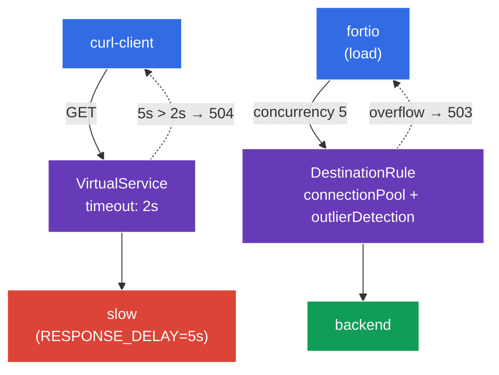

[RU version](README_RU.MD)

# Lab 10 - Resilience: Timeout + Circuit Breaker

Imagine one of your backends starts to "hang" or degrade. Without protection, a slow service holds up every request to it, threads/connections pile up, and the degradation spreads across the whole mesh (a cascading failure). Istio gives you two mechanisms to prevent this:
- **Timeout** - a limit on how long to wait for a response. If the backend doesn't answer in time, the request is aborted with `504` instead of hanging forever.
- **Circuit Breaker** - a "fuse": a connection-pool limit (`connectionPool`) plus automatic ejection of unhealthy endpoints (`outlierDetection`). When a service is overloaded or throwing errors, excess requests are rejected immediately (`503`), giving the service room to recover.

All of it is configured at the infrastructure level, with no application code changes.

### How It Works (High-Level Overview)



## Objective

- Configure a **timeout** in a `VirtualService` and confirm the slow backend returns `504`.
- Configure a **circuit breaker** in a `DestinationRule` (`connectionPool` + `outlierDetection`) and watch excess load get rejected with `503`.

## Step 1. Enable Sidecar Injection

```bash
kubectl label namespace default istio-injection=enabled --overwrite
```

Timeout and circuit breaking are implemented by the Envoy sidecar of the calling service - without it these policies have no effect.

## Step 2. Deploy the Application

```bash
kubectl apply -f https://raw.githubusercontent.com/ViktorUJ/cks/refs/heads/master/tasks/ica/labs/10/k8s-1/scripts/1.yaml
kubectl rollout restart deployment -n default
```

**What gets deployed:**
- **`slow`** - `ping_pong` with `RESPONSE_DELAY=5000` (every response is delayed by 5 seconds) - the "slow" backend for the timeout demo.
- **`backend`** - a fast `ping_pong` - the circuit-breaker target.
- **`curl-client`** - a client to verify the timeout.
- **`fortio`** - a load generator to trip the circuit breaker.

## Step 3. Timeout - Cut Off Long Requests

First, look at the behaviour without a timeout - a request to `slow` returns `200`, but only after ~5 seconds:

```bash
kubectl exec -n default deploy/curl-client -c curl -- \
  curl -s -o /dev/null -w "code=%{http_code} time=%{time_total}s\n" http://slow:8080/
```
```
code=200 time=5.02s
```

Now set a `2s` timeout in a `VirtualService`:

```bash
vim slow-vs.yaml
```

```yaml
apiVersion: networking.istio.io/v1
kind: VirtualService
metadata:
  name: slow-vs
  namespace: default
spec:
  hosts:
  - slow
  http:
  - timeout: 2s          # wait at most 2 seconds for a response
    route:
    - destination:
        host: slow
```

```bash
kubectl apply -f slow-vs.yaml
```

Verify - the request is now aborted after 2 seconds with `504`:

```bash
kubectl exec -n default deploy/curl-client -c curl -- \
  curl -s -o /dev/null -w "code=%{http_code} time=%{time_total}s\n" http://slow:8080/
```
```
code=504 time=2.01s
```

**What happened:** the backend answers after 5s, but the client's Envoy proxy waits only 2s (`timeout`) and, receiving nothing, returns `504 Gateway Timeout`. The request no longer hangs - the client's resources are freed in time.

## Step 4. Circuit Breaker - Reject Overload

A `DestinationRule` sets up the "fuse" for the `backend` service with two blocks:
- **`connectionPool`** - hard limits on connections and requests. Anything over the limit is immediately rejected with `503`.
- **`outlierDetection`** - active health checking: if an endpoint returns consecutive `5xx` errors, it is temporarily ejected from load balancing.

```bash
vim backend-cb.yaml
```

```yaml
apiVersion: networking.istio.io/v1
kind: DestinationRule
metadata:
  name: backend-cb
  namespace: default
spec:
  host: backend
  trafficPolicy:
    connectionPool:
      tcp:
        maxConnections: 1              # at most 1 TCP connection
      http:
        http1MaxPendingRequests: 1     # at most 1 queued request
        maxRequestsPerConnection: 1    # 1 request per connection
    outlierDetection:
      consecutive5xxErrors: 3          # 3 consecutive 5xx errors...
      interval: 5s                     # ...within a 5s scan interval
      baseEjectionTime: 30s            # eject the endpoint for 30s
      maxEjectionPercent: 100          # up to 100% of endpoints may be ejected
```

```bash
kubectl apply -f backend-cb.yaml
```

**Breakdown:**
- **`connectionPool`** - with `maxConnections: 1` and `http1MaxPendingRequests: 1`, the service effectively serves one request plus one queued at a time. Under concurrent load, everything else immediately gets `503` (overload).
- **`outlierDetection`** - if an endpoint returns 3 consecutive `5xx` errors within 5s, Envoy removes it from the pool for 30s. A "sick" pod stops receiving traffic automatically.

## Step 5. Trip the Fuse with Load

Drive load with concurrency 5 (against a pool of 1 connection) using `fortio`:

```bash
kubectl exec -n default deploy/fortio -c fortio -- \
  fortio load -c 5 -qps 0 -n 50 -quiet http://backend:8080/
```

In the fortio output, look at the code distribution - a large share of `503` means the circuit breaker rejected the excess concurrent requests:

```
Code 200 : 18 (36 %)
Code 503 : 32 (64 %)
```

The circuit-breaker counter on the client's Envoy:

```bash
kubectl exec -n default deploy/fortio -c istio-proxy -- \
  pilot-agent request GET stats | grep backend | grep upstream_cx_overflow
```

A growing `upstream_cx_overflow` confirms that connections over the pool limit were dropped.

## Summary

| Mechanism | Resource | Field | What it does |
|-----------|----------|-------|--------------|
| Timeout | `VirtualService` | `http.timeout` | aborts a long request (`504`) |
| Circuit Breaker | `DestinationRule` | `connectionPool` | rejects overload (`503`) |
| Circuit Breaker | `DestinationRule` | `outlierDetection` | ejects unhealthy endpoints |

**Key takeaway:** timeout and circuit breaking protect the **caller** from slow and unstable dependencies:
- **timeout** stops a request from hanging forever;
- **connectionPool** stops a backend from being overwhelmed by a flood of concurrent requests;
- **outlierDetection** automatically pulls failing endpoints out of rotation.

Together they prevent cascading failures - the degradation of one service doesn't drag the whole mesh down with it. And all of it is configured declaratively, without changing application code.
