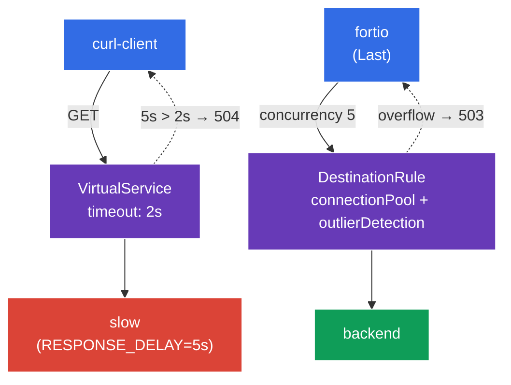

[RU version](README_RU.MD) · [Eng version](README.MD) · [Versión en español](README_ES.MD) · [Version française](README_FR.MD)

# Lab 10 - Resilience: Timeout + Circuit Breaker

Stellen Sie sich vor: Eines der Backends beginnt zu „hängen" oder zu degradieren. Ohne Schutz zieht ein langsamer Service alle Anfragen an ihn in die Länge, Threads/Verbindungen häufen sich an, und die Degradation breitet sich auf das gesamte Mesh aus (cascading failure). Istio bietet zwei Mechanismen, um das zu verhindern:
- **Timeout** - Begrenzung der Wartezeit auf eine Antwort. Wenn das Backend nicht innerhalb der zugewiesenen Zeit antwortet, wird die Anfrage mit `504` abgebrochen, anstatt endlos zu hängen.
- **Circuit Breaker** - eine „Sicherung": Begrenzung des Verbindungspools (`connectionPool`) und automatischer Ausschluss ungesunder Endpoints (`outlierDetection`). Wenn ein Service überlastet ist oder Fehler produziert, werden überschüssige Anfragen sofort abgewiesen (`503`), um dem Service eine „Verschnaufpause" zu geben.

All das wird auf Infrastrukturebene konfiguriert, ohne Änderung des Anwendungscodes.

### Wie das funktioniert (Gesamtschema)



## Ziel

- Ein **Timeout** im `VirtualService` konfigurieren und sich überzeugen, dass ein langsames Backend `504` zurückgibt.
- Einen **Circuit Breaker** in der `DestinationRule` konfigurieren (`connectionPool` + `outlierDetection`) und sehen, wie überschüssige Last mit `503` abgewiesen wird.

## Schritt 1. Aktivierung der Sidecar-Injektion

```bash
kubectl label namespace default istio-injection=enabled --overwrite
```

Timeout und Circuit Breaker werden von Envoy im Sidecar des aufrufenden Services realisiert - ohne ihn funktionieren diese Richtlinien nicht.

## Schritt 2. Installation der Anwendung

```bash
kubectl apply -f https://raw.githubusercontent.com/ViktorUJ/cks/refs/heads/master/tasks/ica/labs/10/k8s-1/scripts/1.yaml
kubectl rollout restart deployment -n default
```

**Was bereitgestellt wird:**
- **`slow`** - `ping_pong` mit der Variablen `RESPONSE_DELAY=5000` (jede Antwort wird um 5 Sekunden verzögert) - ein „langsames" Backend zur Demonstration des Timeouts.
- **`backend`** - schnelles `ping_pong` - Ziel für den Circuit Breaker.
- **`curl-client`** - Client zur Prüfung des Timeouts.
- **`fortio`** - Lastgenerator, um den Circuit Breaker zu „durchbrechen".

## Schritt 3. Timeout - wir brechen lange Anfragen ab

Zuerst betrachten wir das Verhalten ohne Timeout - eine Anfrage an `slow` gibt `200` zurück, aber erst nach ~5 Sekunden:

```bash
kubectl exec -n default deploy/curl-client -c curl -- \
  curl -s -o /dev/null -w "code=%{http_code} time=%{time_total}s\n" http://slow:8080/
```
```
code=200 time=5.02s
```

Jetzt setzen wir ein Timeout von `2s` im `VirtualService`:

```bash
vim slow-vs.yaml
```

```yaml
apiVersion: networking.istio.io/v1
kind: VirtualService
metadata:
  name: slow-vs
  namespace: default
spec:
  hosts:
  - slow
  http:
  - timeout: 2s          # wir warten maximal 2 Sekunden auf die Antwort
    route:
    - destination:
        host: slow
```

```bash
kubectl apply -f slow-vs.yaml
```

Wir prüfen - jetzt wird die Anfrage nach 2 Sekunden mit `504` abgebrochen:

```bash
kubectl exec -n default deploy/curl-client -c curl -- \
  curl -s -o /dev/null -w "code=%{http_code} time=%{time_total}s\n" http://slow:8080/
```
```
code=504 time=2.01s
```

**Was passiert ist:** Das Backend antwortet in 5 s, aber der Envoy-Proxy des Clients wartet nur 2 s (`timeout`) und gibt, ohne die Antwort abzuwarten, `504 Gateway Timeout` zurück. Die Anfrage hängt nicht mehr - die Ressourcen des Clients werden rechtzeitig freigegeben.

## Schritt 4. Circuit Breaker - wir kappen die Überlast

Die `DestinationRule` legt die „Sicherung" für den Service `backend` mit zwei Blöcken fest:
- **`connectionPool`** - harte Limits für Verbindungen und Anfragen. Alles über dem Limit wird sofort mit `503` abgewiesen.
- **`outlierDetection`** - aktive Gesundheitsprüfung: Wenn ein Endpoint mehrmals hintereinander `5xx` zurückgibt, wird er vorübergehend vom Load Balancing ausgeschlossen.

```bash
vim backend-cb.yaml
```

```yaml
apiVersion: networking.istio.io/v1
kind: DestinationRule
metadata:
  name: backend-cb
  namespace: default
spec:
  host: backend
  trafficPolicy:
    connectionPool:
      tcp:
        maxConnections: 1              # nicht mehr als 1 TCP-Verbindung
      http:
        http1MaxPendingRequests: 1     # nicht mehr als 1 Anfrage in der Warteschlange
        maxRequestsPerConnection: 1    # 1 Anfrage pro Verbindung
    outlierDetection:
      consecutive5xxErrors: 3          # 3 Fehler 5xx in Folge...
      interval: 5s                     # ...im Prüfintervall von 5 s
      baseEjectionTime: 30s            # Endpoint für 30 s ausschließen
      maxEjectionPercent: 100          # bis zu 100 % der Endpoints ausschließbar
```

```bash
kubectl apply -f backend-cb.yaml
```

**Erläuterung:**
- **`connectionPool`** - bei `maxConnections: 1` und `http1MaxPendingRequests: 1` bedient der Service faktisch gleichzeitig eine Anfrage + eine in der Warteschlange. Alles Übrige erhält bei konkurrierender Last sofort `503` (Überlast).
- **`outlierDetection`** - wenn ein Endpoint 3 Fehler `5xx` in Folge innerhalb von 5 s liefert, entfernt Envoy ihn für 30 s aus dem Pool. So erhält ein „kranker" Pod automatisch keinen Traffic mehr.

## Schritt 5. Wir durchbrechen die Sicherung mit Last

Wir schicken Last mit einer Concurrency von 5 (bei einem Pool von 1 Verbindung) mithilfe von `fortio`:

```bash
kubectl exec -n default deploy/fortio -c fortio -- \
  fortio load -c 5 -qps 0 -n 50 -quiet http://backend:8080/
```

In der Ausgabe von fortio betrachten wir die Verteilung der Codes: Ein erheblicher Anteil an `503` bedeutet, dass der Circuit Breaker die überschüssigen parallelen Anfragen abgewiesen hat:

```
Code 200 : 18 (36 %)
Code 503 : 32 (64 %)
```

Der Zähler der Sicherungsauslösungen am Envoy des Clients:

```bash
kubectl exec -n default deploy/fortio -c istio-proxy -- \
  pilot-agent request GET stats | grep backend | grep upstream_cx_overflow
```

Ein wachsender `upstream_cx_overflow` bestätigt: Verbindungen über dem Pool-Limit wurden verworfen.

## Fazit

| Mechanismus | Ressource | Feld | Was er tut |
|----------|--------|------|-----------|
| Timeout | `VirtualService` | `http.timeout` | bricht eine lange Anfrage ab (`504`) |
| Circuit Breaker | `DestinationRule` | `connectionPool` | kappt die Überlast (`503`) |
| Circuit Breaker | `DestinationRule` | `outlierDetection` | schließt ungesunde Endpoints aus |

**Zentrale Erkenntnis:** Timeout und Circuit Breaker sind Mechanismen zum **Schutz des Aufrufers** vor langsamen und instabilen Abhängigkeiten:
- **Timeout** lässt eine Anfrage nicht ewig hängen;
- **connectionPool** lässt nicht zu, dass das Backend mit einer Lawine paralleler Anfragen überlastet wird;
- **outlierDetection** entfernt automatisch ausfallende Endpoints aus der Rotation.

Zusammen verhindern sie kaskadierende Ausfälle (cascading failures) - die Degradation eines Services „zieht" nicht das gesamte Mesh mit. Und all das wird deklarativ konfiguriert, ohne Änderung des Anwendungscodes.
