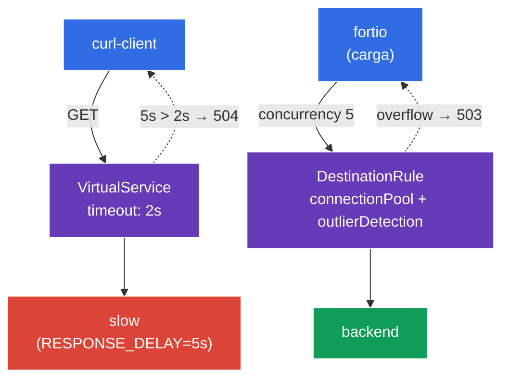

[RU version](README_RU.MD) · [Eng version](README.MD) · [Version française](README_FR.MD) · [Deutsche Version](README_DE.MD)

# Lab 10 - Resilience: Timeout + Circuit Breaker

Imagina lo siguiente: uno de los backends ha empezado a «ir lento» o a degradarse. Sin protección, un servicio lento arrastra todas las peticiones dirigidas a él, los hilos/conexiones se acumulan y la degradación se propaga a toda la malla (cascading failure). Istio ofrece dos mecanismos para evitarlo:
- **Timeout** - límite del tiempo de espera de respuesta. Si el backend no respondió en el tiempo asignado, la petición se aborta con `504` en lugar de quedar colgada indefinidamente.
- **Circuit Breaker** - un «fusible»: limitación del pool de conexiones (`connectionPool`) y exclusión automática de los endpoints no saludables (`outlierDetection`). Cuando el servicio está sobrecargado o genera errores, las peticiones sobrantes se cortan de inmediato (`503`), dándole al servicio un respiro.

Todo esto se configura a nivel de infraestructura, sin cambiar el código de la aplicación.

### Cómo funciona (esquema general)



## Objetivo

- Configurar el **timeout** en `VirtualService` y comprobar que un backend lento devuelve `504`.
- Configurar el **circuit breaker** en `DestinationRule` (`connectionPool` + `outlierDetection`) y ver cómo la carga excedente se corta con `503`.

## Paso 1. Activación de la inyección de sidecar

```bash
kubectl label namespace default istio-injection=enabled --overwrite
```

El timeout y el circuit breaker los implementa Envoy en el sidecar del servicio que llama - sin él estas políticas no funcionarán.

## Paso 2. Instalación de la aplicación

```bash
kubectl apply -f https://raw.githubusercontent.com/ViktorUJ/cks/refs/heads/master/tasks/ica/labs/10/k8s-1/scripts/1.yaml
kubectl rollout restart deployment -n default
```

**Qué se despliega:**
- **`slow`** - `ping_pong` con la variable `RESPONSE_DELAY=5000` (cada respuesta se retrasa 5 segundos) - el backend «lento» para demostrar el timeout.
- **`backend`** - `ping_pong` rápido - el objetivo del circuit breaker.
- **`curl-client`** - cliente para comprobar el timeout.
- **`fortio`** - generador de carga para «reventar» el circuit breaker.

## Paso 3. Timeout - abortamos las peticiones largas

Primero veamos el comportamiento sin timeout - una petición a `slow` devolverá `200`, pero solo tras ~5 segundos:

```bash
kubectl exec -n default deploy/curl-client -c curl -- \
  curl -s -o /dev/null -w "code=%{http_code} time=%{time_total}s\n" http://slow:8080/
```
```
code=200 time=5.02s
```

Ahora ponemos un timeout de `2s` en el `VirtualService`:

```bash
vim slow-vs.yaml
```

```yaml
apiVersion: networking.istio.io/v1
kind: VirtualService
metadata:
  name: slow-vs
  namespace: default
spec:
  hosts:
  - slow
  http:
  - timeout: 2s          # esperamos la respuesta un máximo de 2 segundos
    route:
    - destination:
        host: slow
```

```bash
kubectl apply -f slow-vs.yaml
```

Comprobamos - ahora la petición se aborta a los 2 segundos con `504`:

```bash
kubectl exec -n default deploy/curl-client -c curl -- \
  curl -s -o /dev/null -w "code=%{http_code} time=%{time_total}s\n" http://slow:8080/
```
```
code=504 time=2.01s
```

**Qué ha ocurrido:** el backend responde en 5s, pero el proxy Envoy del cliente espera solo 2s (`timeout`) y, al no recibir respuesta, devuelve `504 Gateway Timeout`. La petición ya no queda colgada - los recursos del cliente se liberan a tiempo.

## Paso 4. Circuit Breaker - cortamos la sobrecarga

`DestinationRule` define el «fusible» para el servicio `backend` con dos bloques:
- **`connectionPool`** - límites estrictos sobre conexiones y peticiones. Todo lo que exceda el límite se rechaza de inmediato con `503`.
- **`outlierDetection`** - comprobación activa de la salud: si un endpoint devuelve `5xx` de forma consecutiva, se excluye temporalmente del balanceo.

```bash
vim backend-cb.yaml
```

```yaml
apiVersion: networking.istio.io/v1
kind: DestinationRule
metadata:
  name: backend-cb
  namespace: default
spec:
  host: backend
  trafficPolicy:
    connectionPool:
      tcp:
        maxConnections: 1              # no más de 1 conexión TCP
      http:
        http1MaxPendingRequests: 1     # no más de 1 petición en cola
        maxRequestsPerConnection: 1    # 1 petición por conexión
    outlierDetection:
      consecutive5xxErrors: 3          # 3 errores 5xx consecutivos...
      interval: 5s                     # ...en un intervalo de comprobación de 5s
      baseEjectionTime: 30s            # excluir el endpoint durante 30s
      maxEjectionPercent: 100          # se puede excluir hasta el 100% de los endpoints
```

```bash
kubectl apply -f backend-cb.yaml
```

**Análisis:**
- **`connectionPool`** - con `maxConnections: 1` y `http1MaxPendingRequests: 1` el servicio atiende de hecho una petición + una en cola simultáneamente. Todo lo demás, bajo carga concurrente, recibe de inmediato `503` (sobrecarga).
- **`outlierDetection`** - si un endpoint da 3 errores `5xx` consecutivos en 5s, Envoy lo retira del pool durante 30s. Así el pod «enfermo» deja de recibir tráfico automáticamente.

## Paso 5. Reventamos el fusible con carga

Lanzamos carga con concurrencia 5 (con un pool de 1 conexión) mediante `fortio`:

```bash
kubectl exec -n default deploy/fortio -c fortio -- \
  fortio load -c 5 -qps 0 -n 50 -quiet http://backend:8080/
```

En la salida de fortio observamos la distribución de los códigos: una proporción significativa de `503` significa que el circuit breaker rechazó las peticiones paralelas sobrantes:

```
Code 200 : 18 (36 %)
Code 503 : 32 (64 %)
```

Contador de activaciones del fusible en el Envoy del cliente:

```bash
kubectl exec -n default deploy/fortio -c istio-proxy -- \
  pilot-agent request GET stats | grep backend | grep upstream_cx_overflow
```

Un `upstream_cx_overflow` creciente confirma: las conexiones por encima del límite del pool se descartaban.

## Resumen

| Mecanismo | Recurso | Campo | Qué hace |
|----------|--------|------|-----------|
| Timeout | `VirtualService` | `http.timeout` | aborta una petición larga (`504`) |
| Circuit Breaker | `DestinationRule` | `connectionPool` | corta la sobrecarga (`503`) |
| Circuit Breaker | `DestinationRule` | `outlierDetection` | excluye los endpoints no saludables |

**Conclusión clave:** el timeout y el circuit breaker son mecanismos de **protección del que llama** frente a dependencias lentas e inestables:
- **timeout** no deja que una petición quede colgada para siempre;
- **connectionPool** no deja sobrecargar el backend con una avalancha de peticiones paralelas;
- **outlierDetection** retira automáticamente de la rotación los endpoints que fallan.

Juntos previenen los fallos en cascada (cascading failures) - la degradación de un servicio no «arrastra» consigo a toda la malla. Y todo esto se configura de forma declarativa, sin cambiar el código de la aplicación.
