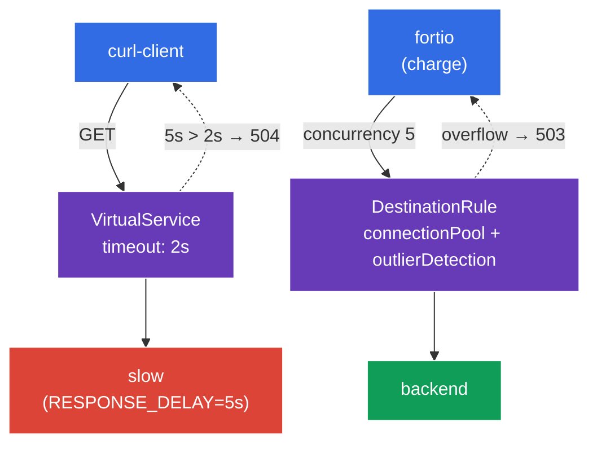

[RU version](README_RU.MD) · [Eng version](README.MD) · [Versión en español](README_ES.MD) · [Deutsche Version](README_DE.MD)

# Lab 10 - Resilience: Timeout + Circuit Breaker

Imaginez : l'un des backends s'est mis à « ramer » ou à se dégrader. Sans protection, un service lent fait traîner toutes les requêtes qui lui sont adressées, les threads/connexions s'accumulent, et la dégradation se propage à tout le maillage (cascading failure). Istio offre deux mécanismes pour éviter ça :
- **Timeout** - limite du temps d'attente de la réponse. Si le backend n'a pas répondu dans le délai imparti, la requête est interrompue avec un `504`, au lieu de rester suspendue indéfiniment.
- **Circuit Breaker** - un « disjoncteur » : limitation du pool de connexions (`connectionPool`) et exclusion automatique des endpoints malsains (`outlierDetection`). Quand un service est surchargé ou renvoie des erreurs en rafale, les requêtes en trop sont immédiatement coupées (`503`), laissant le service « reprendre son souffle ».

Tout cela se configure au niveau de l'infrastructure, sans modifier le code de l'application.

### Comment ça marche (schéma général)



## Objectif

- Configurer un **timeout** dans un `VirtualService` et vérifier qu'un backend lent renvoie un `504`.
- Configurer un **circuit breaker** dans un `DestinationRule` (`connectionPool` + `outlierDetection`) et observer comment la charge excédentaire est coupée avec un `503`.

## Infrastructure

L'environnement est déployé dans AWS (`eu-central-1`) via Terragrunt et se compose de :

| Composant  | Description                                          |
|------------|---------------------------------------------------|
| `vpc`      | VPC `10.10.0.0/16` avec des sous-réseaux publics          |
| `ssh-keys` | Clés SSH pour l'accès aux nœuds                      |
| `k8s-1`    | Kubernetes `1.35.2` (kubeadm) avec Istio installé |
| `worker`   | Machine de travail avec `kubectl` et accès au cluster   |

Instances : `t3.medium` (master) Ubuntu `22.04`

## Déploiement

```bash
TASK=10 make run_ica_task
```

## Étape 1. Activation de l'injection du sidecar

```bash
kubectl label namespace default istio-injection=enabled --overwrite
```

Le timeout et le circuit breaker sont implémentés par Envoy dans le sidecar du service appelant - sans lui, ces politiques ne fonctionneront pas.

## Étape 2. Installation de l'application

```bash
kubectl apply -f https://raw.githubusercontent.com/ViktorUJ/cks/refs/heads/master/tasks/ica/labs/10/k8s-1/scripts/1.yaml
kubectl rollout restart deployment -n default
```

**Ce qui est déployé :**
- **`slow`** - un `ping_pong` avec la variable `RESPONSE_DELAY=5000` (chaque réponse est retardée de 5 secondes) - le backend « lent » pour la démonstration du timeout.
- **`backend`** - un `ping_pong` rapide - la cible du circuit breaker.
- **`curl-client`** - le client pour tester le timeout.
- **`fortio`** - le générateur de charge pour « percer » le circuit breaker.

## Étape 3. Timeout - interrompre les requêtes trop longues

D'abord, regardons le comportement sans timeout - une requête vers `slow` renverra `200`, mais seulement après environ 5 secondes :

```bash
kubectl exec -n default deploy/curl-client -c curl -- \
  curl -s -o /dev/null -w "code=%{http_code} time=%{time_total}s\n" http://slow:8080/
```
```
code=200 time=5.02s
```

Maintenant, on met un timeout de `2s` dans le `VirtualService` :

```bash
vim slow-vs.yaml
```

```yaml
apiVersion: networking.istio.io/v1
kind: VirtualService
metadata:
  name: slow-vs
  namespace: default
spec:
  hosts:
  - slow
  http:
  - timeout: 2s          # on attend la réponse 2 secondes maximum
    route:
    - destination:
        host: slow
```

```bash
kubectl apply -f slow-vs.yaml
```

On vérifie - maintenant la requête est interrompue au bout de 2 secondes avec un `504` :

```bash
kubectl exec -n default deploy/curl-client -c curl -- \
  curl -s -o /dev/null -w "code=%{http_code} time=%{time_total}s\n" http://slow:8080/
```
```
code=504 time=2.01s
```

**Ce qui s'est passé :** le backend répond en 5 s, mais le proxy Envoy du client n'attend que 2 s (`timeout`) et, faute de réponse, renvoie un `504 Gateway Timeout`. La requête ne reste plus suspendue - les ressources du client sont libérées à temps.

## Étape 4. Circuit Breaker - couper la surcharge

Le `DestinationRule` définit un « disjoncteur » pour le service `backend` avec deux blocs :
- **`connectionPool`** - limites strictes sur les connexions et les requêtes. Tout ce qui dépasse la limite est immédiatement rejeté avec un `503`.
- **`outlierDetection`** - vérification active de la santé : si un endpoint renvoie des `5xx` consécutifs, il est temporairement exclu de la répartition de charge.

```bash
vim backend-cb.yaml
```

```yaml
apiVersion: networking.istio.io/v1
kind: DestinationRule
metadata:
  name: backend-cb
  namespace: default
spec:
  host: backend
  trafficPolicy:
    connectionPool:
      tcp:
        maxConnections: 1              # pas plus d'1 connexion TCP
      http:
        http1MaxPendingRequests: 1     # pas plus d'1 requête en file d'attente
        maxRequestsPerConnection: 1    # 1 requête par connexion
    outlierDetection:
      consecutive5xxErrors: 3          # 3 erreurs 5xx consécutives...
      interval: 5s                     # ...sur un intervalle de vérification de 5s
      baseEjectionTime: 30s            # exclure l'endpoint pendant 30s
      maxEjectionPercent: 100          # on peut exclure jusqu'à 100% des endpoints
```

```bash
kubectl apply -f backend-cb.yaml
```

**Décryptage :**
- **`connectionPool`** - avec `maxConnections: 1` et `http1MaxPendingRequests: 1`, le service traite en pratique une seule requête simultanément + une en file d'attente. Tout le reste, sous charge concurrente, reçoit immédiatement un `503` (surcharge).
- **`outlierDetection`** - si un endpoint renvoie 3 erreurs `5xx` consécutives en 5 s, Envoy le retire du pool pendant 30 s. Ainsi, un pod « malade » cesse automatiquement de recevoir du trafic.

## Étape 5. Percer le disjoncteur avec de la charge

On lance une charge avec une concurrence de 5 (alors que le pool est d'1 connexion) à l'aide de `fortio` :

```bash
kubectl exec -n default deploy/fortio -c fortio -- \
  fortio load -c 5 -qps 0 -n 50 -quiet http://backend:8080/
```

Dans la sortie de fortio, on regarde la répartition des codes : une part importante de `503` signifie que le circuit breaker a coupé les requêtes parallèles en trop :

```
Code 200 : 18 (36 %)
Code 503 : 32 (64 %)
```

Le compteur de déclenchements du disjoncteur sur l'Envoy du client :

```bash
kubectl exec -n default deploy/fortio -c istio-proxy -- \
  pilot-agent request GET stats | grep backend | grep upstream_cx_overflow
```

Un `upstream_cx_overflow` qui augmente confirme que les connexions au-delà de la limite du pool ont été rejetées.

## Bilan

| Mécanisme | Ressource | Champ | Ce qu'il fait |
|----------|--------|------|-----------|
| Timeout | `VirtualService` | `http.timeout` | interrompt une requête trop longue (`504`) |
| Circuit Breaker | `DestinationRule` | `connectionPool` | coupe la surcharge (`503`) |
| Circuit Breaker | `DestinationRule` | `outlierDetection` | exclut les endpoints malsains |

**À retenir :** le timeout et le circuit breaker sont des mécanismes de **protection de l'appelant** contre les dépendances lentes et instables :
- le **timeout** empêche une requête de rester suspendue éternellement ;
- le **connectionPool** empêche de surcharger le backend avec une avalanche de requêtes parallèles ;
- l'**outlierDetection** retire automatiquement de la rotation les endpoints défaillants.

Ensemble, ils préviennent les défaillances en cascade (cascading failures) - la dégradation d'un service n'« entraîne » pas tout le maillage avec elle. Et tout cela se configure de façon déclarative, sans modifier le code de l'application.
