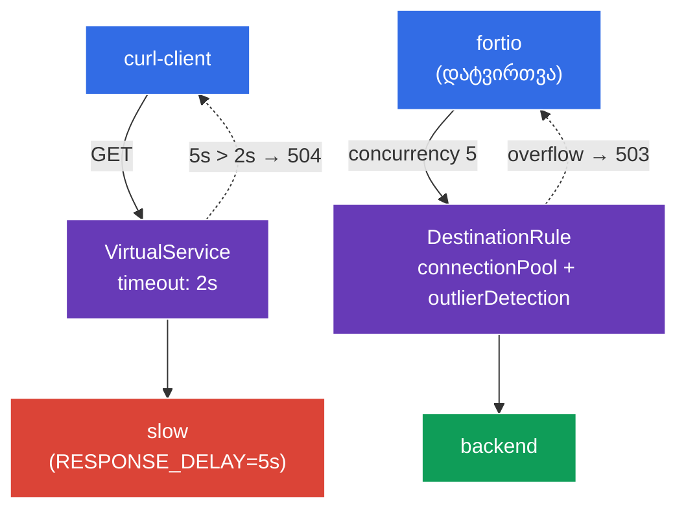

[Русская версия](README_RU.MD) · [Eng version](README.MD) · [Versión en español](README_ES.MD) · [Version française](README_FR.MD) · [Deutsche Version](README_DE.MD) · [繁體中文版](README_TW.MD) · [日本語版](README_JP.MD)

# Lab 10 - მდგრადობა: Timeout + Circuit Breaker

> [საცნობარო გადაწყვეტა](worker/files/solutions/1_GE.MD)

წარმოიდგინეთ: ერთ-ერთმა ბექენდმა „შენელება“ ან დეგრადაცია დაიწყო. დაცვის გარეშე ნელი სერვისი მისკენ მიმართულ ყველა მოთხოვნას აყოვნებს, თრედები/კავშირები გროვდება და დეგრადაცია მთელ mesh-ზე ვრცელდება (cascading failure). ამის თავიდან ასაცილებლად Istio ორ მექანიზმს გვთავაზობს:
- **Timeout** - პასუხის ლოდინის დროის შეზღუდვა. თუ ბექენდი გამოყოფილ დროში არ პასუხობს, მოთხოვნა უსასრულოდ დაკიდების ნაცვლად `504` კოდით წყდება.
- **Circuit Breaker** - „დამცველი“: კავშირების პულის შეზღუდვა (`connectionPool`) და არაჯანსაღი ენდპოინტების ავტომატური გამორიცხვა (`outlierDetection`). როდესაც სერვისი გადატვირთულია ან შეცდომებს ინტენსიურად აბრუნებს, ზედმეტი მოთხოვნები დაუყოვნებლივ იფილტრება (`503`), რაც სერვისს „ამოსუნთქვის“ საშუალებას აძლევს.

ყველაფერი ეს ინფრასტრუქტურის დონეზე, აპლიკაციის კოდის შეცვლის გარეშე კონფიგურირდება.

### როგორ მუშაობს ეს (ზოგადი სქემა)



## მიზანი

- `VirtualService`-ში **timeout**-ის კონფიგურაცია და შემოწმება, რომ ნელი ბექენდი `504`-ს აბრუნებს.
- `DestinationRule`-ში **circuit breaker**-ის (`connectionPool` + `outlierDetection`) კონფიგურაცია და დაკვირვება, როგორ იფილტრება ზედმეტი დატვირთვა `503` კოდით.

## ინფრასტრუქტურა

გარემო Terragrunt-ის საშუალებით AWS-ში (`eu-central-1`) იშლება და შედგება შემდეგი კომპონენტებისგან:

| კომპონენტი | აღწერა |
|------------|---------------------------------------------------|
| `vpc`      | VPC `10.10.0.0/16` საჯარო ქვექსელებით |
| `ssh-keys` | SSH-გასაღებები ნოდებთან წვდომისთვის |
| `k8s-1`    | Kubernetes `1.35.2` (kubeadm) დაყენებული Istio-თი |
| `worker`   | სამუშაო მანქანა `kubectl`-ითა და კლასტერთან წვდომით |

ინსტანსები: `t3.medium` (master) Ubuntu `22.04`

## გაშლა

```bash
TASK=10 make run_ica_task
```

## ნაბიჯი 1. Sidecar-ინექციის ჩართვა

```bash
kubectl label namespace default istio-injection=enabled --overwrite
```

Timeout-სა და circuit breaker-ს გამომძახებელი სერვისის sidecar-ში არსებული Envoy ახორციელებს - მის გარეშე ეს პოლიტიკები არ იმუშავებს.

## ნაბიჯი 2. აპლიკაციის დაყენება

```bash
kubectl apply -f https://raw.githubusercontent.com/ViktorUJ/cks/refs/heads/master/tasks/ica/labs/10/k8s-1/scripts/1.yaml
kubectl rollout restart deployment -n default
```

**რა იშლება:**
- **`slow`** - `ping_pong` ცვლადით `RESPONSE_DELAY=5000` (თითოეული პასუხი 5 წამით ყოვნდება) - „ნელი“ ბექენდი timeout-ის დემონსტრირებისთვის.
- **`backend`** - სწრაფი `ping_pong` - circuit breaker-ის სამიზნე.
- **`curl-client`** - კლიენტი timeout-ის შესამოწმებლად.
- **`fortio`** - დატვირთვის გენერატორი circuit breaker-ის „გასარღვევად“.

## ნაბიჯი 3. Timeout - ხანგრძლივი მოთხოვნების შეწყვეტა

ჯერ ვნახოთ ქცევა timeout-ის გარეშე - `slow`-ისკენ მოთხოვნა `200`-ს დააბრუნებს, თუმცა მხოლოდ ~5 წამის შემდეგ:

```bash
kubectl exec -n default deploy/curl-client -c curl -- \
  curl -s -o /dev/null -w "code=%{http_code} time=%{time_total}s\n" http://slow:8080/
```
```
code=200 time=5.02s
```

ახლა `VirtualService`-ში timeout-ს `2s` მნიშვნელობას ვანიჭებთ:

```bash
vim slow-vs.yaml
```

```yaml
apiVersion: networking.istio.io/v1
kind: VirtualService
metadata:
  name: slow-vs
  namespace: default
spec:
  hosts:
  - slow
  http:
  - timeout: 2s          # ველოდებით პასუხს მაქსიმუმ 2 წამი
    route:
    - destination:
        host: slow
```

```bash
kubectl apply -f slow-vs.yaml
```

ვამოწმებთ - ახლა მოთხოვნა 2 წამში `504` კოდით წყდება:

```bash
kubectl exec -n default deploy/curl-client -c curl -- \
  curl -s -o /dev/null -w "code=%{http_code} time=%{time_total}s\n" http://slow:8080/
```
```
code=504 time=2.01s
```

**რა მოხდა:** ბექენდი 5 წამში პასუხობს, მაგრამ კლიენტის Envoy-პროქსი მხოლოდ 2 წამს (`timeout`) ელოდება და პასუხის მიუღებლობისას `504 Gateway Timeout`-ს აბრუნებს. მოთხოვნა აღარ კიდია - კლიენტის რესურსები დროულად თავისუფლდება.

## ნაბიჯი 4. Circuit Breaker - გადატვირთვის გაფილტვრა

`DestinationRule` სერვის `backend`-ისთვის „დამცველს“ ორი ბლოკით განსაზღვრავს:
- **`connectionPool`** - კავშირებისა და მოთხოვნების მკაცრი ლიმიტები. ლიმიტს გადაჭარბებული ყველაფერი დაუყოვნებლივ `503` კოდით უარიყოფა.
- **`outlierDetection`** - ჯანმრთელობის აქტიური შემოწმება: თუ ენდპოინტი ზედიზედ აბრუნებს `5xx` კოდებს, ის დროებით გამოირიცხება ბალანსირებიდან.

```bash
vim backend-cb.yaml
```

```yaml
apiVersion: networking.istio.io/v1
kind: DestinationRule
metadata:
  name: backend-cb
  namespace: default
spec:
  host: backend
  trafficPolicy:
    connectionPool:
      tcp:
        maxConnections: 1              # არაუმეტეს 1 TCP-კავშირისა
      http:
        http1MaxPendingRequests: 1     # არაუმეტეს 1 მოთხოვნისა რიგში
        maxRequestsPerConnection: 1    # 1 მოთხოვნა თითო კავშირზე
    outlierDetection:
      consecutive5xxErrors: 3          # 3 შეცდომა 5xx ზედიზედ...
      interval: 5s                     # ...შემოწმების ინტერვალში 5წმ
      baseEjectionTime: 30s            # ენდპოინტის გამორიცხვა 30წმ-ით
      maxEjectionPercent: 100          # შესაძლებელია ენდპოინტების 100%-მდე გამორიცხვა
```

```bash
kubectl apply -f backend-cb.yaml
```

**განხილვა:**
- **`connectionPool`** - `maxConnections: 1` და `http1MaxPendingRequests: 1` მნიშვნელობებისას სერვისი ერთდროულად ფაქტობრივად ერთ მოთხოვნას ემსახურება, კიდევ ერთი კი რიგშია. კონკურენტული დატვირთვისას დანარჩენი მოთხოვნები დაუყოვნებლივ იღებს `503`-ს (გადატვირთვა).
- **`outlierDetection`** - თუ ენდპოინტი 5 წამში ზედიზედ 3 შეცდომას `5xx` აბრუნებს, Envoy მას პულიდან 30 წამით იღებს. ამგვარად, „ავადმყოფი“ პოდი ტრაფიკის მიღებას ავტომატურად წყვეტს.

## ნაბიჯი 5. დამცველის დატვირთვით გარღვევა

`fortio`-ს საშუალებით ვუშვებთ დატვირთვას 5 კონკურენტული მოთხოვნით (1 კავშირის მქონე პულზე):

```bash
kubectl exec -n default deploy/fortio -c fortio -- \
  fortio load -c 5 -qps 0 -n 50 -quiet http://backend:8080/
```

Fortio-ს გამოტანილ შედეგში კოდების განაწილებას ვაკვირდებით: `503`-ების მნიშვნელოვანი წილი ნიშნავს, რომ circuit breaker-მა ზედმეტი პარალელური მოთხოვნები უარყო:

```
Code 200 : 18 (36 %)
Code 503 : 32 (64 %)
```

კლიენტის Envoy-ზე დამცველის ამოქმედების მრიცხველი:

```bash
kubectl exec -n default deploy/fortio -c istio-proxy -- \
  pilot-agent request GET stats | grep backend | grep upstream_cx_overflow
```

მზარდი `upstream_cx_overflow` ადასტურებს: პულის ლიმიტს გადაჭარბებული კავშირები იფილტრებოდა.

## შეჯამება

| მექანიზმი | რესურსი | ველი | რას აკეთებს |
|----------|--------|------|-----------|
| Timeout | `VirtualService` | `http.timeout` | წყვეტს ხანგრძლივ მოთხოვნას (`504`) |
| Circuit Breaker | `DestinationRule` | `connectionPool` | ფილტრავს გადატვირთვას (`503`) |
| Circuit Breaker | `DestinationRule` | `outlierDetection` | გამორიცხავს არაჯანსაღ ენდპოინტებს |

**მთავარი დასკვნა:** timeout და circuit breaker არის ნელი და არასტაბილური დამოკიდებულებებისგან **გამომძახებლის დაცვის** მექანიზმები:
- **timeout** მოთხოვნას უსასრულოდ დაკიდების საშუალებას არ აძლევს;
- **connectionPool** პარალელური მოთხოვნების ტალღით ბექენდის გადატვირთვას არ უშვებს;
- **outlierDetection** მწყობრიდან გამოსულ ენდპოინტებს როტაციიდან ავტომატურად იღებს.

ერთად ისინი კასკადურ შეფერხებებს (cascading failures) თავიდან გვაცილებენ - ერთი სერვისის დეგრადაცია მთელ mesh-ს თან არ „ითრევს“. და ყველაფერი ეს აპლიკაციის კოდის შეცვლის გარეშე, დეკლარაციულად კონფიგურირდება.
