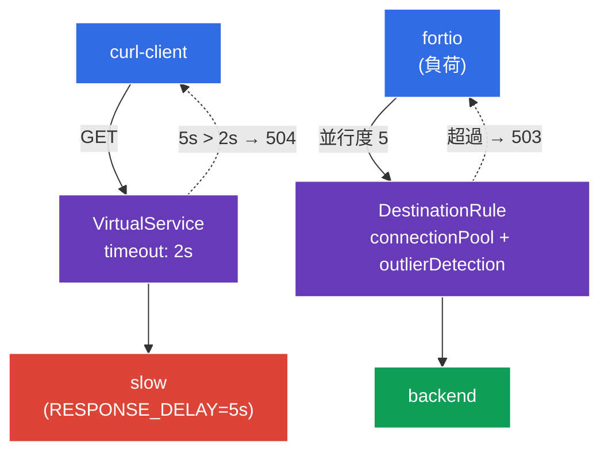

[Русская версия](README_RU.MD) · [Eng version](README.MD) · [Versión en español](README_ES.MD) · [Version française](README_FR.MD) · [Deutsche Version](README_DE.MD) · [ქართული ვერსია](README_GE.MD) · [繁體中文版](README_TW.MD)

# Lab 10 - 回復性: Timeout + Circuit Breaker

> [リファレンス解答](worker/files/solutions/1_JP.MD)

想像してください。バックエンドの 1 つが「遅く」なった、または性能劣化し始めました。保護がなければ、低速なサービスがすべてのリクエストを引きずり、スレッド／接続が蓄積され、劣化が mesh 全体へ広がります（cascading failure）。Istio にはこれを防ぐための 2 つの仕組みがあります。
- **Timeout** - 応答の待機時間を制限します。バックエンドが指定時間内に応答しなければ、リクエストは無限に待機せず `504` で切断されます。
- **Circuit Breaker** - 「ヒューズ」です。接続プール（`connectionPool`）を制限し、異常なエンドポイントを自動的に除外します（`outlierDetection`）。サービスが過負荷状態またはエラーを繰り返す場合、余分なリクエストは即座に遮断され（`503`）、サービスに「立て直す」時間を与えます。

これらはすべて、アプリケーションコードを変更せず、インフラストラクチャレベルで設定します。

### 仕組み（全体図）



## 目的

- `VirtualService` で **timeout** を設定し、低速なバックエンドが `504` を返すことを確認する。
- `DestinationRule` で **circuit breaker**（`connectionPool` + `outlierDetection`）を設定し、余分な負荷が `503` で遮断されることを確認する。

## インフラストラクチャ

環境は Terragrunt を介して AWS（`eu-central-1`）にデプロイされ、次のコンポーネントで構成されています。

| コンポーネント | 説明 |
|------------|---------------------------------------------------|
| `vpc`      | パブリックサブネットを持つ VPC `10.10.0.0/16` |
| `ssh-keys` | ノードへのアクセス用 SSH キー |
| `k8s-1`    | Istio がインストールされた Kubernetes `1.35.2`（kubeadm） |
| `worker`   | `kubectl` とクラスターへのアクセスを備えたワーカーマシン |

インスタンス: `t3.medium`（master）、Ubuntu `22.04`

## デプロイ

```bash
TASK=10 make run_ica_task
```

## ステップ 1. sidecar インジェクションの有効化

```bash
kubectl label namespace default istio-injection=enabled --overwrite
```

Timeout と circuit breaker は呼び出し元サービスの sidecar 内にある Envoy が実装します。これがなければ、これらのポリシーは機能しません。

## ステップ 2. アプリケーションのインストール

```bash
kubectl apply -f https://raw.githubusercontent.com/ViktorUJ/cks/refs/heads/master/tasks/ica/labs/10/k8s-1/scripts/1.yaml
kubectl rollout restart deployment -n default
```

**デプロイされるもの:**
- **`slow`** - 変数 `RESPONSE_DELAY=5000` を持つ `ping_pong`（各応答を 5 秒遅延）: timeout を実演するための「低速な」バックエンド。
- **`backend`** - 高速な `ping_pong`: circuit breaker の対象。
- **`curl-client`** - timeout を検証するクライアント。
- **`fortio`** - circuit breaker を「作動させる」ための負荷ジェネレーター。

## ステップ 3. Timeout - 長時間リクエストの切断

まず、timeout なしの挙動を確認します。`slow` へのリクエストは `200` を返しますが、約 5 秒後になります。

```bash
kubectl exec -n default deploy/curl-client -c curl -- \
  curl -s -o /dev/null -w "code=%{http_code} time=%{time_total}s\n" http://slow:8080/
```
```
code=200 time=5.02s
```

次に、`VirtualService` で timeout `2s` を設定します。

```bash
vim slow-vs.yaml
```

```yaml
apiVersion: networking.istio.io/v1
kind: VirtualService
metadata:
  name: slow-vs
  namespace: default
spec:
  hosts:
  - slow
  http:
  - timeout: 2s          # 応答を最大 2 秒待つ
    route:
    - destination:
        host: slow
```

```bash
kubectl apply -f slow-vs.yaml
```

確認します。今度はリクエストが 2 秒で切断され、`504` が返されます。

```bash
kubectl exec -n default deploy/curl-client -c curl -- \
  curl -s -o /dev/null -w "code=%{http_code} time=%{time_total}s\n" http://slow:8080/
```
```
code=504 time=2.01s
```

**何が起きたか:** バックエンドは 5 秒で応答しますが、クライアントの Envoy プロキシは 2 秒（`timeout`）だけ待機し、応答を待てない場合は `504 Gateway Timeout` を返します。リクエストはもはや待機し続けず、クライアントのリソースは適切なタイミングで解放されます。

## ステップ 4. Circuit Breaker - 過負荷の遮断

`DestinationRule` は、`backend` サービスに対する「ヒューズ」を 2 つのブロックで設定します。
- **`connectionPool`** - 接続とリクエストの厳格な上限です。上限を超えるものは即座に `503` で拒否されます。
- **`outlierDetection`** - 能動的なヘルスチェックです。エンドポイントが連続して `5xx` を返す場合、そのエンドポイントは一時的に負荷分散から除外されます。

```bash
vim backend-cb.yaml
```

```yaml
apiVersion: networking.istio.io/v1
kind: DestinationRule
metadata:
  name: backend-cb
  namespace: default
spec:
  host: backend
  trafficPolicy:
    connectionPool:
      tcp:
        maxConnections: 1              # TCP 接続は最大 1 つまで
      http:
        http1MaxPendingRequests: 1     # キューに入るリクエストは最大 1 つまで
        maxRequestsPerConnection: 1    # 1 接続あたり 1 リクエスト
    outlierDetection:
      consecutive5xxErrors: 3          # 3 回連続の 5xx エラー...
      interval: 5s                     # ...チェック間隔 5 秒あたり
      baseEjectionTime: 30s            # エンドポイントを 30 秒間除外する
      maxEjectionPercent: 100          # 最大 100% のエンドポイントを除外可能
```

```bash
kubectl apply -f backend-cb.yaml
```

**詳細:**
- **`connectionPool`** - `maxConnections: 1` と `http1MaxPendingRequests: 1` では、サービスが同時に処理するのは実質的に 1 リクエストとキュー内の 1 リクエストです。並行負荷における残りのすべては即座に `503`（過負荷）を受け取ります。
- **`outlierDetection`** - エンドポイントが 5 秒以内に `5xx` エラーを 3 回連続で返すと、Envoy はそのエンドポイントを 30 秒間プールから外します。これにより、「異常な」Pod へのトラフィックは自動的に停止します。

## ステップ 5. 負荷でヒューズを作動させる

`fortio` を使い、並行度 5（接続プールは 1）で負荷をかけます。

```bash
kubectl exec -n default deploy/fortio -c fortio -- \
  fortio load -c 5 -qps 0 -n 50 -quiet http://backend:8080/
```

fortio の出力でコードの分布を確認します。`503` が大きな割合を占めていれば、circuit breaker が余分な並列リクエストを拒否したことを意味します。

```
Code 200 : 18 (36 %)
Code 503 : 32 (64 %)
```

クライアントの Envoy におけるヒューズ作動カウンター:

```bash
kubectl exec -n default deploy/fortio -c istio-proxy -- \
  pilot-agent request GET stats | grep backend | grep upstream_cx_overflow
```

増加する `upstream_cx_overflow` は、プールの上限を超えた接続が破棄されたことを裏付けます。

## まとめ

| 仕組み | リソース | フィールド | 動作 |
|----------|--------|------|-----------|
| Timeout | `VirtualService` | `http.timeout` | 長時間リクエストを切断する（`504`） |
| Circuit Breaker | `DestinationRule` | `connectionPool` | 過負荷を遮断する（`503`） |
| Circuit Breaker | `DestinationRule` | `outlierDetection` | 異常なエンドポイントを除外する |

**重要な結論:** timeout と circuit breaker は、低速で不安定な依存先から**呼び出し元を保護する**仕組みです。
- **timeout** はリクエストが永遠に待機することを防ぎます。
- **connectionPool** は並列リクエストの集中によってバックエンドが過負荷になることを防ぎます。
- **outlierDetection** は障害中のエンドポイントをローテーションから自動的に外します。

これらを組み合わせることで cascading failures（カスケード障害）を防止します。つまり、ある 1 つのサービスの劣化が mesh 全体を「引きずり込む」ことはありません。そしてすべては、アプリケーションコードを変更せずに宣言的に設定できます。