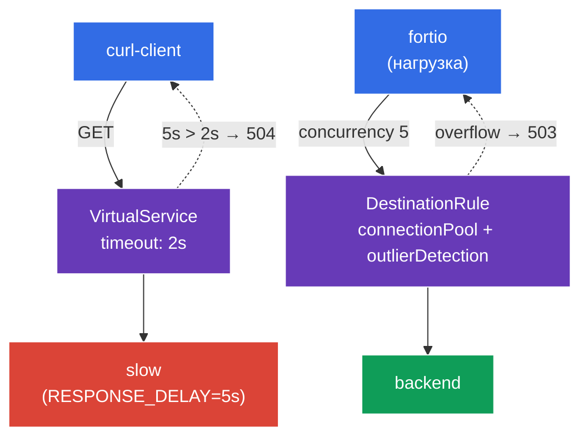

[Eng version](README.MD)

# Lab 10 — Resilience: Timeout + Circuit Breaker

Представьте: один из бэкендов начал «тормозить» или деградировать. Без защиты медленный сервис затягивает все запросы к нему, треды/соединения копятся, и деградация расползается на весь mesh (cascading failure). Istio даёт два механизма, чтобы этого не допустить:
- **Timeout** — ограничение времени ожидания ответа. Если бэкенд не ответил за отведённое время, запрос обрывается с `504`, а не висит бесконечно.
- **Circuit Breaker** — «предохранитель»: ограничение пула соединений (`connectionPool`) и автоматическое исключение нездоровых эндпоинтов (`outlierDetection`). Когда сервис перегружен или сыпет ошибками, лишние запросы сразу отсекаются (`503`), давая сервису «отдышаться».

Всё это настраивается на уровне инфраструктуры, без изменения кода приложения.

### Как это работает (общая схема)



## Цель

- Настроить **timeout** в `VirtualService` и убедиться, что медленный бэкенд отдаёт `504`.
- Настроить **circuit breaker** в `DestinationRule` (`connectionPool` + `outlierDetection`) и увидеть, как лишняя нагрузка отсекается с `503`.

## Шаг 1. Включение sidecar-инъекции

```bash
kubectl label namespace default istio-injection=enabled --overwrite
```

Timeout и circuit breaker реализует Envoy в sidecar вызывающего сервиса — без него эти политики работать не будут.

## Шаг 2. Установка приложения

```bash
kubectl apply -f https://raw.githubusercontent.com/ViktorUJ/cks/refs/heads/AG-149/tasks/ica/labs/10/k8s-1/scripts/1.yaml
kubectl rollout restart deployment -n default
```

**Что разворачивается:**
- **`slow`** — `ping_pong` с переменной `RESPONSE_DELAY=5000` (каждый ответ задерживается на 5 секунд) — «медленный» бэкенд для демонстрации timeout.
- **`backend`** — быстрый `ping_pong` — цель для circuit breaker.
- **`curl-client`** — клиент для проверки timeout.
- **`fortio`** — генератор нагрузки, чтобы «пробить» circuit breaker.

## Шаг 3. Timeout — обрываем долгие запросы

Сначала посмотрим на поведение без timeout — запрос к `slow` вернёт `200`, но только через ~5 секунд:

```bash
kubectl exec -n default deploy/curl-client -c curl -- \
  curl -s -o /dev/null -w "code=%{http_code} time=%{time_total}s\n" http://slow:8080/
```
```
code=200 time=5.02s
```

Теперь ставим timeout `2s` в `VirtualService`:

```bash
vim slow-vs.yaml
```

```yaml
apiVersion: networking.istio.io/v1
kind: VirtualService
metadata:
  name: slow-vs
  namespace: default
spec:
  hosts:
  - slow
  http:
  - timeout: 2s          # ждём ответ максимум 2 секунды
    route:
    - destination:
        host: slow
```

```bash
kubectl apply -f slow-vs.yaml
```

Проверяем — теперь запрос обрывается за 2 секунды с `504`:

```bash
kubectl exec -n default deploy/curl-client -c curl -- \
  curl -s -o /dev/null -w "code=%{http_code} time=%{time_total}s\n" http://slow:8080/
```
```
code=504 time=2.01s
```

**Что произошло:** бэкенд отвечает за 5с, но Envoy-прокси клиента ждёт только 2с (`timeout`) и, не дождавшись, возвращает `504 Gateway Timeout`. Запрос больше не висит — ресурсы клиента освобождаются вовремя.

## Шаг 4. Circuit Breaker — отсекаем перегрузку

`DestinationRule` задаёт «предохранитель» для сервиса `backend` двумя блоками:
- **`connectionPool`** — жёсткие лимиты на соединения и запросы. Всё сверх лимита сразу отбивается `503`.
- **`outlierDetection`** — активная проверка здоровья: если эндпоинт подряд возвращает `5xx`, его временно исключают из балансировки.

```bash
vim backend-cb.yaml
```

```yaml
apiVersion: networking.istio.io/v1
kind: DestinationRule
metadata:
  name: backend-cb
  namespace: default
spec:
  host: backend
  trafficPolicy:
    connectionPool:
      tcp:
        maxConnections: 1              # не более 1 TCP-соединения
      http:
        http1MaxPendingRequests: 1     # не более 1 запроса в очереди
        maxRequestsPerConnection: 1    # 1 запрос на соединение
    outlierDetection:
      consecutive5xxErrors: 3          # 3 ошибки 5xx подряд...
      interval: 5s                     # ...за интервал проверки 5с
      baseEjectionTime: 30s            # исключить эндпоинт на 30с
      maxEjectionPercent: 100          # можно исключить до 100% эндпоинтов
```

```bash
kubectl apply -f backend-cb.yaml
```

**Разбор:**
- **`connectionPool`** — при `maxConnections: 1` и `http1MaxPendingRequests: 1` сервис одновременно обслуживает фактически один запрос + один в очереди. Всё остальное при конкурентной нагрузке немедленно получает `503` (перегрузка).
- **`outlierDetection`** — если эндпоинт даёт 3 ошибки `5xx` подряд за 5с, Envoy убирает его из пула на 30с. Так «больной» под перестаёт получать трафик автоматически.

## Шаг 5. Пробиваем предохранитель нагрузкой

Гоняем нагрузку с конкурентностью 5 (при пуле в 1 соединение) с помощью `fortio`:

```bash
kubectl exec -n default deploy/fortio -c fortio -- \
  fortio load -c 5 -qps 0 -n 50 -quiet http://backend:8080/
```

В выводе fortio смотрим распределение кодов: значительная доля `503` означает, что circuit breaker отбил лишние параллельные запросы:

```
Code 200 : 18 (36 %)
Code 503 : 32 (64 %)
```

Счётчик срабатываний предохранителя на Envoy клиента:

```bash
kubectl exec -n default deploy/fortio -c istio-proxy -- \
  pilot-agent request GET stats | grep backend | grep upstream_cx_overflow
```

Растущий `upstream_cx_overflow` подтверждает: соединения сверх лимита пула отбрасывались.

## Итог

| Механизм | Ресурс | Поле | Что делает |
|----------|--------|------|-----------|
| Timeout | `VirtualService` | `http.timeout` | обрывает долгий запрос (`504`) |
| Circuit Breaker | `DestinationRule` | `connectionPool` | отсекает перегрузку (`503`) |
| Circuit Breaker | `DestinationRule` | `outlierDetection` | исключает нездоровые эндпоинты |

**Ключевой вывод:** timeout и circuit breaker — это механизмы **защиты вызывающего** от медленных и нестабильных зависимостей:
- **timeout** не даёт запросу висеть вечно;
- **connectionPool** не даёт перегрузить бэкенд лавиной параллельных запросов;
- **outlierDetection** автоматически убирает из ротации падающие эндпоинты.

Вместе они предотвращают каскадные сбои (cascading failures) — деградация одного сервиса не «утягивает» за собой весь mesh. И всё это настраивается декларативно, без изменения кода приложения.
