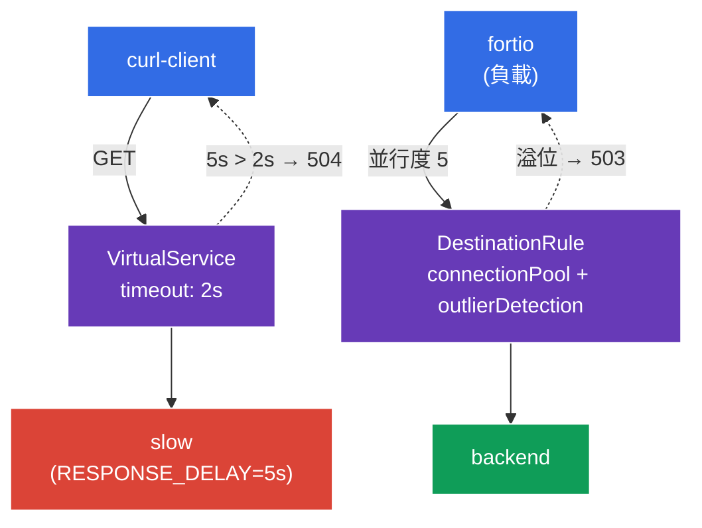

[Русская версия](README_RU.MD) · [Eng version](README.MD) · [Versión en español](README_ES.MD) · [Version française](README_FR.MD) · [Deutsche Version](README_DE.MD) · [ქართული ვერსია](README_GE.MD) · [日本語版](README_JP.MD)

# Lab 10 - 韌性：Timeout + Circuit Breaker

> [參考解答](worker/files/solutions/1_TW.MD)

想像一下：其中一個後端開始「變慢」或效能退化。若沒有防護，緩慢的服務會拖慢所有對它的請求，執行緒／連線不斷累積，退化便會擴散至整個 mesh（cascading failure）。Istio 提供兩種機制來避免這種情況：
- **Timeout** - 限制等待回應的時間。若後端未在指定時間內回應，請求會以 `504` 中斷，而非無限期卡住。
- **Circuit Breaker** - 「保險絲」：限制連線池（`connectionPool`），並自動排除不健康的端點（`outlierDetection`）。當服務過載或持續出錯時，多餘的請求會立即以 `503` 被拒絕，讓服務得以「喘息」。

所有這些設定皆在基礎設施層級完成，無須修改應用程式碼。

### 運作方式（整體架構）



## 目標

- 在 `VirtualService` 中設定 **timeout**，並確認緩慢的後端回傳 `504`。
- 在 `DestinationRule` 中設定 **circuit breaker**（`connectionPool` + `outlierDetection`），並觀察多餘負載如何以 `503` 被拒絕。

## 基礎設施

環境透過 Terragrunt 在 AWS（`eu-central-1`）中部署，由下列項目組成：

| 元件  | 說明                                          |
|------------|---------------------------------------------------|
| `vpc`      | 具備公有子網路的 VPC `10.10.0.0/16`          |
| `ssh-keys` | 用於存取節點的 SSH 金鑰                      |
| `k8s-1`    | 已安裝 Istio 的 Kubernetes `1.35.2`（kubeadm） |
| `worker`   | 具備 `kubectl` 並可存取叢集的工作機器   |

執行個體：`t3.medium`（master）Ubuntu `22.04`

## 部署

```bash
TASK=10 make run_ica_task
```

## 步驟 1. 啟用 sidecar 注入

```bash
kubectl label namespace default istio-injection=enabled --overwrite
```

Timeout 與 circuit breaker 由呼叫服務的 sidecar 中的 Envoy 實作；沒有它，這些策略將無法運作。

## 步驟 2. 安裝應用程式

```bash
kubectl apply -f https://raw.githubusercontent.com/ViktorUJ/cks/refs/heads/master/tasks/ica/labs/10/k8s-1/scripts/1.yaml
kubectl rollout restart deployment -n default
```

**部署內容：**
- **`slow`** - 使用變數 `RESPONSE_DELAY=5000` 的 `ping_pong`（每次回應延遲 5 秒）- 用於示範 timeout 的「緩慢」後端。
- **`backend`** - 快速的 `ping_pong` - circuit breaker 的目標。
- **`curl-client`** - 用於驗證 timeout 的用戶端。
- **`fortio`** - 用來「觸發」circuit breaker 的負載產生器。

## 步驟 3. Timeout - 中斷長時間請求

先觀察未設定 timeout 時的行為：對 `slow` 的請求會回傳 `200`，但必須等候約 5 秒：

```bash
kubectl exec -n default deploy/curl-client -c curl -- \
  curl -s -o /dev/null -w "code=%{http_code} time=%{time_total}s\n" http://slow:8080/
```
```
code=200 time=5.02s
```

現在在 `VirtualService` 中設定 `2s` 的 timeout：

```bash
vim slow-vs.yaml
```

```yaml
apiVersion: networking.istio.io/v1
kind: VirtualService
metadata:
  name: slow-vs
  namespace: default
spec:
  hosts:
  - slow
  http:
  - timeout: 2s          # 最多等待回應 2 秒
    route:
    - destination:
        host: slow
```

```bash
kubectl apply -f slow-vs.yaml
```

驗證結果：現在請求會在 2 秒後以 `504` 中斷：

```bash
kubectl exec -n default deploy/curl-client -c curl -- \
  curl -s -o /dev/null -w "code=%{http_code} time=%{time_total}s\n" http://slow:8080/
```
```
code=504 time=2.01s
```

**發生的事：**後端需 5 秒才回應，但用戶端的 Envoy 代理只等待 2 秒（`timeout`）；若未等到回應，便回傳 `504 Gateway Timeout`。請求不再卡住，用戶端資源能及時釋放。

## 步驟 4. Circuit Breaker - 拒絕過載請求

`DestinationRule` 透過兩個區塊為服務 `backend` 設定「保險絲」：
- **`connectionPool`** - 對連線與請求設定嚴格限制。任何超過限制的請求都會立即以 `503` 被拒絕。
- **`outlierDetection`** - 主動健康檢查：若端點連續回傳 `5xx`，便暫時將其排除於負載平衡之外。

```bash
vim backend-cb.yaml
```

```yaml
apiVersion: networking.istio.io/v1
kind: DestinationRule
metadata:
  name: backend-cb
  namespace: default
spec:
  host: backend
  trafficPolicy:
    connectionPool:
      tcp:
        maxConnections: 1              # 不超過 1 個 TCP 連線
      http:
        http1MaxPendingRequests: 1     # 佇列中不超過 1 個請求
        maxRequestsPerConnection: 1    # 每個連線 1 個請求
    outlierDetection:
      consecutive5xxErrors: 3          # 連續 3 次 5xx 錯誤...
      interval: 5s                     # ...在 5 秒的檢查間隔內
      baseEjectionTime: 30s            # 將端點排除 30 秒
      maxEjectionPercent: 100          # 最多可排除 100% 的端點
```

```bash
kubectl apply -f backend-cb.yaml
```

**說明：**
- **`connectionPool`** - 當 `maxConnections: 1` 與 `http1MaxPendingRequests: 1` 時，服務實際上可同時處理一個請求，加上一個佇列中的請求。競爭負載下的其餘請求會立即收到 `503`（過載）。
- **`outlierDetection`** - 若端點在 5 秒內連續產生 3 個 `5xx` 錯誤，Envoy 會將其從池中移除 30 秒。如此一來，「生病」的 pod 會自動停止接收流量。

## 步驟 5. 使用負載觸發保險絲

使用 `fortio` 以並行度 5（而連線池僅有 1 條連線）產生負載：

```bash
kubectl exec -n default deploy/fortio -c fortio -- \
  fortio load -c 5 -qps 0 -n 50 -quiet http://backend:8080/
```

在 fortio 的輸出中查看狀態碼分布：大量的 `503` 表示 circuit breaker 已拒絕多餘的平行請求：

```
Code 200 : 18 (36 %)
Code 503 : 32 (64 %)
```

用戶端 Envoy 的保險絲觸發計數器：

```bash
kubectl exec -n default deploy/fortio -c istio-proxy -- \
  pilot-agent request GET stats | grep backend | grep upstream_cx_overflow
```

持續增加的 `upstream_cx_overflow` 證實：超出連線池限制的連線已被捨棄。

## 總結

| 機制 | 資源 | 欄位 | 功能 |
|----------|--------|------|-----------|
| Timeout | `VirtualService` | `http.timeout` | 中斷長時間請求（`504`） |
| Circuit Breaker | `DestinationRule` | `connectionPool` | 拒絕過載請求（`503`） |
| Circuit Breaker | `DestinationRule` | `outlierDetection` | 排除不健康的端點 |

**核心結論：**timeout 與 circuit breaker 是保護**呼叫端**免受緩慢與不穩定依賴影響的機制：
- **timeout** 防止請求無限期卡住；
- **connectionPool** 防止大量平行請求壓垮後端；
- **outlierDetection** 自動將故障端點移出輪替。

兩者共同避免級聯故障（cascading failures）- 單一服務的退化不會「拖垮」整個 mesh。而且所有設定皆可透過宣告式方式完成，無須修改應用程式碼。