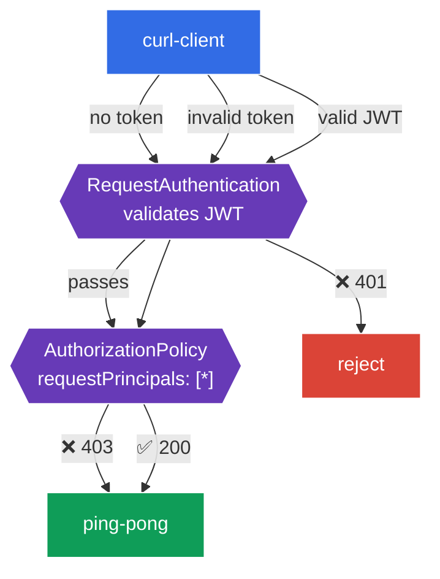

[RU version](README_RU.MD) · [Versión en español](README_ES.MD) · [Version française](README_FR.MD) · [Deutsche Version](README_DE.MD)

# Lab 11 - End-user authentication: RequestAuthentication + JWT

In Lab 04 we covered authentication **between services** (mTLS, `PeerAuthentication`). But there's a second kind of authentication - **end-user**: when a request carries a **JWT token** (e.g., issued by your Identity Provider - Auth0, Keycloak, Google, etc.), and the service must validate that token and authorize the user based on its contents.

Istio solves this with two resources:
- **RequestAuthentication** - **validates** a JWT: signature, issuer, expiry. Key nuance: on its own it does **not require** a token - it only rejects *invalid* tokens (401). A request with no token passes through.
- **AuthorizationPolicy** with `requestPrincipals` - **requires** a valid JWT (otherwise 403) and authorizes based on the token's claims.

These two always work as a pair: `RequestAuthentication` validates, `AuthorizationPolicy` requires and allows.

### How It Works (High-Level Overview)



## Objective

- Configure `RequestAuthentication` to validate a JWT from a specific issuer.
- Confirm an invalid token is rejected (`401`).
- Add an `AuthorizationPolicy` that requires a valid JWT: no token → `403`, valid token → `200`.

This lab uses the test keys and token from the Istio repository:
- issuer: `testing@secure.istio.io`
- JWKS: `.../security/tools/jwt/samples/jwks.json`
- valid token: `.../security/tools/jwt/samples/demo.jwt`

## Step 1. Enable Sidecar Injection

```bash
kubectl label namespace default istio-injection=enabled --overwrite
```

JWT validation is performed by the Envoy sidecar of the service - without it `RequestAuthentication` has no effect.

## Step 2. Deploy the Application

```bash
kubectl apply -f https://raw.githubusercontent.com/ViktorUJ/cks/refs/heads/master/tasks/ica/labs/11/k8s-1/scripts/1.yaml
kubectl rollout restart deployment -n default
```

This deploys the protected backend `ping-pong` and a `curl-client` from which we'll send requests with and without a token.

Baseline check (no policies yet - open access):

```bash
kubectl exec -n default deploy/curl-client -c curl -- \
  curl -s -o /dev/null -w "%{http_code}\n" http://ping-pong:8080/
```
```
200
```

## Step 3. RequestAuthentication - Validate the JWT

```bash
vim request-auth.yaml
```

```yaml
apiVersion: security.istio.io/v1
kind: RequestAuthentication
metadata:
  name: jwt-ping-pong
  namespace: default
spec:
  selector:
    matchLabels:
      app: ping-pong
  jwtRules:
  - issuer: "testing@secure.istio.io"
    jwksUri: "https://raw.githubusercontent.com/istio/istio/release-1.29/security/tools/jwt/samples/jwks.json"
```

```bash
kubectl apply -f request-auth.yaml
```

**Breakdown:**
- **`selector`** - the policy applies to the `ping-pong` pods (their sidecar validates tokens).
- **`jwtRules.issuer`** - the expected token issuer (the `iss` claim in the JWT).
- **`jwksUri`** - where to fetch the public keys to verify the signature. istiod fetches the JWKS and pushes it to the proxies.

Check the behaviour:

```bash
# invalid token -> rejected
kubectl exec -n default deploy/curl-client -c curl -- \
  curl -s -o /dev/null -w "%{http_code}\n" -H "Authorization: Bearer bad-token" http://ping-pong:8080/
```
```
401
```

```bash
# NO token -> still passes (RequestAuthentication does not require a token!)
kubectl exec -n default deploy/curl-client -c curl -- \
  curl -s -o /dev/null -w "%{http_code}\n" http://ping-pong:8080/
```
```
200
```

**Key nuance:** `RequestAuthentication` only **validates** the token if one is present. An invalid token → `401`. But a request **with no token** passes (`200`). To make the token mandatory, you need an `AuthorizationPolicy` - the next step.

## Step 4. AuthorizationPolicy - Require a Valid JWT

```bash
vim require-jwt.yaml
```

```yaml
apiVersion: security.istio.io/v1
kind: AuthorizationPolicy
metadata:
  name: require-jwt
  namespace: default
spec:
  selector:
    matchLabels:
      app: ping-pong
  action: ALLOW
  rules:
  - from:
    - source:
        requestPrincipals: ["*"]   # any request carrying a valid JWT principal
```

```bash
kubectl apply -f require-jwt.yaml
```

**Breakdown:**
- **`requestPrincipals: ["*"]`** - allow only requests that carry a **valid JWT principal** (format `<issuer>/<subject>`). A request with no token has no principal → it's denied (`403`).
- This is exactly how the pair works: `RequestAuthentication` sets the principal from the verified token, and `AuthorizationPolicy` requires it.

## Step 5. Final Verification

```bash
TOKEN=$(curl -s https://raw.githubusercontent.com/istio/istio/release-1.29/security/tools/jwt/samples/demo.jwt)
```

```bash
# no token -> denied by authorization
kubectl exec -n default deploy/curl-client -c curl -- \
  curl -s -o /dev/null -w "%{http_code}\n" http://ping-pong:8080/
```
```
403
```

```bash
# invalid token -> rejected by validation
kubectl exec -n default deploy/curl-client -c curl -- \
  curl -s -o /dev/null -w "%{http_code}\n" -H "Authorization: Bearer bad-token" http://ping-pong:8080/
```
```
401
```

```bash
# valid token -> access allowed
kubectl exec -n default deploy/curl-client -c curl -- \
  curl -s -o /dev/null -w "%{http_code}\n" -H "Authorization: Bearer ${TOKEN}" http://ping-pong:8080/
```
```
200
```

## (optional) Claim-based authorization

You can require a specific JWT claim (e.g., `groups`) with a `when` condition:

```yaml
  rules:
  - from:
    - source:
        requestPrincipals: ["*"]
    when:
    - key: request.auth.claims[groups]
      values: ["group1"]
```

Then only users whose JWT contains the claim `groups: group1` are allowed.

## Summary

| Request | RequestAuthentication | AuthorizationPolicy | Result |
|---------|----------------------|---------------------|--------|
| no token | passes | no principal → deny | **403** |
| invalid token | rejects | - | **401** |
| valid JWT | validates, sets principal | principal present → allow | **200** |

**Key takeaway:** end-user authentication in Istio is a **pair** of resources:
- **RequestAuthentication** answers "is the token even valid?" (signature, issuer, expiry) and rejects bad tokens (`401`);
- **AuthorizationPolicy** answers "is a token required, and what does it grant?" - it makes the token mandatory (`403` without one) and authorizes based on claims.

Both resources live at the infrastructure level - the application doesn't parse or validate JWTs itself.
