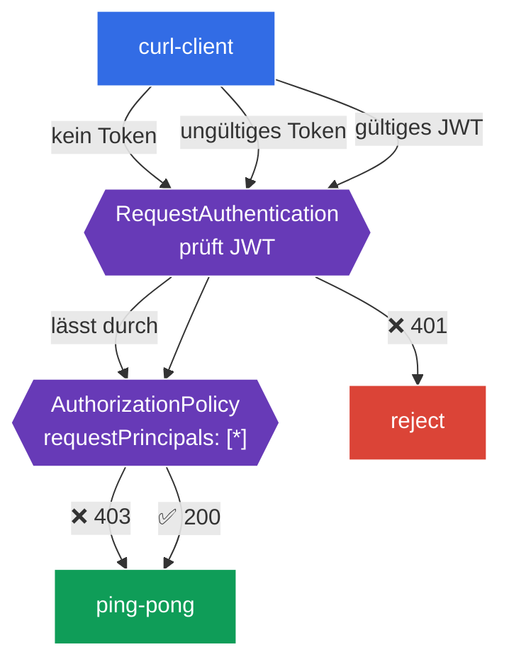

[RU version](README_RU.MD) · [Eng version](README.MD) · [Versión en español](README_ES.MD) · [Version française](README_FR.MD)

# Lab 11 - Authentifizierung von Endnutzern: RequestAuthentication + JWT

In Lab 04 haben wir die Authentifizierung von **Services** untereinander behandelt (mTLS, `PeerAuthentication`). Es gibt aber noch einen zweiten Typ der Authentifizierung - den des **Endnutzers** (end-user): wenn eine Anfrage ein **JWT-Token** trägt (zum Beispiel ausgestellt von Ihrem Identity Provider - Auth0, Keycloak, Google usw.) und der Service dieses Token prüfen und den Nutzer anhand seines Inhalts autorisieren muss.

Istio löst das mit zwei Ressourcen:
- **RequestAuthentication** - **prüft** das JWT: Signatur, Aussteller (`issuer`), Gültigkeitsdauer. Wichtiger Hinweis: Für sich allein **erfordert** es kein Token - es lehnt lediglich *ungültige* Token ab (401). Eine Anfrage ganz ohne Token lässt es durch.
- **AuthorizationPolicy** mit `requestPrincipals` - **erfordert** ein gültiges JWT (sonst 403) und autorisiert anhand der Token-Claims.

Diese beiden Ressourcen arbeiten stets im Paar: `RequestAuthentication` prüft, `AuthorizationPolicy` fordert und erlaubt.

### Wie das funktioniert (Gesamtschema)



## Ziel

- `RequestAuthentication` zur Prüfung eines JWT von einem bestimmten Aussteller konfigurieren.
- Sich überzeugen, dass ein ungültiges Token abgelehnt wird (`401`).
- Eine `AuthorizationPolicy` hinzufügen, die ein gültiges JWT erfordert: ohne Token - `403`, mit gültigem - `200`.

Im Lab werden Test-Schlüssel und ein Token aus dem Istio-Repository verwendet:
- Aussteller (`issuer`): `testing@secure.istio.io`
- JWKS: `.../security/tools/jwt/samples/jwks.json`
- gültiges Token: `.../security/tools/jwt/samples/demo.jwt`

## Infrastruktur

Die Umgebung wird in AWS (`eu-central-1`) über Terragrunt bereitgestellt und besteht aus:

| Komponente  | Beschreibung                                      |
|------------|---------------------------------------------------|
| `vpc`      | VPC `10.10.0.0/16` mit öffentlichen Subnetzen          |
| `ssh-keys` | SSH-Schlüssel für den Zugriff auf die Nodes                      |
| `k8s-1`    | Kubernetes `1.35.2` (kubeadm) mit installiertem Istio |
| `worker`   | Arbeitsmaschine mit `kubectl` und Zugriff auf den Cluster   |

Instanzen: `t3.medium` (master) Ubuntu `22.04`

## Deployment

```bash
TASK=11 make run_ica_task
```

## Schritt 1. Aktivierung der Sidecar-Injektion

```bash
kubectl label namespace default istio-injection=enabled --overwrite
```

Die Prüfung des JWT übernimmt Envoy im Sidecar des Services - ohne ihn funktioniert `RequestAuthentication` nicht.

## Schritt 2. Installation der Anwendung

```bash
kubectl apply -f https://raw.githubusercontent.com/ViktorUJ/cks/refs/heads/master/tasks/ica/labs/11/k8s-1/scripts/1.yaml
kubectl rollout restart deployment -n default
```

Es werden das zu schützende Backend `ping-pong` und `curl-client` bereitgestellt, von dem aus wir Anfragen mit und ohne Token senden werden.

Grundlegende Prüfung (noch ohne Richtlinien - der Zugriff ist offen):

```bash
kubectl exec -n default deploy/curl-client -c curl -- \
  curl -s -o /dev/null -w "%{http_code}\n" http://ping-pong:8080/
```
```
200
```

## Schritt 3. RequestAuthentication - wir prüfen das JWT

```bash
vim request-auth.yaml
```

```yaml
apiVersion: security.istio.io/v1
kind: RequestAuthentication
metadata:
  name: jwt-ping-pong
  namespace: default
spec:
  selector:
    matchLabels:
      app: ping-pong
  jwtRules:
  - issuer: "testing@secure.istio.io"
    jwksUri: "https://raw.githubusercontent.com/istio/istio/release-1.29/security/tools/jwt/samples/jwks.json"
```

```bash
kubectl apply -f request-auth.yaml
```

**Erläuterung:**
- **`selector`** - die Richtlinie wird auf die Pods `ping-pong` angewendet (ihr Sidecar wird die Token prüfen).
- **`jwtRules.issuer`** - der erwartete Aussteller des Tokens (`iss` im JWT).
- **`jwksUri`** - woher die öffentlichen Schlüssel zur Signaturprüfung genommen werden. istiod lädt das JWKS herunter und verteilt es an die Proxys.

Wir prüfen das Verhalten:

```bash
# ungültiges Token -> wird abgelehnt
kubectl exec -n default deploy/curl-client -c curl -- \
  curl -s -o /dev/null -w "%{http_code}\n" -H "Authorization: Bearer bad-token" http://ping-pong:8080/
```
```
401
```

```bash
# OHNE Token -> geht immer noch durch (RequestAuthentication erfordert kein Token!)
kubectl exec -n default deploy/curl-client -c curl -- \
  curl -s -o /dev/null -w "%{http_code}\n" http://ping-pong:8080/
```
```
200
```

**Zentraler Hinweis:** `RequestAuthentication` **prüft** ein Token nur, wenn es vorhanden ist. Ungültiges Token → `401`. Aber eine Anfrage **ohne Token** lässt es durch (`200`). Um das Token verpflichtend zu machen, wird eine `AuthorizationPolicy` benötigt - der nächste Schritt.

## Schritt 4. AuthorizationPolicy - wir fordern ein gültiges JWT

```bash
vim require-jwt.yaml
```

```yaml
apiVersion: security.istio.io/v1
kind: AuthorizationPolicy
metadata:
  name: require-jwt
  namespace: default
spec:
  selector:
    matchLabels:
      app: ping-pong
  action: ALLOW
  rules:
  - from:
    - source:
        requestPrincipals: ["*"]   # jede Anfrage mit gültigem JWT-Principal
```

```bash
kubectl apply -f require-jwt.yaml
```

**Erläuterung:**
- **`requestPrincipals: ["*"]`** - erlaubt nur jene Anfragen, die einen **gültigen JWT-Principal** besitzen (Format `<issuer>/<subject>`). Eine Anfrage ohne Token hat keinen Principal → sie wird abgelehnt (`403`).
- Genau so funktioniert das Zusammenspiel: `RequestAuthentication` setzt den Principal aus dem geprüften Token, und `AuthorizationPolicy` fordert dessen Vorhandensein.

## Schritt 5. Abschließende Prüfung

```bash
TOKEN=$(curl -s https://raw.githubusercontent.com/istio/istio/release-1.29/security/tools/jwt/samples/demo.jwt)
```

```bash
# ohne Token -> von der Autorisierung verboten
kubectl exec -n default deploy/curl-client -c curl -- \
  curl -s -o /dev/null -w "%{http_code}\n" http://ping-pong:8080/
```
```
403
```

```bash
# ungültiges Token -> von der Prüfung abgelehnt
kubectl exec -n default deploy/curl-client -c curl -- \
  curl -s -o /dev/null -w "%{http_code}\n" -H "Authorization: Bearer bad-token" http://ping-pong:8080/
```
```
401
```

```bash
# gültiges Token -> Zugriff erlaubt
kubectl exec -n default deploy/curl-client -c curl -- \
  curl -s -o /dev/null -w "%{http_code}\n" -H "Authorization: Bearer ${TOKEN}" http://ping-pong:8080/
```
```
200
```

## (optional) Autorisierung nach Claim

Man kann einen bestimmten Claim aus dem Token fordern (zum Beispiel `groups`) über die Bedingung `when`:

```yaml
  rules:
  - from:
    - source:
        requestPrincipals: ["*"]
    when:
    - key: request.auth.claims[groups]
      values: ["group1"]
```

Dann erhalten nur Nutzer Zugriff, die im JWT den Claim `groups: group1` haben.

## Fazit

| Anfrage | RequestAuthentication | AuthorizationPolicy | Ergebnis |
|--------|----------------------|---------------------|------|
| ohne Token | lässt durch | kein Principal → deny | **403** |
| ungültiges Token | lehnt ab | - | **401** |
| gültiges JWT | prüft, setzt Principal | Principal vorhanden → allow | **200** |

**Zentrale Erkenntnis:** Die Authentifizierung von Endnutzern in Istio ist ein **Paar** von Ressourcen:
- **RequestAuthentication** beantwortet die Frage „Ist das Token überhaupt gültig?" (Signatur, Aussteller, Gültigkeit) und lehnt schlechte Token ab (`401`);
- **AuthorizationPolicy** beantwortet die Frage „Wird ein Token benötigt und was erlaubt es?" - macht das Token verpflichtend (`403` ohne es) und autorisiert anhand der Claims.

Beide Ressourcen liegen auf Infrastrukturebene, die Anwendung befasst sich nicht mit dem Parsen und Validieren von JWTs.
