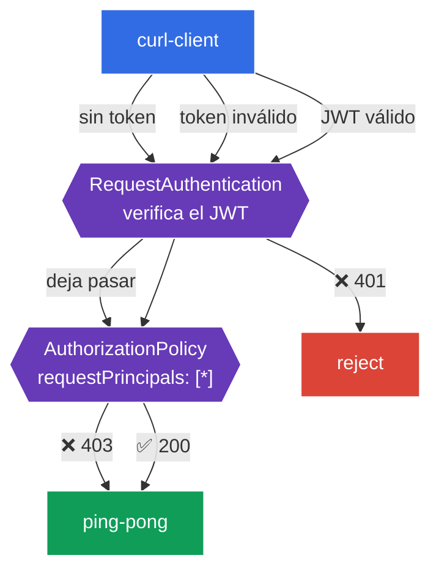

[RU version](README_RU.MD) · [Eng version](README.MD)

# Lab 11 - Autenticación de usuarios finales: RequestAuthentication + JWT

En el lab 04 analizamos la autenticación **entre servicios** (mTLS, `PeerAuthentication`). Pero existe un segundo tipo de autenticación: la del **usuario final** (end-user), cuando la petición lleva un **token JWT** (por ejemplo, emitido por tu Identity Provider - Auth0, Keycloak, Google, etc.), y el servicio debe verificar ese token y autorizar al usuario según su contenido.

Istio lo resuelve con dos recursos:
- **RequestAuthentication** - **verifica** el JWT: firma, emisor (`issuer`), vigencia. Un matiz importante: por sí mismo **no exige** la presencia del token, solo rechaza los tokens *inválidos* (401). Una petición sin token la deja pasar.
- **AuthorizationPolicy** con `requestPrincipals` - **exige** un JWT válido (de lo contrario 403) y autoriza según los claims del token.

Estos dos recursos siempre trabajan en pareja: `RequestAuthentication` verifica, `AuthorizationPolicy` exige y permite.

### Cómo funciona (esquema general)



## Objetivo

- Configurar `RequestAuthentication` para verificar JWT de un emisor concreto.
- Comprobar que un token inválido se rechaza (`401`).
- Añadir una `AuthorizationPolicy` que exija un JWT válido: sin token - `403`, con token válido - `200`.

En el lab se usan claves y un token de prueba del repositorio de Istio:
- emisor (`issuer`): `testing@secure.istio.io`
- JWKS: `.../security/tools/jwt/samples/jwks.json`
- token válido: `.../security/tools/jwt/samples/demo.jwt`

## Paso 1. Activación de la inyección de sidecar

```bash
kubectl label namespace default istio-injection=enabled --overwrite
```

La verificación del JWT la realiza Envoy en el sidecar del servicio; sin él `RequestAuthentication` no funcionará.

## Paso 2. Instalación de la aplicación

```bash
kubectl apply -f https://raw.githubusercontent.com/ViktorUJ/cks/refs/heads/master/tasks/ica/labs/11/k8s-1/scripts/1.yaml
kubectl rollout restart deployment -n default
```

Se despliega el backend protegido `ping-pong` y `curl-client`, desde el cual enviaremos peticiones con y sin token.

Comprobación básica (todavía sin políticas - el acceso está abierto):

```bash
kubectl exec -n default deploy/curl-client -c curl -- \
  curl -s -o /dev/null -w "%{http_code}\n" http://ping-pong:8080/
```
```
200
```

## Paso 3. RequestAuthentication - verificamos el JWT

```bash
vim request-auth.yaml
```

```yaml
apiVersion: security.istio.io/v1
kind: RequestAuthentication
metadata:
  name: jwt-ping-pong
  namespace: default
spec:
  selector:
    matchLabels:
      app: ping-pong
  jwtRules:
  - issuer: "testing@secure.istio.io"
    jwksUri: "https://raw.githubusercontent.com/istio/istio/release-1.29/security/tools/jwt/samples/jwks.json"
```

```bash
kubectl apply -f request-auth.yaml
```

**Análisis:**
- **`selector`** - la política se aplica a los pods `ping-pong` (su sidecar verificará los tokens).
- **`jwtRules.issuer`** - el emisor esperado del token (`iss` en el JWT).
- **`jwksUri`** - de dónde obtener las claves públicas para verificar la firma. istiod descarga el JWKS y lo distribuye a los proxies.

Comprobamos el comportamiento:

```bash
# token inválido -> se rechaza
kubectl exec -n default deploy/curl-client -c curl -- \
  curl -s -o /dev/null -w "%{http_code}\n" -H "Authorization: Bearer bad-token" http://ping-pong:8080/
```
```
401
```

```bash
# SIN token -> aún pasa (¡RequestAuthentication no exige el token!)
kubectl exec -n default deploy/curl-client -c curl -- \
  curl -s -o /dev/null -w "%{http_code}\n" http://ping-pong:8080/
```
```
200
```

**Matiz clave:** `RequestAuthentication` solo **verifica** el token si está presente. Un token inválido → `401`. Pero una petición **sin token** la deja pasar (`200`). Para hacer el token obligatorio se necesita una `AuthorizationPolicy` - el siguiente paso.

## Paso 4. AuthorizationPolicy - exigimos un JWT válido

```bash
vim require-jwt.yaml
```

```yaml
apiVersion: security.istio.io/v1
kind: AuthorizationPolicy
metadata:
  name: require-jwt
  namespace: default
spec:
  selector:
    matchLabels:
      app: ping-pong
  action: ALLOW
  rules:
  - from:
    - source:
        requestPrincipals: ["*"]   # cualquier petición con un principal JWT válido
```

```bash
kubectl apply -f require-jwt.yaml
```

**Análisis:**
- **`requestPrincipals: ["*"]`** - permitir solo aquellas peticiones que tengan un **principal JWT válido** (formato `<issuer>/<subject>`). Una petición sin token no tiene principal → será rechazada (`403`).
- La combinación funciona precisamente así: `RequestAuthentication` establece el principal a partir del token verificado, y `AuthorizationPolicy` exige su presencia.

## Paso 5. Comprobación final

```bash
TOKEN=$(curl -s https://raw.githubusercontent.com/istio/istio/release-1.29/security/tools/jwt/samples/demo.jwt)
```

```bash
# sin token -> denegado por la autorización
kubectl exec -n default deploy/curl-client -c curl -- \
  curl -s -o /dev/null -w "%{http_code}\n" http://ping-pong:8080/
```
```
403
```

```bash
# token inválido -> rechazado por la verificación
kubectl exec -n default deploy/curl-client -c curl -- \
  curl -s -o /dev/null -w "%{http_code}\n" -H "Authorization: Bearer bad-token" http://ping-pong:8080/
```
```
401
```

```bash
# token válido -> acceso permitido
kubectl exec -n default deploy/curl-client -c curl -- \
  curl -s -o /dev/null -w "%{http_code}\n" -H "Authorization: Bearer ${TOKEN}" http://ping-pong:8080/
```
```
200
```

## (opcional) Autorización por claim

Se puede exigir un claim concreto del token (por ejemplo, `groups`) mediante la condición `when`:

```yaml
  rules:
  - from:
    - source:
        requestPrincipals: ["*"]
    when:
    - key: request.auth.claims[groups]
      values: ["group1"]
```

Entonces obtendrán acceso solo los usuarios cuyo JWT tenga el claim `groups: group1`.

## Resumen

| Petición | RequestAuthentication | AuthorizationPolicy | Resultado |
|--------|----------------------|---------------------|------|
| sin token | deja pasar | no hay principal → deny | **403** |
| token inválido | rechaza | - | **401** |
| JWT válido | verifica, establece el principal | hay principal → allow | **200** |

**Conclusión clave:** la autenticación del usuario final en Istio es una **pareja** de recursos:
- **RequestAuthentication** responde a la pregunta «¿es válido el token en sí?» (firma, emisor, vigencia) y rechaza los tokens malos (`401`);
- **AuthorizationPolicy** responde a la pregunta «¿es necesario el token y qué permite?» - hace el token obligatorio (`403` si no está) y autoriza según los claims.

Ambos recursos operan a nivel de infraestructura; la aplicación no se ocupa de analizar ni validar el JWT.
