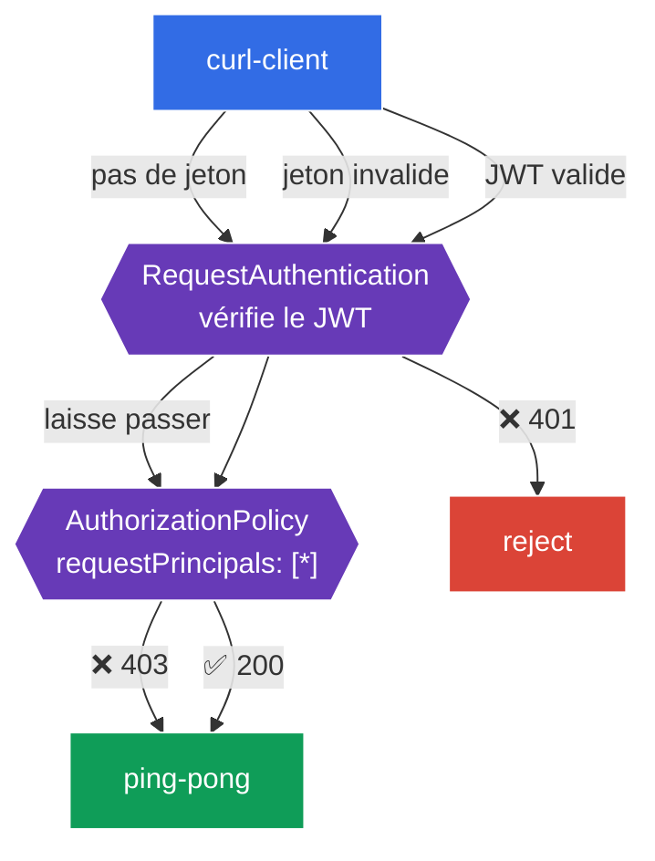

[RU version](README_RU.MD) · [Eng version](README.MD) · [Versión en español](README_ES.MD) · [Deutsche Version](README_DE.MD)

# Lab 11 - Authentification des utilisateurs finaux : RequestAuthentication + JWT

Dans le lab 04, nous avons abordé l'authentification des **services** entre eux (mTLS, `PeerAuthentication`). Mais il existe un second type d'authentification - celle de l'**utilisateur final** (end-user) : lorsqu'une requête porte un **jeton JWT** (par exemple émis par votre Identity Provider - Auth0, Keycloak, Google, etc.), et que le service doit vérifier ce jeton et autoriser l'utilisateur selon son contenu.

Istio résout cela avec deux ressources :
- **RequestAuthentication** - **vérifie** le JWT : signature, émetteur (`issuer`), durée de validité. Nuance importante : à lui seul, il n'**exige pas** la présence d'un jeton - il ne fait que rejeter les jetons *invalides* (401). Une requête sans jeton du tout, il la laisse passer.
- **AuthorizationPolicy** avec `requestPrincipals` - **exige** un JWT valide (sinon 403) et autorise selon les claims du jeton.

Ces deux ressources fonctionnent toujours en tandem : `RequestAuthentication` vérifie, `AuthorizationPolicy` exige et autorise.

### Comment ça marche (schéma général)



## Objectif

- Configurer `RequestAuthentication` pour vérifier un JWT provenant d'un émetteur précis.
- Vérifier qu'un jeton invalide est rejeté (`401`).
- Ajouter une `AuthorizationPolicy` exigeant un JWT valide : sans jeton - `403`, avec un jeton valide - `200`.

Ce lab utilise des clés de test et un jeton issus du dépôt Istio :
- émetteur (`issuer`) : `testing@secure.istio.io`
- JWKS : `.../security/tools/jwt/samples/jwks.json`
- jeton valide : `.../security/tools/jwt/samples/demo.jwt`

## Étape 1. Activation de l'injection du sidecar

```bash
kubectl label namespace default istio-injection=enabled --overwrite
```

La vérification du JWT est effectuée par Envoy dans le sidecar du service - sans lui, `RequestAuthentication` ne fonctionnera pas.

## Étape 2. Installation de l'application

```bash
kubectl apply -f https://raw.githubusercontent.com/ViktorUJ/cks/refs/heads/master/tasks/ica/labs/11/k8s-1/scripts/1.yaml
kubectl rollout restart deployment -n default
```

On déploie le backend à protéger `ping-pong` et `curl-client`, depuis lequel on enverra des requêtes avec et sans jeton.

Vérification de base (encore sans politiques - l'accès est ouvert) :

```bash
kubectl exec -n default deploy/curl-client -c curl -- \
  curl -s -o /dev/null -w "%{http_code}\n" http://ping-pong:8080/
```
```
200
```

## Étape 3. RequestAuthentication - vérifier le JWT

```bash
vim request-auth.yaml
```

```yaml
apiVersion: security.istio.io/v1
kind: RequestAuthentication
metadata:
  name: jwt-ping-pong
  namespace: default
spec:
  selector:
    matchLabels:
      app: ping-pong
  jwtRules:
  - issuer: "testing@secure.istio.io"
    jwksUri: "https://raw.githubusercontent.com/istio/istio/release-1.29/security/tools/jwt/samples/jwks.json"
```

```bash
kubectl apply -f request-auth.yaml
```

**Décryptage :**
- **`selector`** - la politique s'applique aux pods `ping-pong` (leur sidecar vérifiera les jetons).
- **`jwtRules.issuer`** - l'émetteur attendu du jeton (`iss` dans le JWT).
- **`jwksUri`** - où récupérer les clés publiques pour vérifier la signature. istiod télécharge le JWKS et le distribue aux proxies.

On vérifie le comportement :

```bash
# jeton invalide -> rejeté
kubectl exec -n default deploy/curl-client -c curl -- \
  curl -s -o /dev/null -w "%{http_code}\n" -H "Authorization: Bearer bad-token" http://ping-pong:8080/
```
```
401
```

```bash
# SANS jeton -> passe quand même (RequestAuthentication n'exige pas de jeton !)
kubectl exec -n default deploy/curl-client -c curl -- \
  curl -s -o /dev/null -w "%{http_code}\n" http://ping-pong:8080/
```
```
200
```

**Nuance clé :** `RequestAuthentication` ne fait que **vérifier** le jeton, s'il y en a un. Un jeton invalide → `401`. Mais une requête **sans jeton**, il la laisse passer (`200`). Pour rendre le jeton obligatoire, il faut une `AuthorizationPolicy` - c'est l'étape suivante.

## Étape 4. AuthorizationPolicy - exiger un JWT valide

```bash
vim require-jwt.yaml
```

```yaml
apiVersion: security.istio.io/v1
kind: AuthorizationPolicy
metadata:
  name: require-jwt
  namespace: default
spec:
  selector:
    matchLabels:
      app: ping-pong
  action: ALLOW
  rules:
  - from:
    - source:
        requestPrincipals: ["*"]   # toute requête avec un principal JWT valide
```

```bash
kubectl apply -f require-jwt.yaml
```

**Décryptage :**
- **`requestPrincipals: ["*"]`** - n'autoriser que les requêtes qui possèdent un **principal JWT valide** (format `<issuer>/<subject>`). Une requête sans jeton n'a pas de principal → elle sera rejetée (`403`).
- C'est précisément le tandem qui fonctionne ainsi : `RequestAuthentication` établit le principal à partir du jeton vérifié, et `AuthorizationPolicy` en exige la présence.

## Étape 5. Vérification finale

```bash
TOKEN=$(curl -s https://raw.githubusercontent.com/istio/istio/release-1.29/security/tools/jwt/samples/demo.jwt)
```

```bash
# sans jeton -> refusé par l'autorisation
kubectl exec -n default deploy/curl-client -c curl -- \
  curl -s -o /dev/null -w "%{http_code}\n" http://ping-pong:8080/
```
```
403
```

```bash
# jeton invalide -> rejeté par la vérification
kubectl exec -n default deploy/curl-client -c curl -- \
  curl -s -o /dev/null -w "%{http_code}\n" -H "Authorization: Bearer bad-token" http://ping-pong:8080/
```
```
401
```

```bash
# jeton valide -> accès autorisé
kubectl exec -n default deploy/curl-client -c curl -- \
  curl -s -o /dev/null -w "%{http_code}\n" -H "Authorization: Bearer ${TOKEN}" http://ping-pong:8080/
```
```
200
```

## (optionnel) Autorisation par claim

On peut exiger un claim précis du jeton (par exemple `groups`) via la condition `when` :

```yaml
  rules:
  - from:
    - source:
        requestPrincipals: ["*"]
    when:
    - key: request.auth.claims[groups]
      values: ["group1"]
```

Dans ce cas, seuls les utilisateurs dont le JWT contient le claim `groups: group1` obtiendront l'accès.

## Bilan

| Requête | RequestAuthentication | AuthorizationPolicy | Résultat |
|--------|----------------------|---------------------|------|
| sans jeton | laisse passer | pas de principal → deny | **403** |
| jeton invalide | rejette | - | **401** |
| JWT valide | vérifie, pose le principal | principal présent → allow | **200** |

**À retenir :** l'authentification de l'utilisateur final dans Istio, c'est un **tandem** de ressources :
- **RequestAuthentication** répond à la question « le jeton est-il valide ? » (signature, émetteur, durée) et rejette les mauvais jetons (`401`) ;
- **AuthorizationPolicy** répond à la question « le jeton est-il nécessaire et qu'autorise-t-il ? » - elle rend le jeton obligatoire (`403` sans lui) et autorise selon les claims.

Les deux ressources sont au niveau de l'infrastructure, l'application ne s'occupe ni du parsing ni de la validation du JWT.
