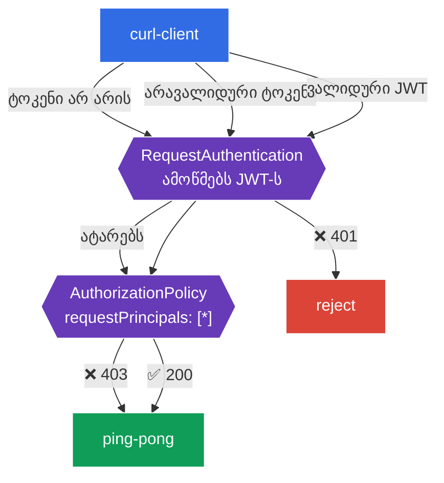

[Русская версия](README_RU.MD) · [Eng version](README.MD) · [Versión en español](README_ES.MD) · [Version française](README_FR.MD) · [Deutsche Version](README_DE.MD) · [繁體中文版](README_TW.MD) · [日本語版](README_JP.MD)

# Lab 11 - საბოლოო მომხმარებლების ავთენტიფიკაცია: RequestAuthentication + JWT

> [საცნობარო გადაწყვეტა](worker/files/solutions/1_GE.MD)

ლაბორატორია 04-ში ჩვენ განვიხილეთ **სერვისების** ერთმანეთთან ავთენტიფიკაცია (mTLS, `PeerAuthentication`). თუმცა არსებობს ავთენტიფიკაციის მეორე ტიპიც - **საბოლოო მომხმარებლის** (end-user): როდესაც მოთხოვნას თან ახლავს **JWT-ტოკენი** (მაგალითად, თქვენი Identity Provider-ის - Auth0-ის, Keycloak-ის, Google-ის და ა.შ. - მიერ გაცემული), ხოლო სერვისმა ეს ტოკენი უნდა შეამოწმოს და მომხმარებელს მის შიგთავსზე დაყრდნობით მიანიჭოს ავტორიზაცია.

Istio ამას ორი რესურსით უზრუნველყოფს:
- **RequestAuthentication** - **ამოწმებს** JWT-ს: ხელმოწერას, გამომცემელს (`issuer`), მოქმედების ვადას. მნიშვნელოვანი ნიუანსი: თავისთავად ის ტოკენის არსებობას **არ მოითხოვს** - მხოლოდ *არავალიდურ* ტოკენებს უარყოფს (401). მოთხოვნას საერთოდ ტოკენის გარეშე ის ატარებს.
- **AuthorizationPolicy** `requestPrincipals`-ით - **მოითხოვს** ვალიდურ JWT-ს (წინააღმდეგ შემთხვევაში 403) და ავტორიზაციას ტოკენის claims-ის მიხედვით ახორციელებს.

ეს ორი რესურსი ყოველთვის წყვილად მუშაობს: `RequestAuthentication` ამოწმებს, `AuthorizationPolicy` კი მოითხოვს და ნებას რთავს.

### როგორ მუშაობს ეს (ზოგადი სქემა)



## მიზანი

- დავაკონფიგურიროთ `RequestAuthentication` კონკრეტული გამომცემლის JWT-ის შესამოწმებლად.
- დავრწმუნდეთ, რომ არავალიდური ტოკენი უარყოფილია (`401`).
- დავამატოთ `AuthorizationPolicy`, რომელიც ვალიდურ JWT-ს მოითხოვს: ტოკენის გარეშე - `403`, ვალიდური ტოკენით - `200`.

ლაბორატორიაში გამოიყენება სატესტო გასაღებები და ტოკენი Istio-ს რეპოზიტორიიდან:
- გამომცემელი (`issuer`): `testing@secure.istio.io`
- JWKS: `.../security/tools/jwt/samples/jwks.json`
- ვალიდური ტოკენი: `.../security/tools/jwt/samples/demo.jwt`

## ინფრასტრუქტურა

გარემო Terragrunt-ის საშუალებით AWS-ში (`eu-central-1`) იშლება და შედგება შემდეგი კომპონენტებისგან:

| კომპონენტი | აღწერა |
|------------|--------|
| `vpc`      | VPC `10.10.0.0/16` საჯარო ქვექსელებით |
| `ssh-keys` | SSH-გასაღებები ნოდებზე წვდომისთვის |
| `k8s-1`    | Kubernetes `1.35.2` (kubeadm) დაყენებული Istio-თი |
| `worker`   | სამუშაო მანქანა `kubectl`-ითა და კლასტერზე წვდომით |

ინსტანსები: `t3.medium` (master) Ubuntu `22.04`

## გაშლა

```bash
TASK=11 make run_ica_task
```

## ნაბიჯი 1. sidecar-ინექციის ჩართვა

```bash
kubectl label namespace default istio-injection=enabled --overwrite
```

JWT-ს სერვისის sidecar-ში არსებული Envoy ამოწმებს - მის გარეშე `RequestAuthentication` არ იმუშავებს.

## ნაბიჯი 2. აპლიკაციის დაყენება

```bash
kubectl apply -f https://raw.githubusercontent.com/ViktorUJ/cks/refs/heads/master/tasks/ica/labs/11/k8s-1/scripts/1.yaml
kubectl rollout restart deployment -n default
```

იშლება დასაცავი ბეკენდი `ping-pong` და `curl-client`, საიდანაც მოთხოვნებს ტოკენითა და ტოკენის გარეშე გავაგზავნით.

საბაზისო შემოწმება (ჯერ პოლიტიკების გარეშე - წვდომა ღიაა):

```bash
kubectl exec -n default deploy/curl-client -c curl -- \
  curl -s -o /dev/null -w "%{http_code}\n" http://ping-pong:8080/
```
```
200
```

## ნაბიჯი 3. RequestAuthentication - ვამოწმებთ JWT-ს

```bash
vim request-auth.yaml
```

```yaml
apiVersion: security.istio.io/v1
kind: RequestAuthentication
metadata:
  name: jwt-ping-pong
  namespace: default
spec:
  selector:
    matchLabels:
      app: ping-pong
  jwtRules:
  - issuer: "testing@secure.istio.io"
    jwksUri: "https://raw.githubusercontent.com/istio/istio/release-1.29/security/tools/jwt/samples/jwks.json"
```

```bash
kubectl apply -f request-auth.yaml
```

**განხილვა:**
- **`selector`** - პოლიტიკა ვრცელდება `ping-pong`-ის პოდებზე (მათი sidecar შეამოწმებს ტოკენებს).
- **`jwtRules.issuer`** - ტოკენის მოსალოდნელი გამომცემელი (`iss` JWT-ში).
- **`jwksUri`** - საიდან უნდა მივიღოთ ხელმოწერის შესამოწმებელი საჯარო გასაღებები. istiod ჩამოტვირთავს JWKS-ს და პროქსიებს გადასცემს.

ვამოწმებთ ქცევას:

```bash
# არავალიდური ტოკენი -> უარყოფილია
kubectl exec -n default deploy/curl-client -c curl -- \
  curl -s -o /dev/null -w "%{http_code}\n" -H "Authorization: Bearer bad-token" http://ping-pong:8080/
```
```
401
```

```bash
# ტოკენის გარეშე -> მაინც გადის (RequestAuthentication ტოკენს არ ითხოვს!)
kubectl exec -n default deploy/curl-client -c curl -- \
  curl -s -o /dev/null -w "%{http_code}\n" http://ping-pong:8080/
```
```
200
```

**მთავარი ნიუანსი:** `RequestAuthentication` ტოკენს მხოლოდ მაშინ **ამოწმებს**, თუ ის არსებობს. არავალიდური ტოკენი → `401`. მაგრამ მოთხოვნას **ტოკენის გარეშე** ის ატარებს (`200`). ტოკენი სავალდებულო რომ გახდეს, საჭიროა `AuthorizationPolicy` - შემდეგი ნაბიჯი.

## ნაბიჯი 4. AuthorizationPolicy - მოვითხოვოთ ვალიდური JWT

```bash
vim require-jwt.yaml
```

```yaml
apiVersion: security.istio.io/v1
kind: AuthorizationPolicy
metadata:
  name: require-jwt
  namespace: default
spec:
  selector:
    matchLabels:
      app: ping-pong
  action: ALLOW
  rules:
  - from:
    - source:
        requestPrincipals: ["*"]   # ნებისმიერი მოთხოვნა ვალიდური JWT-პრინციპალით
```

```bash
kubectl apply -f require-jwt.yaml
```

**განხილვა:**
- **`requestPrincipals: ["*"]`** - ნება დაერთოს მხოლოდ იმ მოთხოვნებს, რომლებსაც **ვალიდური JWT-პრინციპალი** აქვთ (ფორმატი `<issuer>/<subject>`). ტოკენის გარეშე მოთხოვნას პრინციპალი არ აქვს → ის უარყოფილი იქნება (`403`).
- ეს წყვილი სწორედ ასე მუშაობს: `RequestAuthentication` შემოწმებული ტოკენიდან პრინციპალს ადგენს, ხოლო `AuthorizationPolicy` მის არსებობას მოითხოვს.

## ნაბიჯი 5. საბოლოო შემოწმება

```bash
TOKEN=$(curl -s https://raw.githubusercontent.com/istio/istio/release-1.29/security/tools/jwt/samples/demo.jwt)
```

```bash
# ტოკენის გარეშე -> აკრძალულია ავტორიზაციით
kubectl exec -n default deploy/curl-client -c curl -- \
  curl -s -o /dev/null -w "%{http_code}\n" http://ping-pong:8080/
```
```
403
```

```bash
# არავალიდური ტოკენი -> უარყოფილია შემოწმებით
kubectl exec -n default deploy/curl-client -c curl -- \
  curl -s -o /dev/null -w "%{http_code}\n" -H "Authorization: Bearer bad-token" http://ping-pong:8080/
```
```
401
```

```bash
# ვალიდური ტოკენი -> წვდომა ნებადართულია
kubectl exec -n default deploy/curl-client -c curl -- \
  curl -s -o /dev/null -w "%{http_code}\n" -H "Authorization: Bearer ${TOKEN}" http://ping-pong:8080/
```
```
200
```

## (არასავალდებულო) ავტორიზაცია claim-ის მიხედვით

შესაძლებელია ტოკენიდან კონკრეტული claim-ის (მაგალითად, `groups`) მოთხოვნა `when` პირობის საშუალებით:

```yaml
  rules:
  - from:
    - source:
        requestPrincipals: ["*"]
    when:
    - key: request.auth.claims[groups]
      values: ["group1"]
```

ამ შემთხვევაში წვდომას მხოლოდ ის მომხმარებლები მიიღებენ, რომელთა JWT-ში არის claim `groups: group1`.

## შეჯამება

| მოთხოვნა | RequestAuthentication | AuthorizationPolicy | შედეგი |
|----------|-----------------------|---------------------|---------|
| ტოკენის გარეშე | ატარებს | პრინციპალი არ არის → deny | **403** |
| არავალიდური ტოკენი | უარყოფს | - | **401** |
| ვალიდური JWT | ამოწმებს, ადგენს პრინციპალს | პრინციპალი არსებობს → allow | **200** |

**მთავარი დასკვნა:** საბოლოო მომხმარებლის ავთენტიფიკაცია Istio-ში რესურსების **წყვილია**:
- **RequestAuthentication** პასუხობს კითხვას „არის თუ არა ტოკენი საერთოდ ვალიდური?“ (ხელმოწერა, გამომცემელი, ვადა) და ცუდ ტოკენებს უარყოფს (`401`);
- **AuthorizationPolicy** პასუხობს კითხვას „საჭიროა თუ არა ტოკენი და რისი უფლება აქვს მას?“ - ტოკენს სავალდებულოს ხდის (მის გარეშე `403`) და ავტორიზაციას claims-ის მიხედვით ახორციელებს.

ორივე რესურსი ინფრასტრუქტურის დონეზე მუშაობს; აპლიკაცია JWT-ს დამუშავებითა და ვალიდაციით არ არის დაკავებული.
