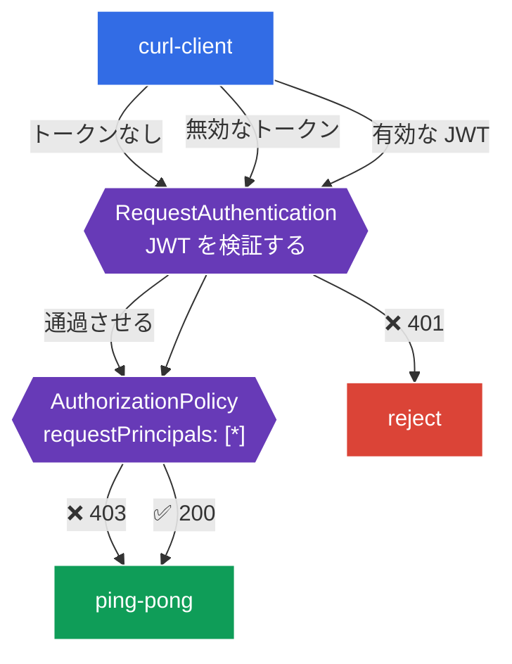

[Русская версия](README_RU.MD) · [Eng version](README.MD) · [Versión en español](README_ES.MD) · [Version française](README_FR.MD) · [Deutsche Version](README_DE.MD) · [ქართული ვერსია](README_GE.MD) · [繁體中文版](README_TW.MD)

# Lab 11 - エンドユーザー認証: RequestAuthentication + JWT

> [リファレンス解答](worker/files/solutions/1_JP.MD)

Lab 04 では、サービス間の**サービス**認証（mTLS、`PeerAuthentication`）を扱いました。しかし、もう 1 つの認証タイプである**エンドユーザー**（end-user）の認証があります。これは、リクエストが **JWT トークン**（たとえば Identity Provider（Auth0、Keycloak、Google など）によって発行されたもの）を含み、サービスがそのトークンを検証して内容に基づきユーザーを認可する場合です。

Istio はこれを 2 つのリソースで実現します。
- **RequestAuthentication** - JWT の**検証**を行います: 署名、発行者（`issuer`）、有効期限。重要な注意点は、これ単体ではトークンの存在を**要求しない**ことです。*無効な*トークンだけを拒否します（401）。トークンがまったくないリクエストは通過させます。
- `requestPrincipals` を持つ **AuthorizationPolicy** - 有効な JWT を**要求**します（そうでなければ 403）。トークンの claims に基づいて認可します。

この 2 つのリソースは常に組み合わせて機能します。`RequestAuthentication` が検証し、`AuthorizationPolicy` がトークンを要求して許可します。

### 仕組み（全体図）



## 目的

- 特定の発行者からの JWT を検証する `RequestAuthentication` を設定する。
- 無効なトークンが拒否される（`401`）ことを確認する。
- 有効な JWT を要求する `AuthorizationPolicy` を追加する: トークンなしでは `403`、有効なトークンでは `200`。

このラボでは、Istio リポジトリ内のテスト用キーとトークンを使用します。
- 発行者（`issuer`）: `testing@secure.istio.io`
- JWKS: `.../security/tools/jwt/samples/jwks.json`
- 有効なトークン: `.../security/tools/jwt/samples/demo.jwt`

## インフラストラクチャ

環境は Terragrunt を介して AWS（`eu-central-1`）にデプロイされ、次のコンポーネントで構成されています。

| コンポーネント  | 説明                                          |
|------------|---------------------------------------------------|
| `vpc`      | パブリックサブネットを持つ VPC `10.10.0.0/16`          |
| `ssh-keys` | ノードへのアクセス用 SSH キー                      |
| `k8s-1`    | Istio がインストールされた Kubernetes `1.35.2`（kubeadm） |
| `worker`   | `kubectl` とクラスターへのアクセスを備えたワーカーマシン   |

インスタンス: `t3.medium`（master）、Ubuntu `22.04`

## デプロイ

```bash
TASK=11 make run_ica_task
```

## ステップ 1. sidecar インジェクションの有効化

```bash
kubectl label namespace default istio-injection=enabled --overwrite
```

JWT の検証はサービスの sidecar 内の Envoy が行います。これがなければ `RequestAuthentication` は動作しません。

## ステップ 2. アプリケーションのインストール

```bash
kubectl apply -f https://raw.githubusercontent.com/ViktorUJ/cks/refs/heads/master/tasks/ica/labs/11/k8s-1/scripts/1.yaml
kubectl rollout restart deployment -n default
```

保護対象のバックエンド `ping-pong` と、トークンあり・なしのリクエストを送信する `curl-client` がデプロイされます。

基本確認（まだポリシーがないため、アクセスは開放されています）:

```bash
kubectl exec -n default deploy/curl-client -c curl -- \
  curl -s -o /dev/null -w "%{http_code}\n" http://ping-pong:8080/
```
```
200
```

## ステップ 3. RequestAuthentication - JWT を検証する

```bash
vim request-auth.yaml
```

```yaml
apiVersion: security.istio.io/v1
kind: RequestAuthentication
metadata:
  name: jwt-ping-pong
  namespace: default
spec:
  selector:
    matchLabels:
      app: ping-pong
  jwtRules:
  - issuer: "testing@secure.istio.io"
    jwksUri: "https://raw.githubusercontent.com/istio/istio/release-1.29/security/tools/jwt/samples/jwks.json"
```

```bash
kubectl apply -f request-auth.yaml
```

**解説:**
- **`selector`** - ポリシーは `ping-pong` Pod に適用されます（その sidecar がトークンを検証します）。
- **`jwtRules.issuer`** - 期待されるトークン発行者（JWT 内の `iss`）。
- **`jwksUri`** - 署名検証用の公開鍵を取得する場所。istiod が JWKS をダウンロードし、プロキシに配布します。

動作を確認します:

```bash
# 無効なトークン -> 拒否される
kubectl exec -n default deploy/curl-client -c curl -- \
  curl -s -o /dev/null -w "%{http_code}\n" -H "Authorization: Bearer bad-token" http://ping-pong:8080/
```
```
401
```

```bash
# トークンなし -> まだ通過する (RequestAuthentication はトークンを要求しない!)
kubectl exec -n default deploy/curl-client -c curl -- \
  curl -s -o /dev/null -w "%{http_code}\n" http://ping-pong:8080/
```
```
200
```

**重要な注意点:** `RequestAuthentication` は、トークンが存在する場合にのみ**検証**します。無効なトークン → `401`。ただし、**トークンなし**のリクエストは通過します（`200`）。トークンを必須にするには、次のステップの `AuthorizationPolicy` が必要です。

## ステップ 4. AuthorizationPolicy - 有効な JWT を要求する

```bash
vim require-jwt.yaml
```

```yaml
apiVersion: security.istio.io/v1
kind: AuthorizationPolicy
metadata:
  name: require-jwt
  namespace: default
spec:
  selector:
    matchLabels:
      app: ping-pong
  action: ALLOW
  rules:
  - from:
    - source:
        requestPrincipals: ["*"]   # 有効な JWT プリンシパルを持つ任意のリクエスト
```

```bash
kubectl apply -f require-jwt.yaml
```

**解説:**
- **`requestPrincipals: ["*"]`** - **有効な JWT プリンシパル**（形式は `<issuer>/<subject>`）を持つリクエストのみを許可します。トークンなしのリクエストにはプリンシパルがないため、拒否されます（`403`）。
- この連携は次のように機能します。`RequestAuthentication` が検証済みトークンからプリンシパルを設定し、`AuthorizationPolicy` がその存在を要求します。

## ステップ 5. 最終確認

```bash
TOKEN=$(curl -s https://raw.githubusercontent.com/istio/istio/release-1.29/security/tools/jwt/samples/demo.jwt)
```

```bash
# トークンなし -> 認可により拒否
kubectl exec -n default deploy/curl-client -c curl -- \
  curl -s -o /dev/null -w "%{http_code}\n" http://ping-pong:8080/
```
```
403
```

```bash
# 無効なトークン -> 検証により拒否
kubectl exec -n default deploy/curl-client -c curl -- \
  curl -s -o /dev/null -w "%{http_code}\n" -H "Authorization: Bearer bad-token" http://ping-pong:8080/
```
```
401
```

```bash
# 有効なトークン -> アクセスが許可される
kubectl exec -n default deploy/curl-client -c curl -- \
  curl -s -o /dev/null -w "%{http_code}\n" -H "Authorization: Bearer ${TOKEN}" http://ping-pong:8080/
```
```
200
```

## （任意）claim による認可

トークン内の特定の claim（たとえば `groups`）を `when` 条件で要求できます:

```yaml
  rules:
  - from:
    - source:
        requestPrincipals: ["*"]
    when:
    - key: request.auth.claims[groups]
      values: ["group1"]
```

この場合、JWT に `groups: group1` claim を持つユーザーだけがアクセスできます。

## まとめ

| リクエスト | RequestAuthentication | AuthorizationPolicy | 結果 |
|--------|----------------------|---------------------|------|
| トークンなし | 通過させる | プリンシパルなし → deny | **403** |
| 無効なトークン | 拒否する | - | **401** |
| 有効な JWT | 検証してプリンシパルを設定 | プリンシパルあり → allow | **200** |

**重要な結論:** Istio におけるエンドユーザー認証は、次の**一対**のリソースで構成されます。
- **RequestAuthentication** は「トークンはそもそも有効か?」（署名、発行者、有効期限）に答え、不正なトークンを拒否します（`401`）。
- **AuthorizationPolicy** は「トークンは必要か、何を許可するか?」に答えます。トークンを必須にし（トークンなしでは `403`）、claims に基づいて認可します。

どちらのリソースもインフラストラクチャレベルで機能するため、アプリケーションが JWT の解析や検証を行う必要はありません。