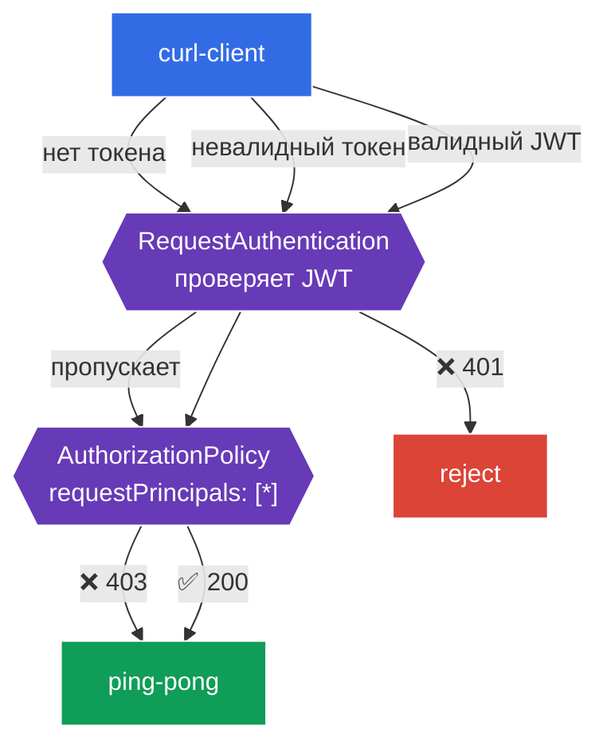

[Eng version](README.MD)

# Lab 11 — Аутентификация конечных пользователей: RequestAuthentication + JWT

В лабе 04 мы разбирали аутентификацию **сервисов** между собой (mTLS, `PeerAuthentication`). Но есть и второй тип аутентификации — **конечного пользователя** (end-user): когда запрос несёт **JWT-токен** (например, выданный вашим Identity Provider — Auth0, Keycloak, Google и т.д.), и сервис должен проверить этот токен и авторизовать пользователя по его содержимому.

Istio решает это двумя ресурсами:
- **RequestAuthentication** — **проверяет** JWT: подпись, издателя (`issuer`), срок действия. Важный нюанс: сам по себе он **не требует** наличия токена — он лишь отвергает *невалидные* токены (401). Запрос вообще без токена он пропускает.
- **AuthorizationPolicy** с `requestPrincipals` — **требует** валидный JWT (иначе 403) и авторизует по claims токена.

Эти два ресурса всегда работают в паре: `RequestAuthentication` проверяет, `AuthorizationPolicy` требует и разрешает.

### Как это работает (общая схема)



## Цель

- Настроить `RequestAuthentication` для проверки JWT от конкретного издателя.
- Убедиться, что невалидный токен отвергается (`401`).
- Добавить `AuthorizationPolicy`, требующую валидный JWT: без токена — `403`, с валидным — `200`.

В лабе используются тестовые ключи и токен из репозитория Istio:
- издатель (`issuer`): `testing@secure.istio.io`
- JWKS: `.../security/tools/jwt/samples/jwks.json`
- валидный токен: `.../security/tools/jwt/samples/demo.jwt`

## Шаг 1. Включение sidecar-инъекции

```bash
kubectl label namespace default istio-injection=enabled --overwrite
```

Проверку JWT выполняет Envoy в sidecar сервиса — без него `RequestAuthentication` работать не будет.

## Шаг 2. Установка приложения

```bash
kubectl apply -f https://raw.githubusercontent.com/ViktorUJ/cks/refs/heads/master/tasks/ica/labs/11/k8s-1/scripts/1.yaml
kubectl rollout restart deployment -n default
```

Разворачивается защищаемый бэкенд `ping-pong` и `curl-client`, с которого будем слать запросы с токеном и без.

Базовая проверка (пока без политик — доступ открыт):

```bash
kubectl exec -n default deploy/curl-client -c curl -- \
  curl -s -o /dev/null -w "%{http_code}\n" http://ping-pong:8080/
```
```
200
```

## Шаг 3. RequestAuthentication — проверяем JWT

```bash
vim request-auth.yaml
```

```yaml
apiVersion: security.istio.io/v1
kind: RequestAuthentication
metadata:
  name: jwt-ping-pong
  namespace: default
spec:
  selector:
    matchLabels:
      app: ping-pong
  jwtRules:
  - issuer: "testing@secure.istio.io"
    jwksUri: "https://raw.githubusercontent.com/istio/istio/release-1.29/security/tools/jwt/samples/jwks.json"
```

```bash
kubectl apply -f request-auth.yaml
```

**Разбор:**
- **`selector`** — политика применяется к подам `ping-pong` (их sidecar будет проверять токены).
- **`jwtRules.issuer`** — ожидаемый издатель токена (`iss` в JWT).
- **`jwksUri`** — откуда взять публичные ключи для проверки подписи. istiod скачивает JWKS и раздаёт прокси.

Проверяем поведение:

```bash
# невалидный токен -> отвергается
kubectl exec -n default deploy/curl-client -c curl -- \
  curl -s -o /dev/null -w "%{http_code}\n" -H "Authorization: Bearer bad-token" http://ping-pong:8080/
```
```
401
```

```bash
# БЕЗ токена -> всё ещё проходит (RequestAuthentication не требует токен!)
kubectl exec -n default deploy/curl-client -c curl -- \
  curl -s -o /dev/null -w "%{http_code}\n" http://ping-pong:8080/
```
```
200
```

**Ключевой нюанс:** `RequestAuthentication` только **проверяет** токен, если он есть. Невалидный токен → `401`. Но запрос **без токена** он пропускает (`200`). Чтобы сделать токен обязательным, нужен `AuthorizationPolicy` — следующий шаг.

## Шаг 4. AuthorizationPolicy — требуем валидный JWT

```bash
vim require-jwt.yaml
```

```yaml
apiVersion: security.istio.io/v1
kind: AuthorizationPolicy
metadata:
  name: require-jwt
  namespace: default
spec:
  selector:
    matchLabels:
      app: ping-pong
  action: ALLOW
  rules:
  - from:
    - source:
        requestPrincipals: ["*"]   # любой запрос с валидным JWT-принципалом
```

```bash
kubectl apply -f require-jwt.yaml
```

**Разбор:**
- **`requestPrincipals: ["*"]`** — разрешить только те запросы, у которых есть **валидный JWT-принципал** (формат `<issuer>/<subject>`). У запроса без токена принципала нет → он будет отклонён (`403`).
- Именно связка работает так: `RequestAuthentication` устанавливает принципал из проверенного токена, а `AuthorizationPolicy` требует его наличие.

## Шаг 5. Финальная проверка

```bash
TOKEN=$(curl -s https://raw.githubusercontent.com/istio/istio/release-1.29/security/tools/jwt/samples/demo.jwt)
```

```bash
# без токена -> запрещено авторизацией
kubectl exec -n default deploy/curl-client -c curl -- \
  curl -s -o /dev/null -w "%{http_code}\n" http://ping-pong:8080/
```
```
403
```

```bash
# невалидный токен -> отвергнут проверкой
kubectl exec -n default deploy/curl-client -c curl -- \
  curl -s -o /dev/null -w "%{http_code}\n" -H "Authorization: Bearer bad-token" http://ping-pong:8080/
```
```
401
```

```bash
# валидный токен -> доступ разрешён
kubectl exec -n default deploy/curl-client -c curl -- \
  curl -s -o /dev/null -w "%{http_code}\n" -H "Authorization: Bearer ${TOKEN}" http://ping-pong:8080/
```
```
200
```

## (опционально) Авторизация по claim

Можно требовать конкретный claim из токена (например, `groups`) через условие `when`:

```yaml
  rules:
  - from:
    - source:
        requestPrincipals: ["*"]
    when:
    - key: request.auth.claims[groups]
      values: ["group1"]
```

Тогда доступ получат только пользователи, у которых в JWT есть claim `groups: group1`.

## Итог

| Запрос | RequestAuthentication | AuthorizationPolicy | Итог |
|--------|----------------------|---------------------|------|
| без токена | пропускает | нет принципала → deny | **403** |
| невалидный токен | отвергает | — | **401** |
| валидный JWT | проверяет, ставит принципал | принципал есть → allow | **200** |

**Ключевой вывод:** аутентификация конечного пользователя в Istio — это **пара** ресурсов:
- **RequestAuthentication** отвечает на вопрос «токен вообще валидный?» (подпись, издатель, срок) и отвергает плохие токены (`401`);
- **AuthorizationPolicy** отвечает на вопрос «а нужен ли токен и что он разрешает?» — делает токен обязательным (`403` без него) и авторизует по claims.

Оба ресурса — на уровне инфраструктуры, приложение не занимается разбором и валидацией JWT.
