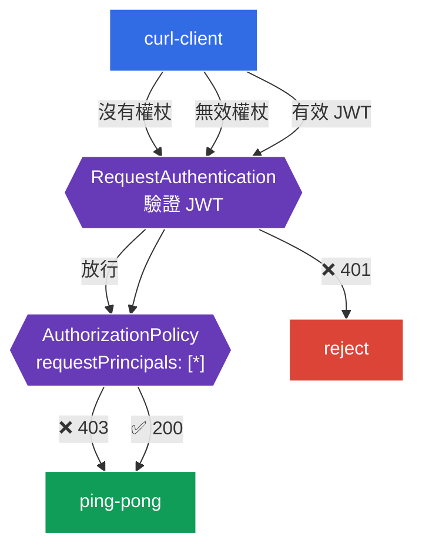

[Русская версия](README_RU.MD) · [Eng version](README.MD) · [Versión en español](README_ES.MD) · [Version française](README_FR.MD) · [Deutsche Version](README_DE.MD) · [ქართული ვერსია](README_GE.MD) · [日本語版](README_JP.MD)

# 實驗 11 - 終端使用者驗證：RequestAuthentication + JWT

> [參考解答](worker/files/solutions/1_TW.MD)

在實驗 04 中，我們探討了服務之間的**服務**驗證（mTLS、`PeerAuthentication`）。但還有第二種類型的驗證：**終端使用者**（end-user）驗證；此時請求會攜帶 **JWT 權杖**（例如由您的 Identity Provider - Auth0、Keycloak、Google 等簽發），而服務必須驗證此權杖並根據其內容授權使用者。

Istio 使用兩種資源解決此問題：
- **RequestAuthentication** - **驗證** JWT：簽章、簽發者（`issuer`）、到期時間。一項重要細節：它本身**不會要求**權杖存在--僅會拒絕*無效*權杖（401）。完全沒有權杖的請求則會放行。
- 搭配 `requestPrincipals` 的 **AuthorizationPolicy** - **要求**有效的 JWT（否則為 403），並依據權杖的 claims 授權。

這兩種資源總是成對運作：`RequestAuthentication` 驗證，`AuthorizationPolicy` 要求並允許。

### 運作方式（總體架構）



## 目標

- 設定 `RequestAuthentication`，以驗證來自特定簽發者的 JWT。
- 確認無效權杖遭拒絕（`401`）。
- 新增要求有效 JWT 的 `AuthorizationPolicy`：沒有權杖時為 `403`，使用有效權杖時為 `200`。

本實驗使用 Istio 儲存庫中的測試金鑰和權杖：
- 簽發者（`issuer`）：`testing@secure.istio.io`
- JWKS：`.../security/tools/jwt/samples/jwks.json`
- 有效權杖：`.../security/tools/jwt/samples/demo.jwt`

## 基礎設施

環境透過 Terragrunt 部署於 AWS（`eu-central-1`），並由以下項目組成：

| 元件  | 說明                                          |
|------------|---------------------------------------------------|
| `vpc`      | 具備公有子網路的 VPC `10.10.0.0/16`          |
| `ssh-keys` | 用於存取節點的 SSH 金鑰                      |
| `k8s-1`    | 已安裝 Istio 的 Kubernetes `1.35.2`（kubeadm） |
| `worker`   | 具備 `kubectl` 並可存取叢集的工作機器   |

執行個體：`t3.medium`（master），Ubuntu `22.04`

## 部署

```bash
TASK=11 make run_ica_task
```

## 步驟 1. 啟用 sidecar 注入

```bash
kubectl label namespace default istio-injection=enabled --overwrite
```

JWT 驗證由服務 sidecar 中的 Envoy 執行--沒有它，`RequestAuthentication` 將無法運作。

## 步驟 2. 安裝應用程式

```bash
kubectl apply -f https://raw.githubusercontent.com/ViktorUJ/cks/refs/heads/master/tasks/ica/labs/11/k8s-1/scripts/1.yaml
kubectl rollout restart deployment -n default
```

這會部署受保護的後端 `ping-pong` 與 `curl-client`；我們將從後者發送包含與不包含權杖的請求。

基本驗證（目前尚未套用政策--存取開放）：

```bash
kubectl exec -n default deploy/curl-client -c curl -- \
  curl -s -o /dev/null -w "%{http_code}\n" http://ping-pong:8080/
```
```
200
```

## 步驟 3. RequestAuthentication - 驗證 JWT

```bash
vim request-auth.yaml
```

```yaml
apiVersion: security.istio.io/v1
kind: RequestAuthentication
metadata:
  name: jwt-ping-pong
  namespace: default
spec:
  selector:
    matchLabels:
      app: ping-pong
  jwtRules:
  - issuer: "testing@secure.istio.io"
    jwksUri: "https://raw.githubusercontent.com/istio/istio/release-1.29/security/tools/jwt/samples/jwks.json"
```

```bash
kubectl apply -f request-auth.yaml
```

**說明：**
- **`selector`** - 政策套用到 `ping-pong` Pod（其 sidecar 將驗證權杖）。
- **`jwtRules.issuer`** - 預期的權杖簽發者（JWT 中的 `iss`）。
- **`jwksUri`** - 取得用於驗證簽章之公開金鑰的位置。istiod 會下載 JWKS 並將其發送給 proxy。

驗證行為：

```bash
# 無效的 token -> 被拒絕
kubectl exec -n default deploy/curl-client -c curl -- \
  curl -s -o /dev/null -w "%{http_code}\n" -H "Authorization: Bearer bad-token" http://ping-pong:8080/
```
```
401
```

```bash
# 沒有 token -> 仍然通過 (RequestAuthentication 不強制要求 token！)
kubectl exec -n default deploy/curl-client -c curl -- \
  curl -s -o /dev/null -w "%{http_code}\n" http://ping-pong:8080/
```
```
200
```

**關鍵細節：**`RequestAuthentication` 只會在權杖存在時**驗證**它。無效權杖 → `401`；但**沒有權杖**的請求會被放行（`200`）。若要強制要求權杖，必須使用 `AuthorizationPolicy`--下一步將介紹。

## 步驟 4. AuthorizationPolicy - 要求有效的 JWT

```bash
vim require-jwt.yaml
```

```yaml
apiVersion: security.istio.io/v1
kind: AuthorizationPolicy
metadata:
  name: require-jwt
  namespace: default
spec:
  selector:
    matchLabels:
      app: ping-pong
  action: ALLOW
  rules:
  - from:
    - source:
        requestPrincipals: ["*"]   # 任何帶有有效 JWT principal 的請求
```

```bash
kubectl apply -f require-jwt.yaml
```

**說明：**
- **`requestPrincipals: ["*"]`** - 僅允許具有**有效 JWT principal** 的請求（格式為 `<issuer>/<subject>`）。沒有權杖的請求不具有 principal → 會被拒絕（`403`）。
- 正是這個組合的運作方式：`RequestAuthentication` 從已驗證的權杖設定 principal，而 `AuthorizationPolicy` 要求它存在。

## 步驟 5. 最終驗證

```bash
TOKEN=$(curl -s https://raw.githubusercontent.com/istio/istio/release-1.29/security/tools/jwt/samples/demo.jwt)
```

```bash
# 沒有 token -> 被授權機制拒絕
kubectl exec -n default deploy/curl-client -c curl -- \
  curl -s -o /dev/null -w "%{http_code}\n" http://ping-pong:8080/
```
```
403
```

```bash
# 無效的 token -> 被檢查拒絕
kubectl exec -n default deploy/curl-client -c curl -- \
  curl -s -o /dev/null -w "%{http_code}\n" -H "Authorization: Bearer bad-token" http://ping-pong:8080/
```
```
401
```

```bash
# 有效的 token -> 允許存取
kubectl exec -n default deploy/curl-client -c curl -- \
  curl -s -o /dev/null -w "%{http_code}\n" -H "Authorization: Bearer ${TOKEN}" http://ping-pong:8080/
```
```
200
```

## （選用）依 claim 授權

可透過 `when` 條件要求權杖中具有特定 claim（例如 `groups`）：

```yaml
  rules:
  - from:
    - source:
        requestPrincipals: ["*"]
    when:
    - key: request.auth.claims[groups]
      values: ["group1"]
```

如此一來，只有 JWT 中具有 `groups: group1` claim 的使用者才能存取。

## 總結

| 請求 | RequestAuthentication | AuthorizationPolicy | 結果 |
|--------|----------------------|---------------------|------|
| 沒有權杖 | 放行 | 沒有 principal → deny | **403** |
| 無效權杖 | 拒絕 | - | **401** |
| 有效 JWT | 驗證並設定 principal | 存在 principal → allow | **200** |

**關鍵結論：**Istio 中的終端使用者驗證是由一**對**資源組成：
- **RequestAuthentication** 回答「權杖本身是否有效？」（簽章、簽發者、期限），並拒絕不良權杖（`401`）；
- **AuthorizationPolicy** 回答「是否需要權杖，以及它允許什麼？」--使權杖成為必要條件（沒有權杖時為 `403`），並根據 claims 授權。

兩種資源皆位於基礎設施層級，應用程式無須自行剖析及驗證 JWT。