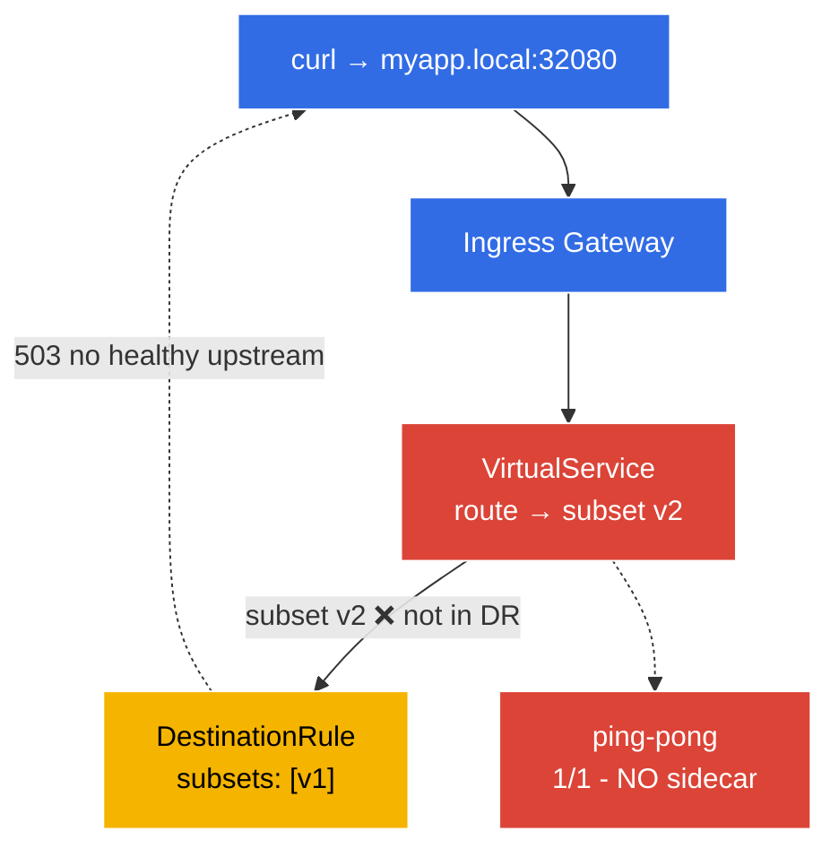

[RU version](README_RU.MD) · [Versión en español](README_ES.MD)

# Lab 12 - Troubleshooting: Diagnose and Fix Istio

The ICA exam has a dedicated **troubleshooting** domain: you're handed a broken environment and must quickly find the root cause and fix it. In this lab the environment is already deployed **in a broken state** - the application doesn't work. Your job is to use the `istioctl` tools to find both configuration bugs and fix them.

Key diagnostic tools:
- **`istioctl analyze`** - a static configuration analyzer. It catches common problems (missing injection, dangling subset/gateway references, conflicting policies) before any traffic is sent.
- **`istioctl proxy-status`** - the sync state of every Envoy proxy against istiod (`SYNCED` / `STALE`).
- **`istioctl proxy-config`** - what's actually in a given Envoy's config: `routes`, `clusters`, `endpoints`, `listeners`.

### What's Broken



The environment ships with **two bugs**:
- **Bug 1** - namespace `default` is not enabled for injection → the `ping-pong` pod is `1/1` (no sidecar, not in the mesh).
- **Bug 2** - the `VirtualService` routes to subset `v2`, which the `DestinationRule` does not define (only `v1`) → requests through the gateway return `503`.

## Objective

Find both bugs with `istioctl` and fix them so that:
- the `ping-pong` pod is `2/2` (sidecar injected);
- `curl http://myapp.local:32080/` returns `200`.

## Step 1. Look Around - What's Wrong

Start with the symptoms:

```bash
kubectl get pods -n default
```
```
NAME              READY   STATUS    RESTARTS   AGE
ping-pong-xxxx    1/1     Running   0          5m     # expected 2/2 - no sidecar!
```

```bash
curl -s -o /dev/null -w "%{http_code}\n" http://myapp.local:32080/
```
```
503                                                    # app is unreachable
```

Two symptoms: a pod with no sidecar, and `503` through the gateway.

## Step 2. `istioctl analyze` - Static Analysis

The first-line tool is the configuration analyzer:

```bash
istioctl analyze -n default
```

It reports something like:
```
Warning [IST0102] (Namespace default) The namespace is not enabled for Istio injection...
Error   [IST0101] (VirtualService ping-pong-vs) Referenced host+subset in destination is not found: "ping-pong+v2"
```

Both bugs show up immediately: **injection is not enabled** and a **reference to a non-existent subset**.

## Step 3. `proxy-status` and `proxy-config` - Deeper into Envoy

Check proxy sync with istiod:

```bash
istioctl proxy-status
```
All proxies should be `SYNCED`. (A `STALE` proxy would mean istiod failed to push the config.)

See what the ingress-gateway Envoy knows about the `ping-pong` cluster:

```bash
GW=$(kubectl -n istio-system get pod -l istio=ingressgateway -o jsonpath='{.items[0].metadata.name}')
istioctl proxy-config clusters "$GW.istio-system" | grep ping-pong
istioctl proxy-config routes   "$GW.istio-system" | grep -i myapp
```

The cluster for subset `v2` will have no endpoints (`no healthy upstream`) - direct confirmation of Bug 2.

## Step 4. Fix Bug 1 - Enable Injection

```bash
kubectl label namespace default istio-injection=enabled --overwrite
kubectl rollout restart deployment ping-pong -n default
kubectl get pods -n default
```
```
NAME              READY   STATUS    RESTARTS   AGE
ping-pong-yyyy    2/2     Running   0          20s    # sidecar is now present
```

## Step 5. Fix Bug 2 - Point the VirtualService at an Existing Subset

The DestinationRule defines only subset `v1`, but the VirtualService sends to `v2`. Route it to the existing subset:

```bash
kubectl patch virtualservice ping-pong-vs -n default --type=json \
  -p='[{"op":"replace","path":"/spec/http/0/route/0/destination/subset","value":"v1"}]'
```

(Alternatively `kubectl edit vs ping-pong-vs` and change `subset: v2` → `subset: v1`; or add a `v2` subset to the DestinationRule - depending on the intended behaviour.)

## Step 6. Verify

Re-run the analysis and the request:

```bash
istioctl analyze -n default
```
```
✔ No validation issues found when analyzing namespace: default.
```

```bash
curl -s -o /dev/null -w "%{http_code}\n" http://myapp.local:32080/
```
```
200
```

```bash
kubectl get pods -n default          # 2/2
```

Both bugs are fixed: the app is in the mesh (sidecar) and reachable through the gateway.

## Summary

| Tool | Purpose | What it found |
|------|---------|---------------|
| `istioctl analyze` | static config analysis | missing injection (IST0102) + dangling subset |
| `istioctl proxy-status` | proxy sync with istiod | all `SYNCED` |
| `istioctl proxy-config` | actual Envoy config (routes/clusters/endpoints) | v2 cluster has no endpoints |

**Key takeaway:** an Istio troubleshooting methodology:
1. **`istioctl analyze`** - almost always the first step; catches most config errors statically.
2. **`istioctl proxy-status`** - confirm istiod pushed config to all proxies (no `STALE`).
3. **`istioctl proxy-config`** - if analyze is clean but traffic still fails, inspect the actual Envoy config (routes → clusters → endpoints) to see where the request really goes (or doesn't).

The two most common classes of problems are **missing sidecars** (namespace not labelled / pod created before the label) and **dangling references** (VirtualService → non-existent subset/gateway). Both are caught by `istioctl analyze` in seconds.
