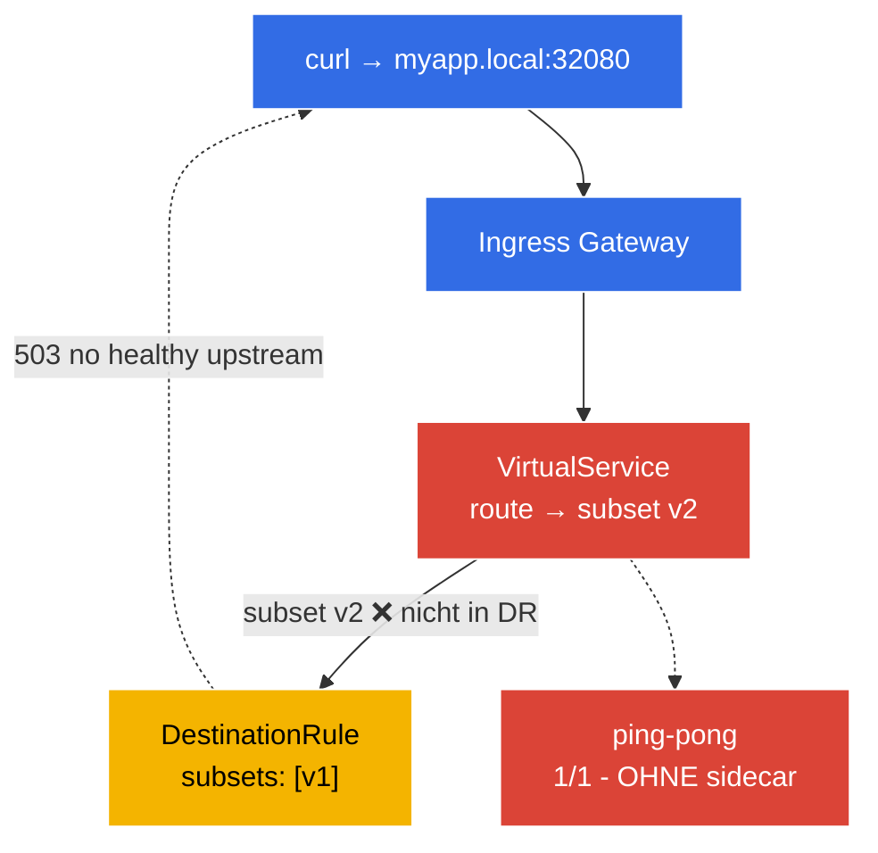

[RU version](README_RU.MD) · [Eng version](README.MD) · [Versión en español](README_ES.MD) · [Version française](README_FR.MD)

# Lab 12 - Troubleshooting: Diagnose und Reparatur von Istio

In der ICA-Prüfung gibt es eine eigene Domäne - **Troubleshooting**: Ihnen wird eine kaputte Umgebung gegeben, und Sie müssen schnell die Ursache finden und beheben. In diesem Lab ist die Umgebung bereits **in einem kaputten Zustand** bereitgestellt - die Anwendung funktioniert nicht. Ihre Aufgabe ist es, mithilfe der Werkzeuge von `istioctl` beide Konfigurationsfehler zu finden und zu beseitigen.

Wichtige Diagnosewerkzeuge:
- **`istioctl analyze`** - statischer Konfigurationsanalysator. Findet typische Probleme (keine Injektion, kaputte Verweise auf subset/gateway, Konfliktrichtlinien) noch bevor Traffic gesendet wird.
- **`istioctl proxy-status`** - Synchronisationsstatus aller Envoy-Proxys mit istiod (`SYNCED` / `STALE`).
- **`istioctl proxy-config`** - was tatsächlich in der Konfiguration eines bestimmten Envoy liegt: `routes`, `clusters`, `endpoints`, `listeners`.

### Was kaputt ist



In der Umgebung sind **zwei Bugs** eingebaut:
- **Bug 1** - der Namespace `default` ist nicht für die Injektion gekennzeichnet → der Pod `ping-pong` ist als `1/1` gestartet (ohne Sidecar, außerhalb des Mesh).
- **Bug 2** - der `VirtualService` routet auf das Subset `v2`, das in der `DestinationRule` nicht existiert (dort gibt es nur `v1`) → Anfragen über das Gateway geben `503` zurück.

## Ziel

Beide Fehler mithilfe von `istioctl` finden und so beheben, dass:
- der Pod `ping-pong` `2/2` ist (Sidecar injiziert);
- die Anfrage `curl http://myapp.local:32080/` `200` zurückgibt.

## Infrastruktur

Die Umgebung wird in AWS (`eu-central-1`) über Terragrunt bereitgestellt und besteht aus:

| Komponente  | Beschreibung                                      |
|------------|---------------------------------------------------|
| `vpc`      | VPC `10.10.0.0/16` mit öffentlichen Subnetzen          |
| `ssh-keys` | SSH-Schlüssel für den Zugriff auf die Nodes                      |
| `k8s-1`    | Kubernetes `1.35.2` (kubeadm) mit installiertem Istio |
| `worker`   | Arbeitsmaschine mit `kubectl` und Zugriff auf den Cluster   |

Instanzen: `t3.medium` (master) Ubuntu `22.04`

## Deployment

```bash
TASK=12 make run_ica_task
```

## Schritt 1. Inspektion - was überhaupt nicht stimmt

Zuerst betrachten wir die Symptome:

```bash
kubectl get pods -n default
```
```
NAME              READY   STATUS    RESTARTS   AGE
ping-pong-xxxx    1/1     Running   0          5m     # erwartet 2/2 - kein Sidecar!
```

```bash
curl -s -o /dev/null -w "%{http_code}\n" http://myapp.local:32080/
```
```
503                                                    # Anwendung nicht erreichbar
```

Zwei Symptome: Pod ohne Sidecar und `503` über das Gateway.

## Schritt 2. `istioctl analyze` - statische Analyse

Das wichtigste Werkzeug der ersten Linie ist der Konfigurationsanalysator:

```bash
istioctl analyze -n default
```

Er meldet in etwa Folgendes:
```
Warning [IST0102] (Namespace default) The namespace is not enabled for Istio injection...
Error   [IST0101] (VirtualService ping-pong-vs) Referenced host+subset in destination is not found: "ping-pong+v2"
```

Beide Bugs sind sofort sichtbar: **Injektion nicht aktiviert** und **Verweis auf ein nicht existierendes Subset**.

## Schritt 3. `proxy-status` und `proxy-config` - tiefer in Envoy

Wir prüfen die Synchronisation der Proxys mit istiod:

```bash
istioctl proxy-status
```
Alle Proxys sollten `SYNCED` sein. (Wäre einer `STALE` - hätte istiod die Konfiguration nicht verteilen können.)

Wir schauen, was der Envoy des Ingress-Gateways über unseren Cluster `ping-pong` sieht:

```bash
GW=$(kubectl -n istio-system get pod -l istio=ingressgateway -o jsonpath='{.items[0].metadata.name}')
istioctl proxy-config clusters "$GW.istio-system" | grep ping-pong
istioctl proxy-config routes   "$GW.istio-system" | grep -i myapp
```

Der Cluster für das Subset `v2` ist ohne Endpoints (`no healthy upstream`) - eine direkte Bestätigung von Bug 2.

## Schritt 4. Wir reparieren Bug 1 - Injektion aktivieren

```bash
kubectl label namespace default istio-injection=enabled --overwrite
kubectl rollout restart deployment ping-pong -n default
kubectl get pods -n default
```
```
NAME              READY   STATUS    RESTARTS   AGE
ping-pong-yyyy    2/2     Running   0          20s    # jetzt ist der Sidecar da
```

## Schritt 5. Wir reparieren Bug 2 - Subset im VirtualService korrigieren

Die DestinationRule definiert nur das Subset `v1`, der VirtualService sendet aber auf `v2`. Wir passen die Route auf das existierende Subset an:

```bash
kubectl patch virtualservice ping-pong-vs -n default --type=json \
  -p='[{"op":"replace","path":"/spec/http/0/route/0/destination/subset","value":"v1"}]'
```

(Analog kann man `kubectl edit vs ping-pong-vs` verwenden und `subset: v2` → `subset: v1` ersetzen, oder umgekehrt das Subset `v2` in die DestinationRule aufnehmen - je nachdem, welches Verhalten beabsichtigt ist.)

## Schritt 6. Prüfung

Wir wiederholen die Analyse und die Anfrage:

```bash
istioctl analyze -n default
```
```
✔ No validation issues found when analyzing namespace: default.
```

```bash
curl -s -o /dev/null -w "%{http_code}\n" http://myapp.local:32080/
```
```
200
```

```bash
kubectl get pods -n default          # 2/2
```

Beide Bugs sind beseitigt: Die Anwendung ist im Mesh (Sidecar) und über das Gateway erreichbar.

## Fazit

| Werkzeug | Wofür | Was wir gefunden haben |
|-----------|----------|-----------|
| `istioctl analyze` | statische Konfigurationsanalyse | keine Injektion (IST0102) + kaputtes Subset |
| `istioctl proxy-status` | Synchronisation der Proxys mit istiod | alle `SYNCED` |
| `istioctl proxy-config` | reale Envoy-Konfiguration (routes/clusters/endpoints) | Cluster v2 ohne Endpoints |

**Zentrale Erkenntnis:** die Diagnose-Methodik für Istio:
1. **`istioctl analyze`** - fast immer der erste Schritt; fängt die meisten Konfigurationsfehler statisch ab.
2. **`istioctl proxy-status`** - sicherstellen, dass istiod die Konfiguration an alle Proxys verteilt hat (kein `STALE`).
3. **`istioctl proxy-config`** - wenn analyze „sauber" ist, aber kein Traffic fließt, betrachten wir die tatsächliche Envoy-Konfiguration (routes → clusters → endpoints), um zu verstehen, wohin die Anfrage tatsächlich geht (oder nicht geht).

Die zwei häufigsten Problemklassen sind das **Fehlen eines Sidecars** (Namespace nicht gekennzeichnet / Pod vor dem Label erstellt) und **kaputte Verweise** (VirtualService → nicht existierendes subset/gateway). Beide werden von `istioctl analyze` in Sekunden gefangen.
