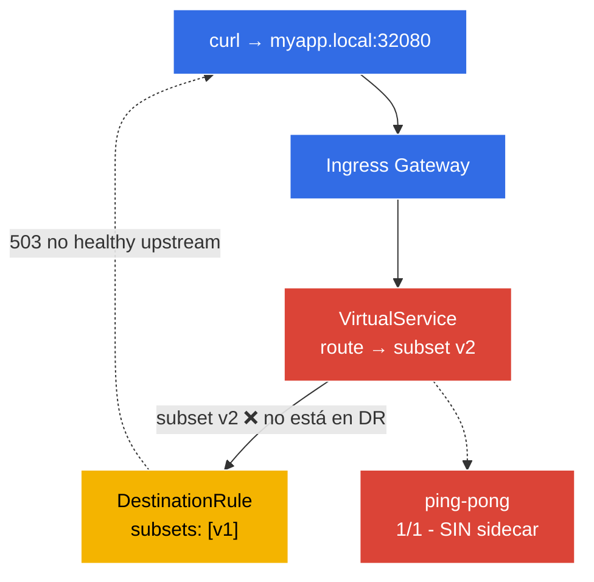

[RU version](README_RU.MD) · [Eng version](README.MD)

# Lab 12 - Troubleshooting: diagnóstico y reparación de Istio

En el examen ICA hay un dominio propio - **troubleshooting**: te dan un entorno roto y hay que encontrar rápidamente la causa y arreglarlo. En este lab el entorno ya está desplegado **en estado roto** - la aplicación no funciona. Tu tarea es, con las herramientas `istioctl`, encontrar ambos errores de configuración y resolverlos.

Herramientas clave de diagnóstico:
- **`istioctl analyze`** - analizador estático de la configuración. Encuentra problemas típicos (falta de inyección, referencias rotas a subset/gateway, conflictos de políticas) incluso antes de enviar tráfico.
- **`istioctl proxy-status`** - estado de sincronización de todos los proxies Envoy con istiod (`SYNCED` / `STALE`).
- **`istioctl proxy-config`** - qué hay realmente en la configuración de un Envoy concreto: `routes`, `clusters`, `endpoints`, `listeners`.

### Qué está roto



En el entorno hay **dos bugs** incorporados:
- **Bug 1** - el namespace `default` no está marcado para la inyección → el pod `ping-pong` arrancó como `1/1` (sin sidecar, fuera del mesh).
- **Bug 2** - el `VirtualService` enruta al subset `v2`, que no existe en el `DestinationRule` (allí solo hay `v1`) → las peticiones a través del gateway devuelven `503`.

## Objetivo

Encontrar ambos errores con `istioctl` y arreglarlos de modo que:
- el pod `ping-pong` sea `2/2` (sidecar inyectado);
- la petición `curl http://myapp.local:32080/` devuelva `200`.

## Paso 1. Inspección - qué es lo que falla

Primero veamos los síntomas:

```bash
kubectl get pods -n default
```
```
NAME              READY   STATUS    RESTARTS   AGE
ping-pong-xxxx    1/1     Running   0          5m     # esperábamos 2/2 - ¡no hay sidecar!
```

```bash
curl -s -o /dev/null -w "%{http_code}\n" http://myapp.local:32080/
```
```
503                                                    # la aplicación no está disponible
```

Dos síntomas: un pod sin sidecar y un `503` a través del gateway.

## Paso 2. `istioctl analyze` - análisis estático

La herramienta principal de primera línea es el analizador de configuración:

```bash
istioctl analyze -n default
```

Informará aproximadamente lo siguiente:
```
Warning [IST0102] (Namespace default) The namespace is not enabled for Istio injection...
Error   [IST0101] (VirtualService ping-pong-vs) Referenced host+subset in destination is not found: "ping-pong+v2"
```

Ambos bugs se ven de inmediato: **la inyección no está activada** y **una referencia a un subset inexistente**.

## Paso 3. `proxy-status` y `proxy-config` - más a fondo en Envoy

Comprobemos la sincronización de los proxies con istiod:

```bash
istioctl proxy-status
```
Todos los proxies deben estar `SYNCED`. (Si estuvieran `STALE`, istiod no habría podido distribuir la configuración.)

Veamos qué ve el Envoy del ingress-gateway sobre nuestro clúster `ping-pong`:

```bash
GW=$(kubectl -n istio-system get pod -l istio=ingressgateway -o jsonpath='{.items[0].metadata.name}')
istioctl proxy-config clusters "$GW.istio-system" | grep ping-pong
istioctl proxy-config routes   "$GW.istio-system" | grep -i myapp
```

El clúster para el subset `v2` estará sin endpoints (`no healthy upstream`) - confirmación directa del bug 2.

## Paso 4. Arreglamos el Bug 1 - activamos la inyección

```bash
kubectl label namespace default istio-injection=enabled --overwrite
kubectl rollout restart deployment ping-pong -n default
kubectl get pods -n default
```
```
NAME              READY   STATUS    RESTARTS   AGE
ping-pong-yyyy    2/2     Running   0          20s    # ahora el sidecar está en su lugar
```

## Paso 5. Arreglamos el Bug 2 - corregimos el subset en el VirtualService

El DestinationRule define solo el subset `v1`, mientras que el VirtualService envía a `v2`. Ajustamos la ruta al subset existente:

```bash
kubectl patch virtualservice ping-pong-vs -n default --type=json \
  -p='[{"op":"replace","path":"/spec/http/0/route/0/destination/subset","value":"v1"}]'
```

(De forma análoga se puede hacer `kubectl edit vs ping-pong-vs` y reemplazar `subset: v2` → `subset: v1`, o, al contrario, añadir el subset `v2` al DestinationRule - depende del comportamiento que se haya diseñado.)

## Paso 6. Comprobación

Repetimos el análisis y la petición:

```bash
istioctl analyze -n default
```
```
✔ No validation issues found when analyzing namespace: default.
```

```bash
curl -s -o /dev/null -w "%{http_code}\n" http://myapp.local:32080/
```
```
200
```

```bash
kubectl get pods -n default          # 2/2
```

Ambos bugs resueltos: la aplicación está en el mesh (sidecar) y accesible a través del gateway.

## Resumen

| Herramienta | Para qué | Qué encontramos |
|-----------|----------|-----------|
| `istioctl analyze` | análisis estático de la configuración | falta de inyección (IST0102) + subset roto |
| `istioctl proxy-status` | sincronización de los proxies con istiod | todos `SYNCED` |
| `istioctl proxy-config` | configuración real de Envoy (routes/clusters/endpoints) | clúster v2 sin endpoints |

**Conclusión clave:** metodología de diagnóstico de Istio:
1. **`istioctl analyze`** - casi siempre el primer paso; detecta la mayoría de los errores de configuración de forma estática.
2. **`istioctl proxy-status`** - asegurarse de que istiod distribuyó la configuración a todos los proxies (sin `STALE`).
3. **`istioctl proxy-config`** - si analyze está «limpio» pero el tráfico no fluye, miramos la configuración real de Envoy (routes → clusters → endpoints) para entender a dónde va (o no va) realmente la petición.

Las dos clases de problemas más frecuentes son la **ausencia de sidecar** (namespace no marcado / pod creado antes de la etiqueta) y las **referencias rotas** (VirtualService → subset/gateway inexistente). Ambas las detecta `istioctl analyze` en segundos.
