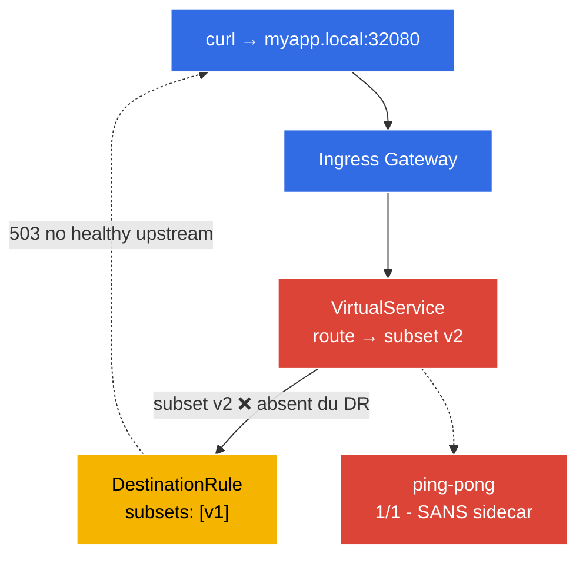

[RU version](README_RU.MD) · [Eng version](README.MD) · [Versión en español](README_ES.MD) · [Deutsche Version](README_DE.MD)

# Lab 12 - Troubleshooting : diagnostic et réparation d'Istio

L'examen ICA comporte un domaine à part entière - le **troubleshooting** : on vous donne un environnement cassé, et il faut rapidement en trouver la cause et le réparer. Dans ce lab, l'environnement est déjà déployé **dans un état cassé** - l'application ne fonctionne pas. Votre mission : à l'aide des outils `istioctl`, trouver les deux erreurs de configuration et les corriger.

Les outils de diagnostic clés :
- **`istioctl analyze`** - analyseur statique de configuration. Il détecte les problèmes typiques (pas d'injection, références cassées vers un subset/gateway, conflits de politiques) avant même d'envoyer du trafic.
- **`istioctl proxy-status`** - état de synchronisation de tous les proxies Envoy avec istiod (`SYNCED` / `STALE`).
- **`istioctl proxy-config`** - ce qui se trouve réellement dans la config d'un Envoy donné : `routes`, `clusters`, `endpoints`, `listeners`.

### Ce qui est cassé



Deux **bugs** sont intégrés dans l'environnement :
- **Bug 1** - le namespace `default` n'est pas marqué pour l'injection → le pod `ping-pong` a démarré en `1/1` (sans sidecar, hors du maillage).
- **Bug 2** - le `VirtualService` route vers le subset `v2`, qui n'existe pas dans le `DestinationRule` (il n'y a que `v1`) → les requêtes via le gateway renvoient un `503`.

## Objectif

Trouver les deux erreurs à l'aide d'`istioctl` et les corriger de sorte que :
- le pod `ping-pong` soit `2/2` (sidecar injecté) ;
- la requête `curl http://myapp.local:32080/` renvoie `200`.

## Étape 1. Inspection - qu'est-ce qui ne va pas

D'abord, regardons les symptômes :

```bash
kubectl get pods -n default
```
```
NAME              READY   STATUS    RESTARTS   AGE
ping-pong-xxxx    1/1     Running   0          5m     # on attendait 2/2 - pas de sidecar !
```

```bash
curl -s -o /dev/null -w "%{http_code}\n" http://myapp.local:32080/
```
```
503                                                    # l'application est indisponible
```

Deux symptômes : un pod sans sidecar et un `503` via le gateway.

## Étape 2. `istioctl analyze` - analyse statique

L'outil principal de première ligne est l'analyseur de configuration :

```bash
istioctl analyze -n default
```

Il indiquera à peu près ceci :
```
Warning [IST0102] (Namespace default) The namespace is not enabled for Istio injection...
Error   [IST0101] (VirtualService ping-pong-vs) Referenced host+subset in destination is not found: "ping-pong+v2"
```

Les deux bugs sont visibles d'emblée : **injection non activée** et **référence vers un subset inexistant**.

## Étape 3. `proxy-status` et `proxy-config` - plus profond dans Envoy

Vérifions la synchronisation des proxies avec istiod :

```bash
istioctl proxy-status
```
Tous les proxies doivent être `SYNCED`. (Si l'un était `STALE`, istiod n'aurait pas pu distribuer la config.)

Regardons ce que voit l'Envoy de l'ingress-gateway au sujet de notre cluster `ping-pong` :

```bash
GW=$(kubectl -n istio-system get pod -l istio=ingressgateway -o jsonpath='{.items[0].metadata.name}')
istioctl proxy-config clusters "$GW.istio-system" | grep ping-pong
istioctl proxy-config routes   "$GW.istio-system" | grep -i myapp
```

Le cluster du subset `v2` sera sans endpoints (`no healthy upstream`) - confirmation directe du bug 2.

## Étape 4. On répare le Bug 1 - activer l'injection

```bash
kubectl label namespace default istio-injection=enabled --overwrite
kubectl rollout restart deployment ping-pong -n default
kubectl get pods -n default
```
```
NAME              READY   STATUS    RESTARTS   AGE
ping-pong-yyyy    2/2     Running   0          20s    # maintenant le sidecar est en place
```

## Étape 5. On répare le Bug 2 - corriger le subset dans le VirtualService

Le DestinationRule ne définit que le subset `v1`, alors que le VirtualService envoie vers `v2`. On aligne la route sur le subset existant :

```bash
kubectl patch virtualservice ping-pong-vs -n default --type=json \
  -p='[{"op":"replace","path":"/spec/http/0/route/0/destination/subset","value":"v1"}]'
```

(On peut aussi faire `kubectl edit vs ping-pong-vs` et remplacer `subset: v2` → `subset: v1`, ou, à l'inverse, ajouter le subset `v2` dans le DestinationRule - selon le comportement souhaité.)

## Étape 6. Vérification

On répète l'analyse et la requête :

```bash
istioctl analyze -n default
```
```
✔ No validation issues found when analyzing namespace: default.
```

```bash
curl -s -o /dev/null -w "%{http_code}\n" http://myapp.local:32080/
```
```
200
```

```bash
kubectl get pods -n default          # 2/2
```

Les deux bugs sont corrigés : l'application est dans le maillage (sidecar) et accessible via le gateway.

## Bilan

| Outil | À quoi il sert | Ce qu'on a trouvé |
|-----------|----------|-----------|
| `istioctl analyze` | analyse statique de la configuration | pas d'injection (IST0102) + subset cassé |
| `istioctl proxy-status` | synchronisation des proxies avec istiod | tous `SYNCED` |
| `istioctl proxy-config` | config réelle d'Envoy (routes/clusters/endpoints) | cluster v2 sans endpoints |

**À retenir :** la méthode de diagnostic d'Istio :
1. **`istioctl analyze`** - presque toujours la première étape ; il attrape la plupart des erreurs de configuration par analyse statique.
2. **`istioctl proxy-status`** - s'assurer qu'istiod a distribué la config à tous les proxies (pas de `STALE`).
3. **`istioctl proxy-config`** - si analyze est « propre » mais que le trafic ne passe pas, on regarde la config effective d'Envoy (routes → clusters → endpoints) pour comprendre où part réellement (ou ne part pas) la requête.

Les deux classes de problèmes les plus fréquentes sont l'**absence de sidecar** (namespace non marqué / pod créé avant le label) et les **références cassées** (VirtualService → subset/gateway inexistant). Les deux sont attrapées par `istioctl analyze` en quelques secondes.
