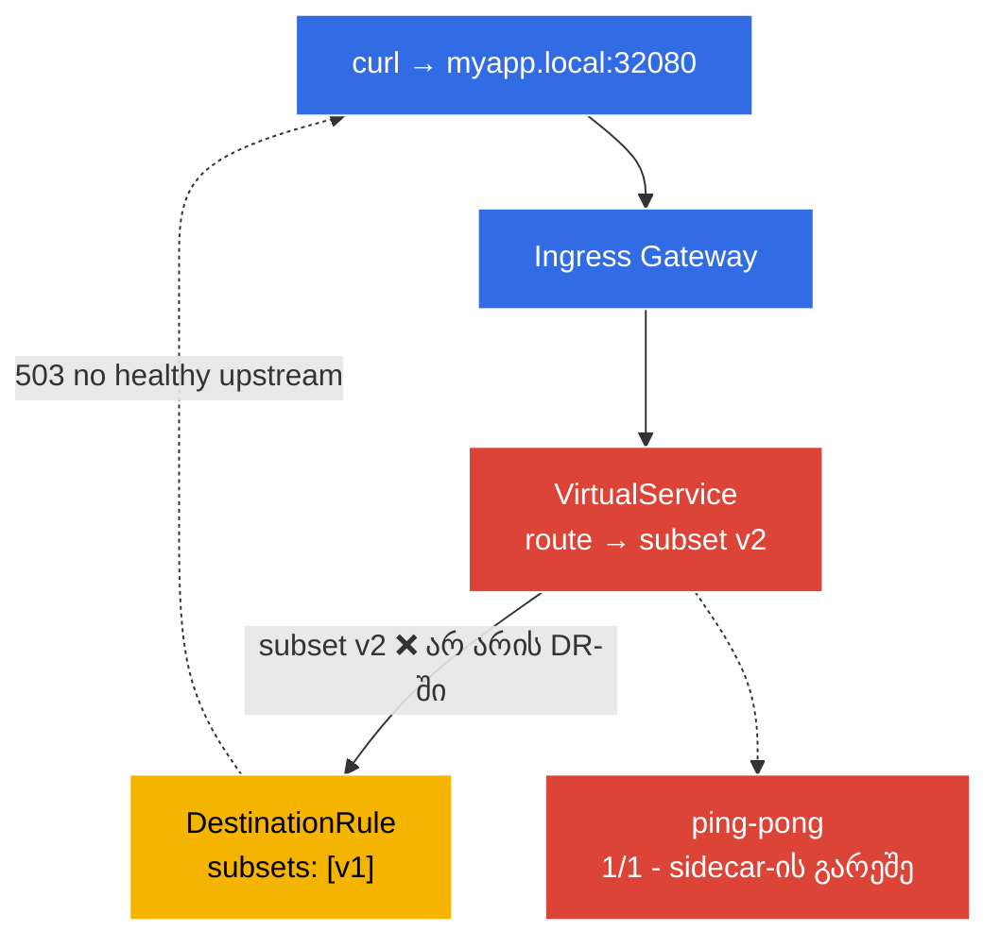

[Русская версия](README_RU.MD) · [Eng version](README.MD) · [Versión en español](README_ES.MD) · [Version française](README_FR.MD) · [Deutsche Version](README_DE.MD) · [繁體中文版](README_TW.MD) · [日本語版](README_JP.MD)

# Lab 12 - პრობლემების აღმოფხვრა: Istio-ს დიაგნოსტიკა და შეკეთება

> [საცნობარო გადაწყვეტა](worker/files/solutions/1_GE.MD)

ICA გამოცდაზე ცალკე დომენია გამოყოფილი - **troubleshooting**: გეძლევათ გაუმართავი გარემო და საჭიროა მიზეზის სწრაფად პოვნა და პრობლემის გამოსწორება. ამ ლაბორატორიაში გარემო უკვე **გაუმართავ მდგომარეობაშია** გაშვებული - აპლიკაცია არ მუშაობს. თქვენი ამოცანაა, `istioctl`-ის ინსტრუმენტების დახმარებით იპოვოთ კონფიგურაციის ორივე შეცდომა და გამოასწოროთ ისინი.

დიაგნოსტიკის ძირითადი ინსტრუმენტები:
- **`istioctl analyze`** - კონფიგურაციის სტატიკური ანალიზატორი. ტრაფიკის გაგზავნამდე პოულობს ტიპურ პრობლემებს (ინექციის არარსებობა, subset/gateway-ზე არასწორი ბმულები, პოლიტიკების კონფლიქტები).
- **`istioctl proxy-status`** - ყველა Envoy-პროქსის istiod-თან სინქრონიზაციის მდგომარეობა (`SYNCED` / `STALE`).
- **`istioctl proxy-config`** - რა ინახება რეალურად კონკრეტული Envoy-ის კონფიგურაციაში: `routes`, `clusters`, `endpoints`, `listeners`.

### რა არის გაფუჭებული



გარემოში ჩადებულია **ორი ბაგი**:
- **ბაგი 1** - namespace `default` ინექციისთვის მონიშნული არ არის → პოდი `ping-pong` გაეშვა როგორც `1/1` (sidecar-ის გარეშე, mesh-ის მიღმა).
- **ბაგი 2** - `VirtualService` მარშრუტს აგზავნის subset `v2`-ზე, რომელიც `DestinationRule`-ში არ არსებობს (იქ მხოლოდ `v1` არის) → gateway-ის გავლით მოთხოვნები აბრუნებს `503`-ს.

## მიზანი

`istioctl`-ის დახმარებით იპოვეთ ორივე შეცდომა და შეაკეთეთ ისე, რომ:
- პოდი `ping-pong` იყოს `2/2` (sidecar ინექცირებულია);
- მოთხოვნამ `curl http://myapp.local:32080/` დააბრუნოს `200`.

## ინფრასტრუქტურა

გარემო იშლება AWS-ში (`eu-central-1`) Terragrunt-ის მეშვეობით და შედგება შემდეგი კომპონენტებისგან:

| კომპონენტი  | აღწერა                                          |
|------------|---------------------------------------------------|
| `vpc`      | VPC `10.10.0.0/16` საჯარო subnet-ებით          |
| `ssh-keys` | SSH-გასაღებები ნოდებზე წვდომისთვის                      |
| `k8s-1`    | Kubernetes `1.35.2` (kubeadm) დაყენებული Istio-თი |
| `worker`   | სამუშაო მანქანა `kubectl`-ითა და კლასტერზე წვდომით   |

ინსტანსები: `t3.medium` (master) Ubuntu `22.04`

## გაშლა

```bash
TASK=12 make run_ica_task
```

## ნაბიჯი 1. დათვალიერება - რა არის საერთოდ არასწორად

ჯერ სიმპტომებს გადავხედოთ:

```bash
kubectl get pods -n default
```
```
NAME              READY   STATUS    RESTARTS   AGE
ping-pong-xxxx    1/1     Running   0          5m     # ველოდით 2/2 - sidecar არ არის!
```

```bash
curl -s -o /dev/null -w "%{http_code}\n" http://myapp.local:32080/
```
```
503                                                    # აპლიკაცია მიუწვდომელია
```

ორი სიმპტომია: პოდი sidecar-ის გარეშეა, ხოლო gateway-ის გავლით ვიღებთ `503`-ს.

## ნაბიჯი 2. `istioctl analyze` - სტატიკური ანალიზი

პირველი ხაზის მთავარი ინსტრუმენტია კონფიგურაციის ანალიზატორი:

```bash
istioctl analyze -n default
```

ის დაახლოებით შემდეგს შეგვატყობინებს:
```
Warning [IST0102] (Namespace default) The namespace is not enabled for Istio injection...
Error   [IST0101] (VirtualService ping-pong-vs) Referenced host+subset in destination is not found: "ping-pong+v2"
```

ორივე ბაგი დაუყოვნებლივ ჩანს: **ინექცია ჩართული არ არის** და არის **ბმული არარსებულ subset-ზე**.

## ნაბიჯი 3. `proxy-status` და `proxy-config` - Envoy-ის უფრო ღრმა შემოწმება

შევამოწმოთ პროქსების istiod-თან სინქრონიზაცია:

```bash
istioctl proxy-status
```
ყველა პროქსი უნდა იყოს `SYNCED`. (თუ რომელიმე `STALE` იქნებოდა - istiod-მა კონფიგურაციის მიწოდება ვერ შეძლო.)

ვნახოთ, რას ხედავს Envoy ingress-gateway ჩვენი `ping-pong` კლასტერის შესახებ:

```bash
GW=$(kubectl -n istio-system get pod -l istio=ingressgateway -o jsonpath='{.items[0].metadata.name}')
istioctl proxy-config clusters "$GW.istio-system" | grep ping-pong
istioctl proxy-config routes   "$GW.istio-system" | grep -i myapp
```

subset `v2`-ის კლასტერს endpoint-ები არ ექნება (`no healthy upstream`) - ეს ბაგი 2-ის პირდაპირი დასტურია.

## ნაბიჯი 4. ვასწორებთ ბაგი 1-ს - ვრთავთ ინექციას

```bash
kubectl label namespace default istio-injection=enabled --overwrite
kubectl rollout restart deployment ping-pong -n default
kubectl get pods -n default
```
```
NAME              READY   STATUS    RESTARTS   AGE
ping-pong-yyyy    2/2     Running   0          20s    # ახლა sidecar ადგილზეა
```

## ნაბიჯი 5. ვასწორებთ ბაგი 2-ს - ვცვლით subset-ს VirtualService-ში

DestinationRule მხოლოდ subset `v1`-ს განსაზღვრავს, VirtualService კი ტრაფიკს `v2`-ზე აგზავნის. მარშრუტი არსებულ subset-თან შესაბამისობაში მოგვყავს:

```bash
kubectl patch virtualservice ping-pong-vs -n default --type=json \
  -p='[{"op":"replace","path":"/spec/http/0/route/0/destination/subset","value":"v1"}]'
```

(ანალოგიურად, შეიძლება გამოვიყენოთ `kubectl edit vs ping-pong-vs` და `subset: v2` → `subset: v1` ჩავანაცვლოთ, ან, პირიქით, DestinationRule-ში subset `v2` დავამატოთ - იმის მიხედვით, თუ რა ქცევაა გათვალისწინებული.)

## ნაბიჯი 6. შემოწმება

ხელახლა ვუშვებთ ანალიზსა და მოთხოვნას:

```bash
istioctl analyze -n default
```
```
✔ No validation issues found when analyzing namespace: default.
```

```bash
curl -s -o /dev/null -w "%{http_code}\n" http://myapp.local:32080/
```
```
200
```

```bash
kubectl get pods -n default          # 2/2
```

ორივე ბაგი გამოსწორებულია: აპლიკაცია mesh-შია (sidecar-ით) და gateway-ის გავლით ხელმისაწვდომია.

## შეჯამება

| ინსტრუმენტი | დანიშნულება | რა ვიპოვეთ |
|-----------|----------|-----------|
| `istioctl analyze` | კონფიგურაციის სტატიკური ანალიზი | ინექცია არ არის (IST0102) + არასწორი subset |
| `istioctl proxy-status` | პროქსების istiod-თან სინქრონიზაცია | ყველა `SYNCED`-ია |
| `istioctl proxy-config` | Envoy-ის რეალური კონფიგურაცია (routes/clusters/endpoints) | v2 კლასტერი endpoint-ების გარეშეა |

**მთავარი დასკვნა:** Istio-ს დიაგნოსტიკის მეთოდიკა:
1. **`istioctl analyze`** - თითქმის ყოველთვის პირველი ნაბიჯია; სტატიკური ანალიზით კონფიგურაციის შეცდომების უმრავლესობას პოულობს.
2. **`istioctl proxy-status`** - უნდა დავრწმუნდეთ, რომ istiod-მა კონფიგურაცია ყველა პროქსის მიაწოდა (`STALE` არ არის).
3. **`istioctl proxy-config`** - თუ analyze „სუფთაა“, ტრაფიკი კი არ გადის, ვამოწმებთ Envoy-ის ფაქტობრივ კონფიგურაციას (routes → clusters → endpoints), რათა გავიგოთ, რეალურად სად მიდის (ან არ მიდის) მოთხოვნა.

პრობლემების ორი ყველაზე გავრცელებული კლასია **sidecar-ის არარსებობა** (namespace მონიშნული არ არის / პოდი მონიშვნამდე შეიქმნა) და **არასწორი ბმულები** (VirtualService → არარსებული subset/gateway). `istioctl analyze` ორივეს წამებში პოულობს.
