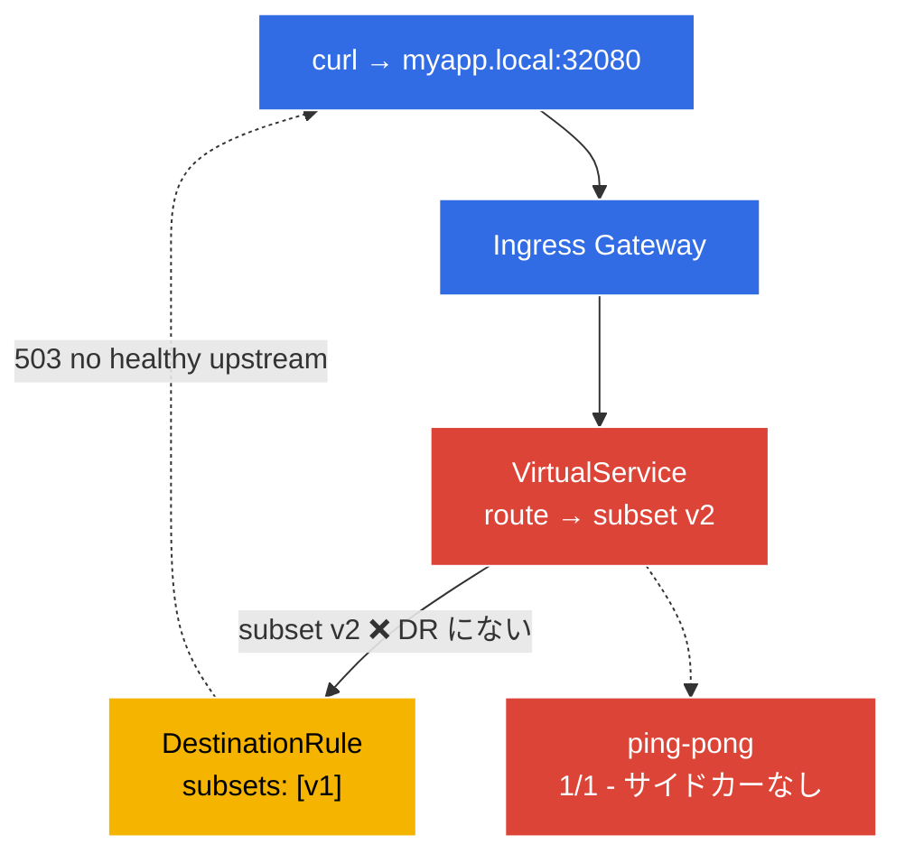

[Русская версия](README_RU.MD) · [Eng version](README.MD) · [Versión en español](README_ES.MD) · [Version française](README_FR.MD) · [Deutsche Version](README_DE.MD) · [ქართული ვერსია](README_GE.MD) · [繁體中文版](README_TW.MD)

# Lab 12 - トラブルシューティング: Istio の診断と修復

> [リファレンス解答](worker/files/solutions/1_JP.MD)

ICA 試験には **troubleshooting** という独立したドメインがあります。壊れた環境が与えられ、その原因を迅速に見つけて修復する必要があります。このラボでは、環境はすでに**壊れた状態で**デプロイされています。アプリケーションは動作しません。あなたの課題は、`istioctl` ツールを使って設定上の 2 つのエラーを見つけ、修復することです。

主要な診断ツール:
- **`istioctl analyze`** - 設定の静的アナライザー。トラフィック送信前に、典型的な問題（インジェクションがない、subset/gateway への壊れた参照、ポリシーの競合）を検出します。
- **`istioctl proxy-status`** - すべての Envoy プロキシと istiod の同期状態（`SYNCED` / `STALE`）。
- **`istioctl proxy-config`** - 特定の Envoy の設定に実際に含まれるもの: `routes`、`clusters`、`endpoints`、`listeners`。

### 何が壊れているか



環境には**2 つのバグ**が仕込まれています:
- **バグ 1** - namespace `default` にインジェクションのラベルがない → pod `ping-pong` は `1/1`（サイドカーなし、mesh 外）で起動している。
- **バグ 2** - `VirtualService` が `DestinationRule` に存在しない subset `v2` へルーティングしている（そこには `v1` しかない）→ gateway 経由のリクエストは `503` を返す。

## 目標

`istioctl` を使って両方のエラーを見つけ、次の状態になるよう修復します:
- pod `ping-pong` が `2/2`（サイドカーがインジェクト済み）であること。
- リクエスト `curl http://myapp.local:32080/` が `200` を返すこと。

## インフラストラクチャ

環境は Terragrunt により AWS（`eu-central-1`）へデプロイされ、以下で構成されています:

| コンポーネント | 説明 |
|------------|---------------------------------------------------|
| `vpc`      | パブリックサブネットを持つ VPC `10.10.0.0/16` |
| `ssh-keys` | ノードへのアクセス用 SSH キー |
| `k8s-1`    | Istio がインストールされた Kubernetes `1.35.2`（kubeadm） |
| `worker`   | `kubectl` とクラスターへのアクセスを備えた作業マシン |

インスタンス: `t3.medium`（master）Ubuntu `22.04`

## デプロイ

```bash
TASK=12 make run_ica_task
```

## ステップ 1. 確認 - 何が問題なのか

まず症状を確認します:

```bash
kubectl get pods -n default
```
```
NAME              READY   STATUS    RESTARTS   AGE
ping-pong-xxxx    1/1     Running   0          5m     # 2/2 を期待していた - sidecar がない!
```

```bash
curl -s -o /dev/null -w "%{http_code}\n" http://myapp.local:32080/
```
```
503                                                    # アプリケーションが利用できない
```

症状は 2 つです: サイドカーなしの pod と、gateway 経由の `503`。

## ステップ 2. `istioctl analyze` - 静的解析

最初に使う主要ツールは設定アナライザーです:

```bash
istioctl analyze -n default
```

おおむね次のように報告されます:
```
Warning [IST0102] (Namespace default) The namespace is not enabled for Istio injection...
Error   [IST0101] (VirtualService ping-pong-vs) Referenced host+subset in destination is not found: "ping-pong+v2"
```

両方のバグがすぐに確認できます: **インジェクションが有効でない**こと、および**存在しない subset への参照**です。

## ステップ 3. `proxy-status` と `proxy-config` - Envoy をさらに詳しく確認

プロキシと istiod の同期を確認します:

```bash
istioctl proxy-status
```
すべてのプロキシが `SYNCED` である必要があります。（`STALE` の場合、istiod は設定を配布できていません。）

Envoy ingress-gateway がクラスター `ping-pong` について何を認識しているかを確認します:

```bash
GW=$(kubectl -n istio-system get pod -l istio=ingressgateway -o jsonpath='{.items[0].metadata.name}')
istioctl proxy-config clusters "$GW.istio-system" | grep ping-pong
istioctl proxy-config routes   "$GW.istio-system" | grep -i myapp
```

subset `v2` のクラスターにはエンドポイントがありません（`no healthy upstream`）。これはバグ 2 の直接的な証拠です。

## ステップ 4. バグ 1 の修復 - インジェクションを有効化

```bash
kubectl label namespace default istio-injection=enabled --overwrite
kubectl rollout restart deployment ping-pong -n default
kubectl get pods -n default
```
```
NAME              READY   STATUS    RESTARTS   AGE
ping-pong-yyyy    2/2     Running   0          20s    # sidecar が配置された
```

## ステップ 5. バグ 2 の修復 - VirtualService の subset を修正

DestinationRule は subset `v1` だけを定義していますが、VirtualService は `v2` に送信しています。ルートを存在する subset に合わせます:

```bash
kubectl patch virtualservice ping-pong-vs -n default --type=json \
  -p='[{"op":"replace","path":"/spec/http/0/route/0/destination/subset","value":"v1"}]'
```

（同様に `kubectl edit vs ping-pong-vs` を実行して `subset: v2` → `subset: v1` に置き換えることもできます。あるいは逆に、`DestinationRule` に subset `v2` を追加します。どちらにするかは、意図された動作によります。）

## ステップ 6. 確認

解析とリクエストを再実行します:

```bash
istioctl analyze -n default
```
```
✔ No validation issues found when analyzing namespace: default.
```

```bash
curl -s -o /dev/null -w "%{http_code}\n" http://myapp.local:32080/
```
```
200
```

```bash
kubectl get pods -n default          # 2/2
```

両方のバグが解消されました: アプリケーションは mesh 内にあり（サイドカー）、gateway 経由でアクセス可能です。

## まとめ

| ツール | 用途 | 見つかったもの |
|-----------|----------|-----------|
| `istioctl analyze` | 設定の静的解析 | インジェクションなし（IST0102）+ 壊れた subset |
| `istioctl proxy-status` | プロキシと istiod の同期 | すべて `SYNCED` |
| `istioctl proxy-config` | 実際の Envoy 設定（routes/clusters/endpoints） | エンドポイントのない v2 クラスター |

**重要な結論:** Istio の診断手順:
1. **`istioctl analyze`** - ほぼ常に最初のステップです。静的解析により、大半の設定エラーを検出します。
2. **`istioctl proxy-status`** - istiod がすべてのプロキシへ設定を配布したこと（`STALE` がないこと）を確認します。
3. **`istioctl proxy-config`** - analyze が「正常」でもトラフィックが流れない場合、実際の Envoy 設定（routes → clusters → endpoints）を確認し、リクエストが実際にどこへ向かうのか（または向かわないのか）を把握します。

最も一般的な問題のクラスは 2 つです。**サイドカーがない**こと（namespace にラベルがない / pod がラベル付与前に作成された）と、**壊れた参照**（VirtualService → 存在しない subset/gateway）です。どちらも `istioctl analyze` により数秒で検出できます。