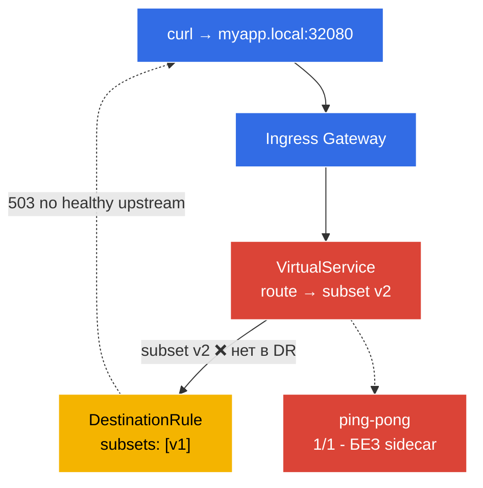

[Eng version](README.MD) · [Versión en español](README_ES.MD) · [Version française](README_FR.MD) · [Deutsche Version](README_DE.MD)

# Lab 12 - Troubleshooting: диагностика и починка Istio

На экзамене ICA есть отдельный домен - **troubleshooting**: вам дают сломанное окружение, и нужно быстро найти причину и починить. В этой лабораторной окружение уже развёрнуто **в сломанном состоянии** - приложение не работает. Ваша задача - с помощью инструментов `istioctl` найти обе ошибки конфигурации и устранить их.

Ключевые инструменты диагностики:
- **`istioctl analyze`** - статический анализатор конфигурации. Находит типовые проблемы (нет инъекции, битые ссылки на subset/gateway, конфликты политик) ещё до отправки трафика.
- **`istioctl proxy-status`** - состояние синхронизации всех Envoy-прокси с istiod (`SYNCED` / `STALE`).
- **`istioctl proxy-config`** - что реально лежит в конфиге конкретного Envoy: `routes`, `clusters`, `endpoints`, `listeners`.

### Что сломано



В окружении заложены **два бага**:
- **Баг 1** - namespace `default` не размечен для инъекции → под `ping-pong` поднялся `1/1` (без sidecar, вне mesh).
- **Баг 2** - `VirtualService` маршрутизирует на subset `v2`, которого нет в `DestinationRule` (там только `v1`) → запросы через gateway возвращают `503`.

## Цель

Найти обе ошибки с помощью `istioctl` и починить так, чтобы:
- под `ping-pong` был `2/2` (sidecar инъектирован);
- запрос `curl http://myapp.local:32080/` возвращал `200`.

## Инфраструктура

Окружение разворачивается в AWS (`eu-central-1`) через Terragrunt и состоит из:

| Компонент  | Описание                                          |
|------------|---------------------------------------------------|
| `vpc`      | VPC `10.10.0.0/16` с публичными подсетями          |
| `ssh-keys` | SSH-ключи для доступа к нодам                      |
| `k8s-1`    | Kubernetes `1.35.2` (kubeadm) с установленным Istio |
| `worker`   | Рабочая машина с `kubectl` и доступом к кластеру   |

Инстансы: `t3.medium` (master) Ubuntu `22.04`

## Развёртывание

```bash
TASK=12 make run_ica_task
```

## Шаг 1. Осмотр - что вообще не так

Сначала посмотрим на симптомы:

```bash
kubectl get pods -n default
```
```
NAME              READY   STATUS    RESTARTS   AGE
ping-pong-xxxx    1/1     Running   0          5m     # ожидали 2/2 - нет sidecar!
```

```bash
curl -s -o /dev/null -w "%{http_code}\n" http://myapp.local:32080/
```
```
503                                                    # приложение недоступно
```

Два симптома: под без sidecar и `503` через gateway.

## Шаг 2. `istioctl analyze` - статический анализ

Главный инструмент первой линии - анализатор конфигурации:

```bash
istioctl analyze -n default
```

Он сообщит примерно следующее:
```
Warning [IST0102] (Namespace default) The namespace is not enabled for Istio injection...
Error   [IST0101] (VirtualService ping-pong-vs) Referenced host+subset in destination is not found: "ping-pong+v2"
```

Оба бага видны сразу: **не включена инъекция** и **ссылка на несуществующий subset**.

## Шаг 3. `proxy-status` и `proxy-config` - глубже в Envoy

Проверим синхронизацию прокси с istiod:

```bash
istioctl proxy-status
```
Все прокси должны быть `SYNCED`. (Если бы был `STALE` - istiod не смог раздать конфиг.)

Посмотрим, что видит Envoy ingress-gateway про наш кластер `ping-pong`:

```bash
GW=$(kubectl -n istio-system get pod -l istio=ingressgateway -o jsonpath='{.items[0].metadata.name}')
istioctl proxy-config clusters "$GW.istio-system" | grep ping-pong
istioctl proxy-config routes   "$GW.istio-system" | grep -i myapp
```

Кластер для subset `v2` будет без эндпоинтов (`no healthy upstream`) - прямое подтверждение бага 2.

## Шаг 4. Чиним Баг 1 - включаем инъекцию

```bash
kubectl label namespace default istio-injection=enabled --overwrite
kubectl rollout restart deployment ping-pong -n default
kubectl get pods -n default
```
```
NAME              READY   STATUS    RESTARTS   AGE
ping-pong-yyyy    2/2     Running   0          20s    # теперь sidecar на месте
```

## Шаг 5. Чиним Баг 2 - правим subset в VirtualService

DestinationRule определяет только subset `v1`, а VirtualService шлёт на `v2`. Приводим маршрут к существующему subset:

```bash
kubectl patch virtualservice ping-pong-vs -n default --type=json \
  -p='[{"op":"replace","path":"/spec/http/0/route/0/destination/subset","value":"v1"}]'
```

(Аналогично можно `kubectl edit vs ping-pong-vs` и заменить `subset: v2` → `subset: v1`, либо, наоборот, добавить subset `v2` в DestinationRule - зависит от того, какое поведение задумано.)

## Шаг 6. Проверка

Повторяем анализ и запрос:

```bash
istioctl analyze -n default
```
```
✔ No validation issues found when analyzing namespace: default.
```

```bash
curl -s -o /dev/null -w "%{http_code}\n" http://myapp.local:32080/
```
```
200
```

```bash
kubectl get pods -n default          # 2/2
```

Оба бага устранены: приложение в mesh (sidecar) и доступно через gateway.

## Итог

| Инструмент | Для чего | Что нашли |
|-----------|----------|-----------|
| `istioctl analyze` | статический анализ конфигурации | нет инъекции (IST0102) + битый subset |
| `istioctl proxy-status` | синхронизация прокси с istiod | все `SYNCED` |
| `istioctl proxy-config` | реальный конфиг Envoy (routes/clusters/endpoints) | кластер v2 без эндпоинтов |

**Ключевой вывод:** методика диагностики Istio:
1. **`istioctl analyze`** - почти всегда первый шаг; ловит большинство ошибок конфигурации по статике.
2. **`istioctl proxy-status`** - убедиться, что istiod раздал конфиг всем прокси (нет `STALE`).
3. **`istioctl proxy-config`** - если analyze «чист», а трафик не идёт, смотрим фактический конфиг Envoy (routes → clusters → endpoints), чтобы понять, куда реально уходит (или не уходит) запрос.

Два самых частых класса проблем - **отсутствие sidecar** (namespace не размечен / под создан до метки) и **битые ссылки** (VirtualService → несуществующий subset/gateway). Оба ловятся `istioctl analyze` за секунды.
