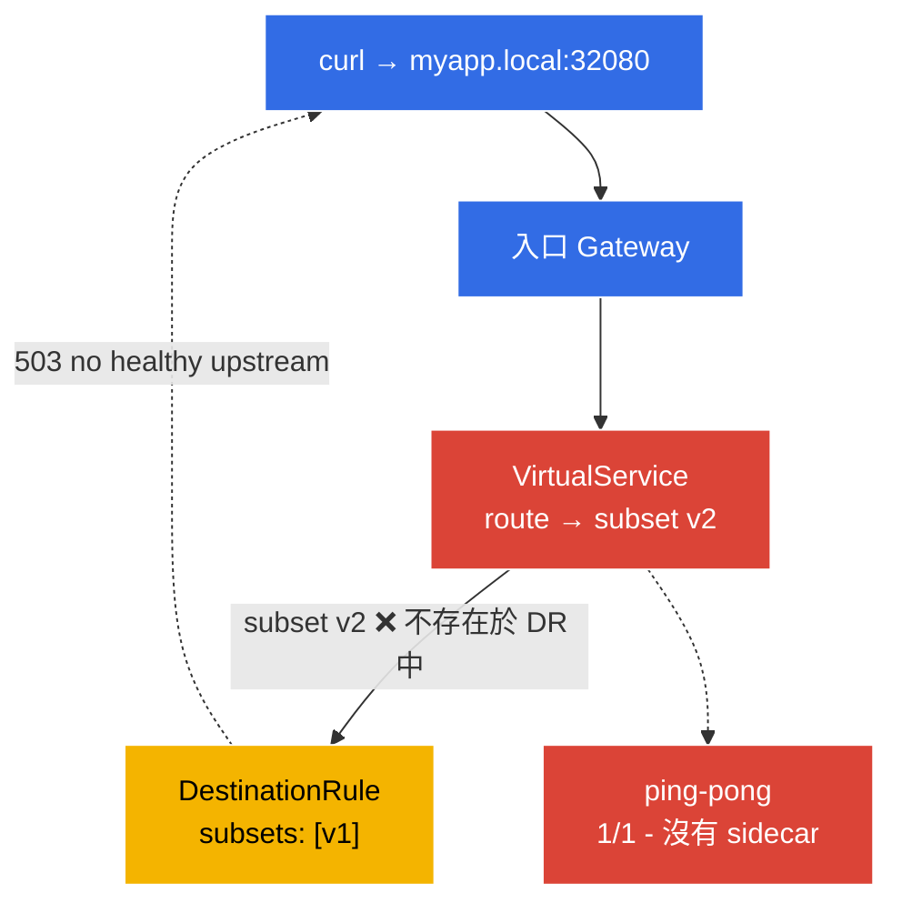

[Русская версия](README_RU.MD) · [Eng version](README.MD) · [Versión en español](README_ES.MD) · [Version française](README_FR.MD) · [Deutsche Version](README_DE.MD) · [ქართული ვერსია](README_GE.MD) · [日本語版](README_JP.MD)

# 實驗 12 - 疑難排解：診斷與修復 Istio

> [參考解答](worker/files/solutions/1_TW.MD)

ICA 考試有一個獨立的領域--**疑難排解**：會提供一個故障環境，您需要迅速找出原因並修復。在本實驗中，環境已經以**故障狀態**部署--應用程式無法運作。您的任務是使用 `istioctl` 工具找出兩個組態錯誤並加以排除。

主要診斷工具：
- **`istioctl analyze`**--組態靜態分析器。在傳送流量前，便可找出常見問題（未啟用注入、損壞的 subset/gateway 參照、策略衝突）。
- **`istioctl proxy-status`**--所有 Envoy 代理與 istiod 的同步狀態（`SYNCED` / `STALE`）。
- **`istioctl proxy-config`**--特定 Envoy 組態中實際存在的內容：`routes`、`clusters`、`endpoints`、`listeners`。

### 哪裡故障



此環境中包含**兩個錯誤**：
- **錯誤 1**--namespace `default` 未標記為啟用注入 → `ping-pong` Pod 以 `1/1` 啟動（沒有 sidecar，在 mesh 之外）。
- **錯誤 2**--`VirtualService` 將流量路由到 `DestinationRule` 中不存在的 subset `v2`（其中只有 `v1`）→ 經由 gateway 的請求會回傳 `503`。

## 目標

使用 `istioctl` 找出兩個錯誤並修復，使：
- `ping-pong` Pod 為 `2/2`（已注入 sidecar）；
- 請求 `curl http://myapp.local:32080/` 回傳 `200`。

## 基礎設施

此環境透過 Terragrunt 在 AWS（`eu-central-1`）中部署，包含：

| 元件  | 說明                                          |
|------------|---------------------------------------------------|
| `vpc`      | 具有公用子網路的 VPC `10.10.0.0/16`          |
| `ssh-keys` | 用於存取節點的 SSH 金鑰                      |
| `k8s-1`    | 已安裝 Istio 的 Kubernetes `1.35.2`（kubeadm） |
| `worker`   | 具有 `kubectl` 與叢集存取權的工作機器   |

執行個體：`t3.medium`（master）Ubuntu `22.04`

## 部署

```bash
TASK=12 make run_ica_task
```

## 步驟 1. 檢視--究竟哪裡不對

首先查看症狀：

```bash
kubectl get pods -n default
```
```
NAME              READY   STATUS    RESTARTS   AGE
ping-pong-xxxx    1/1     Running   0          5m     # 預期是 2/2 - 沒有 sidecar！
```

```bash
curl -s -o /dev/null -w "%{http_code}\n" http://myapp.local:32080/
```
```
503                                                    # 應用程式無法存取
```

兩個症狀：沒有 sidecar 的 Pod，以及經由 gateway 出現 `503`。

## 步驟 2. `istioctl analyze`--靜態分析

首要的一線工具是組態分析器：

```bash
istioctl analyze -n default
```

它會顯示大致如下的訊息：
```
Warning [IST0102] (Namespace default) The namespace is not enabled for Istio injection...
Error   [IST0101] (VirtualService ping-pong-vs) Referenced host+subset in destination is not found: "ping-pong+v2"
```

兩個錯誤立即可見：**未啟用注入**，以及**參照了不存在的 subset**。

## 步驟 3. `proxy-status` 與 `proxy-config`--深入檢查 Envoy

檢查代理與 istiod 的同步：

```bash
istioctl proxy-status
```
所有代理都必須是 `SYNCED`。（若為 `STALE`，代表 istiod 無法發送組態。）

查看 Envoy ingress-gateway 對我們的 `ping-pong` 叢集所見的資訊：

```bash
GW=$(kubectl -n istio-system get pod -l istio=ingressgateway -o jsonpath='{.items[0].metadata.name}')
istioctl proxy-config clusters "$GW.istio-system" | grep ping-pong
istioctl proxy-config routes   "$GW.istio-system" | grep -i myapp
```

subset `v2` 的叢集不會有端點（`no healthy upstream`）--這是錯誤 2 的直接證據。

## 步驟 4. 修復錯誤 1--啟用注入

```bash
kubectl label namespace default istio-injection=enabled --overwrite
kubectl rollout restart deployment ping-pong -n default
kubectl get pods -n default
```
```
NAME              READY   STATUS    RESTARTS   AGE
ping-pong-yyyy    2/2     Running   0          20s    # 現在 sidecar 已就位
```

## 步驟 5. 修復錯誤 2--修正 VirtualService 中的 subset

DestinationRule 僅定義 subset `v1`，但 VirtualService 傳送至 `v2`。將路由調整為現有的 subset：

```bash
kubectl patch virtualservice ping-pong-vs -n default --type=json \
  -p='[{"op":"replace","path":"/spec/http/0/route/0/destination/subset","value":"v1"}]'
```

（也可以使用 `kubectl edit vs ping-pong-vs`，將 `subset: v2` 替換為 `subset: v1`；或者反過來，在 DestinationRule 中新增 subset `v2`--取決於預期的行為。）

## 步驟 6. 驗證

再次執行分析和請求：

```bash
istioctl analyze -n default
```
```
✔ No validation issues found when analyzing namespace: default.
```

```bash
curl -s -o /dev/null -w "%{http_code}\n" http://myapp.local:32080/
```
```
200
```

```bash
kubectl get pods -n default          # 2/2
```

兩個錯誤皆已排除：應用程式位於 mesh 中（具有 sidecar），且可經由 gateway 存取。

## 總結

| 工具 | 用途 | 找到的問題 |
|-----------|----------|-----------|
| `istioctl analyze` | 組態靜態分析 | 未啟用注入（IST0102）+ 損壞的 subset |
| `istioctl proxy-status` | 代理與 istiod 的同步 | 全部為 `SYNCED` |
| `istioctl proxy-config` | 實際 Envoy 組態（routes/clusters/endpoints） | v2 叢集沒有端點 |

**關鍵結論：**Istio 的診斷方法：
1. **`istioctl analyze`**--幾乎總是第一步；可透過靜態分析捕捉大部分組態錯誤。
2. **`istioctl proxy-status`**--確認 istiod 已將組態發送給所有代理（沒有 `STALE`）。
3. **`istioctl proxy-config`**--若 analyze「沒有問題」，但流量無法通過，請檢視實際 Envoy 組態（routes → clusters → endpoints），以了解請求實際流向何處（或未流向何處）。

最常見的兩類問題是**缺少 sidecar**（namespace 未標記／Pod 在標記前建立）以及**損壞的參照**（VirtualService → 不存在的 subset/gateway）。兩者都能由 `istioctl analyze` 在幾秒內偵測到。
