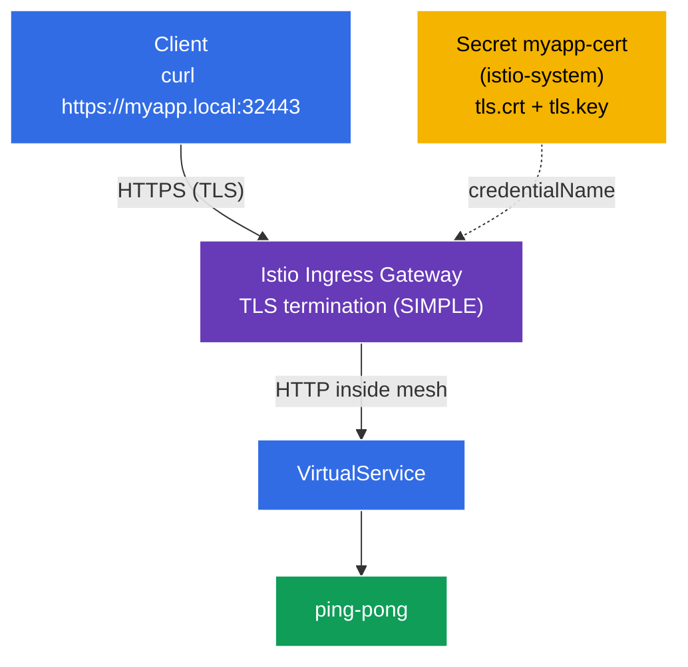

[RU version](README_RU.MD)

# Lab 13 — Securing Edge Traffic with TLS

So far, traffic from the outside entered the cluster over **HTTP** (`http://myapp.local:32080`). In production that's not acceptable — edge traffic must be encrypted with **TLS/HTTPS**. Istio can terminate TLS right at the ingress gateway: the client connects over HTTPS, the gateway decrypts the traffic, and then forwards it to the service inside the mesh.

In this lab we:
- generate a TLS certificate and store it in a Kubernetes `Secret`;
- configure a `Gateway` for **HTTPS** with TLS termination (`mode: SIMPLE`);
- verify the app is reachable at `https://myapp.local:32443`.

## Infrastructure

The environment is provisioned in AWS (`eu-central-1`) using Terragrunt and includes:

| Component  | Description                                       |
|------------|---------------------------------------------------|
| `vpc`      | VPC `10.10.0.0/16` with public subnets            |
| `ssh-keys` | SSH keys for node access                          |
| `k8s-1`    | Kubernetes `1.35.2` (kubeadm) with Istio installed |
| `worker`   | Workstation with `kubectl` and cluster access     |

Instances: `t3.medium` (master), Ubuntu `22.04`. Ingress Gateway NodePort: HTTP `32080`, HTTPS `32443`.

## Provisioning

```bash
TASK=13 make run_ica_task
```

### How It Works (High-Level Overview)



## Objective

- Create a TLS certificate and a `Secret` for the ingress gateway.
- Configure a `Gateway` with `tls.mode: SIMPLE` (TLS termination at the edge).
- Verify HTTPS access.

## Step 1. Deploy the Application

```bash
kubectl label namespace default istio-injection=enabled --overwrite
kubectl apply -f https://raw.githubusercontent.com/ViktorUJ/cks/refs/heads/AG-149/tasks/ica/labs/13/k8s-1/scripts/1.yaml
kubectl rollout restart deployment -n default
```

## Step 2. Certificate and Secret

Generate a self-signed certificate for `myapp.local` and store it in a `tls` Secret.

**Important:** for `credentialName` in the `Gateway`, the Secret must live in the ingress gateway's namespace — `istio-system`.

```bash
openssl req -x509 -newkey rsa:2048 -nodes -days 365 \
  -keyout myapp.key -out myapp.crt \
  -subj "/CN=myapp.local/O=demo" \
  -addext "subjectAltName=DNS:myapp.local"

kubectl create -n istio-system secret tls myapp-cert \
  --cert=myapp.crt --key=myapp.key
```

## Step 3. Gateway with TLS Termination (SIMPLE)

```bash
vim gateway.yaml
```

```yaml
apiVersion: networking.istio.io/v1
kind: Gateway
metadata:
  name: myapp-gateway
  namespace: default
spec:
  selector:
    istio: ingressgateway
  servers:
  - port:
      number: 443
      name: https
      protocol: HTTPS
    tls:
      mode: SIMPLE                # server-side TLS termination
      credentialName: myapp-cert  # references the Secret in istio-system
    hosts:
    - "myapp.local"
```

```bash
kubectl apply -f gateway.yaml
```

**Breakdown:**
- **`protocol: HTTPS`** + **`tls.mode: SIMPLE`** — the gateway accepts TLS connections and **decrypts** them (server-side termination). The client speaks HTTPS; inside the mesh it becomes plain HTTP (or mTLS between sidecars).
- **`credentialName: myapp-cert`** — the name of the `Secret` holding the certificate and key. Istio reads it from the ingress gateway's namespace (`istio-system`) via SDS. That's why the Secret is created in `istio-system`, not `default`.
- **`hosts: ["myapp.local"]`** — the certificate and routing are bound to this host (SNI).

## Step 4. VirtualService

```bash
vim vs.yaml
```

```yaml
apiVersion: networking.istio.io/v1
kind: VirtualService
metadata:
  name: myapp-vs
  namespace: default
spec:
  hosts:
  - "myapp.local"
  gateways:
  - myapp-gateway
  http:
  - route:
    - destination:
        host: ping-pong
        port:
          number: 8080
```

```bash
kubectl apply -f vs.yaml
```

## Step 5. Verify

```bash
# HTTPS works (-k because the cert is self-signed)
curl -sk https://myapp.local:32443/ | grep 'Server Name'
```
```
Server Name: Ping-Pong Backend
```

Inspect the certificate the gateway serves:

```bash
curl -skv https://myapp.local:32443/ 2>&1 | grep -E 'subject:|issuer:'
```
```
*  subject: CN=myapp.local; O=demo
*  issuer: CN=myapp.local; O=demo
```

TLS is terminated at the ingress gateway, and the client sees our certificate for `myapp.local`.

## (optional) Mutual TLS at the edge (MUTUAL)

To require a certificate from the **client** too, use `mode: MUTUAL` — add a CA (`ca.crt`) to the Secret and the gateway verifies the client certificate:

```yaml
    tls:
      mode: MUTUAL
      credentialName: myapp-cert-mtls   # tls.crt + tls.key + ca.crt
```

Then the client must present its own certificate: `curl --cert client.crt --key client.key ...`.

## Summary

| Resource | Field | What it does |
|----------|-------|--------------|
| `Secret` (tls) | `tls.crt` / `tls.key` | stores the cert and key in `istio-system` |
| `Gateway` | `tls.mode: SIMPLE` + `credentialName` | terminates HTTPS at the edge |
| `VirtualService` | `gateways: [myapp-gateway]` | routes the decrypted traffic to the service |

**Key takeaway:** securing edge traffic in Istio is an HTTPS `Gateway` with `tls.mode: SIMPLE` (server-side termination) or `MUTUAL` (mutual TLS), referencing a `Secret` that holds the certificate in the ingress gateway's namespace. Clients connect over TLS, while inside the mesh the traffic is already decrypted (and, optionally, separately protected by mTLS between sidecars). The application itself does no TLS work at all.
