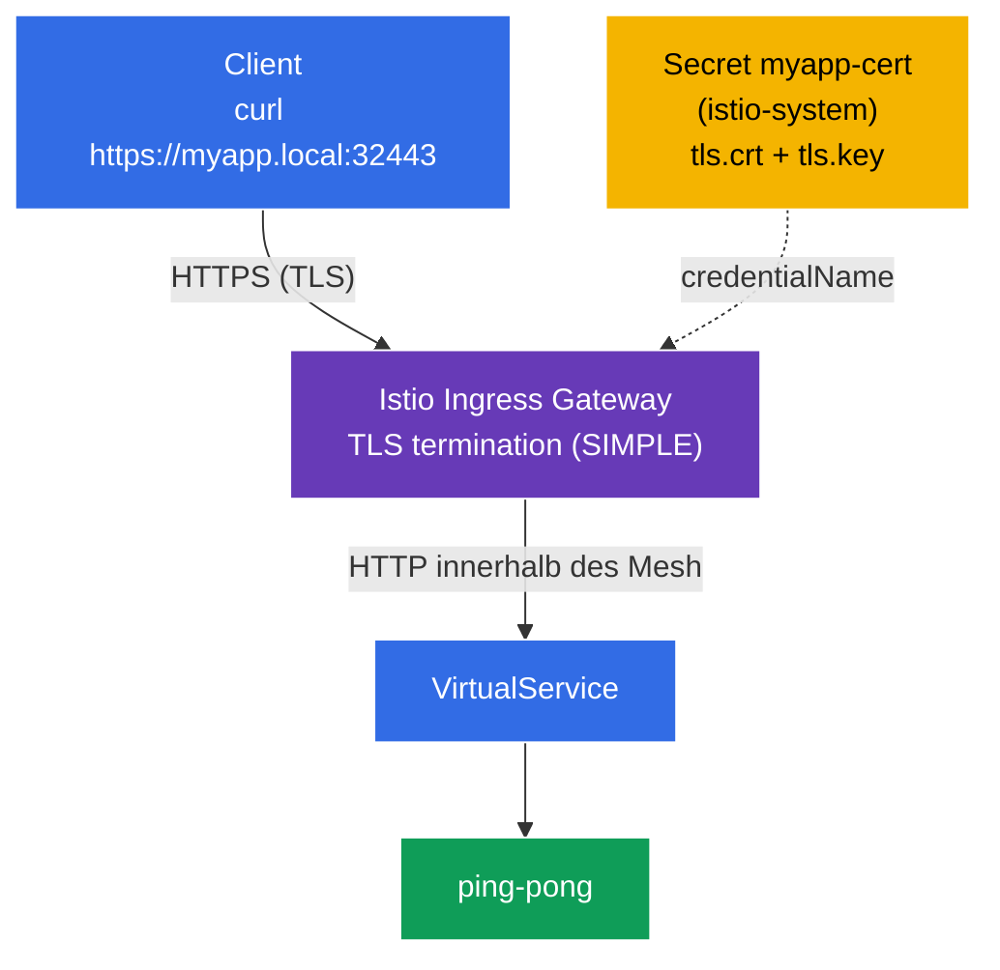

[RU version](README_RU.MD) · [Eng version](README.MD) · [Versión en español](README_ES.MD) · [Version française](README_FR.MD)

# Lab 13 - Securing Edge Traffic with TLS

Bisher kam der Traffic von außen über **HTTP** in den Cluster (`http://myapp.local:32080`). In der Produktion geht das nicht - der Traffic am Eingang (edge) muss über **TLS/HTTPS** verschlüsselt sein. Istio ermöglicht es, TLS direkt am Ingress-Gateway zu terminieren: Der Client verbindet sich über HTTPS, das Gateway entschlüsselt den Traffic und leitet ihn dann innerhalb des Mesh an den Service weiter.

In diesem Lab werden wir:
- ein TLS-Zertifikat generieren und es in einem Kubernetes `Secret` ablegen;
- ein `Gateway` auf **HTTPS** mit TLS-Terminierung konfigurieren (`mode: SIMPLE`);
- prüfen, dass die Anwendung über `https://myapp.local:32443` erreichbar ist.

## Infrastruktur

Die Umgebung wird in AWS (`eu-central-1`) über Terragrunt bereitgestellt und besteht aus:

| Komponente  | Beschreibung                                          |
|------------|---------------------------------------------------|
| `vpc`      | VPC `10.10.0.0/16` mit öffentlichen Subnetzen          |
| `ssh-keys` | SSH-Schlüssel für den Zugriff auf die Nodes                      |
| `k8s-1`    | Kubernetes `1.35.2` (kubeadm) mit installiertem Istio |
| `worker`   | Arbeitsmaschine mit `kubectl` und Zugriff auf den Cluster   |

Instanzen: `t3.medium` (master) Ubuntu `22.04`. Ingress Gateway auf NodePort: HTTP `32080`, HTTPS `32443`.

## Bereitstellung

```bash
TASK=13 make run_ica_task
```

### Wie das funktioniert (Gesamtschema)



## Ziel

- Ein TLS-Zertifikat und ein `Secret` für das Ingress-Gateway erstellen.
- Ein `Gateway` mit `tls.mode: SIMPLE` konfigurieren (TLS-Terminierung am Eingang).
- Den Zugriff über HTTPS prüfen.

## Schritt 1. Installation der Anwendung

```bash
kubectl label namespace default istio-injection=enabled --overwrite
kubectl apply -f https://raw.githubusercontent.com/ViktorUJ/cks/refs/heads/master/tasks/ica/labs/13/k8s-1/scripts/1.yaml
kubectl rollout restart deployment -n default
```

## Schritt 2. Zertifikat und Secret

Wir generieren ein selbstsigniertes Zertifikat für `myapp.local` und legen es in einem `Secret` vom Typ `tls` ab.

**Wichtig:** Für `credentialName` im `Gateway` muss das Secret im Namespace des Ingress-Gateways liegen - `istio-system`.

```bash
openssl req -x509 -newkey rsa:2048 -nodes -days 365 \
  -keyout myapp.key -out myapp.crt \
  -subj "/CN=myapp.local/O=demo" \
  -addext "subjectAltName=DNS:myapp.local"

kubectl create -n istio-system secret tls myapp-cert \
  --cert=myapp.crt --key=myapp.key
```

## Schritt 3. Gateway mit TLS-Terminierung (SIMPLE)

```bash
vim gateway.yaml
```

```yaml
apiVersion: networking.istio.io/v1
kind: Gateway
metadata:
  name: myapp-gateway
  namespace: default
spec:
  selector:
    istio: ingressgateway
  servers:
  - port:
      number: 443
      name: https
      protocol: HTTPS
    tls:
      mode: SIMPLE                # serverseitige TLS-Terminierung
      credentialName: myapp-cert  # Verweis auf das Secret in istio-system
    hosts:
    - "myapp.local"
```

```bash
kubectl apply -f gateway.yaml
```

**Erläuterung:**
- **`protocol: HTTPS`** + **`tls.mode: SIMPLE`** - das Gateway nimmt TLS-Verbindungen an und **entschlüsselt** sie (serverseitige Terminierung). Der Client spricht HTTPS, danach innerhalb des Mesh - gewöhnliches HTTP (oder mTLS zwischen den Sidecars).
- **`credentialName: myapp-cert`** - Name des `Secret` mit Zertifikat und Schlüssel. Istio liest es über SDS aus dem Namespace des Ingress-Gateways (`istio-system`). Genau deshalb wurde das Secret in `istio-system` und nicht in `default` erstellt.
- **`hosts: ["myapp.local"]`** - das TLS-Zertifikat und das Routing sind an diesen Host gebunden (SNI).

## Schritt 4. VirtualService

```bash
vim vs.yaml
```

```yaml
apiVersion: networking.istio.io/v1
kind: VirtualService
metadata:
  name: myapp-vs
  namespace: default
spec:
  hosts:
  - "myapp.local"
  gateways:
  - myapp-gateway
  http:
  - route:
    - destination:
        host: ping-pong
        port:
          number: 8080
```

```bash
kubectl apply -f vs.yaml
```

## Schritt 5. Prüfung

```bash
# HTTPS funktioniert (Flag -k, da das Zertifikat selbstsigniert ist)
curl -sk https://myapp.local:32443/ | grep 'Server Name'
```
```
Server Name: Ping-Pong Backend
```

Wir betrachten das Zertifikat selbst, das das Gateway ausliefert:

```bash
curl -skv https://myapp.local:32443/ 2>&1 | grep -E 'subject:|issuer:'
```
```
*  subject: CN=myapp.local; O=demo
*  issuer: CN=myapp.local; O=demo
```

TLS wird am Ingress-Gateway terminiert, und der Client sieht unser Zertifikat für `myapp.local`.

## (optional) Gegenseitiges TLS am Eingang (MUTUAL)

Um auch vom **Client** ein Zertifikat zu fordern, wird `mode: MUTUAL` verwendet - dem Secret wird eine CA (`ca.crt`) hinzugefügt, und das Gateway prüft das Client-Zertifikat:

```yaml
    tls:
      mode: MUTUAL
      credentialName: myapp-cert-mtls   # tls.crt + tls.key + ca.crt
```

Dann ist der Client verpflichtet, sein Zertifikat vorzuweisen: `curl --cert client.crt --key client.key ...`.

## Fazit

| Ressource | Feld | Was sie tut |
|--------|------|-----------|
| `Secret` (tls) | `tls.crt` / `tls.key` | speichert Zertifikat und Schlüssel in `istio-system` |
| `Gateway` | `tls.mode: SIMPLE` + `credentialName` | terminiert HTTPS am Eingang |
| `VirtualService` | `gateways: [myapp-gateway]` | routet den entschlüsselten Traffic an den Service |

**Zentrale Erkenntnis:** Der Schutz des Edge-Traffics in Istio ist ein HTTPS-`Gateway` mit `tls.mode: SIMPLE` (serverseitige Terminierung) oder `MUTUAL` (gegenseitiges TLS), das auf ein `Secret` mit dem Zertifikat im Namespace des Ingress-Gateways verweist. Clients verbinden sich über TLS, und innerhalb des Mesh läuft der Traffic bereits entschlüsselt (und, falls gewünscht, separat durch mTLS zwischen den Sidecars geschützt). Die Anwendung befasst sich dabei überhaupt nicht mit TLS.
