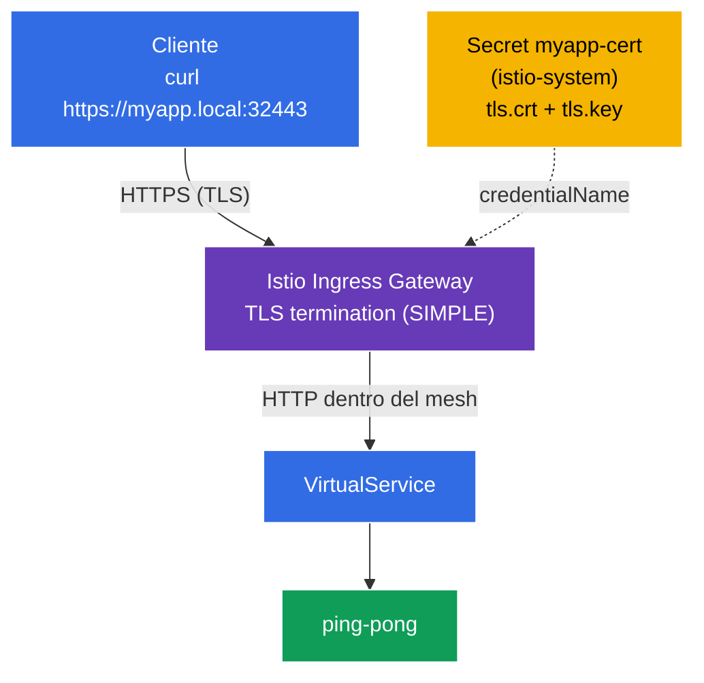

[RU version](README_RU.MD) · [Eng version](README.MD) · [Version française](README_FR.MD) · [Deutsche Version](README_DE.MD)

# Lab 13 - Securing Edge Traffic with TLS

Hasta ahora el tráfico externo llegaba al clúster por **HTTP** (`http://myapp.local:32080`). En producción esto no es aceptable: el tráfico de entrada (edge) debe estar cifrado con **TLS/HTTPS**. Istio permite terminar TLS directamente en el ingress gateway: el cliente se conecta por HTTPS, el gateway descifra el tráfico y luego, dentro del mesh, lo entrega al servicio.

En este lab vamos a:
- generar un certificado TLS y guardarlo en un `Secret` de Kubernetes;
- configurar el `Gateway` en **HTTPS** con terminación TLS (`mode: SIMPLE`);
- comprobar que la aplicación está disponible en `https://myapp.local:32443`.

## Infraestructura

El entorno se despliega en AWS (`eu-central-1`) mediante Terragrunt y consta de:

| Componente | Descripción                                        |
|------------|---------------------------------------------------|
| `vpc`      | VPC `10.10.0.0/16` con subredes públicas           |
| `ssh-keys` | Claves SSH para el acceso a los nodos              |
| `k8s-1`    | Kubernetes `1.35.2` (kubeadm) con Istio instalado  |
| `worker`   | Máquina de trabajo con `kubectl` y acceso al clúster |

Instancias: `t3.medium` (master) Ubuntu `22.04`. Ingress Gateway en NodePort: HTTP `32080`, HTTPS `32443`.

## Despliegue

```bash
TASK=13 make run_ica_task
```

### Cómo funciona (esquema general)



## Objetivo

- Crear un certificado TLS y un `Secret` para el ingress gateway.
- Configurar el `Gateway` con `tls.mode: SIMPLE` (terminación TLS en la entrada).
- Comprobar el acceso por HTTPS.

## Paso 1. Instalación de la aplicación

```bash
kubectl label namespace default istio-injection=enabled --overwrite
kubectl apply -f https://raw.githubusercontent.com/ViktorUJ/cks/refs/heads/master/tasks/ica/labs/13/k8s-1/scripts/1.yaml
kubectl rollout restart deployment -n default
```

## Paso 2. Certificado y Secret

Generamos un certificado autofirmado para `myapp.local` y lo colocamos en un `Secret` de tipo `tls`.

**Importante:** para el `credentialName` del `Gateway`, el Secret debe estar en el namespace del ingress gateway - `istio-system`.

```bash
openssl req -x509 -newkey rsa:2048 -nodes -days 365 \
  -keyout myapp.key -out myapp.crt \
  -subj "/CN=myapp.local/O=demo" \
  -addext "subjectAltName=DNS:myapp.local"

kubectl create -n istio-system secret tls myapp-cert \
  --cert=myapp.crt --key=myapp.key
```

## Paso 3. Gateway con terminación TLS (SIMPLE)

```bash
vim gateway.yaml
```

```yaml
apiVersion: networking.istio.io/v1
kind: Gateway
metadata:
  name: myapp-gateway
  namespace: default
spec:
  selector:
    istio: ingressgateway
  servers:
  - port:
      number: 443
      name: https
      protocol: HTTPS
    tls:
      mode: SIMPLE                # terminación TLS del lado servidor
      credentialName: myapp-cert  # referencia al Secret en istio-system
    hosts:
    - "myapp.local"
```

```bash
kubectl apply -f gateway.yaml
```

**Análisis:**
- **`protocol: HTTPS`** + **`tls.mode: SIMPLE`** - el gateway acepta conexiones TLS y las **descifra** (terminación del lado servidor). El cliente habla por HTTPS, y luego dentro del mesh es HTTP normal (o mTLS entre sidecars).
- **`credentialName: myapp-cert`** - nombre del `Secret` con el certificado y la clave. Istio lo lee del namespace del ingress gateway (`istio-system`) mediante SDS. Por eso el Secret se crea en `istio-system`, y no en `default`.
- **`hosts: ["myapp.local"]`** - el certificado TLS y el enrutamiento están vinculados a este host (SNI).

## Paso 4. VirtualService

```bash
vim vs.yaml
```

```yaml
apiVersion: networking.istio.io/v1
kind: VirtualService
metadata:
  name: myapp-vs
  namespace: default
spec:
  hosts:
  - "myapp.local"
  gateways:
  - myapp-gateway
  http:
  - route:
    - destination:
        host: ping-pong
        port:
          number: 8080
```

```bash
kubectl apply -f vs.yaml
```

## Paso 5. Comprobación

```bash
# HTTPS funciona (flag -k, porque el certificado es autofirmado)
curl -sk https://myapp.local:32443/ | grep 'Server Name'
```
```
Server Name: Ping-Pong Backend
```

Miramos el propio certificado que entrega el gateway:

```bash
curl -skv https://myapp.local:32443/ 2>&1 | grep -E 'subject:|issuer:'
```
```
*  subject: CN=myapp.local; O=demo
*  issuer: CN=myapp.local; O=demo
```

TLS se termina en el ingress gateway, y el cliente ve nuestro certificado para `myapp.local`.

## (opcional) TLS mutuo en la entrada (MUTUAL)

Para exigir un certificado también del **cliente** se usa `mode: MUTUAL` - al Secret se le añade el CA (`ca.crt`), y el gateway verifica el certificado del cliente:

```yaml
    tls:
      mode: MUTUAL
      credentialName: myapp-cert-mtls   # tls.crt + tls.key + ca.crt
```

Entonces el cliente está obligado a presentar su certificado: `curl --cert client.crt --key client.key ...`.

## Resumen

| Recurso | Campo | Qué hace |
|--------|------|-----------|
| `Secret` (tls) | `tls.crt` / `tls.key` | almacena el certificado y la clave en `istio-system` |
| `Gateway` | `tls.mode: SIMPLE` + `credentialName` | termina HTTPS en la entrada |
| `VirtualService` | `gateways: [myapp-gateway]` | enruta el tráfico descifrado al servicio |

**Conclusión clave:** proteger el tráfico edge en Istio es un `Gateway` HTTPS con `tls.mode: SIMPLE` (terminación del lado servidor) o `MUTUAL` (TLS mutuo), que referencia a un `Secret` con el certificado en el namespace del ingress gateway. Los clientes se conectan por TLS, y dentro del mesh el tráfico va ya descifrado (y, si se desea, protegido por separado con mTLS entre sidecars). La aplicación, mientras tanto, no se ocupa de TLS en absoluto.
