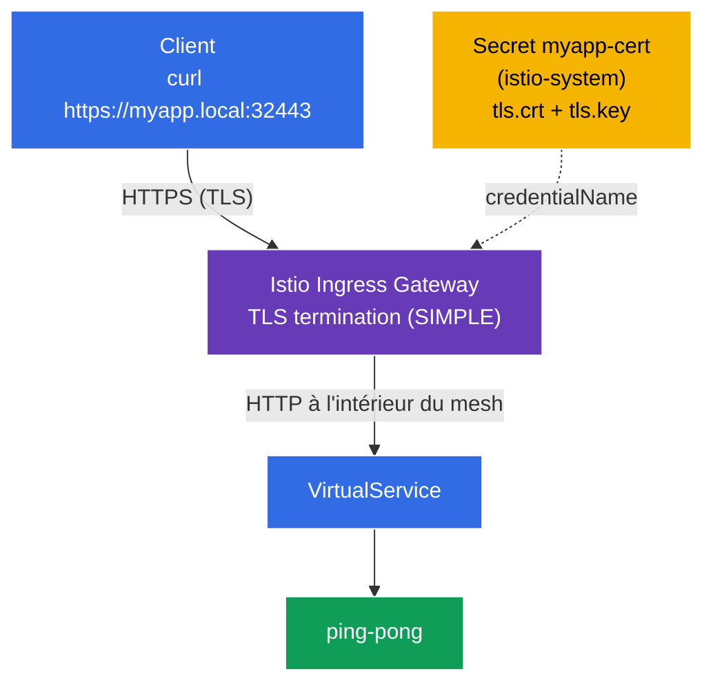

[RU version](README_RU.MD) · [Eng version](README.MD) · [Versión en español](README_ES.MD) · [Deutsche Version](README_DE.MD)

# Lab 13 - Securing Edge Traffic with TLS

Jusqu'ici, le trafic externe entrait dans le cluster en **HTTP** (`http://myapp.local:32080`). En production, c'est inacceptable - le trafic en périphérie (edge) doit être chiffré en **TLS/HTTPS**. Istio permet de terminer le TLS directement sur l'ingress-gateway : le client se connecte en HTTPS, le gateway déchiffre le trafic et le transmet ensuite au service à l'intérieur du maillage.

Dans ce lab, nous allons :
- générer un certificat TLS et le placer dans un `Secret` Kubernetes ;
- configurer un `Gateway` en **HTTPS** avec terminaison TLS (`mode: SIMPLE`) ;
- vérifier que l'application est accessible via `https://myapp.local:32443`.

## Infrastructure

L'environnement est déployé dans AWS (`eu-central-1`) via Terragrunt et se compose de :

| Composant  | Description                                          |
|------------|---------------------------------------------------|
| `vpc`      | VPC `10.10.0.0/16` avec des sous-réseaux publics          |
| `ssh-keys` | clés SSH pour l'accès aux nœuds                      |
| `k8s-1`    | Kubernetes `1.35.2` (kubeadm) avec Istio installé |
| `worker`   | machine de travail avec `kubectl` et accès au cluster   |

Instances : `t3.medium` (master) Ubuntu `22.04`. Ingress Gateway en NodePort : HTTP `32080`, HTTPS `32443`.

## Déploiement

```bash
TASK=13 make run_ica_task
```

### Comment ça marche (schéma général)



## Objectif

- Créer un certificat TLS et un `Secret` pour l'ingress-gateway.
- Configurer un `Gateway` avec `tls.mode: SIMPLE` (terminaison TLS en entrée).
- Vérifier l'accès en HTTPS.

## Étape 1. Installation de l'application

```bash
kubectl label namespace default istio-injection=enabled --overwrite
kubectl apply -f https://raw.githubusercontent.com/ViktorUJ/cks/refs/heads/master/tasks/ica/labs/13/k8s-1/scripts/1.yaml
kubectl rollout restart deployment -n default
```

## Étape 2. Certificat et Secret

On génère un certificat auto-signé pour `myapp.local` et on le place dans un `Secret` de type `tls`.

**Important :** pour le `credentialName` du `Gateway`, le Secret doit se trouver dans le namespace de l'ingress-gateway - `istio-system`.

```bash
openssl req -x509 -newkey rsa:2048 -nodes -days 365 \
  -keyout myapp.key -out myapp.crt \
  -subj "/CN=myapp.local/O=demo" \
  -addext "subjectAltName=DNS:myapp.local"

kubectl create -n istio-system secret tls myapp-cert \
  --cert=myapp.crt --key=myapp.key
```

## Étape 3. Gateway avec terminaison TLS (SIMPLE)

```bash
vim gateway.yaml
```

```yaml
apiVersion: networking.istio.io/v1
kind: Gateway
metadata:
  name: myapp-gateway
  namespace: default
spec:
  selector:
    istio: ingressgateway
  servers:
  - port:
      number: 443
      name: https
      protocol: HTTPS
    tls:
      mode: SIMPLE                # terminaison TLS côté serveur
      credentialName: myapp-cert  # référence au Secret dans istio-system
    hosts:
    - "myapp.local"
```

```bash
kubectl apply -f gateway.yaml
```

**Décryptage :**
- **`protocol: HTTPS`** + **`tls.mode: SIMPLE`** - le gateway accepte les connexions TLS et les **déchiffre** (terminaison côté serveur). Le client parle en HTTPS, ensuite à l'intérieur du maillage c'est du HTTP classique (ou du mTLS entre sidecars).
- **`credentialName: myapp-cert`** - le nom du `Secret` contenant le certificat et la clé. Istio le lit depuis le namespace de l'ingress-gateway (`istio-system`) via SDS. C'est pourquoi le Secret est créé dans `istio-system` et non dans `default`.
- **`hosts: ["myapp.local"]`** - le certificat TLS et le routage sont liés à cet hôte (SNI).

## Étape 4. VirtualService

```bash
vim vs.yaml
```

```yaml
apiVersion: networking.istio.io/v1
kind: VirtualService
metadata:
  name: myapp-vs
  namespace: default
spec:
  hosts:
  - "myapp.local"
  gateways:
  - myapp-gateway
  http:
  - route:
    - destination:
        host: ping-pong
        port:
          number: 8080
```

```bash
kubectl apply -f vs.yaml
```

## Étape 5. Vérification

```bash
# HTTPS fonctionne (flag -k, car le certificat est auto-signé)
curl -sk https://myapp.local:32443/ | grep 'Server Name'
```
```
Server Name: Ping-Pong Backend
```

On regarde le certificat lui-même, celui que renvoie le gateway :

```bash
curl -skv https://myapp.local:32443/ 2>&1 | grep -E 'subject:|issuer:'
```
```
*  subject: CN=myapp.local; O=demo
*  issuer: CN=myapp.local; O=demo
```

Le TLS est terminé sur l'ingress-gateway, et le client voit notre certificat pour `myapp.local`.

## (optionnel) TLS mutuel en entrée (MUTUAL)

Pour exiger un certificat aussi du **client**, on utilise `mode: MUTUAL` - on ajoute un CA (`ca.crt`) au Secret, et le gateway vérifie le certificat client :

```yaml
    tls:
      mode: MUTUAL
      credentialName: myapp-cert-mtls   # tls.crt + tls.key + ca.crt
```

Le client doit alors présenter son certificat : `curl --cert client.crt --key client.key ...`.

## Bilan

| Ressource | Champ | Ce qu'elle fait |
|--------|------|-----------|
| `Secret` (tls) | `tls.crt` / `tls.key` | stocke le certificat et la clé dans `istio-system` |
| `Gateway` | `tls.mode: SIMPLE` + `credentialName` | termine le HTTPS en entrée |
| `VirtualService` | `gateways: [myapp-gateway]` | route le trafic déchiffré vers le service |

**À retenir :** la protection du trafic edge dans Istio, c'est un `Gateway` HTTPS avec `tls.mode: SIMPLE` (terminaison côté serveur) ou `MUTUAL` (TLS mutuel), référençant un `Secret` contenant le certificat dans le namespace de l'ingress-gateway. Les clients se connectent en TLS, et à l'intérieur du maillage le trafic circule déjà déchiffré (et, si on le souhaite, protégé séparément par mTLS entre sidecars). L'application, elle, ne s'occupe pas du tout du TLS.
