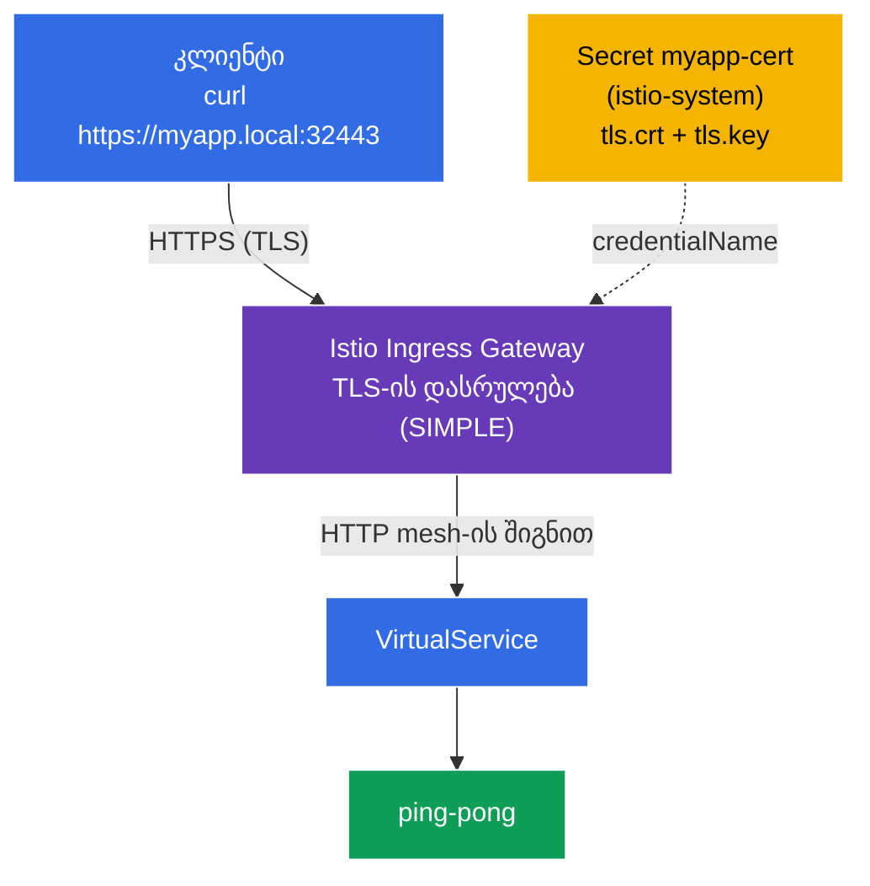

[Русская версия](README_RU.MD) · [Eng version](README.MD) · [Versión en español](README_ES.MD) · [Version française](README_FR.MD) · [Deutsche Version](README_DE.MD) · [繁體中文版](README_TW.MD) · [日本語版](README_JP.MD)

# Lab 13 - პერიმეტრული ტრაფიკის დაცვა TLS-ით

> [საცნობარო გადაწყვეტა](worker/files/solutions/1_GE.MD)

აქამდე გარედან ტრაფიკი კლასტერში **HTTP**-ის მეშვეობით შემოდიოდა (`http://myapp.local:32080`). საწარმოო გარემოში ეს დაუშვებელია - შემომავალი (edge) ტრაფიკი **TLS/HTTPS**-ით უნდა იყოს დაშიფრული. Istio საშუალებას გვაძლევს, TLS პირდაპირ ingress-შლუზზე დავასრულოთ: კლიენტი HTTPS-ით უკავშირდება, შლუზი ტრაფიკს გაშიფრავს და შემდეგ mesh-ის შიგნით სერვისს გადასცემს.

ამ ლაბორატორიაში ჩვენ:
- დავაგენერირებთ TLS-სერტიფიკატს და Kubernetes `Secret`-ში მოვათავსებთ;
- `Gateway`-ს **HTTPS**-ზე TLS-ის დასრულებით (`mode: SIMPLE`) დავაკონფიგურირებთ;
- შევამოწმებთ, რომ აპლიკაცია ხელმისაწვდომია მისამართზე `https://myapp.local:32443`.

## ინფრასტრუქტურა

გარემო Terragrunt-ის მეშვეობით AWS-ში (`eu-central-1`) იშლება და შემდეგი კომპონენტებისგან შედგება:

| კომპონენტი  | აღწერა                                          |
|------------|---------------------------------------------------|
| `vpc`      | VPC `10.10.0.0/16` საჯარო ქვექსელებით          |
| `ssh-keys` | SSH-გასაღებები ნოდებზე წვდომისთვის                      |
| `k8s-1`    | Kubernetes `1.35.2` (kubeadm) დაყენებული Istio-თი |
| `worker`   | სამუშაო მანქანა `kubectl`-ითა და კლასტერზე წვდომით   |

ინსტანსები: `t3.medium` (master) Ubuntu `22.04`. Ingress Gateway NodePort-ზე: HTTP `32080`, HTTPS `32443`.

## გაშლა

```bash
TASK=13 make run_ica_task
```

### როგორ მუშაობს ეს (ზოგადი სქემა)



## მიზანი

- ingress-შლუზისთვის TLS-სერტიფიკატისა და `Secret`-ის შექმნა.
- `Gateway`-ის `tls.mode: SIMPLE`-ით (შემოსვლისას TLS-ის დასრულება) დაკონფიგურირება.
- HTTPS-ით წვდომის შემოწმება.

## ნაბიჯი 1. აპლიკაციის დაყენება

```bash
kubectl label namespace default istio-injection=enabled --overwrite
kubectl apply -f https://raw.githubusercontent.com/ViktorUJ/cks/refs/heads/master/tasks/ica/labs/13/k8s-1/scripts/1.yaml
kubectl rollout restart deployment -n default
```

## ნაბიჯი 2. სერტიფიკატი და Secret

`myapp.local`-ისთვის თვითხელმოწერილ სერტიფიკატს ვაგენერირებთ და `tls` ტიპის `Secret`-ში ვათავსებთ.

**მნიშვნელოვანია:** `Gateway`-ში `credentialName`-ისთვის Secret ingress-შლუზის namespace-ში - `istio-system`-ში - უნდა მდებარეობდეს.

```bash
openssl req -x509 -newkey rsa:2048 -nodes -days 365 \
  -keyout myapp.key -out myapp.crt \
  -subj "/CN=myapp.local/O=demo" \
  -addext "subjectAltName=DNS:myapp.local"

kubectl create -n istio-system secret tls myapp-cert \
  --cert=myapp.crt --key=myapp.key
```

## ნაბიჯი 3. Gateway TLS-ის დასრულებით (SIMPLE)

```bash
vim gateway.yaml
```

```yaml
apiVersion: networking.istio.io/v1
kind: Gateway
metadata:
  name: myapp-gateway
  namespace: default
spec:
  selector:
    istio: ingressgateway
  servers:
  - port:
      number: 443
      name: https
      protocol: HTTPS
    tls:
      mode: SIMPLE                # სერვერის მხარეს TLS-ის ტერმინაცია
      credentialName: myapp-cert  # მითითება Secret-ზე istio-system-ში
    hosts:
    - "myapp.local"
```

```bash
kubectl apply -f gateway.yaml
```

**განმარტება:**
- **`protocol: HTTPS`** + **`tls.mode: SIMPLE`** - შლუზი იღებს TLS-კავშირებს და მათ **გაშიფრავს** (სერვერის მხარეს TLS-ის დასრულება). კლიენტი HTTPS-ით ურთიერთობს, შემდეგ კი mesh-ის შიგნით ჩვეულებრივი HTTP (ან sidecar-ებს შორის mTLS) გამოიყენება.
- **`credentialName: myapp-cert`** - სერტიფიკატისა და გასაღების შემცველი `Secret`-ის სახელია. Istio მას ingress-შლუზის namespace-იდან (`istio-system`) SDS-ის მეშვეობით კითხულობს. სწორედ ამიტომ შეიქმნა Secret `istio-system`-ში და არა `default`-ში.
- **`hosts: ["myapp.local"]`** - TLS-სერტიფიკატი და მარშრუტიზაცია ამ ჰოსტთანაა დაკავშირებული (SNI).

## ნაბიჯი 4. VirtualService

```bash
vim vs.yaml
```

```yaml
apiVersion: networking.istio.io/v1
kind: VirtualService
metadata:
  name: myapp-vs
  namespace: default
spec:
  hosts:
  - "myapp.local"
  gateways:
  - myapp-gateway
  http:
  - route:
    - destination:
        host: ping-pong
        port:
          number: 8080
```

```bash
kubectl apply -f vs.yaml
```

## ნაბიჯი 5. შემოწმება

```bash
# HTTPS მუშაობს (ფლაგი -k, რადგან სერტიფიკატი თვითხელმოწერილია)
curl -sk https://myapp.local:32443/ | grep 'Server Name'
```
```
Server Name: Ping-Pong Backend
```

ვნახოთ თავად სერტიფიკატი, რომელსაც შლუზი აბრუნებს:

```bash
curl -skv https://myapp.local:32443/ 2>&1 | grep -E 'subject:|issuer:'
```
```
*  subject: CN=myapp.local; O=demo
*  issuer: CN=myapp.local; O=demo
```

TLS ingress-შლუზზე სრულდება, კლიენტი კი `myapp.local`-ისთვის განკუთვნილ ჩვენს სერტიფიკატს ხედავს.

## (არასავალდებულო) ორმხრივი TLS შემოსვლისას (MUTUAL)

**კლიენტისგანაც** სერტიფიკატის მოსათხოვად გამოიყენება `mode: MUTUAL` - Secret-ს ემატება CA (`ca.crt`), შლუზი კი კლიენტის სერტიფიკატს ამოწმებს:

```yaml
    tls:
      mode: MUTUAL
      credentialName: myapp-cert-mtls   # tls.crt + tls.key + ca.crt
```

ამ შემთხვევაში კლიენტი ვალდებულია, საკუთარი სერტიფიკატი წარადგინოს: `curl --cert client.crt --key client.key ...`.

## შეჯამება

| რესურსი | ველი | რას აკეთებს |
|--------|------|-----------|
| `Secret` (tls) | `tls.crt` / `tls.key` | სერტიფიკატსა და გასაღებს `istio-system`-ში ინახავს |
| `Gateway` | `tls.mode: SIMPLE` + `credentialName` | შემოსვლისას HTTPS-ს ასრულებს |
| `VirtualService` | `gateways: [myapp-gateway]` | გაშიფრულ ტრაფიკს სერვისისკენ მარშრუტიზაციას უკეთებს |

**მთავარი დასკვნა:** Istio-ში პერიმეტრული ტრაფიკის დაცვა არის HTTPS-`Gateway` `tls.mode: SIMPLE`-ით (სერვერის მხარეს TLS-ის დასრულება) ან `MUTUAL`-ით (ორმხრივი TLS), რომელიც ingress-შლუზის namespace-ში სერტიფიკატის შემცველ `Secret`-ზე მიუთითებს. კლიენტები TLS-ით უკავშირდებიან, mesh-ის შიგნით კი ტრაფიკი უკვე გაშიფრული სახით გადაიცემა (და, სურვილის შემთხვევაში, sidecar-ებს შორის ცალკე mTLS-ითაა დაცული). ამასთან, აპლიკაცია TLS-ს საერთოდ არ ამუშავებს.
