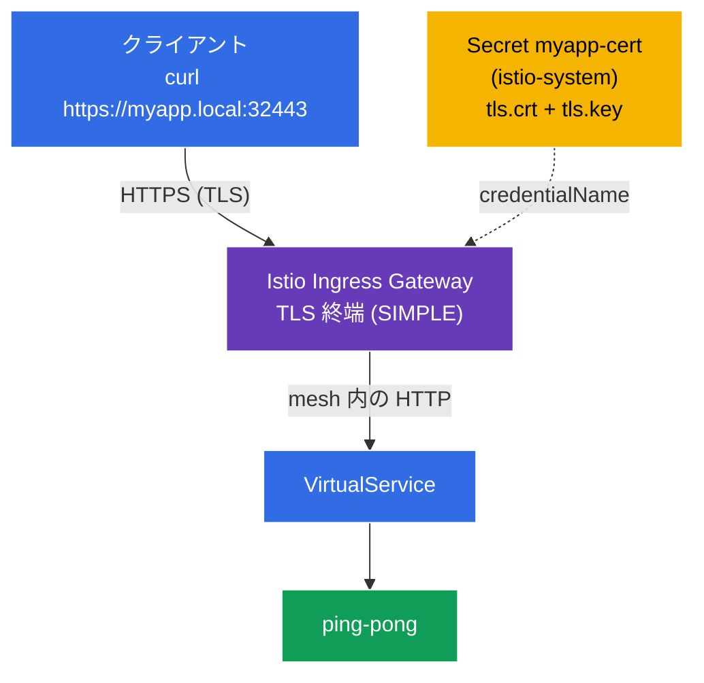

[Русская версия](README_RU.MD) · [Eng version](README.MD) · [Versión en español](README_ES.MD) · [Version française](README_FR.MD) · [Deutsche Version](README_DE.MD) · [ქართული ვერსია](README_GE.MD) · [繁體中文版](README_TW.MD)

# Lab 13 - TLS によるエッジトラフィックの保護

> [リファレンス解答](worker/files/solutions/1_JP.MD)

これまで、外部からのトラフィックは **HTTP** (`http://myapp.local:32080`) 経由でクラスターに到達していました。本番環境ではこれは許容されません。エッジでの受信トラフィックは **TLS/HTTPS** により暗号化する必要があります。Istio では、ingress ゲートウェイで直接 TLS を終端できます。クライアントは HTTPS で接続し、ゲートウェイがトラフィックを復号してから mesh 内でサービスへ転送します。

このラボでは、以下を行います:
- TLS 証明書を生成し、Kubernetes `Secret` に格納する。
- TLS 終端（`mode: SIMPLE`）を使用する **HTTPS** の `Gateway` を設定する。
- アプリケーションに `https://myapp.local:32443` でアクセスできることを確認する。

## インフラストラクチャ

環境は Terragrunt を使用して AWS（`eu-central-1`）にデプロイされ、以下で構成されています:

| コンポーネント | 説明 |
|------------|---------------------------------------------------|
| `vpc`      | パブリックサブネットを持つ VPC `10.10.0.0/16` |
| `ssh-keys` | ノードへのアクセス用 SSH キー |
| `k8s-1`    | Istio がインストールされた Kubernetes `1.35.2`（kubeadm） |
| `worker`   | `kubectl` とクラスターへのアクセスを備えた作業用マシン |

インスタンス: `t3.medium`（master）、Ubuntu `22.04`。Ingress Gateway の NodePort: HTTP `32080`、HTTPS `32443`。

## デプロイ

```bash
TASK=13 make run_ica_task
```

### 仕組み（全体図）



## 目標

- ingress ゲートウェイ用の TLS 証明書と `Secret` を作成する。
- `tls.mode: SIMPLE` を持つ `Gateway` を設定する（受信時の TLS 終端）。
- HTTPS 経由のアクセスを確認する。

## ステップ 1. アプリケーションのインストール

```bash
kubectl label namespace default istio-injection=enabled --overwrite
kubectl apply -f https://raw.githubusercontent.com/ViktorUJ/cks/refs/heads/master/tasks/ica/labs/13/k8s-1/scripts/1.yaml
kubectl rollout restart deployment -n default
```

## ステップ 2. 証明書と Secret

`myapp.local` 用の自己署名証明書を生成し、`tls` タイプの `Secret` に格納します。

**重要:** `Gateway` の `credentialName` で使用する Secret は、ingress ゲートウェイの namespace、つまり `istio-system` に配置する必要があります。

```bash
openssl req -x509 -newkey rsa:2048 -nodes -days 365 \
  -keyout myapp.key -out myapp.crt \
  -subj "/CN=myapp.local/O=demo" \
  -addext "subjectAltName=DNS:myapp.local"

kubectl create -n istio-system secret tls myapp-cert \
  --cert=myapp.crt --key=myapp.key
```

## ステップ 3. TLS 終端（SIMPLE）を使用する Gateway

```bash
vim gateway.yaml
```

```yaml
apiVersion: networking.istio.io/v1
kind: Gateway
metadata:
  name: myapp-gateway
  namespace: default
spec:
  selector:
    istio: ingressgateway
  servers:
  - port:
      number: 443
      name: https
      protocol: HTTPS
    tls:
      mode: SIMPLE                # サーバー側での TLS 終端
      credentialName: myapp-cert  # istio-system 内の Secret への参照
    hosts:
    - "myapp.local"
```

```bash
kubectl apply -f gateway.yaml
```

**解説:**
- **`protocol: HTTPS`** + **`tls.mode: SIMPLE`** - ゲートウェイは TLS 接続を受け入れ、**復号**します（サーバー側終端）。クライアントは HTTPS で通信し、その後 mesh 内では通常の HTTP（またはサイドカー間の mTLS）が使用されます。
- **`credentialName: myapp-cert`** - 証明書とキーを含む `Secret` の名前です。Istio は SDS を介して ingress ゲートウェイの namespace（`istio-system`）からこれを読み取ります。このため、Secret は `default` ではなく `istio-system` に作成されています。
- **`hosts: ["myapp.local"]`** - TLS 証明書とルーティングはこのホスト（SNI）に紐付けられます。

## ステップ 4. VirtualService

```bash
vim vs.yaml
```

```yaml
apiVersion: networking.istio.io/v1
kind: VirtualService
metadata:
  name: myapp-vs
  namespace: default
spec:
  hosts:
  - "myapp.local"
  gateways:
  - myapp-gateway
  http:
  - route:
    - destination:
        host: ping-pong
        port:
          number: 8080
```

```bash
kubectl apply -f vs.yaml
```

## ステップ 5. 確認

```bash
# HTTPS が動作する (証明書は自己署名のため -k フラグを使用)
curl -sk https://myapp.local:32443/ | grep 'Server Name'
```
```
Server Name: Ping-Pong Backend
```

ゲートウェイが提示する証明書自体を確認します:

```bash
curl -skv https://myapp.local:32443/ 2>&1 | grep -E 'subject:|issuer:'
```
```
*  subject: CN=myapp.local; O=demo
*  issuer: CN=myapp.local; O=demo
```

TLS は ingress ゲートウェイで終端され、クライアントには `myapp.local` 用の証明書が見えます。

## （任意）受信時の相互 TLS（MUTUAL）

**クライアント**にも証明書を要求するには、`mode: MUTUAL` を使用します。Secret に CA（`ca.crt`）を追加すると、ゲートウェイがクライアント証明書を検証します:

```yaml
    tls:
      mode: MUTUAL
      credentialName: myapp-cert-mtls   # tls.crt + tls.key + ca.crt
```

この場合、クライアントは自身の証明書を提示する必要があります: `curl --cert client.crt --key client.key ...`。

## まとめ

| リソース | フィールド | 動作 |
|--------|------|-----------|
| `Secret` (tls) | `tls.crt` / `tls.key` | 証明書とキーを `istio-system` に保存する |
| `Gateway` | `tls.mode: SIMPLE` + `credentialName` | 受信時に HTTPS を終端する |
| `VirtualService` | `gateways: [myapp-gateway]` | 復号されたトラフィックをサービスにルーティングする |

**重要なポイント:** Istio でエッジトラフィックを保護するには、`tls.mode: SIMPLE`（サーバー側終端）または `MUTUAL`（相互 TLS）を使用し、ingress ゲートウェイの namespace にある証明書付き `Secret` を参照する HTTPS `Gateway` を設定します。クライアントは TLS で接続し、mesh 内のトラフィックはすでに復号された状態で流れます（必要に応じて、サイドカー間の mTLS で別途保護できます）。アプリケーション自体は TLS を一切処理しません。
