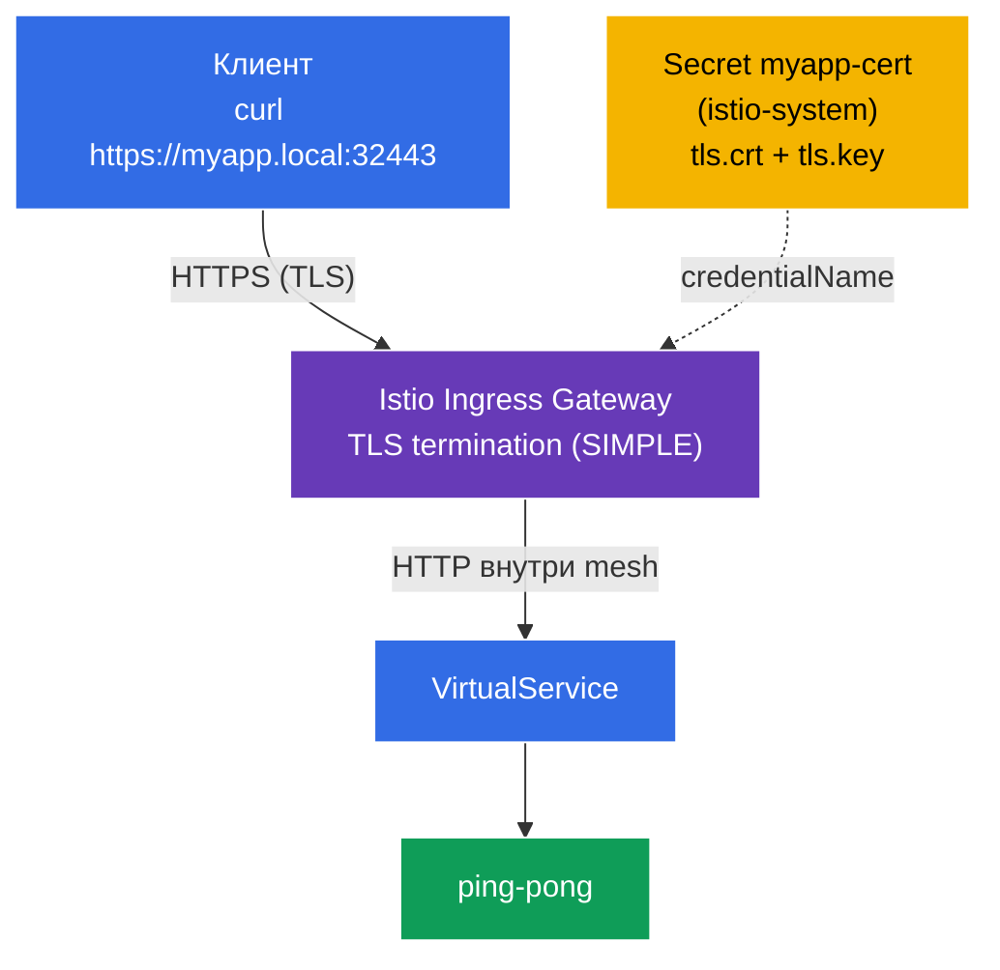

[Eng version](README.MD) · [Versión en español](README_ES.MD) · [Version française](README_FR.MD) · [Deutsche Version](README_DE.MD)

# Lab 13 - Securing Edge Traffic with TLS

До сих пор трафик снаружи приходил в кластер по **HTTP** (`http://myapp.local:32080`). В продакшене так нельзя - трафик на входе (edge) должен быть зашифрован по **TLS/HTTPS**. Istio позволяет терминировать TLS прямо на ingress-шлюзе: клиент подключается по HTTPS, шлюз расшифровывает трафик и дальше внутри mesh передаёт его сервису.

В этой лабораторной мы:
- сгенерируем TLS-сертификат и положим его в Kubernetes `Secret`;
- настроим `Gateway` на **HTTPS** с терминацией TLS (`mode: SIMPLE`);
- проверим, что приложение доступно по `https://myapp.local:32443`.

## Инфраструктура

Окружение разворачивается в AWS (`eu-central-1`) через Terragrunt и состоит из:

| Компонент  | Описание                                          |
|------------|---------------------------------------------------|
| `vpc`      | VPC `10.10.0.0/16` с публичными подсетями          |
| `ssh-keys` | SSH-ключи для доступа к нодам                      |
| `k8s-1`    | Kubernetes `1.35.2` (kubeadm) с установленным Istio |
| `worker`   | Рабочая машина с `kubectl` и доступом к кластеру   |

Инстансы: `t3.medium` (master) Ubuntu `22.04`. Ingress Gateway на NodePort: HTTP `32080`, HTTPS `32443`.

## Развёртывание

```bash
TASK=13 make run_ica_task
```

### Как это работает (общая схема)



## Цель

- Создать TLS-сертификат и `Secret` для ingress-шлюза.
- Настроить `Gateway` с `tls.mode: SIMPLE` (терминация TLS на входе).
- Проверить доступ по HTTPS.

## Шаг 1. Установка приложения

```bash
kubectl label namespace default istio-injection=enabled --overwrite
kubectl apply -f https://raw.githubusercontent.com/ViktorUJ/cks/refs/heads/master/tasks/ica/labs/13/k8s-1/scripts/1.yaml
kubectl rollout restart deployment -n default
```

## Шаг 2. Сертификат и Secret

Генерируем самоподписанный сертификат для `myapp.local` и кладём его в `Secret` типа `tls`.

**Важно:** для `credentialName` в `Gateway` Secret должен лежать в namespace ingress-шлюза - `istio-system`.

```bash
openssl req -x509 -newkey rsa:2048 -nodes -days 365 \
  -keyout myapp.key -out myapp.crt \
  -subj "/CN=myapp.local/O=demo" \
  -addext "subjectAltName=DNS:myapp.local"

kubectl create -n istio-system secret tls myapp-cert \
  --cert=myapp.crt --key=myapp.key
```

## Шаг 3. Gateway с терминацией TLS (SIMPLE)

```bash
vim gateway.yaml
```

```yaml
apiVersion: networking.istio.io/v1
kind: Gateway
metadata:
  name: myapp-gateway
  namespace: default
spec:
  selector:
    istio: ingressgateway
  servers:
  - port:
      number: 443
      name: https
      protocol: HTTPS
    tls:
      mode: SIMPLE                # серверная терминация TLS
      credentialName: myapp-cert  # ссылка на Secret в istio-system
    hosts:
    - "myapp.local"
```

```bash
kubectl apply -f gateway.yaml
```

**Разбор:**
- **`protocol: HTTPS`** + **`tls.mode: SIMPLE`** - шлюз принимает TLS-соединения и **расшифровывает** их (серверная терминация). Клиент говорит по HTTPS, дальше внутри mesh - обычный HTTP (или mTLS между сайдкарами).
- **`credentialName: myapp-cert`** - имя `Secret` с сертификатом и ключом. Istio читает его из namespace ingress-шлюза (`istio-system`) через SDS. Именно поэтому Secret создан в `istio-system`, а не в `default`.
- **`hosts: ["myapp.local"]`** - TLS-сертификат и маршрутизация привязаны к этому хосту (SNI).

## Шаг 4. VirtualService

```bash
vim vs.yaml
```

```yaml
apiVersion: networking.istio.io/v1
kind: VirtualService
metadata:
  name: myapp-vs
  namespace: default
spec:
  hosts:
  - "myapp.local"
  gateways:
  - myapp-gateway
  http:
  - route:
    - destination:
        host: ping-pong
        port:
          number: 8080
```

```bash
kubectl apply -f vs.yaml
```

## Шаг 5. Проверка

```bash
# HTTPS работает (флаг -k, т.к. сертификат самоподписанный)
curl -sk https://myapp.local:32443/ | grep 'Server Name'
```
```
Server Name: Ping-Pong Backend
```

Смотрим сам сертификат, который отдаёт шлюз:

```bash
curl -skv https://myapp.local:32443/ 2>&1 | grep -E 'subject:|issuer:'
```
```
*  subject: CN=myapp.local; O=demo
*  issuer: CN=myapp.local; O=demo
```

TLS терминируется на ingress-шлюзе, а клиент видит наш сертификат для `myapp.local`.

## (опционально) Взаимный TLS на входе (MUTUAL)

Чтобы требовать сертификат и от **клиента**, используется `mode: MUTUAL` - в Secret добавляется CA (`ca.crt`), а шлюз проверяет клиентский сертификат:

```yaml
    tls:
      mode: MUTUAL
      credentialName: myapp-cert-mtls   # tls.crt + tls.key + ca.crt
```

Тогда клиент обязан предъявить свой сертификат: `curl --cert client.crt --key client.key ...`.

## Итог

| Ресурс | Поле | Что делает |
|--------|------|-----------|
| `Secret` (tls) | `tls.crt` / `tls.key` | хранит сертификат и ключ в `istio-system` |
| `Gateway` | `tls.mode: SIMPLE` + `credentialName` | терминирует HTTPS на входе |
| `VirtualService` | `gateways: [myapp-gateway]` | маршрутизирует расшифрованный трафик на сервис |

**Ключевой вывод:** защита edge-трафика в Istio - это HTTPS-`Gateway` с `tls.mode: SIMPLE` (серверная терминация) или `MUTUAL` (взаимный TLS), ссылающийся на `Secret` с сертификатом в namespace ingress-шлюза. Клиенты подключаются по TLS, а внутри mesh трафик идёт уже расшифрованным (и, при желании, защищён отдельно mTLS между сайдкарами). Приложение при этом не занимается TLS вообще.
