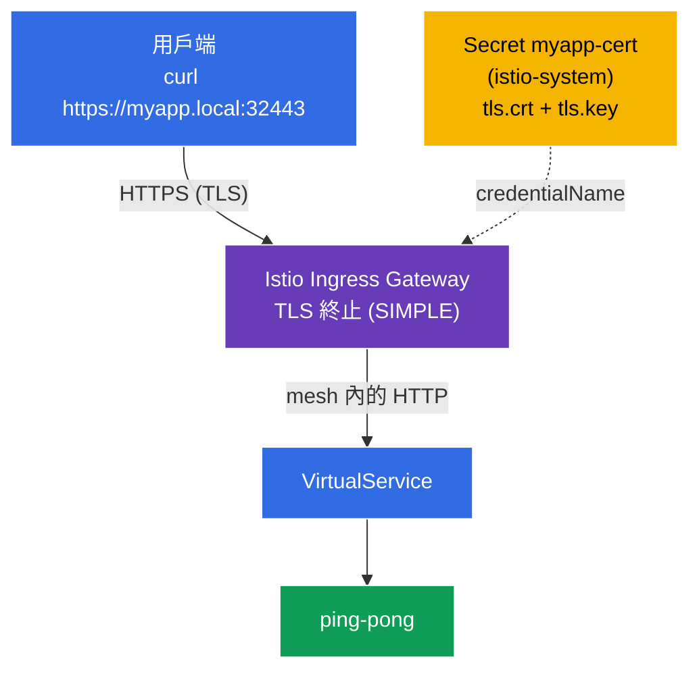

[Русская версия](README_RU.MD) · [Eng version](README.MD) · [Versión en español](README_ES.MD) · [Version française](README_FR.MD) · [Deutsche Version](README_DE.MD) · [ქართული ვერსია](README_GE.MD) · [日本語版](README_JP.MD)

# 實驗 13 - 使用 TLS 保護邊緣流量

> [參考解答](worker/files/solutions/1_TW.MD)

到目前為止，來自外部的流量會透過 **HTTP** (`http://myapp.local:32080`) 進入叢集。在生產環境中這不可接受--入口（edge）流量必須使用 **TLS/HTTPS** 加密。Istio 可直接在 ingress 閘道上終止 TLS：用戶端透過 HTTPS 連線，閘道解密流量後，再於 mesh 內將其傳送至服務。

在本實驗中，我們將：
- 產生 TLS 憑證並將其存入 Kubernetes `Secret`；
- 設定使用 **HTTPS** 且會終止 TLS 的 `Gateway`（`mode: SIMPLE`）；
- 驗證應用程式可透過 `https://myapp.local:32443` 存取。

## 基礎架構

環境透過 Terragrunt 在 AWS（`eu-central-1`）中部署，包含：

| 元件  | 說明                                          |
|------------|---------------------------------------------------|
| `vpc`      | 具有公有子網路的 VPC `10.10.0.0/16`          |
| `ssh-keys` | 用於存取節點的 SSH 金鑰                      |
| `k8s-1`    | 已安裝 Istio 的 Kubernetes `1.35.2`（kubeadm） |
| `worker`   | 具備 `kubectl` 且可存取叢集的工作機器   |

執行個體：`t3.medium`（master）Ubuntu `22.04`。Ingress Gateway 使用 NodePort：HTTP `32080`、HTTPS `32443`。

## 部署

```bash
TASK=13 make run_ica_task
```

### 運作方式（整體架構）



## 目標

- 建立用於 ingress 閘道的 TLS 憑證與 `Secret`。
- 設定 `tls.mode: SIMPLE` 的 `Gateway`（在入口終止 TLS）。
- 驗證 HTTPS 存取。

## 步驟 1. 安裝應用程式

```bash
kubectl label namespace default istio-injection=enabled --overwrite
kubectl apply -f https://raw.githubusercontent.com/ViktorUJ/cks/refs/heads/master/tasks/ica/labs/13/k8s-1/scripts/1.yaml
kubectl rollout restart deployment -n default
```

## 步驟 2. 憑證與 Secret

為 `myapp.local` 產生自簽憑證，並將其存入 `tls` 類型的 `Secret`。

**重要：** `Gateway` 中由 `credentialName` 引用的 Secret 必須位於 ingress 閘道的 namespace--`istio-system`。

```bash
openssl req -x509 -newkey rsa:2048 -nodes -days 365 \
  -keyout myapp.key -out myapp.crt \
  -subj "/CN=myapp.local/O=demo" \
  -addext "subjectAltName=DNS:myapp.local"

kubectl create -n istio-system secret tls myapp-cert \
  --cert=myapp.crt --key=myapp.key
```

## 步驟 3. 使用 TLS 終止（SIMPLE）的 Gateway

```bash
vim gateway.yaml
```

```yaml
apiVersion: networking.istio.io/v1
kind: Gateway
metadata:
  name: myapp-gateway
  namespace: default
spec:
  selector:
    istio: ingressgateway
  servers:
  - port:
      number: 443
      name: https
      protocol: HTTPS
    tls:
      mode: SIMPLE                # 伺服器端 TLS 終止
      credentialName: myapp-cert  # 參照 istio-system 中的 Secret
    hosts:
    - "myapp.local"
```

```bash
kubectl apply -f gateway.yaml
```

**說明：**
- **`protocol: HTTPS`** + **`tls.mode: SIMPLE`**--閘道接受 TLS 連線並將其**解密**（伺服器端終止）。用戶端使用 HTTPS，後續在 mesh 內則是一般 HTTP（或 sidecar 之間使用 mTLS）。
- **`credentialName: myapp-cert`**--含有憑證與金鑰的 `Secret` 名稱。Istio 透過 SDS 從 ingress 閘道的 namespace（`istio-system`）讀取它。這正是為何 Secret 建立於 `istio-system` 而非 `default`。
- **`hosts: ["myapp.local"]`**--TLS 憑證與路由皆繫結至此主機（SNI）。

## 步驟 4. VirtualService

```bash
vim vs.yaml
```

```yaml
apiVersion: networking.istio.io/v1
kind: VirtualService
metadata:
  name: myapp-vs
  namespace: default
spec:
  hosts:
  - "myapp.local"
  gateways:
  - myapp-gateway
  http:
  - route:
    - destination:
        host: ping-pong
        port:
          number: 8080
```

```bash
kubectl apply -f vs.yaml
```

## 步驟 5. 驗證

```bash
# HTTPS 可運作 (使用 -k 旗標，因為憑證為自簽)
curl -sk https://myapp.local:32443/ | grep 'Server Name'
```
```
Server Name: Ping-Pong Backend
```

查看閘道提供的憑證本身：

```bash
curl -skv https://myapp.local:32443/ 2>&1 | grep -E 'subject:|issuer:'
```
```
*  subject: CN=myapp.local; O=demo
*  issuer: CN=myapp.local; O=demo
```

TLS 在 ingress 閘道上終止，而用戶端會看到我們為 `myapp.local` 提供的憑證。

## （選用）入口處的雙向 TLS（MUTUAL）

若要同時要求**用戶端**提供憑證，請使用 `mode: MUTUAL`--在 Secret 中加入 CA（`ca.crt`），閘道便會驗證用戶端憑證：

```yaml
    tls:
      mode: MUTUAL
      credentialName: myapp-cert-mtls   # tls.crt + tls.key + ca.crt
```

此時用戶端必須出示自己的憑證：`curl --cert client.crt --key client.key ...`。

## 總結

| 資源 | 欄位 | 功能 |
|--------|------|-----------|
| `Secret` (tls) | `tls.crt` / `tls.key` | 在 `istio-system` 中儲存憑證與金鑰 |
| `Gateway` | `tls.mode: SIMPLE` + `credentialName` | 在入口終止 HTTPS |
| `VirtualService` | `gateways: [myapp-gateway]` | 將已解密的流量路由至服務 |

**關鍵結論：** 在 Istio 中保護 edge 流量，是使用具有 `tls.mode: SIMPLE`（伺服器端終止）或 `MUTUAL`（雙向 TLS）的 HTTPS `Gateway`，並讓它引用 ingress 閘道 namespace 中含憑證的 `Secret`。用戶端透過 TLS 連線，而 mesh 內的流量已解密（並可選擇再透過 sidecar 之間的 mTLS 個別保護）。應用程式本身完全不需處理 TLS。