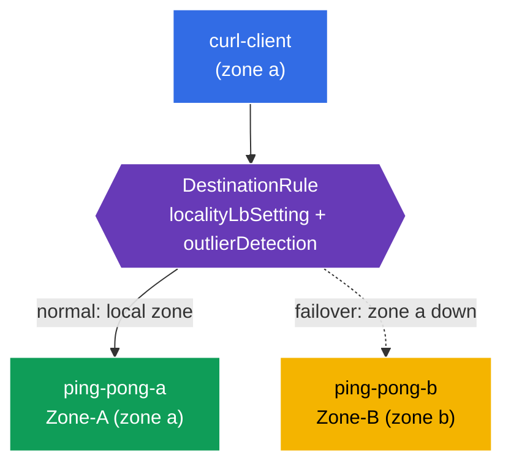

[RU version](README_RU.MD) · [Versión en español](README_ES.MD)

# Lab 14 - Locality-aware Failover

Imagine your service runs across two availability zones (`eu-central-1a` and `eu-central-1b`). Normally you want a client to reach the **nearest** (same-zone) instance - it lowers latency and cross-zone traffic. But if the local instance fails, traffic must **automatically fail over** to the other zone. That's **locality-aware load balancing + failover**.

Istio implements this based on node topology (`topology.kubernetes.io/region` / `zone`): it knows which zone each endpoint is in and routes traffic to the local zone first, failing over to a neighbouring zone when the local one is unavailable.

## Infrastructure

The environment is provisioned in AWS (`eu-central-1`) using Terragrunt and includes:

| Component  | Description                                       |
|------------|---------------------------------------------------|
| `vpc`      | VPC `10.10.0.0/16` with public subnets            |
| `ssh-keys` | SSH keys for node access                          |
| `k8s-1`    | Kubernetes `1.35.2` (kubeadm) with Istio; **control-plane + 2 worker nodes in different zones** (`1a`, `1b`) |
| `worker`   | Workstation with `kubectl` and cluster access     |

Instances: `t3.medium`, Ubuntu `22.04`. Worker nodes get their `topology.kubernetes.io/zone` labels at join time via `node_labels` (kubelet `--node-labels`) - self-managed kubeadm without a cloud provider doesn't set them.

## Provisioning

```bash
TASK=14 make run_ica_task
```

### How It Works (High-Level Overview)



## Objective

- Configure a `DestinationRule` with `localityLbSetting` + `outlierDetection`.
- Confirm a client in zone a is served by the local backend (Zone-A).
- Verify **failover**: when zone a is down, traffic goes to zone b (Zone-B).

## Step 1. Check the node topology labels

Istio derives endpoint locality from node labels. Confirm the nodes carry a zone:

```bash
kubectl get nodes -L topology.kubernetes.io/zone
```
```
NAME              ...   ZONE
ip-10-10-1-xxx    ...                   # control-plane (no zone)
ip-10-10-1-yyy    ...   eu-central-1a   # worker-a
ip-10-10-2-zzz    ...   eu-central-1b   # worker-b
```

**Important:** in a cloud these labels are set by the cloud provider. Self-managed kubeadm doesn't have them - in this lab they're set on the worker nodes via `node_labels` at join time. Without them, locality LB doesn't work.

## Step 2. Deploy the Application

```bash
kubectl label namespace default istio-injection=enabled --overwrite
kubectl apply -f https://raw.githubusercontent.com/ViktorUJ/cks/refs/heads/master/tasks/ica/labs/14/k8s-1/scripts/1.yaml
kubectl rollout restart deployment -n default
```

**What gets deployed:** one `ping-pong` Service backed by two Deployments:
- **`ping-pong-a`** - pinned to zone a (`nodeSelector` zone=eu-central-1a), `SERVER_NAME: "Zone-A"`;
- **`ping-pong-b`** - pinned to zone b, `SERVER_NAME: "Zone-B"`;
- **`curl-client`** - in zone a (same locality as ping-pong-a).

Both backends carry the label `app: ping-pong`, so the Service has endpoints in **both** zones, and Istio knows the locality of each.

```bash
kubectl get pods -n default -o wide
```

## Step 3. DestinationRule - locality LB + outlier detection

Locality failover needs **two** pieces: `outlierDetection` (to detect unhealthy endpoints) and `localityLbSetting` (to enable locality-aware routing).

```bash
vim dr.yaml
```

```yaml
apiVersion: networking.istio.io/v1
kind: DestinationRule
metadata:
  name: ping-pong-dr
  namespace: default
spec:
  host: ping-pong
  trafficPolicy:
    loadBalancer:
      simple: ROUND_ROBIN
      localityLbSetting:
        enabled: true          # enable zone-aware routing
    outlierDetection:          # required for failover
      consecutive5xxErrors: 1
      interval: 1s
      baseEjectionTime: 1m
      maxEjectionPercent: 100
```

```bash
kubectl apply -f dr.yaml
```

**Breakdown:**
- **`localityLbSetting.enabled: true`** - enables local-zone preference: traffic goes to endpoints in the same zone as the client while they're healthy.
- **`outlierDetection`** - without it, failover doesn't work. Istio needs to be able to mark endpoints unhealthy in order to eject them and shift to another zone. It's what "turns on" the locality priority/failover machinery.

## Step 4. Observe local-zone preference

The client is in zone a, so it's served by the local Zone-A backend:

```bash
for i in $(seq 5); do
  kubectl exec -n default deploy/curl-client -c curl -- curl -s http://ping-pong:8080/ | grep 'Server Name';
done
```
```
Server Name: Zone-A
Server Name: Zone-A
Server Name: Zone-A
Server Name: Zone-A
Server Name: Zone-A
```

All traffic stays in its own zone - zone b is not used, even though its endpoint is healthy and part of the Service.

## Step 5. Failover - take zone a down

Bring the local (Zone-A) backend down and watch traffic shift to Zone-B:

```bash
kubectl scale deployment ping-pong-a -n default --replicas=0
kubectl wait --for=delete pod -l app=ping-pong,zone=a -n default --timeout=60s

for i in $(seq 5); do
  kubectl exec -n default deploy/curl-client -c curl -- curl -s http://ping-pong:8080/ | grep 'Server Name';
done
```
```
Server Name: Zone-B
Server Name: Zone-B
Server Name: Zone-B
Server Name: Zone-B
Server Name: Zone-B
```

There are no local endpoints in zone a anymore → Istio automatically shifts traffic to zone b. The application stays available despite a whole zone "going down".

Restore zone a:

```bash
kubectl scale deployment ping-pong-a -n default --replicas=1
```

Once recovered, traffic prefers the local Zone-A again.

## Summary

| Element | Role |
|---------|------|
| Node labels `topology.kubernetes.io/zone` | source of endpoint locality information |
| `localityLbSetting.enabled` | local-zone preference |
| `outlierDetection` | required for failover (no ejection → no failover) |

**Key takeaway:** locality-aware failover in Istio is built on node topology plus the pairing of `localityLbSetting` + `outlierDetection`. Normally traffic stays in its own zone (lower latency, less cross-zone traffic), and when local endpoints fail it automatically shifts to a neighbouring zone - with no intervention and no application code changes.
