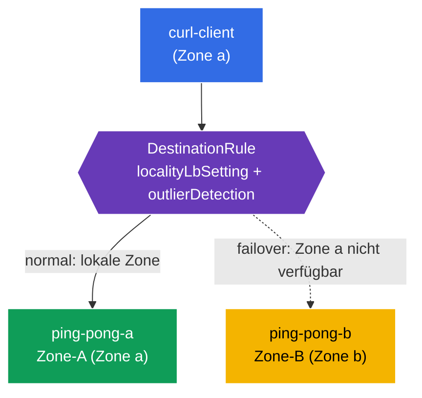

[RU version](README_RU.MD) · [Eng version](README.MD) · [Versión en español](README_ES.MD) · [Version française](README_FR.MD)

# Lab 14 - Locality-aware Failover (Ausfallsicherheit nach Zonen)

Stellen Sie sich vor: Ihr Service läuft in zwei Availability Zones (`eu-central-1a` und `eu-central-1b`). Im Normalbetrieb möchte man, dass der Client zur **nächstgelegenen** Instanz (in seiner Zone) geht - das verringert Latenz und Traffic zwischen den Zonen. Aber wenn die lokale Instanz ausfällt, soll der Traffic **automatisch** auf die andere Zone umschalten. Genau das ist **Locality-aware Load Balancing + Failover**.

Istio realisiert das auf Basis der Topologie der Nodes (`topology.kubernetes.io/region` / `zone`): Es weiß, in welcher Zone sich jeder Endpoint befindet, und leitet den Traffic zuerst in die lokale Zone und bei deren Nichtverfügbarkeit in die benachbarte.

## Infrastruktur

Die Umgebung wird in AWS (`eu-central-1`) über Terragrunt bereitgestellt und besteht aus:

| Komponente  | Beschreibung                                          |
|------------|---------------------------------------------------|
| `vpc`      | VPC `10.10.0.0/16` mit öffentlichen Subnetzen          |
| `ssh-keys` | SSH-Schlüssel für den Zugriff auf die Nodes                      |
| `k8s-1`    | Kubernetes `1.35.2` (kubeadm) mit Istio; **control-plane + 2 Worker-Nodes in verschiedenen Zonen** (`1a`, `1b`) |
| `worker`   | Arbeitsmaschine mit `kubectl` und Zugriff auf den Cluster   |

Instanzen: `t3.medium`, Ubuntu `22.04`. Worker-Nodes erhalten beim Join die Labels `topology.kubernetes.io/zone` über `node_labels` (kubelet `--node-labels`) - ein self-managed kubeadm ohne Cloud-Provider setzt sie nicht.

## Bereitstellung

```bash
TASK=14 make run_ica_task
```

### Wie das funktioniert (Gesamtschema)



## Ziel

- Eine `DestinationRule` mit `localityLbSetting` + `outlierDetection` konfigurieren.
- Sich überzeugen, dass ein Client aus Zone a vom lokalen Backend (Zone-A) bedient wird.
- Das **Failover** prüfen: Bei Ausfall von Zone a geht der Traffic in Zone b (Zone-B).

## Schritt 1. Prüfung der Topologie-Labels der Nodes

Istio berechnet die Locality der Endpoints aus den Labels der Nodes. Wir prüfen, dass die Nodes mit Zonen gekennzeichnet sind:

```bash
kubectl get nodes -L topology.kubernetes.io/zone
```
```
NAME              ...   ZONE
ip-10-10-1-xxx    ...            # control-plane (ohne Zone)
ip-10-10-1-yyy    ...   eu-central-1a   # worker-a
ip-10-10-2-zzz    ...   eu-central-1b   # worker-b
```

**Wichtig:** In der Cloud setzt der Cloud-Provider diese Labels. In einem self-managed kubeadm gibt es sie nicht - in diesem Lab werden sie auf den Worker-Nodes über `node_labels` beim Join gesetzt. Ohne sie funktioniert Locality LB nicht.

## Schritt 2. Installation der Anwendung

```bash
kubectl label namespace default istio-injection=enabled --overwrite
kubectl apply -f https://raw.githubusercontent.com/ViktorUJ/cks/refs/heads/master/tasks/ica/labs/14/k8s-1/scripts/1.yaml
kubectl rollout restart deployment -n default
```

**Was bereitgestellt wird:** ein Service `ping-pong` und zwei Deployments darunter:
- **`ping-pong-a`** - an Zone a gebunden (`nodeSelector` zone=eu-central-1a), `SERVER_NAME: "Zone-A"`;
- **`ping-pong-b`** - an Zone b gebunden, `SERVER_NAME: "Zone-B"`;
- **`curl-client`** - in Zone a (dieselbe Locality wie ping-pong-a).

Beide Backends haben das Label `app: ping-pong`, daher sieht der Service Endpoints in **beiden** Zonen, und Istio kennt die Locality jedes einzelnen.

```bash
kubectl get pods -n default -o wide
```

## Schritt 3. DestinationRule - Locality LB + Outlier Detection

Für Locality-Failover werden **zwei** Elemente benötigt: `outlierDetection` (Erkennung ungesunder Endpoints) und `localityLbSetting` (Aktivierung des Routings nach Locality).

```bash
vim dr.yaml
```

```yaml
apiVersion: networking.istio.io/v1
kind: DestinationRule
metadata:
  name: ping-pong-dr
  namespace: default
spec:
  host: ping-pong
  trafficPolicy:
    loadBalancer:
      simple: ROUND_ROBIN
      localityLbSetting:
        enabled: true          # wir aktivieren das Routing unter Berücksichtigung der Zonen
    outlierDetection:          # zwingend für Failover
      consecutive5xxErrors: 1
      interval: 1s
      baseEjectionTime: 1m
      maxEjectionPercent: 100
```

```bash
kubectl apply -f dr.yaml
```

**Erläuterung:**
- **`localityLbSetting.enabled: true`** - aktiviert die Bevorzugung der lokalen Zone: Der Traffic geht zu den Endpoints derselben Zone wie der Client, solange sie gesund sind.
- **`outlierDetection`** - ohne es funktioniert das Failover nicht. Istio muss Endpoints als ungesund markieren können, um sie auszuschließen und auf eine andere Zone umzuschalten. Selbst wenn die lokalen Endpoints einfach verschwunden sind, ist es gerade die Outlier Detection, die den Mechanismus der Locality-Prioritäten und Überläufe „einschaltet".

## Schritt 4. Prüfung der lokalen Bevorzugung

Client in Zone a → wird vom lokalen Zone-A bedient:

```bash
for i in $(seq 5); do
  kubectl exec -n default deploy/curl-client -c curl -- curl -s http://ping-pong:8080/ | grep 'Server Name';
done
```
```
Server Name: Zone-A
Server Name: Zone-A
Server Name: Zone-A
Server Name: Zone-A
Server Name: Zone-A
```

Der gesamte Traffic bleibt in seiner Zone - Zone b wird nicht in Anspruch genommen, obwohl ihr Endpoint gesund ist und zum Service gehört.

## Schritt 5. Failover - wir „legen" Zone a lahm

Wir setzen das lokale Backend (Zone-A) außer Betrieb und sehen, dass der Traffic auf Zone-B umschaltet:

```bash
kubectl scale deployment ping-pong-a -n default --replicas=0
kubectl wait --for=delete pod -l app=ping-pong,zone=a -n default --timeout=60s

for i in $(seq 5); do
  kubectl exec -n default deploy/curl-client -c curl -- curl -s http://ping-pong:8080/ | grep 'Server Name';
done
```
```
Server Name: Zone-B
Server Name: Zone-B
Server Name: Zone-B
Server Name: Zone-B
Server Name: Zone-B
```

Es gibt keine lokalen Endpoints in Zone a mehr → Istio leitet den Traffic automatisch in Zone b um. Die Anwendung bleibt erreichbar, trotz des „Ausfalls" einer ganzen Zone.

Wir stellen Zone a wieder her:

```bash
kubectl scale deployment ping-pong-a -n default --replicas=1
```

Nach der Wiederherstellung bevorzugt der Traffic erneut das lokale Zone-A.

## Fazit

| Element | Rolle |
|---------|------|
| Node-Labels `topology.kubernetes.io/zone` | Informationsquelle über die Locality der Endpoints |
| `localityLbSetting.enabled` | Bevorzugung der lokalen Zone |
| `outlierDetection` | zwingende Voraussetzung für Failover (ohne es gibt es keine Überläufe) |

**Zentrale Erkenntnis:** Locality-aware Failover in Istio baut auf der Topologie der Nodes und der Kombination `localityLbSetting` + `outlierDetection` auf. Im Normalfall bleibt der Traffic in seiner Zone (weniger Latenz und Cross-Zone-Traffic), und bei Ausfall der lokalen Endpoints wird er automatisch in die benachbarte Zone umgeleitet - ohne Eingriff und ohne Änderung des Anwendungscodes.
