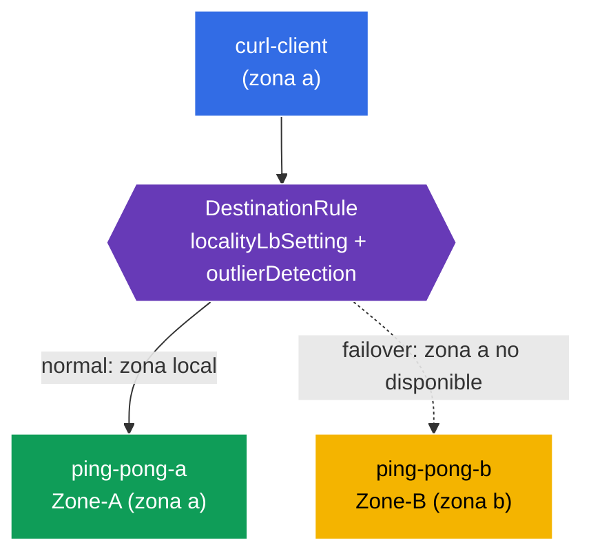

[RU version](README_RU.MD) · [Eng version](README.MD) · [Version française](README_FR.MD) · [Deutsche Version](README_DE.MD)

# Lab 14 - Locality-aware Failover (tolerancia a fallos por zonas)

Imagina: tu servicio funciona en dos zonas de disponibilidad (`eu-central-1a` y `eu-central-1b`). En condiciones normales quieres que el cliente vaya a la instancia **más cercana** (en su propia zona) - esto reduce la latencia y el tráfico entre zonas. Pero si la instancia local falla, el tráfico debe **conmutar automáticamente** a otra zona. Esto es precisamente el **balanceo de carga locality-aware + failover**.

Istio lo implementa a partir de la topología de los nodos (`topology.kubernetes.io/region` / `zone`): sabe en qué zona se encuentra cada endpoint y dirige el tráfico primero a la zona local, y si esta no está disponible, a la vecina.

## Infraestructura

El entorno se despliega en AWS (`eu-central-1`) mediante Terragrunt y consta de:

| Componente | Descripción                                        |
|------------|---------------------------------------------------|
| `vpc`      | VPC `10.10.0.0/16` con subredes públicas           |
| `ssh-keys` | Claves SSH para el acceso a los nodos              |
| `k8s-1`    | Kubernetes `1.35.2` (kubeadm) con Istio; **control-plane + 2 nodos worker en distintas zonas** (`1a`, `1b`) |
| `worker`   | Máquina de trabajo con `kubectl` y acceso al clúster |

Instancias: `t3.medium`, Ubuntu `22.04`. Los nodos worker, al unirse, reciben las etiquetas `topology.kubernetes.io/zone` mediante `node_labels` (kubelet `--node-labels`) - un kubeadm self-managed sin cloud-provider no las establece.

## Despliegue

```bash
TASK=14 make run_ica_task
```

### Cómo funciona (esquema general)



## Objetivo

- Configurar un `DestinationRule` con `localityLbSetting` + `outlierDetection`.
- Comprobar que el cliente de la zona a es atendido por el backend local (Zone-A).
- Verificar el **failover**: si la zona a falla, el tráfico va a la zona b (Zone-B).

## Paso 1. Comprobación de las etiquetas topológicas de los nodos

Istio calcula la localidad de los endpoints a partir de las etiquetas de los nodos. Comprobemos que los nodos están marcados con zonas:

```bash
kubectl get nodes -L topology.kubernetes.io/zone
```
```
NAME              ...   ZONE
ip-10-10-1-xxx    ...            # control-plane (sin zona)
ip-10-10-1-yyy    ...   eu-central-1a   # worker-a
ip-10-10-2-zzz    ...   eu-central-1b   # worker-b
```

**Importante:** en la nube estas etiquetas las establece el cloud-provider. En un kubeadm self-managed no existen - en este lab se asignan a los nodos worker mediante `node_labels` al unirse. Sin ellas, el locality LB no funciona.

## Paso 2. Instalación de la aplicación

```bash
kubectl label namespace default istio-injection=enabled --overwrite
kubectl apply -f https://raw.githubusercontent.com/ViktorUJ/cks/refs/heads/master/tasks/ica/labs/14/k8s-1/scripts/1.yaml
kubectl rollout restart deployment -n default
```

**Qué se despliega:** un único Service `ping-pong` y dos Deployment bajo él:
- **`ping-pong-a`** - fijado a la zona a (`nodeSelector` zone=eu-central-1a), `SERVER_NAME: "Zone-A"`;
- **`ping-pong-b`** - fijado a la zona b, `SERVER_NAME: "Zone-B"`;
- **`curl-client`** - en la zona a (la misma localidad que ping-pong-a).

Ambos backends tienen la etiqueta `app: ping-pong`, por lo que el Service ve endpoints en **ambas** zonas, e Istio conoce la localidad de cada uno.

```bash
kubectl get pods -n default -o wide
```

## Paso 3. DestinationRule - locality LB + outlier detection

Para el locality failover se necesitan **dos** elementos: `outlierDetection` (detección de endpoints no saludables) y `localityLbSetting` (activación del enrutamiento por localidad).

```bash
vim dr.yaml
```

```yaml
apiVersion: networking.istio.io/v1
kind: DestinationRule
metadata:
  name: ping-pong-dr
  namespace: default
spec:
  host: ping-pong
  trafficPolicy:
    loadBalancer:
      simple: ROUND_ROBIN
      localityLbSetting:
        enabled: true          # activamos el enrutamiento teniendo en cuenta las zonas
    outlierDetection:          # obligatorio para failover
      consecutive5xxErrors: 1
      interval: 1s
      baseEjectionTime: 1m
      maxEjectionPercent: 100
```

```bash
kubectl apply -f dr.yaml
```

**Análisis:**
- **`localityLbSetting.enabled: true`** - activa la preferencia por la zona local: el tráfico va a los endpoints de la misma zona que el cliente mientras estén saludables.
- **`outlierDetection`** - sin él el failover no funciona. Istio debe poder marcar los endpoints como no saludables para excluirlos y conmutar a otra zona. Incluso si los endpoints locales simplemente desaparecen, es precisamente la outlier detection la que «activa» el mecanismo de prioridades de localidad y los desbordamientos.

## Paso 4. Comprobación de la preferencia local

Cliente en la zona a → atendido por el Zone-A local:

```bash
for i in $(seq 5); do
  kubectl exec -n default deploy/curl-client -c curl -- curl -s http://ping-pong:8080/ | grep 'Server Name';
done
```
```
Server Name: Zone-A
Server Name: Zone-A
Server Name: Zone-A
Server Name: Zone-A
Server Name: Zone-A
```

Todo el tráfico se mantiene en su propia zona - la zona b no se utiliza, aunque su endpoint esté saludable y forme parte del Service.

## Paso 5. Failover - «tiramos» la zona a

Sacamos de servicio el backend local (Zone-A) y observamos que el tráfico conmuta a Zone-B:

```bash
kubectl scale deployment ping-pong-a -n default --replicas=0
kubectl wait --for=delete pod -l app=ping-pong,zone=a -n default --timeout=60s

for i in $(seq 5); do
  kubectl exec -n default deploy/curl-client -c curl -- curl -s http://ping-pong:8080/ | grep 'Server Name';
done
```
```
Server Name: Zone-B
Server Name: Zone-B
Server Name: Zone-B
Server Name: Zone-B
Server Name: Zone-B
```

Ya no hay endpoints locales en la zona a → Istio desborda el tráfico automáticamente a la zona b. La aplicación sigue disponible, a pesar de la «caída» de una zona entera.

Restauramos la zona a:

```bash
kubectl scale deployment ping-pong-a -n default --replicas=1
```

Tras la recuperación, el tráfico volverá a preferir la Zone-A local.

## Resumen

| Elemento | Rol |
|---------|------|
| Etiquetas de nodos `topology.kubernetes.io/zone` | fuente de información sobre la localidad de los endpoints |
| `localityLbSetting.enabled` | preferencia por la zona local |
| `outlierDetection` | condición obligatoria para el failover (sin él no hay desbordamientos) |

**Conclusión clave:** el locality-aware failover en Istio se construye sobre la topología de los nodos y la combinación `localityLbSetting` + `outlierDetection`. En condiciones normales el tráfico se mantiene en su propia zona (menos latencia y tráfico cross-zone), y cuando los endpoints locales fallan se desborda automáticamente a la zona vecina - sin intervención y sin cambiar el código de la aplicación.
