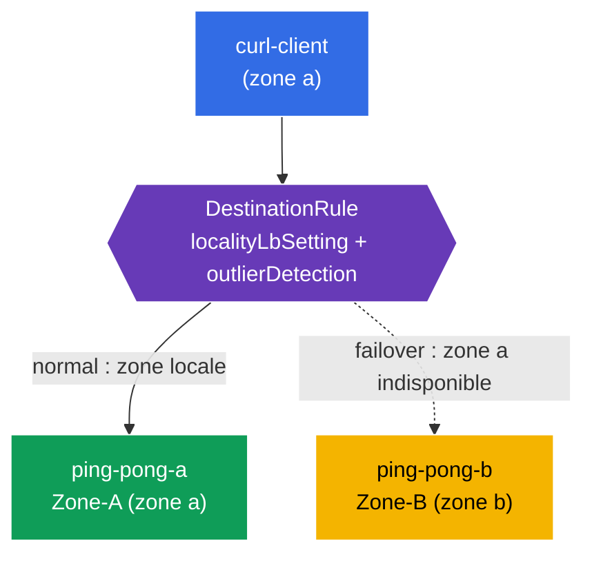

[RU version](README_RU.MD) · [Eng version](README.MD) · [Versión en español](README_ES.MD) · [Deutsche Version](README_DE.MD)

# Lab 14 - Locality-aware Failover (résilience par zones)

Imaginez : votre service tourne dans deux zones de disponibilité (`eu-central-1a` et `eu-central-1b`). En fonctionnement normal, on veut que le client s'adresse à l'instance la **plus proche** (dans sa propre zone) - cela réduit la latence et le trafic entre zones. Mais si l'instance locale tombe en panne - le trafic doit **basculer automatiquement** vers l'autre zone. C'est le **locality-aware load balancing + failover**.

Istio l'implémente à partir de la topologie des nœuds (`topology.kubernetes.io/region` / `zone`) : il sait dans quelle zone se trouve chaque endpoint et dirige le trafic d'abord vers la zone locale, puis, lorsqu'elle est indisponible, vers la zone voisine.

## Infrastructure

L'environnement est déployé dans AWS (`eu-central-1`) via Terragrunt et se compose de :

| Composant  | Description                                          |
|------------|---------------------------------------------------|
| `vpc`      | VPC `10.10.0.0/16` avec des sous-réseaux publics          |
| `ssh-keys` | clés SSH pour l'accès aux nœuds                      |
| `k8s-1`    | Kubernetes `1.35.2` (kubeadm) avec Istio ; **control-plane + 2 nœuds worker dans des zones différentes** (`1a`, `1b`) |
| `worker`   | machine de travail avec `kubectl` et accès au cluster   |

Instances : `t3.medium`, Ubuntu `22.04`. À la jointure, les nœuds worker reçoivent les labels `topology.kubernetes.io/zone` via `node_labels` (kubelet `--node-labels`) - kubeadm self-managed sans cloud-provider ne les pose pas.

## Déploiement

```bash
TASK=14 make run_ica_task
```

### Comment ça marche (schéma général)



## Objectif

- Configurer un `DestinationRule` avec `localityLbSetting` + `outlierDetection`.
- Vérifier qu'un client de la zone a est servi par le backend local (Zone-A).
- Tester le **failover** : en cas de panne de la zone a, le trafic bascule vers la zone b (Zone-B).

## Étape 1. Vérification des labels topologiques des nœuds

Istio calcule la localité des endpoints à partir des labels des nœuds. Vérifions que les nœuds sont marqués avec leurs zones :

```bash
kubectl get nodes -L topology.kubernetes.io/zone
```
```
NAME              ...   ZONE
ip-10-10-1-xxx    ...            # control-plane (sans zone)
ip-10-10-1-yyy    ...   eu-central-1a   # worker-a
ip-10-10-2-zzz    ...   eu-central-1b   # worker-b
```

**Important :** dans le cloud, ces labels sont posés par le cloud-provider. En kubeadm self-managed, ils n'existent pas - dans ce lab, ils sont définis sur les nœuds worker via `node_labels` à la jointure. Sans eux, le locality LB ne fonctionne pas.

## Étape 2. Installation de l'application

```bash
kubectl label namespace default istio-injection=enabled --overwrite
kubectl apply -f https://raw.githubusercontent.com/ViktorUJ/cks/refs/heads/master/tasks/ica/labs/14/k8s-1/scripts/1.yaml
kubectl rollout restart deployment -n default
```

**Ce qui est déployé :** un seul Service `ping-pong` et deux Deployment sous lui :
- **`ping-pong-a`** - épinglé à la zone a (`nodeSelector` zone=eu-central-1a), `SERVER_NAME: "Zone-A"` ;
- **`ping-pong-b`** - épinglé à la zone b, `SERVER_NAME: "Zone-B"` ;
- **`curl-client`** - dans la zone a (même localité que ping-pong-a).

Les deux backends ont le label `app: ping-pong`, donc le Service voit des endpoints dans les **deux** zones, et Istio connaît la localité de chacun.

```bash
kubectl get pods -n default -o wide
```

## Étape 3. DestinationRule - locality LB + outlier detection

Pour le locality failover, deux éléments sont nécessaires : `outlierDetection` (détection des endpoints malsains) et `localityLbSetting` (activation du routage par localité).

```bash
vim dr.yaml
```

```yaml
apiVersion: networking.istio.io/v1
kind: DestinationRule
metadata:
  name: ping-pong-dr
  namespace: default
spec:
  host: ping-pong
  trafficPolicy:
    loadBalancer:
      simple: ROUND_ROBIN
      localityLbSetting:
        enabled: true          # on active le routage tenant compte des zones
    outlierDetection:          # obligatoire pour le failover
      consecutive5xxErrors: 1
      interval: 1s
      baseEjectionTime: 1m
      maxEjectionPercent: 100
```

```bash
kubectl apply -f dr.yaml
```

**Décryptage :**
- **`localityLbSetting.enabled: true`** - active la préférence pour la zone locale : le trafic va vers les endpoints de la même zone que le client, tant qu'ils sont en bonne santé.
- **`outlierDetection`** - sans lui, le failover ne fonctionne pas. Istio doit pouvoir marquer les endpoints comme malsains pour les exclure et basculer vers une autre zone. Même si les endpoints locaux ont simplement disparu, c'est précisément l'outlier detection qui « active » le mécanisme des priorités de localité et des reports de trafic.

## Étape 4. Vérification de la préférence locale

Client dans la zone a → servi par le Zone-A local :

```bash
for i in $(seq 5); do
  kubectl exec -n default deploy/curl-client -c curl -- curl -s http://ping-pong:8080/ | grep 'Server Name';
done
```
```
Server Name: Zone-A
Server Name: Zone-A
Server Name: Zone-A
Server Name: Zone-A
Server Name: Zone-A
```

Tout le trafic reste dans sa propre zone - la zone b n'est pas sollicitée, bien que son endpoint soit sain et fasse partie du Service.

## Étape 5. Failover - on « fait tomber » la zone a

On met hors service le backend local (Zone-A) et on observe que le trafic bascule vers Zone-B :

```bash
kubectl scale deployment ping-pong-a -n default --replicas=0
kubectl wait --for=delete pod -l app=ping-pong,zone=a -n default --timeout=60s

for i in $(seq 5); do
  kubectl exec -n default deploy/curl-client -c curl -- curl -s http://ping-pong:8080/ | grep 'Server Name';
done
```
```
Server Name: Zone-B
Server Name: Zone-B
Server Name: Zone-B
Server Name: Zone-B
Server Name: Zone-B
```

Il n'y a plus d'endpoints locaux dans la zone a → Istio reporte automatiquement le trafic vers la zone b. L'application reste disponible malgré la « chute » d'une zone entière.

On rétablit la zone a :

```bash
kubectl scale deployment ping-pong-a -n default --replicas=1
```

Après restauration, le trafic préférera de nouveau le Zone-A local.

## Bilan

| Élément | Rôle |
|---------|------|
| Labels de nœuds `topology.kubernetes.io/zone` | source d'information sur la localité des endpoints |
| `localityLbSetting.enabled` | préférence pour la zone locale |
| `outlierDetection` | condition obligatoire du failover (sans lui, pas de report) |

**À retenir :** le locality-aware failover dans Istio repose sur la topologie des nœuds et le tandem `localityLbSetting` + `outlierDetection`. En temps normal, le trafic reste dans sa propre zone (moins de latence et de trafic cross-zone), et en cas de panne des endpoints locaux, il est automatiquement reporté vers la zone voisine - sans intervention et sans modifier le code de l'application.
