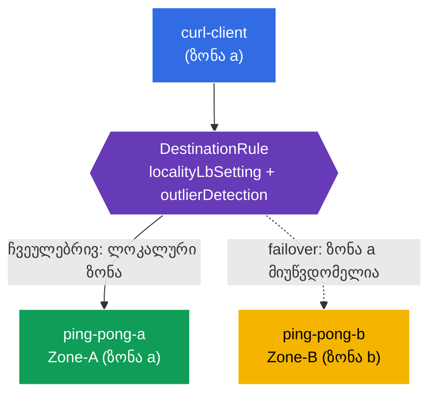

[Русская версия](README_RU.MD) · [Eng version](README.MD) · [Versión en español](README_ES.MD) · [Version française](README_FR.MD) · [Deutsche Version](README_DE.MD) · [繁體中文版](README_TW.MD) · [日本語版](README_JP.MD)

# Lab 14 - ლოკაციაზე დაფუძნებული გადართვა (ზონების მიხედვით მდგრადობა)

> [საცნობარო გადაწყვეტა](worker/files/solutions/1_GE.MD)

წარმოიდგინეთ: თქვენი სერვისი ხელმისაწვდომობის ორ ზონაში (`eu-central-1a` და `eu-central-1b`) მუშაობს. ჩვეულებრივ რეჟიმში სასურველია, რომ კლიენტმა **უახლოეს** (თავის ზონაში მდებარე) ეგზემპლარს მიმართოს - ეს ამცირებს დაყოვნებასა და ზონებს შორის ტრაფიკს. მაგრამ თუ ლოკალური ეგზემპლარი მწყობრიდან გამოვა - ტრაფიკი **ავტომატურად უნდა გადაერთოს** სხვა ზონაზე. სწორედ ეს არის **locality-aware load balancing + failover**.

Istio ამას ნოდების ტოპოლოგიის (`topology.kubernetes.io/region` / `zone`) საფუძველზე ახორციელებს: მან იცის, რომელ ზონაში მდებარეობს თითოეული ენდპოინტი, და ტრაფიკს ჯერ ლოკალურ ზონაში მიმართავს, ხოლო მისი მიუწვდომლობის შემთხვევაში - მეზობელ ზონაში.

## ინფრასტრუქტურა

გარემო AWS-ში (`eu-central-1`) Terragrunt-ის საშუალებით იშლება და შედგება შემდეგი კომპონენტებისგან:

| კომპონენტი | აღწერა |
|------------|--------|
| `vpc`      | VPC `10.10.0.0/16` საჯარო ქვექსელებით |
| `ssh-keys` | ნოდებზე წვდომისთვის საჭირო SSH-გასაღებები |
| `k8s-1`    | Kubernetes `1.35.2` (kubeadm) Istio-თი; **control-plane + 2 worker-ნოდი სხვადასხვა ზონაში** (`1a`, `1b`) |
| `worker`   | სამუშაო მანქანა `kubectl`-ითა და კლასტერზე წვდომით |

ინსტანსები: `t3.medium`, Ubuntu `22.04`. მიერთებისას worker-ნოდები `node_labels`-ის (kubelet `--node-labels`) საშუალებით იღებენ `topology.kubernetes.io/zone` ჭდეებს - self-managed kubeadm მათ cloud-provider-ის გარეშე არ ანიჭებს.

## გაშლა

```bash
TASK=14 make run_ica_task
```

### როგორ მუშაობს (ზოგადი სქემა)



## მიზანი

- `DestinationRule`-ის კონფიგურაცია `localityLbSetting` + `outlierDetection`-ით.
- დარწმუნება, რომ a ზონის კლიენტს ლოკალური ბეკენდი (Zone-A) ემსახურება.
- **failover**-ის შემოწმება: a ზონის მწყობრიდან გამოსვლისას ტრაფიკი b ზონაში (Zone-B) გადადის.

## ნაბიჯი 1. ნოდების ტოპოლოგიური ჭდეების შემოწმება

Istio ენდპოინტების ლოკაციას ნოდების ჭდეებიდან განსაზღვრავს. შევამოწმოთ, რომ ნოდებს ზონების ჭდეები აქვთ:

```bash
kubectl get nodes -L topology.kubernetes.io/zone
```
```
NAME              ...   ZONE
ip-10-10-1-xxx    ...            # control-plane (ზონის გარეშე)
ip-10-10-1-yyy    ...   eu-central-1a   # worker-a
ip-10-10-2-zzz    ...   eu-central-1b   # worker-b
```

**მნიშვნელოვანია:** ღრუბლოვან გარემოში ამ ჭდეებს cloud-provider ანიჭებს. self-managed kubeadm-ში ისინი არ არის - ამ ლაბორატორიაში worker-ნოდებზე ისინი მიერთებისას `node_labels`-ის საშუალებითაა მითითებული. მათ გარეშე locality LB არ მუშაობს.

## ნაბიჯი 2. აპლიკაციის დაყენება

```bash
kubectl label namespace default istio-injection=enabled --overwrite
kubectl apply -f https://raw.githubusercontent.com/ViktorUJ/cks/refs/heads/master/tasks/ica/labs/14/k8s-1/scripts/1.yaml
kubectl rollout restart deployment -n default
```

**რა იშლება:** ერთი Service `ping-pong` და მის უკან ორი Deployment:
- **`ping-pong-a`** - მიბმულია a ზონაზე (`nodeSelector` zone=eu-central-1a), `SERVER_NAME: "Zone-A"`;
- **`ping-pong-b`** - მიბმულია b ზონაზე, `SERVER_NAME: "Zone-B"`;
- **`curl-client`** - a ზონაშია (იმავე ლოკაციაში, რომელშიც ping-pong-a).

ორივე ბეკენდს აქვს ჭდე `app: ping-pong`, ამიტომ Service ენდპოინტებს **ორივე** ზონაში ხედავს, ხოლო Istio-მ თითოეულის ლოკაცია იცის.

```bash
kubectl get pods -n default -o wide
```

## ნაბიჯი 3. DestinationRule - locality LB + outlier detection

Locality failover-ისთვის საჭიროა **ორი** ელემენტი: `outlierDetection` (არაჯანსაღი ენდპოინტების გამოვლენა) და `localityLbSetting` (ლოკაციაზე დაფუძნებული მარშრუტიზაციის ჩართვა).

```bash
vim dr.yaml
```

```yaml
apiVersion: networking.istio.io/v1
kind: DestinationRule
metadata:
  name: ping-pong-dr
  namespace: default
spec:
  host: ping-pong
  trafficPolicy:
    loadBalancer:
      simple: ROUND_ROBIN
      localityLbSetting:
        enabled: true          # ვრთავთ ზონების გათვალისწინებით მარშრუტიზაციას
    outlierDetection:          # სავალდებულოა failover-ისთვის
      consecutive5xxErrors: 1
      interval: 1s
      baseEjectionTime: 1m
      maxEjectionPercent: 100
```

```bash
kubectl apply -f dr.yaml
```

**განმარტება:**
- **`localityLbSetting.enabled: true`** - რთავს ლოკალური ზონისთვის უპირატესობის მინიჭებას: სანამ ენდპოინტები ჯანსაღია, ტრაფიკი კლიენტის იმავე ზონაში მდებარე ენდპოინტებისკენ მიემართება.
- **`outlierDetection`** - მის გარეშე failover არ მუშაობს. Istio-ს უნდა შეეძლოს არაჯანსაღი ენდპოინტების მონიშვნა, რათა გამორიცხოს ისინი და სხვა ზონაზე გადაერთოს. მაშინაც კი, თუ ლოკალური ენდპოინტები უბრალოდ გაქრა, სწორედ outlier detection „რთავს“ ლოკაციის პრიორიტეტებისა და გადადინების მექანიზმს.

## ნაბიჯი 4. ლოკალური უპირატესობის შემოწმება

a ზონის კლიენტს → ლოკალური Zone-A ემსახურება:

```bash
for i in $(seq 5); do
  kubectl exec -n default deploy/curl-client -c curl -- curl -s http://ping-pong:8080/ | grep 'Server Name';
done
```
```
Server Name: Zone-A
Server Name: Zone-A
Server Name: Zone-A
Server Name: Zone-A
Server Name: Zone-A
```

მთელი ტრაფიკი საკუთარ ზონაში რჩება - b ზონა არ გამოიყენება, მიუხედავად იმისა, რომ მისი ენდპოინტი ჯანსაღია და Service-ში შედის.

## ნაბიჯი 5. Failover - a ზონის „მწყობრიდან გამოყვანა“

ლოკალური ბეკენდი (Zone-A) მწყობრიდან გამოგვყავს და ვამოწმებთ, რომ ტრაფიკი Zone-B-ზე გადაერთვება:

```bash
kubectl scale deployment ping-pong-a -n default --replicas=0
kubectl wait --for=delete pod -l app=ping-pong,zone=a -n default --timeout=60s

for i in $(seq 5); do
  kubectl exec -n default deploy/curl-client -c curl -- curl -s http://ping-pong:8080/ | grep 'Server Name';
done
```
```
Server Name: Zone-B
Server Name: Zone-B
Server Name: Zone-B
Server Name: Zone-B
Server Name: Zone-B
```

a ზონაში ლოკალური ენდპოინტები აღარ არის → Istio ტრაფიკს ავტომატურად b ზონაში გადაამისამართებს. აპლიკაცია მთელი ზონის „გათიშვის“ მიუხედავად ხელმისაწვდომი რჩება.

a ზონას ვაბრუნებთ:

```bash
kubectl scale deployment ping-pong-a -n default --replicas=1
```

აღდგენის შემდეგ ტრაფიკი კვლავ უპირატესობას ლოკალურ Zone-A-ს მიანიჭებს.

## შეჯამება

| ელემენტი | როლი |
|----------|------|
| ნოდების ჭდეები `topology.kubernetes.io/zone` | ენდპოინტების ლოკაციის შესახებ ინფორმაციის წყარო |
| `localityLbSetting.enabled` | ლოკალური ზონისთვის უპირატესობის მინიჭება |
| `outlierDetection` | failover-ის სავალდებულო პირობა (მის გარეშე გადადინება არ ხდება) |

**მთავარი დასკვნა:** Istio-ში locality-aware failover ნოდების ტოპოლოგიასა და `localityLbSetting` + `outlierDetection` კომბინაციას ეფუძნება. ჩვეულებრივ პირობებში ტრაფიკი საკუთარ ზონაში რჩება (ნაკლები დაყოვნება და cross-zone ტრაფიკი), ხოლო ლოკალური ენდპოინტების მწყობრიდან გამოსვლისას ავტომატურად მეზობელ ზონაში გადადის - ჩარევისა და აპლიკაციის კოდის ცვლილების გარეშე.
