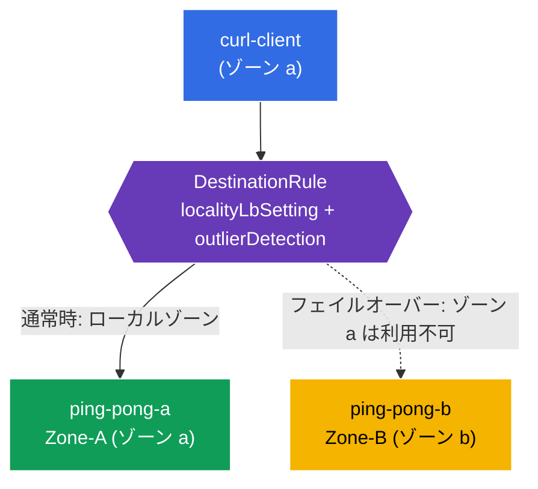

[Русская версия](README_RU.MD) · [Eng version](README.MD) · [Versión en español](README_ES.MD) · [Version française](README_FR.MD) · [Deutsche Version](README_DE.MD) · [ქართული ვერსია](README_GE.MD) · [繁體中文版](README_TW.MD)

# Lab 14 - ローカリティ認識フェイルオーバー（ゾーン障害耐性）

> [リファレンス解答](worker/files/solutions/1_JP.MD)

想像してください。あなたのサービスは 2 つのアベイラビリティーゾーン（`eu-central-1a` と `eu-central-1b`）で稼働しています。通常時は、クライアントが**最も近い**（同じゾーン内の）インスタンスにアクセスすることが望ましく、これによりレイテンシーとゾーン間トラフィックを削減できます。しかし、ローカルのインスタンスに障害が発生した場合、トラフィックは**自動的に別のゾーンへ切り替わる**必要があります。これが **locality-aware load balancing + failover** です。

Istio はノードトポロジー（`topology.kubernetes.io/region` / `zone`）に基づいてこれを実現します。各エンドポイントがどのゾーンにあるかを認識し、まずローカルゾーンへトラフィックを送信し、ローカルゾーンが利用できない場合は隣接ゾーンへ送信します。

## インフラストラクチャ

環境は Terragrunt を通じて AWS（`eu-central-1`）にデプロイされ、以下で構成されます。

| コンポーネント | 説明 |
|------------|---------------------------------------------------|
| `vpc`      | パブリックサブネットを持つ VPC `10.10.0.0/16` |
| `ssh-keys` | ノードにアクセスするための SSH キー |
| `k8s-1`    | Istio を備えた Kubernetes `1.35.2`（kubeadm）。**異なるゾーンにある control-plane + 2 台の worker ノード**（`1a`、`1b`） |
| `worker`   | `kubectl` とクラスターへのアクセスを備えた作業マシン |

インスタンスタイプは `t3.medium`、OS は Ubuntu `22.04` です。worker ノードは参加時に `node_labels`（kubelet `--node-labels`）を通じて `topology.kubernetes.io/zone` ラベルを取得します。cloud-provider を使用しない self-managed kubeadm では、これらのラベルは自動設定されません。

## デプロイ

```bash
TASK=14 make run_ica_task
```

### 仕組み（全体図）



## 目標

- `localityLbSetting` + `outlierDetection` を持つ `DestinationRule` を構成する。
- ゾーン a のクライアントがローカルバックエンド（Zone-A）から処理されることを確認する。
- **フェイルオーバー**を確認する。ゾーン a に障害が発生すると、トラフィックがゾーン b（Zone-B）へ移行する。

## ステップ 1. ノードのトポロジーラベルを確認する

Istio はノードラベルからエンドポイントのローカリティを算出します。ノードがゾーンでラベル付けされていることを確認します。

```bash
kubectl get nodes -L topology.kubernetes.io/zone
```
```
NAME              ...   ZONE
ip-10-10-1-xxx    ...            # control-plane (ゾーンなし)
ip-10-10-1-yyy    ...   eu-central-1a   # worker-a
ip-10-10-2-zzz    ...   eu-central-1b   # worker-b
```

**重要:** クラウドでは、これらのラベルは cloud-provider が設定します。self-managed kubeadm には存在しないため、このラボでは参加時に `node_labels` を通じて worker ノードに設定されています。これらがない場合、locality LB は機能しません。

## ステップ 2. アプリケーションをインストールする

```bash
kubectl label namespace default istio-injection=enabled --overwrite
kubectl apply -f https://raw.githubusercontent.com/ViktorUJ/cks/refs/heads/master/tasks/ica/labs/14/k8s-1/scripts/1.yaml
kubectl rollout restart deployment -n default
```

**デプロイされるもの:** 1 つの Service `ping-pong` と、その背後にある 2 つの Deployment です。
- **`ping-pong-a`** - ゾーン a に固定（`nodeSelector` zone=eu-central-1a）、`SERVER_NAME: "Zone-A"`。
- **`ping-pong-b`** - ゾーン b に固定、`SERVER_NAME: "Zone-B"`。
- **`curl-client`** - ゾーン a（ping-pong-a と同じローカリティ）。

両方のバックエンドに `app: ping-pong` ラベルがあるため、Service は**両方の**ゾーンのエンドポイントを認識し、Istio は各エンドポイントのローカリティを把握します。

```bash
kubectl get pods -n default -o wide
```

## ステップ 3. DestinationRule - locality LB + outlier detection

ローカリティフェイルオーバーには、**2 つ**の要素が必要です。`outlierDetection`（異常なエンドポイントの検出）と `localityLbSetting`（ローカリティベースルーティングの有効化）です。

```bash
vim dr.yaml
```

```yaml
apiVersion: networking.istio.io/v1
kind: DestinationRule
metadata:
  name: ping-pong-dr
  namespace: default
spec:
  host: ping-pong
  trafficPolicy:
    loadBalancer:
      simple: ROUND_ROBIN
      localityLbSetting:
        enabled: true          # ゾーンを考慮したルーティングを有効化する
    outlierDetection:          # failover に必須
      consecutive5xxErrors: 1
      interval: 1s
      baseEjectionTime: 1m
      maxEjectionPercent: 100
```

```bash
kubectl apply -f dr.yaml
```

**解説:**
- **`localityLbSetting.enabled: true`** - ローカルゾーンを優先します。クライアントと同じゾーンのエンドポイントが正常である間、トラフィックはそこへ送信されます。
- **`outlierDetection`** - これがなければフェイルオーバーは機能しません。Istio は、エンドポイントを除外して別のゾーンへ切り替えられるよう、異常とマークできなければなりません。ローカルエンドポイントが単に消失した場合でも、ローカリティ優先とトラフィック移行の仕組みを「有効化」するのは outlier detection です。

## ステップ 4. ローカル優先を確認する

ゾーン a のクライアント → ローカルの Zone-A が処理します。

```bash
for i in $(seq 5); do
  kubectl exec -n default deploy/curl-client -c curl -- curl -s http://ping-pong:8080/ | grep 'Server Name';
done
```
```
Server Name: Zone-A
Server Name: Zone-A
Server Name: Zone-A
Server Name: Zone-A
Server Name: Zone-A
```

すべてのトラフィックは同じゾーン内に留まります。ゾーン b のエンドポイントは正常で Service に含まれていても、使用されません。

## ステップ 5. フェイルオーバー - ゾーン a を「停止」する

ローカルバックエンド（Zone-A）を停止し、トラフィックが Zone-B に切り替わることを確認します。

```bash
kubectl scale deployment ping-pong-a -n default --replicas=0
kubectl wait --for=delete pod -l app=ping-pong,zone=a -n default --timeout=60s

for i in $(seq 5); do
  kubectl exec -n default deploy/curl-client -c curl -- curl -s http://ping-pong:8080/ | grep 'Server Name';
done
```
```
Server Name: Zone-B
Server Name: Zone-B
Server Name: Zone-B
Server Name: Zone-B
Server Name: Zone-B
```

ゾーン a にはローカルエンドポイントがなくなります → Istio はトラフィックを自動的にゾーン b へ移行します。ゾーン全体が「停止」しても、アプリケーションは利用可能なままです。

ゾーン a を復旧させます。

```bash
kubectl scale deployment ping-pong-a -n default --replicas=1
```

復旧後、トラフィックは再びローカルの Zone-A を優先します。

## まとめ

| 要素 | 役割 |
|---------|------|
| ノードラベル `topology.kubernetes.io/zone` | エンドポイントのローカリティ情報のソース |
| `localityLbSetting.enabled` | ローカルゾーンの優先 |
| `outlierDetection` | フェイルオーバーの必須条件（これがなければトラフィック移行は発生しない） |

**重要なポイント:** Istio の locality-aware failover は、ノードトポロジーと `localityLbSetting` + `outlierDetection` の組み合わせに基づいて構築されます。通常時、トラフィックは同じゾーン内に留まり（レイテンシーと cross-zone トラフィックを低減）、ローカルエンドポイントに障害が発生すると、操作やアプリケーションコードの変更なしに隣接ゾーンへ自動的に移行します。
