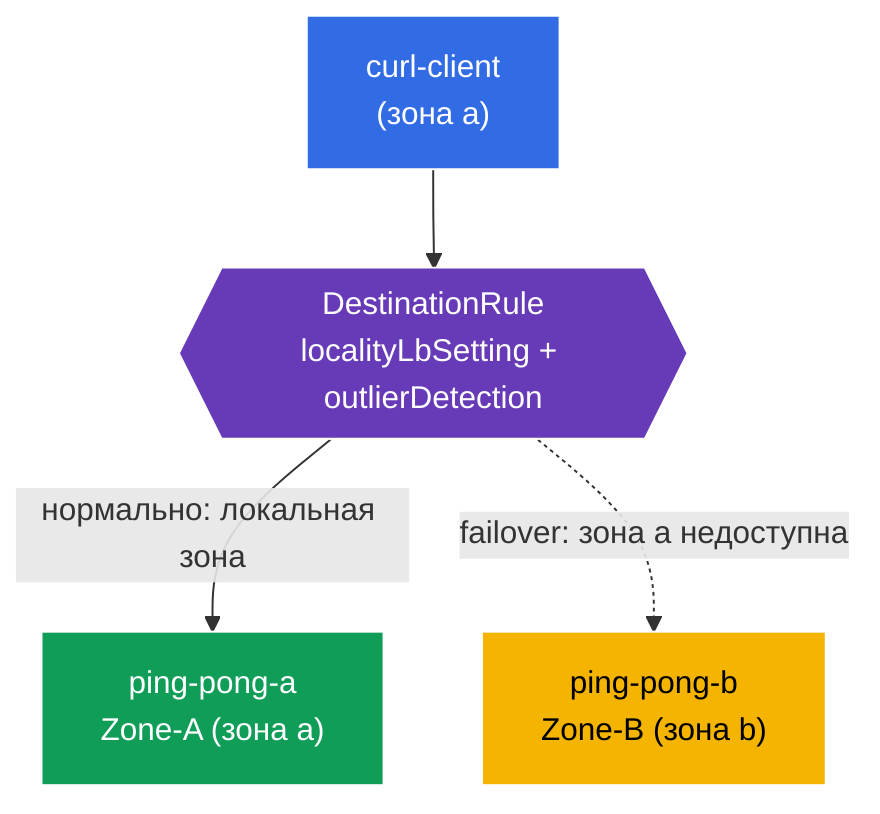

[Eng version](README.MD) · [Versión en español](README_ES.MD)

# Lab 14 - Locality-aware Failover (отказоустойчивость по зонам)

Представьте: ваш сервис работает в двух зонах доступности (`eu-central-1a` и `eu-central-1b`). В нормальном режиме хочется, чтобы клиент ходил в **ближайший** (в своей зоне) экземпляр - это снижает задержку и трафик между зонами. Но если локальный экземпляр отказал - трафик должен **автоматически переключиться** на другую зону. Это и есть **locality-aware load balancing + failover**.

Istio реализует это на основе топологии нод (`topology.kubernetes.io/region` / `zone`): он знает, в какой зоне находится каждый эндпоинт, и направляет трафик сначала в локальную зону, а при её недоступности - в соседнюю.

## Инфраструктура

Окружение разворачивается в AWS (`eu-central-1`) через Terragrunt и состоит из:

| Компонент  | Описание                                          |
|------------|---------------------------------------------------|
| `vpc`      | VPC `10.10.0.0/16` с публичными подсетями          |
| `ssh-keys` | SSH-ключи для доступа к нодам                      |
| `k8s-1`    | Kubernetes `1.35.2` (kubeadm) с Istio; **control-plane + 2 worker-ноды в разных зонах** (`1a`, `1b`) |
| `worker`   | Рабочая машина с `kubectl` и доступом к кластеру   |

Инстансы: `t3.medium`, Ubuntu `22.04`. Worker-ноды при джойне получают метки `topology.kubernetes.io/zone` через `node_labels` (kubelet `--node-labels`) - self-managed kubeadm без cloud-provider их не ставит.

## Развёртывание

```bash
TASK=14 make run_ica_task
```

### Как это работает (общая схема)



## Цель

- Настроить `DestinationRule` с `localityLbSetting` + `outlierDetection`.
- Убедиться, что клиент из зоны a обслуживается локальным бэкендом (Zone-A).
- Проверить **failover**: при отказе зоны a трафик уходит в зону b (Zone-B).

## Шаг 1. Проверка топологических меток нод

Istio вычисляет локальность эндпоинтов из меток нод. Проверим, что ноды размечены зонами:

```bash
kubectl get nodes -L topology.kubernetes.io/zone
```
```
NAME              ...   ZONE
ip-10-10-1-xxx    ...            # control-plane (без зоны)
ip-10-10-1-yyy    ...   eu-central-1a   # worker-a
ip-10-10-2-zzz    ...   eu-central-1b   # worker-b
```

**Важно:** в облаке эти метки проставляет cloud-provider. В self-managed kubeadm их нет - в этой лабе они заданы на worker-нодах через `node_labels` при джойне. Без них locality LB не работает.

## Шаг 2. Установка приложения

```bash
kubectl label namespace default istio-injection=enabled --overwrite
kubectl apply -f https://raw.githubusercontent.com/ViktorUJ/cks/refs/heads/master/tasks/ica/labs/14/k8s-1/scripts/1.yaml
kubectl rollout restart deployment -n default
```

**Что разворачивается:** один Service `ping-pong` и два Deployment под ним:
- **`ping-pong-a`** - прибит к зоне a (`nodeSelector` zone=eu-central-1a), `SERVER_NAME: "Zone-A"`;
- **`ping-pong-b`** - прибит к зоне b, `SERVER_NAME: "Zone-B"`;
- **`curl-client`** - в зоне a (тот же локалити, что и ping-pong-a).

Оба бэкенда имеют лейбл `app: ping-pong`, поэтому Service видит эндпоинты в **обеих** зонах, а Istio знает локальность каждого.

```bash
kubectl get pods -n default -o wide
```

## Шаг 3. DestinationRule - locality LB + outlier detection

Для locality failover нужны **два** элемента: `outlierDetection` (обнаружение нездоровых эндпоинтов) и `localityLbSetting` (включение маршрутизации по локальности).

```bash
vim dr.yaml
```

```yaml
apiVersion: networking.istio.io/v1
kind: DestinationRule
metadata:
  name: ping-pong-dr
  namespace: default
spec:
  host: ping-pong
  trafficPolicy:
    loadBalancer:
      simple: ROUND_ROBIN
      localityLbSetting:
        enabled: true          # включаем маршрутизацию с учётом зон
    outlierDetection:          # обязательно для failover
      consecutive5xxErrors: 1
      interval: 1s
      baseEjectionTime: 1m
      maxEjectionPercent: 100
```

```bash
kubectl apply -f dr.yaml
```

**Разбор:**
- **`localityLbSetting.enabled: true`** - включает предпочтение локальной зоны: трафик идёт в эндпоинты той же зоны, что и клиент, пока они здоровы.
- **`outlierDetection`** - без него failover не работает. Istio должен уметь помечать эндпоинты нездоровыми, чтобы исключить их и переключиться на другую зону. Даже если локальные эндпоинты просто исчезли, именно outlier detection «включает» механизм локалити-приоритетов и переливов.

## Шаг 4. Проверка локального предпочтения

Клиент в зоне a → обслуживается локальным Zone-A:

```bash
for i in $(seq 5); do
  kubectl exec -n default deploy/curl-client -c curl -- curl -s http://ping-pong:8080/ | grep 'Server Name';
done
```
```
Server Name: Zone-A
Server Name: Zone-A
Server Name: Zone-A
Server Name: Zone-A
Server Name: Zone-A
```

Весь трафик остаётся в своей зоне - зона b не задействована, хотя её эндпоинт здоров и входит в Service.

## Шаг 5. Failover - «роняем» зону a

Уводим локальный бэкенд (Zone-A) из строя и смотрим, что трафик переключается на Zone-B:

```bash
kubectl scale deployment ping-pong-a -n default --replicas=0
kubectl wait --for=delete pod -l app=ping-pong,zone=a -n default --timeout=60s

for i in $(seq 5); do
  kubectl exec -n default deploy/curl-client -c curl -- curl -s http://ping-pong:8080/ | grep 'Server Name';
done
```
```
Server Name: Zone-B
Server Name: Zone-B
Server Name: Zone-B
Server Name: Zone-B
Server Name: Zone-B
```

Локальных эндпоинтов в зоне a больше нет → Istio автоматически переливает трафик в зону b. Приложение остаётся доступным, несмотря на «падение» целой зоны.

Возвращаем зону a:

```bash
kubectl scale deployment ping-pong-a -n default --replicas=1
```

После восстановления трафик снова предпочтёт локальную Zone-A.

## Итог

| Элемент | Роль |
|---------|------|
| Метки нод `topology.kubernetes.io/zone` | источник информации о локальности эндпоинтов |
| `localityLbSetting.enabled` | предпочтение локальной зоны |
| `outlierDetection` | обязательное условие для failover (без него переливов нет) |

**Ключевой вывод:** locality-aware failover в Istio строится на топологии нод и связке `localityLbSetting` + `outlierDetection`. В норме трафик остаётся в своей зоне (меньше задержки и cross-zone трафика), а при отказе локальных эндпоинтов автоматически переливается в соседнюю зону - без вмешательства и без изменения кода приложения.
