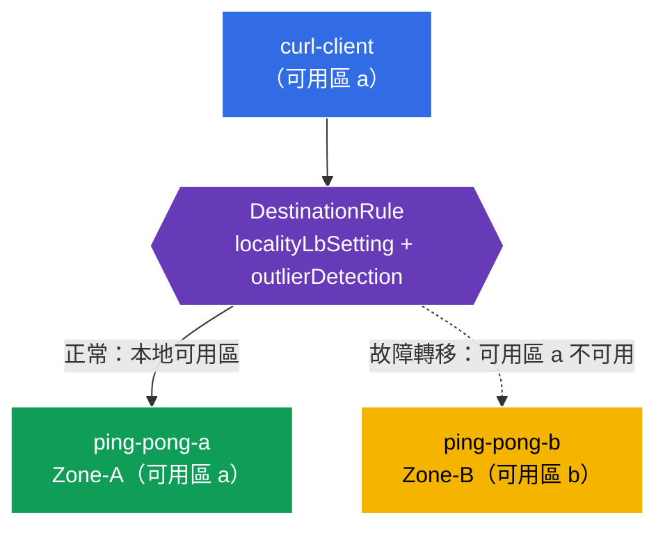

[Русская версия](README_RU.MD) · [Eng version](README.MD) · [Versión en español](README_ES.MD) · [Version française](README_FR.MD) · [Deutsche Version](README_DE.MD) · [ქართული ვერსია](README_GE.MD) · [日本語版](README_JP.MD)

# Lab 14 - 位置感知故障轉移（跨可用區容錯）

> [參考解答](worker/files/solutions/1_TW.MD)

想像一下：您的服務運行於兩個可用區（`eu-central-1a` 與 `eu-central-1b`）。在正常模式下，希望用戶端連線至**最近**（同一可用區）的執行個體--這可降低延遲與跨可用區流量。但若本地執行個體故障，流量必須**自動切換**至另一個可用區。這就是**位置感知負載平衡 + 故障轉移**。

Istio 根據節點拓撲（`topology.kubernetes.io/region` / `zone`）實現此功能：它知道每個端點所在的可用區，先將流量導向本地可用區，當其不可用時再導向相鄰可用區。

## 基礎設施

環境透過 Terragrunt 部署於 AWS（`eu-central-1`），由以下組成：

| 元件  | 說明                                          |
|------------|---------------------------------------------------|
| `vpc`      | 含公用子網路的 VPC `10.10.0.0/16`          |
| `ssh-keys` | 用於存取節點的 SSH 金鑰                      |
| `k8s-1`    | 含 Istio 的 Kubernetes `1.35.2`（kubeadm）；**control-plane + 位於不同可用區的 2 個 worker 節點**（`1a`、`1b`） |
| `worker`   | 已安裝 `kubectl` 且可存取叢集的工作機器   |

執行個體：`t3.medium`、Ubuntu `22.04`。Worker 節點加入時會透過 `node_labels`（kubelet `--node-labels`）取得 `topology.kubernetes.io/zone` 標籤--未使用 cloud-provider 的自管 kubeadm 不會自行設定這些標籤。

## 部署

```bash
TASK=14 make run_ica_task
```

### 運作方式（整體架構）



## 目標

- 設定包含 `localityLbSetting` + `outlierDetection` 的 `DestinationRule`。
- 確認來自可用區 a 的用戶端由本地後端（Zone-A）提供服務。
- 驗證**故障轉移**：可用區 a 故障時，流量會導向可用區 b（Zone-B）。

## 步驟 1. 檢查節點拓撲標籤

Istio 從節點標籤推算端點的位置。請確認節點已標記可用區：

```bash
kubectl get nodes -L topology.kubernetes.io/zone
```
```
NAME              ...   ZONE
ip-10-10-1-xxx    ...            # control-plane (沒有區域)
ip-10-10-1-yyy    ...   eu-central-1a   # worker-a
ip-10-10-2-zzz    ...   eu-central-1b   # worker-b
```

**重要：**在雲端中，這些標籤由 cloud-provider 設定。自管 kubeadm 沒有這些標籤--本實驗透過加入時的 `node_labels` 將其設定於 worker 節點。缺少它們，locality LB 無法運作。

## 步驟 2. 安裝應用程式

```bash
kubectl label namespace default istio-injection=enabled --overwrite
kubectl apply -f https://raw.githubusercontent.com/ViktorUJ/cks/refs/heads/master/tasks/ica/labs/14/k8s-1/scripts/1.yaml
kubectl rollout restart deployment -n default
```

**部署內容：**一個 Service `ping-pong`，以及其下的兩個 Deployment：
- **`ping-pong-a`**--固定於可用區 a（`nodeSelector` zone=eu-central-1a），`SERVER_NAME: "Zone-A"`；
- **`ping-pong-b`**--固定於可用區 b，`SERVER_NAME: "Zone-B"`；
- **`curl-client`**--位於可用區 a（與 ping-pong-a 相同的位置）。

兩個後端皆有 `app: ping-pong` 標籤，因此 Service 可看到**兩個**可用區的端點，而 Istio 知道每個端點的位置。

```bash
kubectl get pods -n default -o wide
```

## 步驟 3. DestinationRule - locality LB + outlier detection

位置故障轉移需要**兩個**要素：`outlierDetection`（偵測不健康端點）與 `localityLbSetting`（啟用依位置路由）。

```bash
vim dr.yaml
```

```yaml
apiVersion: networking.istio.io/v1
kind: DestinationRule
metadata:
  name: ping-pong-dr
  namespace: default
spec:
  host: ping-pong
  trafficPolicy:
    loadBalancer:
      simple: ROUND_ROBIN
      localityLbSetting:
        enabled: true          # 啟用具區域感知的路由
    outlierDetection:          # failover 的必要條件
      consecutive5xxErrors: 1
      interval: 1s
      baseEjectionTime: 1m
      maxEjectionPercent: 100
```

```bash
kubectl apply -f dr.yaml
```

**說明：**
- **`localityLbSetting.enabled: true`**--啟用本地可用區偏好：只要端點健康，流量便會傳送至與用戶端同一可用區的端點。
- **`outlierDetection`**--沒有它，故障轉移無法運作。Istio 必須能夠將端點標記為不健康，才能將其排除並切換至另一個可用區。即使本地端點只是消失，正是 outlier detection「啟用」了位置優先順序與流量轉移機制。

## 步驟 4. 驗證本地偏好

可用區 a 的用戶端 → 由本地 Zone-A 提供服務：

```bash
for i in $(seq 5); do
  kubectl exec -n default deploy/curl-client -c curl -- curl -s http://ping-pong:8080/ | grep 'Server Name';
done
```
```
Server Name: Zone-A
Server Name: Zone-A
Server Name: Zone-A
Server Name: Zone-A
Server Name: Zone-A
```

所有流量都留在自身可用區--雖然可用區 b 的端點健康且屬於 Service，卻不會被使用。

## 步驟 5. 故障轉移--「使可用區 a 停擺」

讓本地後端（Zone-A）停止運作，並確認流量切換至 Zone-B：

```bash
kubectl scale deployment ping-pong-a -n default --replicas=0
kubectl wait --for=delete pod -l app=ping-pong,zone=a -n default --timeout=60s

for i in $(seq 5); do
  kubectl exec -n default deploy/curl-client -c curl -- curl -s http://ping-pong:8080/ | grep 'Server Name';
done
```
```
Server Name: Zone-B
Server Name: Zone-B
Server Name: Zone-B
Server Name: Zone-B
Server Name: Zone-B
```

可用區 a 已不再有本地端點 → Istio 自動將流量轉移至可用區 b。即使整個可用區「停擺」，應用程式仍維持可用。

恢復可用區 a：

```bash
kubectl scale deployment ping-pong-a -n default --replicas=1
```

恢復後，流量會再次優先導向本地 Zone-A。

## 總結

| 元素 | 角色 |
|---------|------|
| 節點標籤 `topology.kubernetes.io/zone` | 端點位置資訊的來源 |
| `localityLbSetting.enabled` | 本地可用區偏好 |
| `outlierDetection` | 故障轉移的必要條件（沒有它就沒有流量轉移） |

**核心結論：**Istio 中的位置感知故障轉移建構於節點拓撲以及 `localityLbSetting` + `outlierDetection` 的組合。在正常情況下，流量留在自身可用區（更低延遲與更少跨可用區流量）；本地端點故障時，流量會自動轉移至相鄰可用區--無需介入，也無需變更應用程式程式碼。