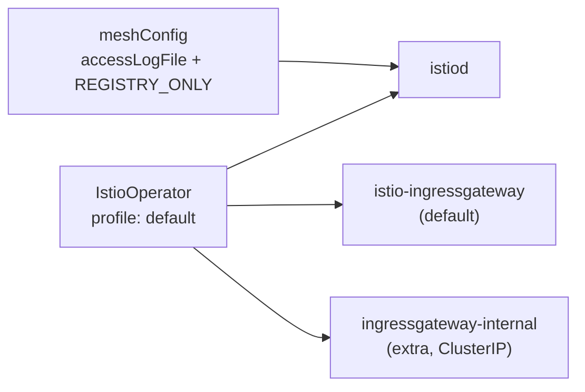

# Lab 15 — Installation & Configuration: customizing the Istio install (IstioOperator + MeshConfig)

## Overview

In most labs Istio is already installed for you. Here the task is the opposite:
**install and configure Istio to meet specific requirements**. This is a core
competency of the *Installation, Upgrade & Configuration* domain — "Customizing your
Istio Installation".

Istio is installed with `istioctl install -f <file>`, where the file is an
`IstioOperator` manifest. In it you set:
- **profile** — the base set of components (`default`, `minimal`, `demo`, ...);
- **meshConfig** — global mesh settings (logging, egress policy, etc.);
- **components** — which components to deploy and how many (e.g. multiple ingress
  gateways).

In this lab the cluster is already up (control-plane + worker) but Istio is **not
installed** — installing it is the task. `istioctl` is pre-installed on the worker PC.



## Task

1. Write an `IstioOperator` manifest based on the `default` profile.
2. Set in `meshConfig`:
   - `accessLogFile: /dev/stdout` — enable Envoy access logs to stdout;
   - `outboundTrafficPolicy.mode: REGISTRY_ONLY` — block egress to hosts that are not
     in the mesh registry.
3. Add a **second** ingress gateway `ingressgateway-internal` alongside the default
   `istio-ingressgateway`.
4. Install Istio with this manifest and confirm everything is applied.

## Step 1. IstioOperator manifest

```bash
cat > custom-istio.yaml <<'EOF'
apiVersion: install.istio.io/v1alpha1
kind: IstioOperator
metadata:
  name: custom-istio
spec:
  profile: default
  meshConfig:
    accessLogFile: /dev/stdout
    outboundTrafficPolicy:
      mode: REGISTRY_ONLY
  components:
    ingressGateways:
      - name: istio-ingressgateway
        enabled: true
      - name: ingressgateway-internal
        enabled: true
        label:
          istio: ingressgateway-internal
        k8s:
          service:
            type: ClusterIP
EOF
```

## Step 2. Install

```bash
istioctl install -f custom-istio.yaml -y
```

## Step 3. Verify

```bash
kubectl get pods -n istio-system
kubectl get deploy -n istio-system | grep -E 'ingressgateway'
kubectl get configmap istio -n istio-system -o jsonpath='{.data.mesh}' \
  | grep -E 'accessLogFile|outboundTrafficPolicy|REGISTRY_ONLY'
```

Expected:
- `istiod` is `Running`;
- two deployments: `istio-ingressgateway` and `ingressgateway-internal` — both ready;
- the `istio` configmap contains `accessLogFile: /dev/stdout` and
  `outboundTrafficPolicy.mode: REGISTRY_ONLY`.

## Breakdown

- **profile: default** — deploys `istiod` and one ingress gateway. A profile is the
  starting point you layer your customizations on top of.
- **meshConfig** lands in the `istio` configmap (key `mesh`) and is read by istiod.
  This is how global parameters are configured without editing the Deployments.
- **outboundTrafficPolicy: REGISTRY_ONLY** blocks calls to external hosts that are not
  declared via a `ServiceEntry` (see Lab 05). The default mode is `ALLOW_ANY`.
- **components.ingressGateways** lets you deploy multiple gateways — a common pattern
  when you need a separate internal gateway (`ClusterIP`) in addition to the external
  one.

## Check the result

Run on the worker PC:

```bash
check_result
```

## Summary

You installed Istio from a custom `IstioOperator`: chose a profile, set global mesh
parameters via `meshConfig`, and deployed an extra ingress gateway as a component.
That is the "Customizing your Istio Installation" skill from the ICA curriculum.

## Infrastructure

| Component | Type | Count | Role |
|---|---|---|---|
| control-plane | `t3.medium` | 1 | master + workloads (istiod, gateways) |
| worker | `t3.small` | 1 | extra capacity for the two gateways |
| worker PC | `t3.small` | 1 | workstation: `kubectl`, `istioctl`, `check_result` |

Region: `eu-central-1` (AZ `eu-central-1a` / `eu-central-1b`).
